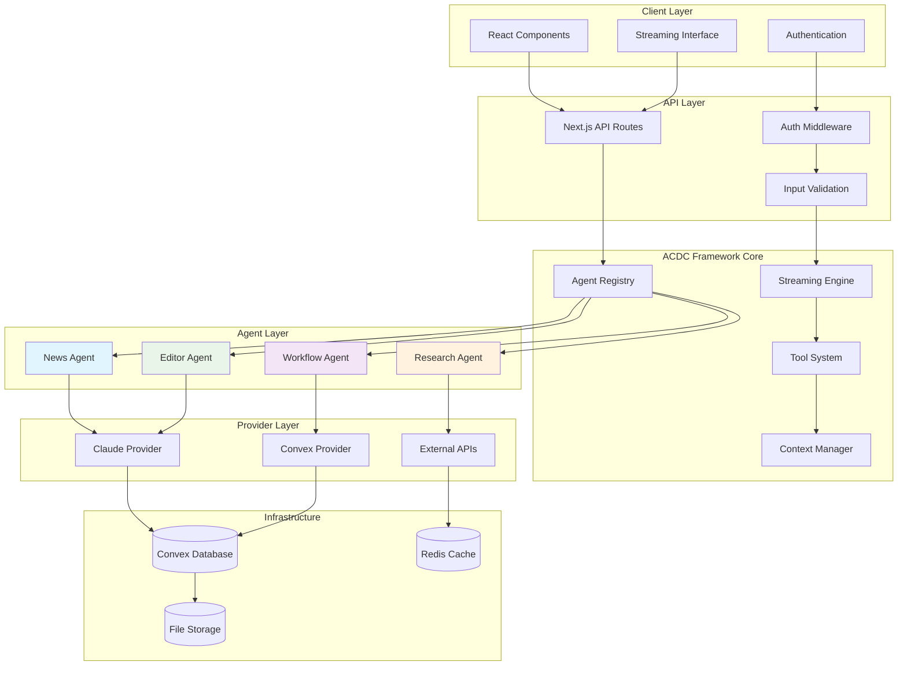
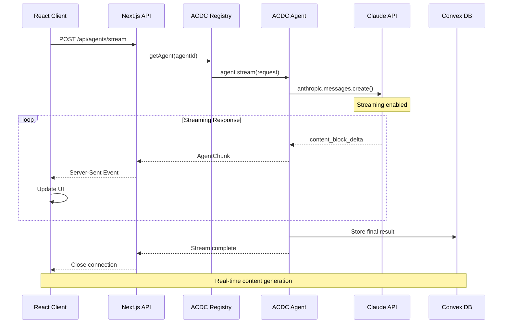
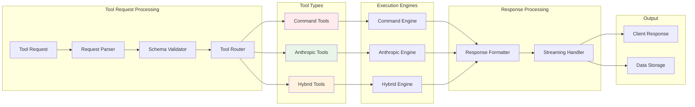
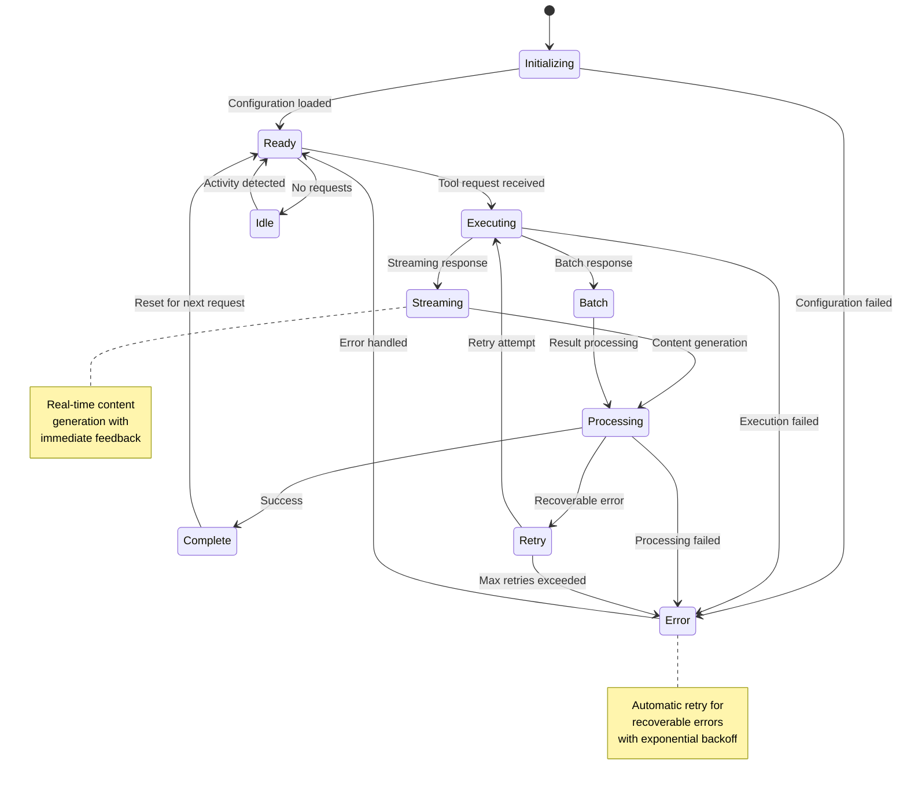
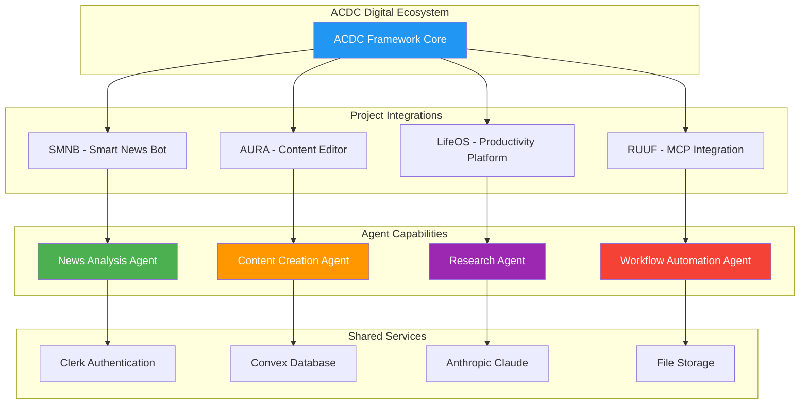
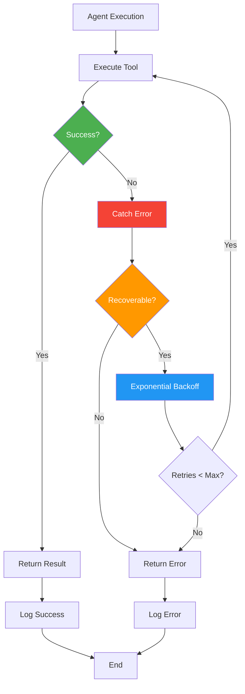
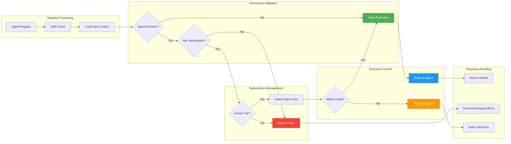
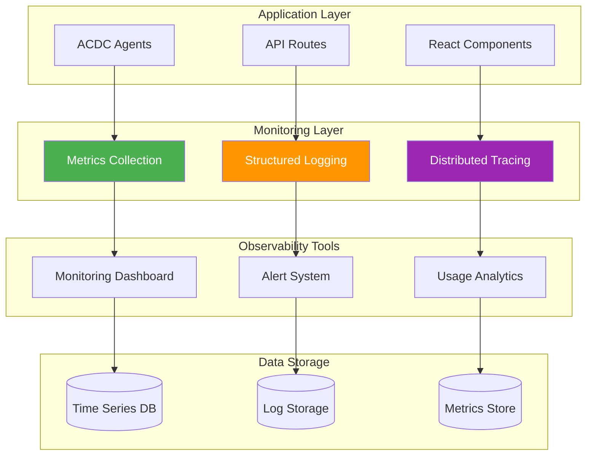

# ACDC Framework Architecture Diagrams

## Core System Architecture



## Streaming Data Flow



## Tool System Architecture



## Agent Lifecycle



## Multi-Project Integration



## Error Recovery Flow



## Premium Feature Gating



## Development Workflow

```mermaid
gitgraph
    commit id: "Initial ACDC Setup"
    branch feature-agent
    checkout feature-agent
    commit id: "Create BaseAgent"
    commit id: "Implement Tools"
    commit id: "Add Streaming"
    checkout main
    merge feature-agent
    commit id: "Deploy Agent v1"
    
    branch integration-smnb
    checkout integration-smnb
    commit id: "SMNB Adapter"
    commit id: "Tool Migration"
    commit id: "UI Updates"
    checkout main
    merge integration-smnb
    commit id: "SMNB Integration"
    
    branch integration-aura
    checkout integration-aura
    commit id: "AURA Migration"
    commit id: "Legacy Support"
    commit id: "Performance Optimization"
    checkout main
    merge integration-aura
    commit id: "AURA Integration"
    
    commit id: "Production Release"
```

## Monitoring & Observability



---

## Legend

### Color Coding
- 🔵 **Blue**: Core framework components
- 🟢 **Green**: Success states and positive flows
- 🟠 **Orange**: Warning states and processing
- 🔴 **Red**: Error states and failures
- 🟣 **Purple**: Premium features and advanced functionality

### Component Types
- **Rectangles**: Processes and services
- **Diamonds**: Decision points
- **Cylinders**: Data storage
- **Circles**: Start/end points
- **Parallelograms**: Input/output operations

---

*Architecture diagrams for the ACDC Agentic Framework*  
*ACDC Digital - December 2024*