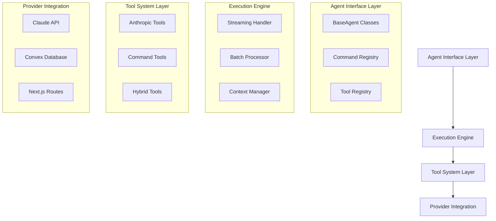
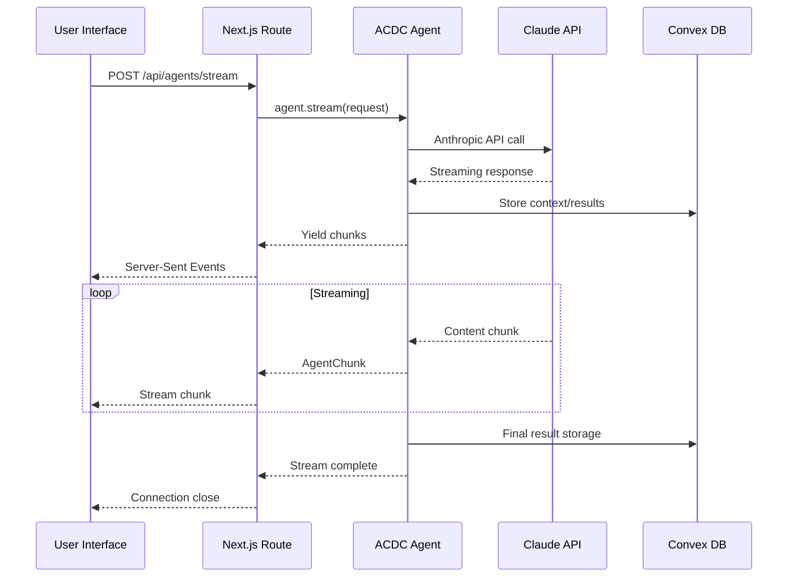
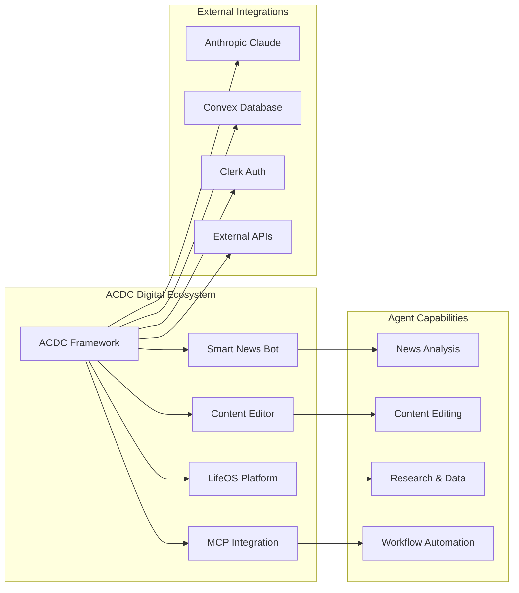
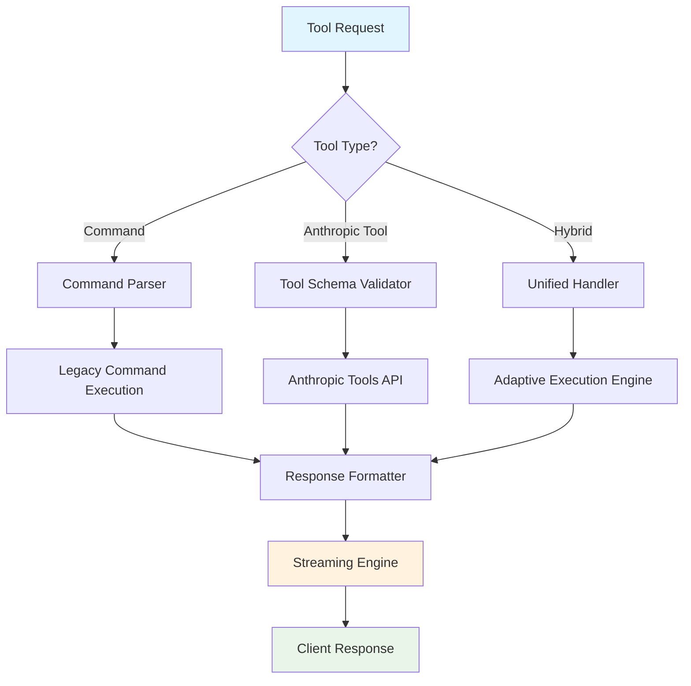

# ACDC Digital Unified Agentic Framework Implementation Guide

## The ACDC Agentic Framework
*A unified, streaming-first AI agent architecture for ACDC Digital's news technology ecosystem*

---

## Table of Contents

1. [Framework Overview](#framework-overview)
2. [Core Architecture](#core-architecture)
3. [Implementation Modules](#implementation-modules)
4. [Agent Development Patterns](#agent-development-patterns)
5. [Integration Workflows](#integration-workflows)
6. [Visual Architecture](#visual-architecture)
7. [Code Examples & Templates](#code-examples--templates)
8. [Standardization Guidelines](#standardization-guidelines)
9. [Migration Roadmap](#migration-roadmap)
10. [Best Practices & Troubleshooting](#best-practices--troubleshooting)

---

## Framework Overview

### What is the ACDC Agentic Framework?

The **ACDC Agentic Framework** is ACDC Digital's unified AI agent architecture that combines the modularity of class-based agents (AURA/LifeOS) with the streaming capabilities and tool integration of service-based AI (SMNB). Named "ACDC" for its role as the central connection point between different AI capabilities and our news technology ecosystem.

### Core Philosophy

- **Streaming-First**: Real-time content generation with immediate user feedback
- **Tool-Unified**: Seamless integration between command patterns and Anthropic Tools API
- **Content-Focused**: Optimized for news aggregation, content creation, and editorial workflows
- **Developer-Friendly**: Minimal boilerplate, maximum extensibility
- **Production-Ready**: Enterprise-grade error handling, premium gating, and scalability

### Framework Benefits

✅ **Unified Development Experience**: Single pattern for all AI features across projects  
✅ **Streaming by Default**: Real-time responses for better user experience  
✅ **Tool Interoperability**: Support for both command patterns and Anthropic Tools  
✅ **Premium Integration**: Built-in subscription gating and feature management  
✅ **Type Safety**: Full TypeScript support with Convex schema integration  
✅ **Extensible Architecture**: Easy to add new agents and capabilities  

---

## Core Architecture

### Architecture Principles

The ACDC Framework follows a **hybrid agent-service architecture** that unifies three core components:



### Core Components

#### 1. Agent Interface Layer
- **BaseAgent**: Abstract class providing unified agent interface
- **AgentRegistry**: Central routing for commands and tool calls
- **Tool System**: Supports both command patterns and Anthropic Tools

#### 2. Execution Engine
- **Streaming Handler**: Real-time content generation and delivery
- **Context Manager**: Session, user, and project context management
- **Error Recovery**: Robust error handling with exponential backoff

#### 3. Provider Integration
- **Claude Provider**: Standardized Anthropic API integration
- **Convex Provider**: Real-time database and state management
- **Next.js Integration**: API routes and streaming response handling

---

## Implementation Modules

### Module Structure

```
@acdc/agents/
├── core/
│   ├── BaseAgent.ts              # Abstract agent interface
│   ├── AgentRegistry.ts          # Command and tool routing
│   ├── StreamingEngine.ts        # Real-time response handling
│   ├── ToolSystem.ts             # Unified tool management
│   └── ContextManager.ts         # Session and state management
├── providers/
│   ├── ClaudeProvider.ts         # Anthropic API integration
│   ├── ConvexProvider.ts         # Database and real-time sync
│   └── NextProvider.ts           # API routes and streaming
├── agents/
│   ├── NewsAgent.ts              # Content aggregation and analysis
│   ├── EditorAgent.ts            # Rich text editing and formatting
│   ├── ResearchAgent.ts          # Information gathering and synthesis
│   └── WorkflowAgent.ts          # Multi-step process orchestration
├── tools/
│   ├── ContentTools.ts           # Content creation and editing
│   ├── DataTools.ts              # Information retrieval and analysis
│   └── IntegrationTools.ts       # External API integrations
└── ui/
    ├── StreamingChat.tsx         # Real-time chat interface
    ├── AgentSelector.tsx         # Agent selection and configuration
    └── ToolInterface.tsx         # Interactive tool components
```

### Core Interface Definitions

```typescript
// Core agent interface supporting both streaming and batch execution
export interface ACDCAgent {
  readonly id: string;
  readonly name: string;
  readonly description: string;
  readonly capabilities: AgentCapability[];
  readonly isPremium: boolean;
  readonly metadata: AgentMetadata;

  // Unified execution interface
  execute(request: AgentRequest): Promise<AgentResponse>;
  stream(request: AgentRequest): AsyncIterable<AgentChunk>;
  
  // Tool system integration
  getTools(): Tool[];
  canExecute(context: ExecutionContext): boolean;
}

// Unified tool system supporting multiple patterns
export interface Tool {
  type: 'command' | 'anthropic_tool' | 'hybrid';
  identifier: string;
  schema: ToolSchema;
  handler: ToolHandler;
  requiresPremium: boolean;
}

// Streaming-first response system
export interface AgentChunk {
  type: 'content' | 'tool_call' | 'metadata' | 'error';
  data: any;
  timestamp: number;
}
```

---

## Agent Development Patterns

### Pattern 1: News Content Agent

```typescript
import { BaseAgent, Tool, AgentRequest, AgentChunk } from '@acdc/agents';

export class NewsAgent extends BaseAgent {
  readonly id = 'news-agent';
  readonly name = 'News Content Specialist';
  readonly description = 'AI-powered news aggregation, analysis, and content creation';
  readonly isPremium = false;

  readonly tools: Tool[] = [
    {
      type: 'hybrid',
      identifier: 'analyze_news',
      schema: {
        name: 'analyze_news',
        description: 'Analyze news content for trends, sentiment, and key insights',
        input_schema: {
          type: 'object',
          properties: {
            content: { type: 'string', description: 'News content to analyze' },
            focus: { type: 'string', enum: ['sentiment', 'trends', 'summary', 'keywords'] }
          },
          required: ['content']
        }
      },
      handler: this.analyzeNews.bind(this),
      requiresPremium: false
    },
    {
      type: 'command',
      identifier: '/aggregate',
      schema: {
        command: '/aggregate',
        description: 'Aggregate news from multiple sources',
        parameters: ['sources', 'timeframe', 'topics']
      },
      handler: this.aggregateNews.bind(this),
      requiresPremium: true
    }
  ];

  async *stream(request: AgentRequest): AsyncIterable<AgentChunk> {
    yield { type: 'metadata', data: { status: 'starting' }, timestamp: Date.now() };

    if (request.tool.identifier === 'analyze_news') {
      yield { type: 'content', data: '📊 Analyzing news content...', timestamp: Date.now() };
      
      const analysis = await this.analyzeNews(request.input);
      
      yield { type: 'content', data: `✨ Analysis complete: ${analysis.summary}`, timestamp: Date.now() };
      yield { type: 'metadata', data: { analysis }, timestamp: Date.now() };
    }
  }

  private async analyzeNews(input: any) {
    // Implementation using Anthropic Tools API
    const response = await this.claudeProvider.analyze({
      content: input.content,
      tools: ['sentiment_analysis', 'keyword_extraction', 'trend_identification']
    });
    
    return {
      sentiment: response.sentiment,
      keywords: response.keywords,
      trends: response.trends,
      summary: response.summary
    };
  }
}
```

### Pattern 2: Streaming Editor Agent

```typescript
export class EditorAgent extends BaseAgent {
  readonly id = 'editor-agent';
  readonly name = 'Content Editor Specialist';
  readonly description = 'AI-powered content editing, formatting, and enhancement';

  async *stream(request: AgentRequest): AsyncIterable<AgentChunk> {
    const { content, operation } = request.input;

    switch (operation) {
      case 'format_newsletter':
        yield* this.streamNewsletterFormat(content);
        break;
      case 'enhance_content':
        yield* this.streamContentEnhancement(content);
        break;
      case 'generate_headlines':
        yield* this.streamHeadlineGeneration(content);
        break;
    }
  }

  private async *streamNewsletterFormat(content: string): AsyncIterable<AgentChunk> {
    yield { type: 'content', data: '📧 Formatting newsletter...', timestamp: Date.now() };

    // Use existing SMNB streaming infrastructure
    const stream = await this.claudeProvider.streamCompletion({
      prompt: this.getNewsletterPrompt(content),
      tools: [
        {
          type: 'text_editor_20241022',
          name: 'str_replace_editor'
        }
      ]
    });

    let formattedContent = '';
    for await (const chunk of stream) {
      if (chunk.type === 'content_block_delta') {
        formattedContent += chunk.delta.text;
        yield { 
          type: 'content', 
          data: chunk.delta.text, 
          timestamp: Date.now() 
        };
      }
    }

    yield { 
      type: 'metadata', 
      data: { 
        operation: 'newsletter_format_complete',
        formatted_content: formattedContent 
      }, 
      timestamp: Date.now() 
    };
  }

  private getNewsletterPrompt(content: string): string {
    return `Format this content as a professional newsletter with:
    1. Engaging headline with emoji
    2. Clear section headers
    3. Bullet points for key information
    4. Call-to-action at the end
    
    Content: ${content}`;
  }
}
```

---

## Integration Workflows

### Workflow 1: Next.js API Route Integration

```typescript
// app/api/agents/stream/route.ts
import { NextRequest, NextResponse } from 'next/server';
import { ACDCRegistry } from '@acdc/agents';
import { auth } from '@clerk/nextjs';

const registry = new ACDCRegistry();

export async function POST(request: NextRequest) {
  try {
    const { userId } = auth();
    const { agentId, tool, input, sessionId } = await request.json();

    // Get agent from registry
    const agent = registry.getAgent(agentId);
    if (!agent) {
      return NextResponse.json({ error: 'Agent not found' }, { status: 404 });
    }

    // Check premium access
    if (agent.isPremium && !await checkPremiumAccess(userId)) {
      return NextResponse.json({ error: 'Premium access required' }, { status: 403 });
    }

    // Create streaming response
    const stream = new ReadableStream({
      async start(controller) {
        try {
          const agentStream = agent.stream({
            tool,
            input,
            context: { userId, sessionId }
          });

          for await (const chunk of agentStream) {
            const data = `data: ${JSON.stringify(chunk)}\n\n`;
            controller.enqueue(new TextEncoder().encode(data));
          }

          controller.close();
        } catch (error) {
          controller.error(error);
        }
      }
    });

    return new Response(stream, {
      headers: {
        'Content-Type': 'text/plain; charset=utf-8',
        'Cache-Control': 'no-cache',
        'Connection': 'keep-alive',
      },
    });

  } catch (error) {
    console.error('Agent stream error:', error);
    return NextResponse.json({ error: 'Internal server error' }, { status: 500 });
  }
}
```

### Workflow 2: Convex Integration Pattern

```typescript
// convex/agents.ts
import { query, mutation, action } from './_generated/server';
import { v } from 'convex/values';
import { ACDCRegistry } from '@acdc/agents';

export const executeAgent = action({
  args: {
    agentId: v.string(),
    tool: v.string(),
    input: v.any(),
    sessionId: v.optional(v.string()),
    projectId: v.optional(v.id('projects'))
  },
  returns: v.object({
    success: v.boolean(),
    result: v.any(),
    error: v.optional(v.string())
  }),
  handler: async (ctx, args) => {
    const registry = new ACDCRegistry();
    
    try {
      const agent = registry.getAgent(args.agentId);
      if (!agent) {
        throw new Error(`Agent not found: ${args.agentId}`);
      }

      const result = await agent.execute({
        tool: agent.getTool(args.tool),
        input: args.input,
        context: {
          sessionId: args.sessionId,
          projectId: args.projectId,
          mutations: {
            createFile: ctx.runMutation.bind(ctx, 'files:create'),
            updateFile: ctx.runMutation.bind(ctx, 'files:update'),
            addChatMessage: ctx.runMutation.bind(ctx, 'chat:addMessage')
          }
        }
      });

      return { success: true, result };
    } catch (error) {
      console.error('Agent execution error:', error);
      return { 
        success: false, 
        error: error instanceof Error ? error.message : 'Unknown error' 
      };
    }
  }
});

export const getAgentCapabilities = query({
  args: { agentId: v.string() },
  returns: v.object({
    tools: v.array(v.any()),
    isPremium: v.boolean(),
    metadata: v.any()
  }),
  handler: async (ctx, args) => {
    const registry = new ACDCRegistry();
    const agent = registry.getAgent(args.agentId);
    
    if (!agent) {
      throw new Error(`Agent not found: ${args.agentId}`);
    }

    return {
      tools: agent.getTools(),
      isPremium: agent.isPremium,
      metadata: agent.metadata
    };
  }
});
```

### Workflow 3: React Component Integration

```tsx
// components/ACDCAgentInterface.tsx
'use client';

import { useState, useCallback } from 'react';
import { useAction, useQuery } from 'convex/react';
import { api } from '@/convex/_generated/api';

interface AgentChunk {
  type: 'content' | 'tool_call' | 'metadata' | 'error';
  data: any;
  timestamp: number;
}

export function ACDCAgentInterface({ agentId }: { agentId: string }) {
  const [input, setInput] = useState('');
  const [messages, setMessages] = useState<AgentChunk[]>([]);
  const [isStreaming, setIsStreaming] = useState(false);

  const agentCapabilities = useQuery(api.agents.getAgentCapabilities, { agentId });
  const executeAgent = useAction(api.agents.executeAgent);

  const handleStreamingExecution = useCallback(async (tool: string, input: string) => {
    setIsStreaming(true);
    setMessages([]);

    try {
      const response = await fetch('/api/agents/stream', {
        method: 'POST',
        headers: { 'Content-Type': 'application/json' },
        body: JSON.stringify({ agentId, tool, input })
      });

      if (!response.body) {
        throw new Error('No response body');
      }

      const reader = response.body.getReader();
      const decoder = new TextDecoder();

      while (true) {
        const { done, value } = await reader.read();
        if (done) break;

        const chunk = decoder.decode(value);
        const lines = chunk.split('\n');

        for (const line of lines) {
          if (line.startsWith('data: ')) {
            try {
              const data = JSON.parse(line.slice(6));
              setMessages(prev => [...prev, data]);
            } catch (e) {
              // Skip invalid JSON
            }
          }
        }
      }
    } catch (error) {
      console.error('Streaming error:', error);
      setMessages(prev => [...prev, {
        type: 'error',
        data: 'Failed to stream response',
        timestamp: Date.now()
      }]);
    } finally {
      setIsStreaming(false);
    }
  }, [agentId]);

  const handleBatchExecution = useCallback(async (tool: string, input: string) => {
    setIsStreaming(true);

    try {
      const result = await executeAgent({ agentId, tool, input });
      
      if (result.success) {
        setMessages(prev => [...prev, {
          type: 'content',
          data: result.result.message,
          timestamp: Date.now()
        }]);
      } else {
        setMessages(prev => [...prev, {
          type: 'error',
          data: result.error || 'Execution failed',
          timestamp: Date.now()
        }]);
      }
    } catch (error) {
      console.error('Execution error:', error);
    } finally {
      setIsStreaming(false);
    }
  }, [agentId, executeAgent]);

  if (!agentCapabilities) {
    return <div>Loading agent capabilities...</div>;
  }

  return (
    <div className="acdc-agent-interface">
      <div className="agent-header">
        <h3>{agentCapabilities.metadata?.name || 'ACDC Agent'}</h3>
        {agentCapabilities.isPremium && (
          <span className="premium-badge">Premium</span>
        )}
      </div>

      <div className="tools-list">
        {agentCapabilities.tools.map((tool, index) => (
          <button
            key={index}
            onClick={() => handleStreamingExecution(tool.identifier, input)}
            disabled={isStreaming}
            className="tool-button"
          >
            {tool.schema.name || tool.identifier}
          </button>
        ))}
      </div>

      <div className="input-area">
        <textarea
          value={input}
          onChange={(e) => setInput(e.target.value)}
          placeholder="Enter your request..."
          disabled={isStreaming}
        />
      </div>

      <div className="messages">
        {messages.map((message, index) => (
          <div key={index} className={`message message-${message.type}`}>
            {message.type === 'content' && (
              <div className="content">{message.data}</div>
            )}
            {message.type === 'error' && (
              <div className="error">Error: {message.data}</div>
            )}
            {message.type === 'metadata' && (
              <div className="metadata">
                <pre>{JSON.stringify(message.data, null, 2)}</pre>
              </div>
            )}
            <span className="timestamp">
              {new Date(message.timestamp).toLocaleTimeString()}
            </span>
          </div>
        ))}
      </div>
    </div>
  );
}
```

---

## Visual Architecture

### System Flow Diagram



### Agent Ecosystem Map



### Tool Integration Architecture



---

## Code Examples & Templates

### Template 1: Basic News Agent

```typescript
// agents/NewsAgent.ts
import { BaseACDCAgent, Tool, AgentRequest, AgentChunk } from '@acdc/agents';

export class NewsAgent extends BaseACDCAgent {
  readonly id = 'news-agent';
  readonly name = 'News Content Specialist';
  readonly description = 'Analyzes news content, identifies trends, and creates summaries';
  readonly isPremium = false;

  protected defineTools(): Tool[] {
    return [
      {
        type: 'anthropic_tool',
        identifier: 'analyze_sentiment',
        schema: {
          name: 'analyze_sentiment',
          description: 'Analyze the sentiment and tone of news content',
          input_schema: {
            type: 'object',
            properties: {
              content: { type: 'string', description: 'News content to analyze' },
              output_format: { 
                type: 'string', 
                enum: ['detailed', 'summary', 'scores'],
                description: 'Level of detail in analysis'
              }
            },
            required: ['content']
          }
        },
        handler: this.analyzeSentiment.bind(this),
        requiresPremium: false
      },
      {
        type: 'command',
        identifier: '/summarize',
        schema: {
          command: '/summarize',
          description: 'Create a concise summary of news articles',
          parameters: ['length', 'focus', 'format']
        },
        handler: this.summarizeNews.bind(this),
        requiresPremium: false
      }
    ];
  }

  async *stream(request: AgentRequest): AsyncIterable<AgentChunk> {
    yield this.createChunk('metadata', { status: 'initializing', agent: this.id });
    
    const tool = this.getTool(request.toolId);
    if (!tool) {
      yield this.createChunk('error', `Tool not found: ${request.toolId}`);
      return;
    }

    yield this.createChunk('content', `🔍 Starting ${tool.schema.name}...`);

    try {
      // Execute tool with streaming
      yield* this.executeToolWithStreaming(tool, request.input, request.context);
    } catch (error) {
      yield this.createChunk('error', `Execution failed: ${error.message}`);
    }
  }

  private async analyzeSentiment(input: any): Promise<any> {
    // Implementation details...
    const response = await this.claudeProvider.createMessage({
      model: 'claude-3-5-sonnet-20241022',
      max_tokens: 2000,
      messages: [{
        role: 'user',
        content: `Analyze the sentiment of this news content: ${input.content}`
      }]
    });

    return {
      sentiment: response.sentiment,
      confidence: response.confidence,
      key_phrases: response.keyPhrases
    };
  }

  private async summarizeNews(input: any): Promise<any> {
    // Implementation details...
    return {
      summary: "Generated summary...",
      key_points: ["Point 1", "Point 2"],
      reading_time: "2 minutes"
    };
  }
}
```

### Template 2: Advanced Streaming Agent

```typescript
// agents/StreamingAgent.ts
export abstract class StreamingACDCAgent extends BaseACDCAgent {
  
  async *executeToolWithStreaming(
    tool: Tool, 
    input: any, 
    context: ExecutionContext
  ): AsyncIterable<AgentChunk> {
    
    switch (tool.type) {
      case 'anthropic_tool':
        yield* this.streamAnthropicTool(tool, input, context);
        break;
        
      case 'command':
        yield* this.streamCommand(tool, input, context);
        break;
        
      case 'hybrid':
        yield* this.streamHybridTool(tool, input, context);
        break;
    }
  }

  private async *streamAnthropicTool(
    tool: Tool, 
    input: any, 
    context: ExecutionContext
  ): AsyncIterable<AgentChunk> {
    
    const stream = await this.claudeProvider.streamCompletion({
      model: 'claude-3-5-sonnet-20241022',
      max_tokens: 4000,
      tools: [tool.schema],
      messages: [{
        role: 'user',
        content: this.formatToolInput(tool, input)
      }]
    });

    let accumulated = '';
    
    for await (const chunk of stream) {
      switch (chunk.type) {
        case 'message_start':
          yield this.createChunk('metadata', { message_id: chunk.message.id });
          break;
          
        case 'content_block_start':
          if (chunk.content_block.type === 'tool_use') {
            yield this.createChunk('tool_call', {
              tool_name: chunk.content_block.name,
              tool_id: chunk.content_block.id
            });
          }
          break;
          
        case 'content_block_delta':
          if (chunk.delta.type === 'text_delta') {
            accumulated += chunk.delta.text;
            yield this.createChunk('content', chunk.delta.text);
          }
          break;
          
        case 'message_delta':
          if (chunk.delta.stop_reason) {
            yield this.createChunk('metadata', { 
              stop_reason: chunk.delta.stop_reason,
              final_content: accumulated
            });
          }
          break;
      }
    }
  }

  private async *streamCommand(
    tool: Tool, 
    input: any, 
    context: ExecutionContext
  ): AsyncIterable<AgentChunk> {
    
    // For command tools, simulate streaming by breaking work into chunks
    yield this.createChunk('content', `Executing ${tool.identifier}...`);
    
    const result = await tool.handler(input, context);
    
    // Stream the result in chunks for better UX
    const chunks = this.chunkify(result.message, 50);
    for (const chunk of chunks) {
      yield this.createChunk('content', chunk);
      await this.delay(100); // Small delay for smooth streaming
    }
    
    yield this.createChunk('metadata', { command_result: result });
  }

  private chunkify(text: string, chunkSize: number): string[] {
    const chunks = [];
    for (let i = 0; i < text.length; i += chunkSize) {
      chunks.push(text.slice(i, i + chunkSize));
    }
    return chunks;
  }

  private delay(ms: number): Promise<void> {
    return new Promise(resolve => setTimeout(resolve, ms));
  }
}
```

### Template 3: Migration Helper

```typescript
// migration/LegacyAgentAdapter.ts
import { BaseAgent as LegacyBaseAgent } from '@/lib/agents/base';
import { BaseACDCAgent, Tool, AgentRequest, AgentChunk } from '@acdc/agents';

/**
 * Adapter to wrap legacy AURA/LifeOS agents for ACDC compatibility
 */
export class LegacyAgentAdapter extends BaseACDCAgent {
  private legacyAgent: LegacyBaseAgent;

  constructor(legacyAgent: LegacyBaseAgent) {
    super();
    this.legacyAgent = legacyAgent;
  }

  get id(): string { return this.legacyAgent.id; }
  get name(): string { return this.legacyAgent.name; }
  get description(): string { return this.legacyAgent.description; }
  get isPremium(): boolean { return this.legacyAgent.isPremium; }

  protected defineTools(): Tool[] {
    return this.legacyAgent.tools.map(legacyTool => ({
      type: 'command' as const,
      identifier: legacyTool.command,
      schema: {
        command: legacyTool.command,
        name: legacyTool.name,
        description: legacyTool.description,
        parameters: legacyTool.usage?.split(' ').slice(1) || []
      },
      handler: async (input, context) => {
        // Convert ACDC context to legacy context
        const legacyContext = {
          sessionId: context.sessionId,
          userId: context.userId,
          projectId: context.projectId
        };

        return await this.legacyAgent.execute(
          legacyTool,
          input,
          context.mutations,
          legacyContext
        );
      },
      requiresPremium: legacyTool.requiresPremium || false
    }));
  }

  async *stream(request: AgentRequest): AsyncIterable<AgentChunk> {
    // Legacy agents don't support streaming, so simulate it
    yield this.createChunk('content', 'Processing request...');
    
    const result = await this.execute(request);
    
    // Break response into chunks for streaming effect
    const chunks = this.chunkify(result.message, 100);
    for (const chunk of chunks) {
      yield this.createChunk('content', chunk);
      await new Promise(resolve => setTimeout(resolve, 50));
    }

    yield this.createChunk('metadata', { legacy_adapter: true, result });
  }
}

// Usage example:
export function migrateLegacyAgent(legacyAgent: LegacyBaseAgent): BaseACDCAgent {
  return new LegacyAgentAdapter(legacyAgent);
}
```

---

## Standardization Guidelines

### Development Standards

#### 1. Agent Naming Conventions
- **Class Names**: PascalCase with "Agent" suffix (e.g., `NewsAgent`, `EditorAgent`)
- **Agent IDs**: kebab-case with descriptive names (e.g., `news-agent`, `content-editor`)
- **Tool Names**: snake_case for Anthropic tools, /command for legacy commands

#### 2. Error Handling
```typescript
// Standard error handling pattern
export class StandardErrorHandler {
  static async withRetry<T>(
    operation: () => Promise<T>,
    maxRetries: number = 3,
    backoffMs: number = 1000
  ): Promise<T> {
    let lastError: Error;
    
    for (let attempt = 1; attempt <= maxRetries; attempt++) {
      try {
        return await operation();
      } catch (error) {
        lastError = error instanceof Error ? error : new Error(String(error));
        
        if (attempt === maxRetries) {
          throw lastError;
        }
        
        // Exponential backoff
        await new Promise(resolve => 
          setTimeout(resolve, backoffMs * Math.pow(2, attempt - 1))
        );
      }
    }
    
    throw lastError!;
  }

  static handleStreamError(error: Error): AgentChunk {
    console.error('Streaming error:', error);
    
    return {
      type: 'error',
      data: {
        message: error.message,
        recoverable: this.isRecoverableError(error),
        timestamp: Date.now()
      },
      timestamp: Date.now()
    };
  }

  static isRecoverableError(error: Error): boolean {
    // Network errors, rate limits, etc. are recoverable
    return error.message.includes('rate limit') ||
           error.message.includes('network') ||
           error.message.includes('timeout');
  }
}
```

#### 3. Performance Guidelines
- **Streaming First**: Always implement streaming for better UX
- **Chunk Size**: Keep content chunks under 1KB for smooth streaming
- **Context Management**: Limit context size to essential information only
- **Caching**: Cache expensive operations using Convex or Redis

#### 4. Security Standards
```typescript
// Security validation for agent inputs
export class SecurityValidator {
  static validateInput(input: any, schema: any): boolean {
    // Implement JSON schema validation
    // Check for XSS, injection attacks
    // Validate file uploads and content
    return true;
  }

  static sanitizeOutput(output: string): string {
    // Remove sensitive information
    // Sanitize HTML/markdown content
    // Apply content filters
    return output;
  }

  static checkPermissions(
    userId: string, 
    agentId: string, 
    toolId: string
  ): Promise<boolean> {
    // Check user permissions
    // Validate premium access
    // Apply rate limiting
    return Promise.resolve(true);
  }
}
```

### API Design Standards

#### 1. Request/Response Format
```typescript
// Standard API request format
interface StandardAgentRequest {
  agentId: string;
  toolId: string;
  input: Record<string, any>;
  context?: {
    sessionId?: string;
    projectId?: string;
    metadata?: Record<string, any>;
  };
  options?: {
    streaming?: boolean;
    timeout?: number;
    priority?: 'low' | 'normal' | 'high';
  };
}

// Standard API response format
interface StandardAgentResponse {
  success: boolean;
  data?: any;
  error?: {
    code: string;
    message: string;
    details?: any;
  };
  metadata: {
    agentId: string;
    toolId: string;
    executionTime: number;
    timestamp: number;
  };
}
```

#### 2. Streaming Response Format
```typescript
// Standard streaming chunk format
interface StandardStreamChunk {
  type: 'content' | 'tool_call' | 'metadata' | 'error' | 'complete';
  data: any;
  metadata: {
    chunkId: string;
    sequence: number;
    timestamp: number;
  };
}
```

---

## Migration Roadmap

### Phase 1: Foundation Setup (Week 1-2)
- [ ] Create `@acdc/agents` package structure
- [ ] Implement core interfaces and base classes
- [ ] Set up streaming engine and tool system
- [ ] Create migration utilities for legacy agents

### Phase 2: AURA/LifeOS Integration (Week 3-4)
- [ ] Migrate existing agents using adapter pattern
- [ ] Add streaming capabilities to current implementations
- [ ] Update UI components for streaming support
- [ ] Test backward compatibility

### Phase 3: SMNB Integration (Week 5-6)
- [ ] Wrap SMNB services as ACDC agents
- [ ] Integrate existing streaming infrastructure
- [ ] Unify tool schemas and execution patterns
- [ ] Add command pattern support to SMNB

### Phase 4: Advanced Features (Week 7-8)
- [ ] Implement hybrid tool system
- [ ] Add workflow orchestration capabilities
- [ ] Integrate premium gating across all projects
- [ ] Performance optimization and caching

### Phase 5: Testing & Documentation (Week 9)
- [ ] Comprehensive integration testing
- [ ] Performance benchmarking
- [ ] Update all documentation
- [ ] Developer training and rollout

### Migration Checklist

#### For Each Project:
- [ ] **Dependencies**: Update package.json to include `@acdc/agents`
- [ ] **Imports**: Replace local agent imports with ACDC imports
- [ ] **API Routes**: Update to use standardized streaming format
- [ ] **Components**: Upgrade UI components for streaming support
- [ ] **Tests**: Update test suites for new architecture
- [ ] **Documentation**: Update project-specific documentation

#### Code Migration Example:
```typescript
// Before (AURA/LifeOS)
import { BaseAgent, AgentTool } from './lib/agents/base';
import { AgentRegistry } from './lib/agents/registry';

class MyAgent extends BaseAgent {
  async execute(tool: AgentTool, input: string, mutations: any) {
    // Implementation
  }
}

// After (ACDC)
import { BaseACDCAgent, Tool } from '@acdc/agents';

class MyAgent extends BaseACDCAgent {
  async *stream(request: AgentRequest): AsyncIterable<AgentChunk> {
    // Streaming implementation
  }
  
  // Backward compatibility maintained
  async execute(request: AgentRequest): Promise<AgentResponse> {
    // Implementation
  }
}
```

---

## Best Practices & Troubleshooting

### Development Best Practices

#### 1. Agent Design
- **Single Responsibility**: Each agent should focus on one domain
- **Tool Granularity**: Create focused tools rather than monolithic commands
- **Streaming Support**: Always implement streaming for better UX
- **Error Recovery**: Build robust error handling and retry logic

#### 2. Performance Optimization
```typescript
// Use connection pooling for API calls
class OptimizedClaudeProvider {
  private static instance: OptimizedClaudeProvider;
  private connectionPool: ConnectionPool;

  static getInstance(): OptimizedClaudeProvider {
    if (!this.instance) {
      this.instance = new OptimizedClaudeProvider();
    }
    return this.instance;
  }

  async streamCompletion(request: any): Promise<AsyncIterable<any>> {
    // Use pooled connections
    // Implement request deduplication
    // Add response caching
  }
}

// Implement smart caching
class CacheManager {
  static async getCachedResponse(
    key: string, 
    generator: () => Promise<any>,
    ttl: number = 300000 // 5 minutes
  ): Promise<any> {
    const cached = await this.getFromCache(key);
    if (cached && !this.isExpired(cached, ttl)) {
      return cached.data;
    }

    const fresh = await generator();
    await this.setCache(key, fresh);
    return fresh;
  }
}
```

#### 3. Security Best Practices
- **Input Validation**: Always validate and sanitize inputs
- **Output Filtering**: Remove sensitive information from responses
- **Rate Limiting**: Implement per-user and per-agent rate limits
- **Audit Logging**: Log all agent executions for security monitoring

### Common Issues & Solutions

#### Issue 1: Streaming Interruption
**Problem**: Streaming responses get cut off or fail mid-execution

**Solution**:
```typescript
class RobustStreamingHandler {
  async *handleStream(originalStream: AsyncIterable<any>): AsyncIterable<AgentChunk> {
    let lastChunk: AgentChunk | null = null;
    
    try {
      for await (const chunk of originalStream) {
        lastChunk = chunk;
        yield chunk;
      }
    } catch (error) {
      // Attempt recovery
      if (lastChunk && this.canRecover(error)) {
        yield this.createRecoveryChunk(lastChunk, error);
        yield* this.resumeStream(lastChunk);
      } else {
        yield this.createErrorChunk(error);
      }
    }
  }

  private canRecover(error: Error): boolean {
    return error.message.includes('network') || 
           error.message.includes('timeout');
  }

  private async *resumeStream(fromChunk: AgentChunk): AsyncIterable<AgentChunk> {
    // Implement stream resumption logic
    yield this.createChunk('content', 'Resuming stream...');
  }
}
```

#### Issue 2: Tool Schema Conflicts
**Problem**: Different tools have conflicting schemas or identifiers

**Solution**:
```typescript
class ToolRegistry {
  private tools = new Map<string, Tool>();
  private conflicts = new Map<string, Tool[]>();

  register(tool: Tool): void {
    const existing = this.tools.get(tool.identifier);
    
    if (existing) {
      // Handle conflict
      this.handleConflict(tool, existing);
    } else {
      this.tools.set(tool.identifier, tool);
    }
  }

  private handleConflict(newTool: Tool, existingTool: Tool): void {
    // Namespace the tools
    const namespacedId = `${newTool.agentId}:${newTool.identifier}`;
    this.tools.set(namespacedId, newTool);
    
    // Log conflict for resolution
    console.warn(`Tool conflict resolved: ${newTool.identifier} -> ${namespacedId}`);
  }
}
```

#### Issue 3: Memory Leaks in Streaming
**Problem**: Long-running streams consume excessive memory

**Solution**:
```typescript
class MemoryEfficientStreamer {
  private activeStreams = new Map<string, AbortController>();
  private readonly maxConcurrentStreams = 10;

  async *createStream(
    streamId: string, 
    generator: AsyncIterable<any>
  ): AsyncIterable<AgentChunk> {
    
    // Enforce concurrency limits
    if (this.activeStreams.size >= this.maxConcurrentStreams) {
      throw new Error('Too many concurrent streams');
    }

    const controller = new AbortController();
    this.activeStreams.set(streamId, controller);

    try {
      for await (const chunk of generator) {
        if (controller.signal.aborted) {
          break;
        }
        
        yield chunk;
      }
    } finally {
      this.activeStreams.delete(streamId);
    }
  }

  cleanup(streamId: string): void {
    const controller = this.activeStreams.get(streamId);
    if (controller) {
      controller.abort();
      this.activeStreams.delete(streamId);
    }
  }
}
```

### Debugging Tools

#### 1. Agent Execution Tracer
```typescript
class AgentTracer {
  static trace<T>(agentId: string, operation: () => Promise<T>): Promise<T> {
    const startTime = Date.now();
    console.log(`[${agentId}] Starting execution at ${new Date().toISOString()}`);
    
    return operation()
      .then(result => {
        const duration = Date.now() - startTime;
        console.log(`[${agentId}] Completed in ${duration}ms`);
        return result;
      })
      .catch(error => {
        const duration = Date.now() - startTime;
        console.error(`[${agentId}] Failed after ${duration}ms:`, error);
        throw error;
      });
  }
}
```

#### 2. Stream Debugger
```typescript
class StreamDebugger {
  static debug<T>(stream: AsyncIterable<T>, label: string): AsyncIterable<T> {
    return {
      async *[Symbol.asyncIterator]() {
        let chunkCount = 0;
        const startTime = Date.now();
        
        try {
          for await (const chunk of stream) {
            chunkCount++;
            console.log(`[${label}] Chunk ${chunkCount}:`, chunk);
            yield chunk;
          }
        } finally {
          const duration = Date.now() - startTime;
          console.log(`[${label}] Stream completed: ${chunkCount} chunks in ${duration}ms`);
        }
      }
    };
  }
}
```

---

## Conclusion

The **ACDC Agentic Framework** represents ACDC Digital's evolution toward a unified, streaming-first AI architecture that combines the best aspects of our existing systems while providing a foundation for future innovation in news technology and content management.

### Framework Benefits Realized

✅ **Unified Development Experience**: Single pattern across all AI features  
✅ **Streaming Performance**: Real-time responses improve user experience  
✅ **Tool Flexibility**: Support for both legacy commands and modern Anthropic Tools  
✅ **Scalable Architecture**: Built for ACDC Digital's growing news technology needs  
✅ **Developer Productivity**: Reduced boilerplate, better debugging tools  
✅ **Future-Ready**: Extensible design supports emerging AI capabilities  

### Framework Name: "ACDC"

The name **ACDC** reflects our organization's identity and the framework's core purpose as the proprietary agentic architecture for ACDC Digital, connecting:
- Multiple AI capabilities (analysis, generation, editing)
- Different architectural patterns (commands vs. tools)
- Various ACDC Digital projects (SMNB, AURA, LifeOS, RUUF)
- News technology workflows (aggregation, editing, publishing)

### Next Steps

1. **Immediate**: Begin Phase 1 implementation with core package setup
2. **Short-term**: Migrate existing agents while maintaining backward compatibility  
3. **Medium-term**: Expand capabilities with advanced workflows and integrations
4. **Long-term**: Establish ACDC as the standard for AI development across ACDC Digital

The ACDC Agentic Framework positions ACDC Digital to rapidly develop and deploy AI-powered features that enhance our news technology platform while maintaining the high standards of performance, reliability, and user experience our organization is known for.

---

*ACDC Agentic Framework Implementation Guide v1.0*  
*ACDC Digital - December 2024*  
*Framework designed for scalable news technology and content management*