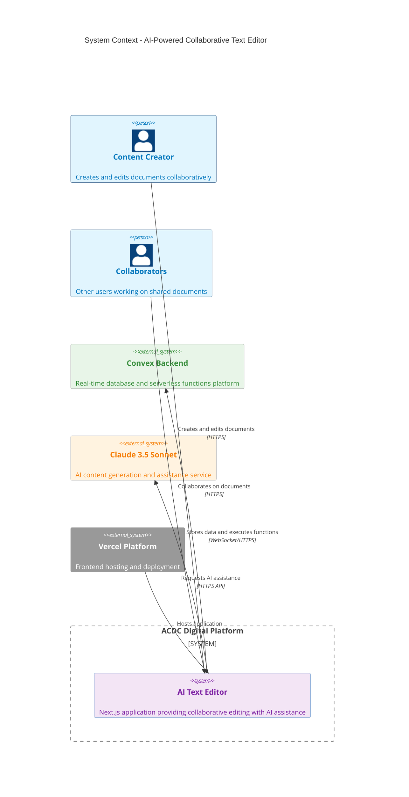
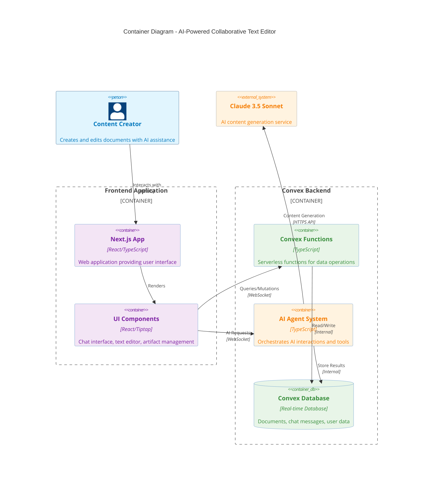
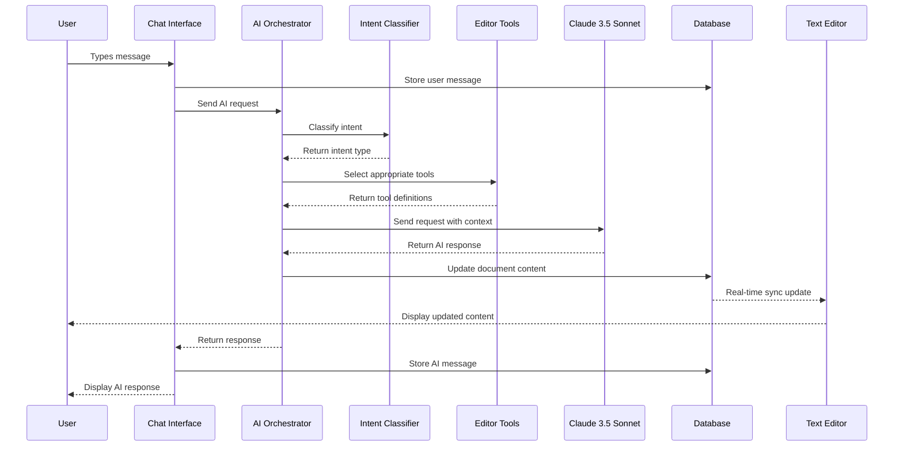
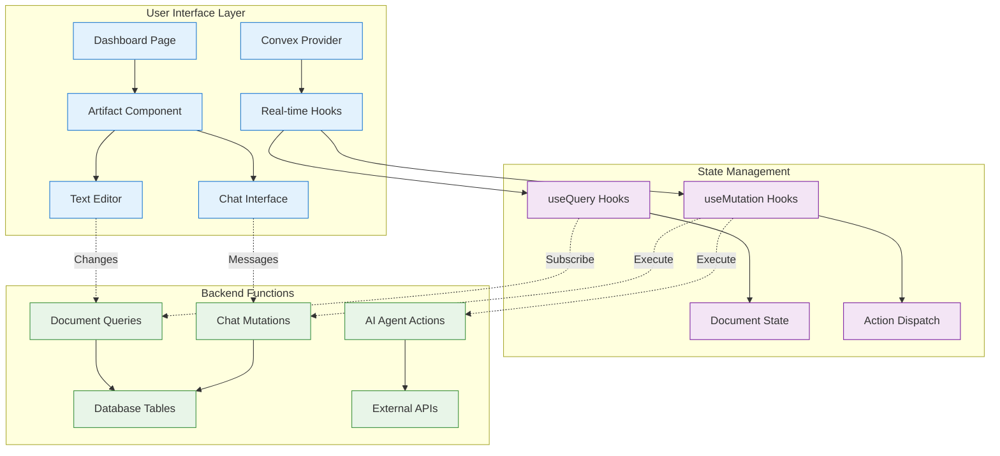
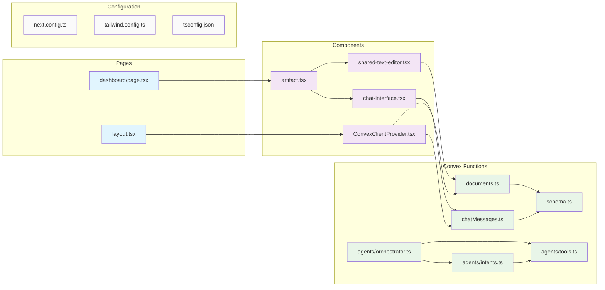
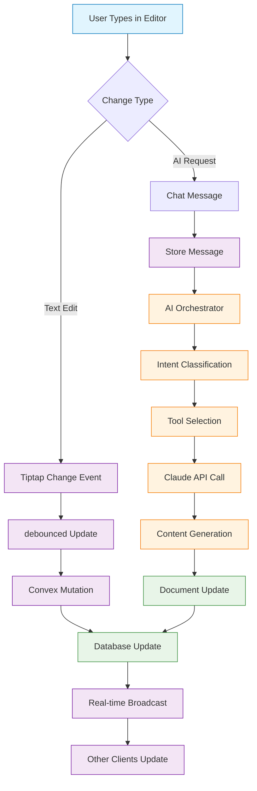
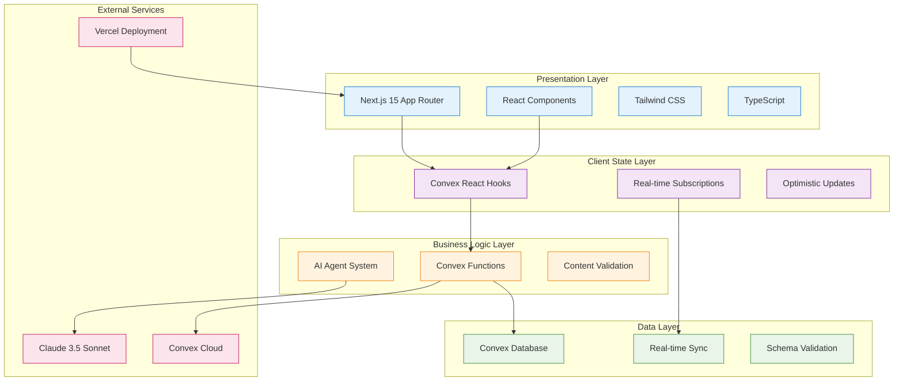
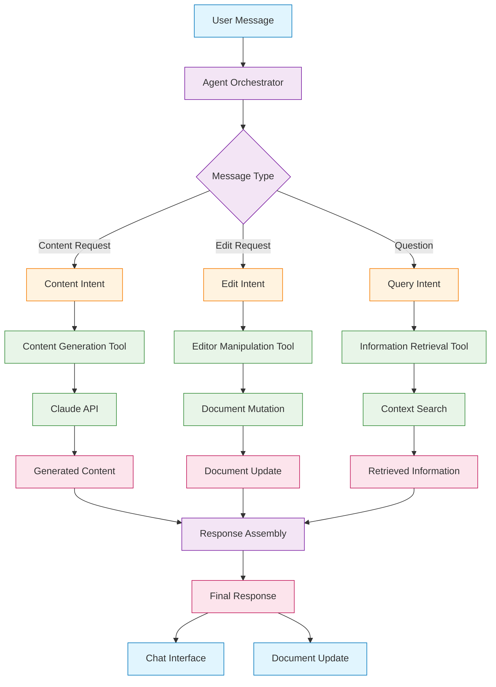
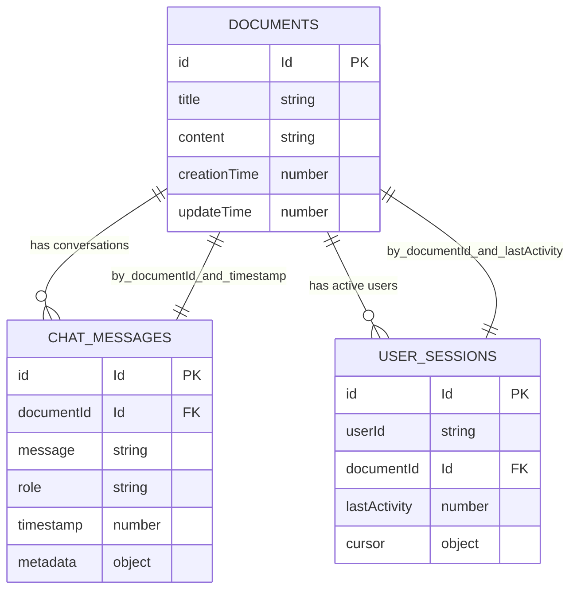

# Component Mapping Charts - AI-Powered Collaborative Text Editor

## C4 System Context Diagram

## C4 Container Diagram

## Chat Interface Data Flow

## Component Interaction Map

## File Dependency Graph

## Real-time Collaboration Flow

## Technology Stack Layers

## AI Agent Architecture

## Database Schema Relationships

This comprehensive mapping provides detailed visualization of all system components, their relationships, data flows, and architectural patterns in the AI-powered collaborative text editor.