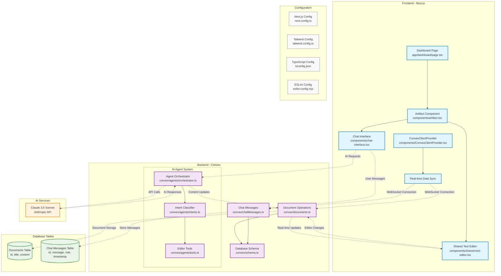
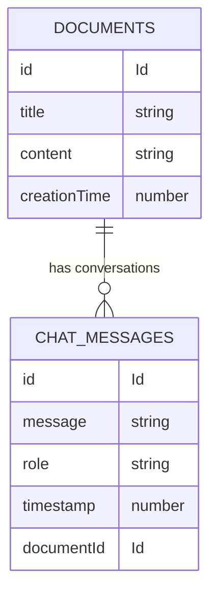
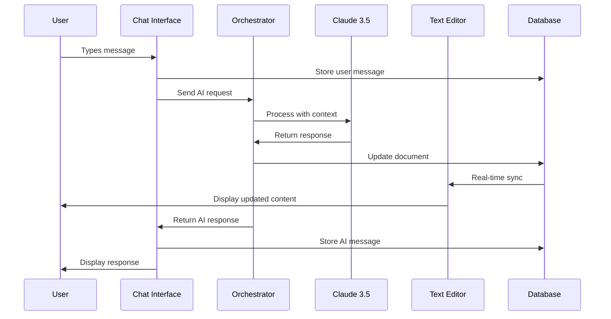
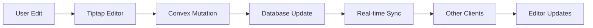
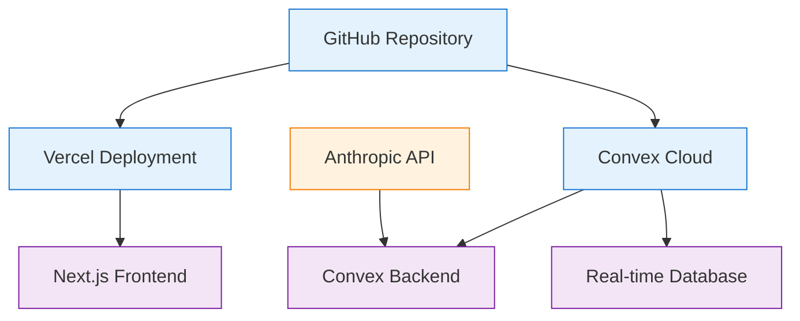

# AI-Powered Collaborative Text Editor - System Architecture

## Overview
This document provides a comprehensive mapping of the AI-powered collaborative text editor system, including detailed file overviews, component relationships, and data flow patterns.

## System Architecture Diagram

## Detailed File Mapping

### 🎨 Frontend Components (Next.js App Router)

#### Core Pages
- **`app/dashboard/page.tsx`**
  - *Purpose*: Main dashboard entry point with collaborative workspace
  - *Function*: Renders the primary interface with artifact management
  - *Dependencies*: Artifact component, ConvexClientProvider
  - *Key Features*: Document selection, real-time collaboration setup

- **`app/layout.tsx`**
  - *Purpose*: Root layout wrapper for the entire application
  - *Function*: Provides global providers, styling, and HTML structure
  - *Dependencies*: ConvexClientProvider, global CSS, Inter font
  - *Key Features*: Convex integration, responsive design setup

#### Interactive Components
- **`components/artifact.tsx`**
  - *Purpose*: Central artifact container managing chat and editor
  - *Function*: Coordinates between chat interface and text editor
  - *Dependencies*: Chat interface, shared text editor, Convex hooks
  - *Key Features*: State management, component orchestration, real-time sync

- **`components/chat-interface.tsx`**
  - *Purpose*: AI-powered chat interface for content generation
  - *Function*: Handles user messages, AI responses, and context management
  - *Dependencies*: Convex mutations, agent orchestrator
  - *Key Features*: Message history, AI integration, intent recognition

- **`components/shared-text-editor.tsx`**
  - *Purpose*: Collaborative Tiptap-based rich text editor
  - *Function*: Provides HTML editing with real-time collaboration
  - *Dependencies*: Tiptap, Convex document operations
  - *Key Features*: Rich text editing, auto-save, real-time updates

#### Infrastructure
- **`components/ConvexClientProvider.tsx`**
  - *Purpose*: Convex client configuration and context provider
  - *Function*: Establishes WebSocket connection for real-time features
  - *Dependencies*: Convex React client, environment variables
  - *Key Features*: Real-time data sync, client-side state management

### 🔧 Backend Functions (Convex)

#### Database Operations
- **`convex/documents.ts`**
  - *Purpose*: Document CRUD operations and real-time sync
  - *Function*: Manages document storage, retrieval, and updates
  - *Dependencies*: Database schema, Convex validators
  - *Key Features*: Document queries, mutations, content persistence

- **`convex/chatMessages.ts`**
  - *Purpose*: Chat message storage and retrieval system
  - *Function*: Handles message history and conversation context
  - *Dependencies*: Database schema, message validators
  - *Key Features*: Message queries, conversation threading, persistence

- **`convex/schema.ts`**
  - *Purpose*: Database schema definition and table structure
  - *Function*: Defines data models and relationships
  - *Dependencies*: Convex schema validators
  - *Key Features*: Type safety, data validation, indexing

#### AI Agent System
- **`convex/agents/orchestrator.ts`**
  - *Purpose*: Central AI agent coordinator and request handler
  - *Function*: Routes requests, manages AI interactions, coordinates tools
  - *Dependencies*: Intent classifier, editor tools, Anthropic API
  - *Key Features*: Request routing, response handling, tool coordination

- **`convex/agents/intents.ts`**
  - *Purpose*: Intent classification and request parsing
  - *Function*: Analyzes user requests to determine appropriate actions
  - *Dependencies*: AI classification models, intent definitions
  - *Key Features*: Natural language understanding, intent recognition

- **`convex/agents/tools.ts`**
  - *Purpose*: AI tool definitions for content manipulation
  - *Function*: Provides specific tools for document editing and generation
  - *Dependencies*: Document operations, content validators
  - *Key Features*: Content generation, editing operations, tool registry

### 📊 Database Schema

#### Tables Structure

### 🔄 Data Flow Patterns

#### User Interaction Flow

#### Real-time Collaboration Flow

### ⚙️ Configuration Files

#### Development Configuration
- **`next.config.ts`**
  - *Purpose*: Next.js application configuration
  - *Function*: Build settings, optimizations, environment setup
  - *Key Features*: TypeScript support, build optimizations

- **`tailwind.config.ts`**
  - *Purpose*: Tailwind CSS configuration and theming
  - *Function*: Design system setup, custom utilities
  - *Key Features*: Design tokens, responsive breakpoints

- **`tsconfig.json`**
  - *Purpose*: TypeScript compiler configuration
  - *Function*: Type checking, compilation settings
  - *Key Features*: Strict typing, path mapping

- **`eslint.config.mjs`**
  - *Purpose*: Code quality and style enforcement
  - *Function*: Linting rules, code standards
  - *Key Features*: Next.js rules, TypeScript integration

### 🎯 Key Integration Points

#### Frontend ↔ Backend
- **Real-time Updates**: Convex WebSocket connections for live collaboration
- **State Management**: React hooks integrated with server state
- **Type Safety**: Shared TypeScript types between frontend and backend

#### AI Integration
- **Intent Recognition**: Natural language processing for user requests
- **Content Generation**: AI-powered document creation and editing
- **Context Awareness**: Conversation history and document context

#### Database Operations
- **Real-time Queries**: Live data subscriptions for collaboration
- **Optimistic Updates**: Client-side predictions for smooth UX
- **Conflict Resolution**: Automatic handling of concurrent edits

## Technology Stack Summary

### Frontend Technologies
- **Next.js 15+**: React framework with App Router
- **TypeScript**: Type-safe development
- **Tailwind CSS**: Utility-first styling
- **Tiptap**: Rich text editor framework
- **Convex React**: Real-time data hooks

### Backend Technologies
- **Convex**: Real-time backend platform
- **TypeScript**: Server-side type safety
- **Anthropic Claude**: AI content generation
- **WebSocket**: Real-time communication

### Development Tools
- **ESLint**: Code quality enforcement
- **PostCSS**: CSS processing
- **pnpm**: Package management
- **Git**: Version control

## Deployment Architecture

This architecture provides a robust foundation for AI-powered collaborative editing with real-time synchronization, intelligent content generation, and seamless user experience.