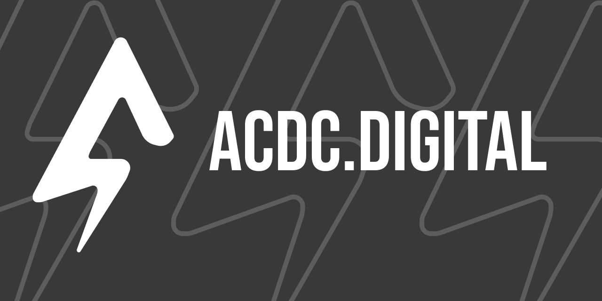

## 💾 Hi there! I'm Matthew. Owner/ Founder of ACDC.digital.




#####


#### This is where you'll find what we're working on, our developing projects, and our architectural foundation. Our playbook is simple:
352,728 lines of code across 5.5GB of projects

| Project | Lines of Code | % of Codebase | Size | % of Space | Primary Focus |
|---------|--------------|---------------|------|------------|---------------|
| **smnb** | 98,569 | 27.9% | 491MB | 8.6% | News Management & Content Processing |
| **aura** | 71,993 | 20.4% | 183MB | 3.2% | Collaborative Document Editing |
| **lifeOS** | 54,164 | 15.4% | 1.9GB | 33.5% | Comprehensive Productivity Suite |
| **soloist** | 53,484 | 15.2% | 29MB | 0.5% | Personal Analytics & Forecasting |
| **solov2** | 14,838 | 4.2% | 625MB | 11.0% | Enhanced Analytics Platform |
| **ruuf** | 11,312 | 3.2% | 164MB | 2.9% | Python-based Framework |
| **tradies** | 10,925 | 3.1% | 578MB | 10.2% | Documentation & Notebooks |
| **acdc-digital** | 10,170 | 2.9% | 375MB | 6.6% | Core Framework & Infrastructure |
| **donut** | 9,966 | 2.8% | 655MB | 11.5% | Web Application Platform |
| **grapes** | 9,591 | 2.7% | 146MB | 2.6% | Python Utilities |
| **home** | 7,716 | 2.2% | 531MB | 9.4% | Home Website & Portfolio |

## ACDC.digital - Full Service Agentic Framework Studio

ACDC.digital is a **full-service agentic framework studio** that transforms concepts into production-ready intelligent systems. From initial design concepts to complex backend infrastructure, we deliver complete solutions that seamlessly blend autonomous agent capabilities with exceptional user experiences and natural conversation.

#### **Our End-to-End Process:**
- **Design & UX**: Intuitive interfaces that make complex AI interactions feel natural through interactive chat conversations.
- **Agent Development**: Sophisticated multi-agent orchestration and workflow automation built on top of a proven platform.
- **Backend Infrastructure**: Scalable, real-time systems supporting concurrent agent operations for complex task management while you focus on the big picture.
- **Full Deployment**: Production-grade delivery with monitoring and optimization, hosted, and maintained.

#### **Full-Service Capabilities**

| Service Area | Expertise | Technologies | Deliverables |
|--------------|-----------|--------------|--------------|
| **UI/UX Design** | Agent-Human Interaction Patterns | Figma, Tailwind CSS, Custom ShadnCN Component Library | Custom Interfaces, Design Systems, User Flows |
| **Agent Orchestration** | Multi-Agent Coordination | TypeScript, Anthropic Provider, Convex Serverless Database | Autonomous Frameworks, Task Distribution Systems, Data Gathering & Analytics |
| **Backend Infrastructure** | Real-Time & Scalable Systems | Convex, Node.js, Serverless Architecture | High-Performance APIs, Live Synchronization, Auto-Scaling |
| **Technical Architecture** | End-to-End System Design | Next.js, Database Design, Deployment Pipelines | Complete Technical Specifications, Infrastructure Planning, and User Guides |
| **AI Integration** | Accessible Multi-Model Communication | Anthropic Routing (Tools & Conversational, Artifacts) | Seamless AI Workflows, Intelligent Fallback Systems |
| **Workflow Automation** | Process Optimization | Custom Orchestration, Decision Trees | Intelligent Routing, Adaptive Process Management, Human in the Loop |

#### **Current Projects & Agent Ecosystem**

| Project | Active Agents | Core Technologies | Agent Capabilities | Use Case Focus |
|---------|---------------|------------------|-------------------|----------------|
| **Soloist** | 12+ agents | Next.js, Convex, TypeScript | Data Analysis, Predictive Modeling, Performance Tracking, Mood Forecasting | Personal Analytics & Productivity Optimization |
| **SMNB** | 18+ agents | React, Convex, Node.js | Content Aggregation, Duplicate Detection, Threading, Classification | News Management & Content Processing |
| **AURA** | 15+ agents | Next.js, Tailwind, Convex | Document Formatting, Real-time Collaboration, Auto-styling, Version Control | Collaborative Document Editing |
| **LifeOS** | 22+ agents | TypeScript, React, Multi-model AI | Research Automation, File Management, Task Orchestration, Workflow Optimization | Comprehensive Productivity Suite |
| **Framework Core** | 11+ agents | Model Context Protocol, Serverless | Agent Coordination, Communication Routing, Scalability Management | Foundation Infrastructure |

> **Total Active Agents**: 78+ across all projects with expanding multi-agent coordination capabilities

#### **Framework Architecture**

- Production-grade TypeScript development with strict type safety across agent communications
  ```typescript
  agentMessage({ from: AgentId, to: AgentId, payload: TypedPayload })
  ```

- Serverless-first architecture enabling elastic agent scaling and resource optimization
  ```typescript
  autoScale(currentLoad) → scheduler.spawn(optimalCapacity)
  ```

- Multi-model AI integration with intelligent routing and fallback mechanisms
  ```typescript
  aiRouter.route(task) → claude-3.5 || gpt-4o || gpt-4o-mini
  ```

- Mono-repo structure supporting modular agent development and deployment ensuring organization-wide consistency
  ```typescript
  class Agent<TContext, TCapabilities> { execute() → AgentResult }
  ```

- Advanced caching strategies and state management for high-performance agent coordination
  ```typescript
  cachedResult = storage.get(key) ?? compute.memoize(key, fn)
  ```

⚡⚡⚡


