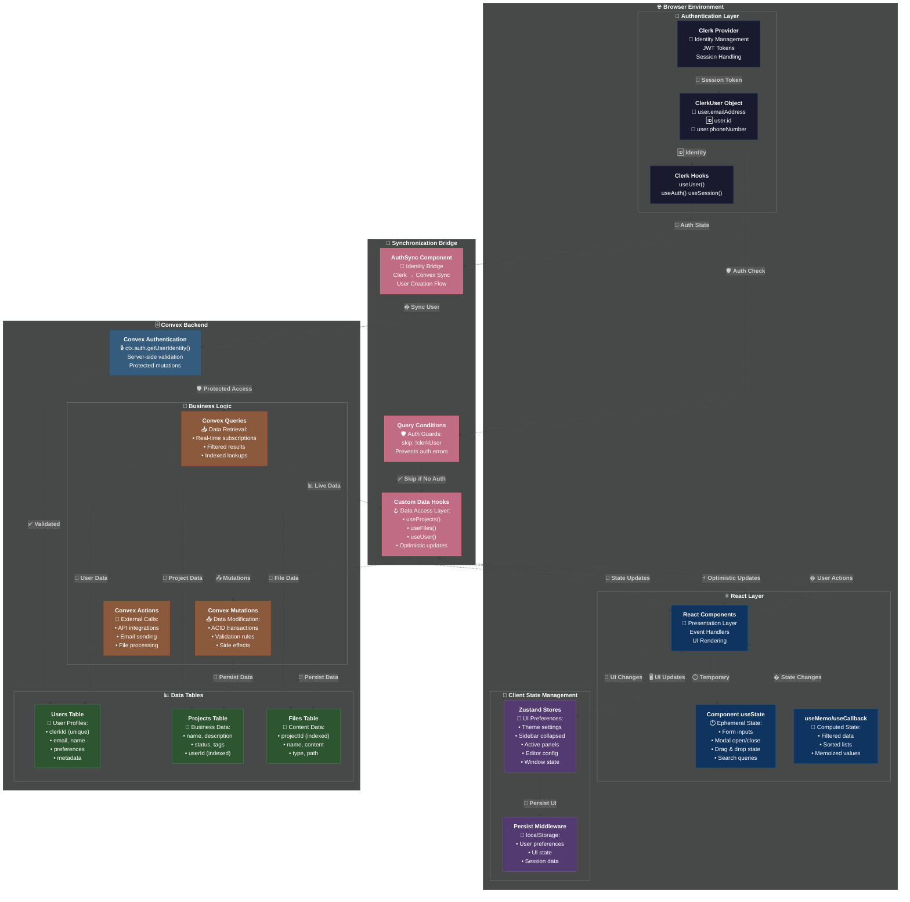
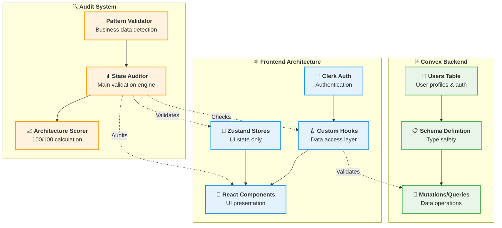
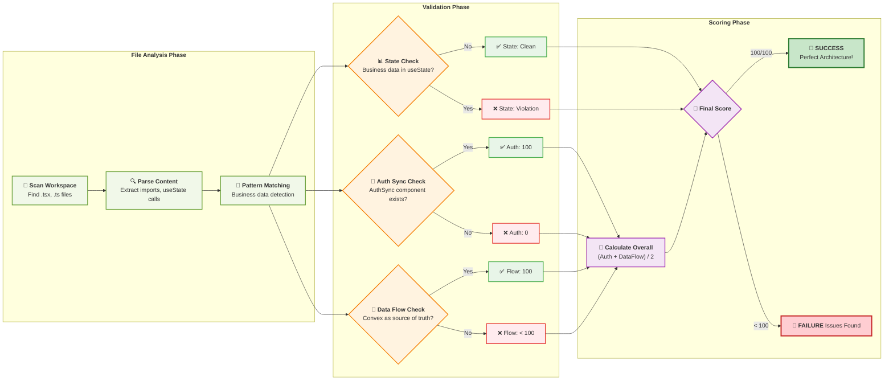
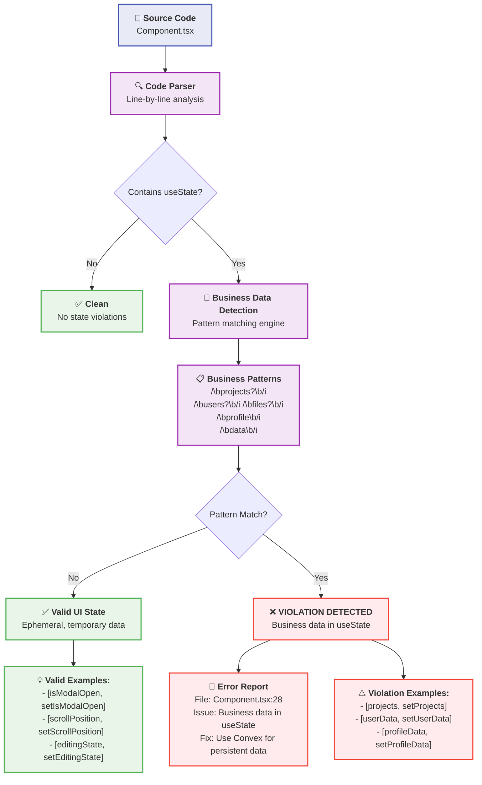
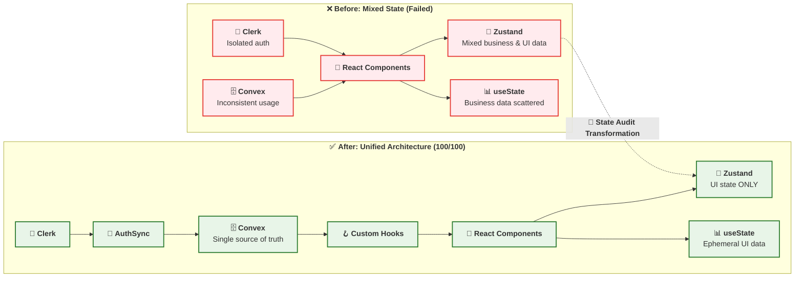
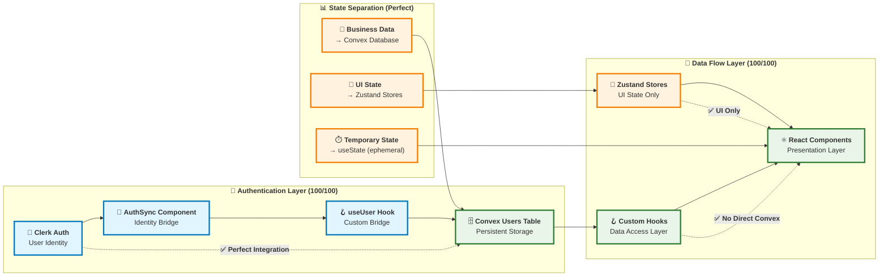

# LifeOS State Management Architecture - Advanced Visualizations

This document contains sophisticated Mermaid charts that visualize the intricate relationships and data flows within our comprehensive state management system.

## Complex State Flow Architecture



## State Audit Deep Inspection Matrix

```mermaid
%%{init: {
  'theme': 'dark',
  'themeVariables': {
    'primaryColor': '#1e1e1e',
    'primaryTextColor': '#ffffff',
    'primaryBorderColor': '#404040',
    'lineColor': '#404040'
  }
}}%%
flowchart TD
    subgraph "`🔍 **State Audit Categories**`"
        subgraph "`🔐 **Authentication Sync Validation**`"
            AuthSyncCheck{"`**AuthSync Component**
            Exists in codebase?`"}
            LayoutCheck{"`**Layout Integration**
            Included in app/layout.tsx?`"}
            UserHookCheck{"`**useUser Hook**
            Bridges Clerk ↔ Convex?`"}
            ConditionalCheck{"`**Conditional Queries**
            Prevents auth errors?`"}
            
            AuthSyncCheck -->|Yes| AuthPass1["`✅ **Component Found**
            Score: +25`"]
            AuthSyncCheck -->|No| AuthFail1["`❌ **Missing AuthSync**
            Critical: Identity sync broken`"]
            
            LayoutCheck -->|Yes| AuthPass2["`✅ **Properly Integrated**
            Score: +25`"]
            LayoutCheck -->|No| AuthFail2["`❌ **Not in Layout**
            Auth won't initialize`"]
            
            UserHookCheck -->|Yes| AuthPass3["`✅ **Bridge Working**
            Score: +25`"]
            UserHookCheck -->|No| AuthFail3["`❌ **Bridge Broken**
            Data access compromised`"]
            
            ConditionalCheck -->|Yes| AuthPass4["`✅ **Safe Queries**
            Score: +25`"]
            ConditionalCheck -->|No| AuthFail4["`❌ **Unsafe Queries**
            Runtime auth errors`"]
        end
        
        subgraph "`🌊 **Data Flow Architecture Validation**`"
            ConvexSourceCheck{"`**Convex Source of Truth**
            Business data only in Convex?`"}
            ZustandUICheck{"`**Zustand UI Only**
            No business data in stores?`"}
            CustomHooksCheck{"`**Custom Hooks Pattern**
            Wrapping Convex operations?`"}
            DirectConvexCheck{"`**Direct Convex Calls**
            Components call Convex directly?`"}
            
            ConvexSourceCheck -->|Yes| DataPass1["`✅ **Single Source**
            Score: +25`"]
            ConvexSourceCheck -->|No| DataFail1["`❌ **Data Duplication**
            Multiple sources of truth`"]
            
            ZustandUICheck -->|Yes| DataPass2["`✅ **Clean Separation**
            Score: +25`"]
            ZustandUICheck -->|No| DataFail2["`❌ **Business in UI Store**
            Architecture violation`"]
            
            CustomHooksCheck -->|Yes| DataPass3["`✅ **Proper Abstraction**
            Score: +25`"]
            CustomHooksCheck -->|No| DataFail3["`❌ **Missing Abstraction**
            Tight coupling detected`"]
            
            DirectConvexCheck -->|No| DataPass4["`✅ **Proper Layering**
            Score: +25`"]
            DirectConvexCheck -->|Yes| DataFail4["`❌ **Layer Violation**
            Direct component access`"]
        end
        
        subgraph "`📊 **State Separation Inspection**`"
            UseStateCheck{"`**useState Patterns**
            Business data detected?`"}
            PatternMatch["`**Pattern Matching Engine**
            Scanning for violations:
            • /\\bprojects?\\b/i
            • /\\busers?\\b/i
            • /\\bfiles?\\b/i
            • /\\bprofile\\b/i
            • /\\bdata\\b/i`"]
            
            UseStateCheck --> PatternMatch
            PatternMatch -->|No Match| StatePass["`✅ **Clean useState**
            Only ephemeral UI state`"]
            PatternMatch -->|Match Found| StateFail["`❌ **Business Data Violation**
            File: component.tsx:28
            Fix: Move to Convex`"]
        end
    end
    
    subgraph "`📈 **Scoring Matrix**`"
        AuthScore["`🔐 **Auth Sync Score**
        (Pass1 + Pass2 + Pass3 + Pass4) / 4 * 100`"]
        DataScore["`🌊 **Data Flow Score** 
        (Pass1 + Pass2 + Pass3 + Pass4) / 4 * 100`"]
        OverallCalc{"`🎯 **Overall Calculation**
        (AuthScore + DataScore) / 2`"}
        
        AuthPass1 --> AuthScore
        AuthPass2 --> AuthScore  
        AuthPass3 --> AuthScore
        AuthPass4 --> AuthScore
        AuthFail1 --> AuthScore
        AuthFail2 --> AuthScore
        AuthFail3 --> AuthScore
        AuthFail4 --> AuthScore
        
        DataPass1 --> DataScore
        DataPass2 --> DataScore
        DataPass3 --> DataScore  
        DataPass4 --> DataScore
        DataFail1 --> DataScore
        DataFail2 --> DataScore
        DataFail3 --> DataScore
        DataFail4 --> DataScore
        
        AuthScore --> OverallCalc
        DataScore --> OverallCalc
        StatePass --> OverallCalc
        StateFail --> OverallCalc
        
        OverallCalc -->|100/100| PerfectScore["`🎉 **PERFECT ARCHITECTURE**
        
        📊 FINAL SCORES:
        🔐 Auth Sync: 100/100
        🌊 Data Flow: 100/100  
        📊 State Sep: ✅ Clean
        🎯 Overall: 100/100
        
        ✨ Zero violations detected
        🏆 Architecture excellence achieved`"]
        
        OverallCalc -->|< 100| FailedScore["`🔴 **ARCHITECTURE ISSUES**
        
        📊 SCORES BREAKDOWN:
        🔐 Auth Sync: X/100
        🌊 Data Flow: Y/100
        📊 State Sep: Z violations
        🎯 Overall: W/100
        
        🚨 Critical fixes required
        📝 See violation details`"]
    end
    
    %% Enhanced styling for dark theme
    classDef checkNode fill:#2d1b69,stroke:#3c1874,color:#ffffff
    classDef passNode fill:#1b4332,stroke:#2d5016,color:#ffffff
    classDef failNode fill:#6a040f,stroke:#7b0c1a,color:#ffffff  
    classDef scoreNode fill:#1a535c,stroke:#2c7a7b,color:#ffffff
    classDef perfectNode fill:#06d6a0,stroke:#ffffff,color:#000000,stroke-width:3px
    classDef failedNode fill:#ef476f,stroke:#ffffff,color:#000000,stroke-width:3px
    classDef patternNode fill:#4a4e69,stroke:#6c5b7b,color:#ffffff
    
    class AuthSyncCheck,LayoutCheck,UserHookCheck,ConditionalCheck,ConvexSourceCheck,ZustandUICheck,CustomHooksCheck,DirectConvexCheck,UseStateCheck checkNode
    class AuthPass1,AuthPass2,AuthPass3,AuthPass4,DataPass1,DataPass2,DataPass3,DataPass4,StatePass passNode
    class AuthFail1,AuthFail2,AuthFail3,AuthFail4,DataFail1,DataFail2,DataFail3,DataFail4,StateFail failNode
    class AuthScore,DataScore,OverallCalc scoreNode
    class PerfectScore perfectNode
    class FailedScore failedNode
    class PatternMatch patternNode
```



## State Management Layers - Intricate Relationships

```mermaid
%%{init: {
  'theme': 'dark',
  'themeVariables': {
    'primaryColor': '#1e1e1e',
    'primaryTextColor': '#ffffff',
    'primaryBorderColor': '#404040',
    'lineColor': '#404040'
  }
}}%%
flowchart LR
    subgraph "`🧠 **Cognitive State Layers**`"
        subgraph "`⚡ **Ephemeral Layer** (Component State)`"
            FormInputs["`**Form Inputs**
            🖊️ Text fields
            📝 Textarea content
            ☑️ Checkbox states
            🎚️ Slider values`"]
            
            UIInteractions["`**UI Interactions**
            🖱️ Hover states
            🎯 Focus management
            📱 Touch gestures
            ⌨️ Keyboard navigation`"]
            
            TemporaryFlags["`**Temporary Flags**
            🔄 Loading states
            ❗ Error boundaries
            📊 Progress indicators
            ⏱️ Timeout handlers`"]
        end
        
        subgraph "`🎨 **Preference Layer** (Zustand)`"
            VisualPrefs["`**Visual Settings**
            🌙 Theme: dark/light
            📏 Font size: 12-20px
            📐 Layout density
            🎨 Color schemes`"]
            
            WorkspaceState["`**Workspace Layout**
            📂 Sidebar collapsed
            📑 Active panels
            🔖 Open tabs
            📍 Scroll positions`"]
            
            UserSettings["`**User Preferences**
            � Notification settings
            ⌨️ Keyboard shortcuts
            📱 Device preferences
            🌍 Language/locale`"]
        end
        
        subgraph "`💼 **Business Layer** (Convex)`"
            EntityData["`**Core Entities**
            👤 User profiles
            📁 Project data
            📄 File contents
            🏷️ Tag systems`"]
            
            RelationshipData["`**Relationships**
            🔗 Project → Files
            👥 User → Projects  
            �️ Tags → Projects
            📊 Analytics data`"]
            
            BusinessLogic["`**Domain Logic**
            ✅ Validation rules
            🔒 Permission systems
            📈 Audit trails
            🔄 Workflow states`"]
        end
    end
    
    subgraph "`🔄 **Data Synchronization Patterns**`"
        OptimisticUpdates["`**Optimistic Updates**
        1. 🏃‍♂️ Immediate UI feedback
        2. 📤 Send to Convex
        3. ✅ Confirm or rollback
        4. 🔄 Sync final state`"]
        
        RealtimeSync["`**Real-time Sync**
        📡 Convex subscriptions
        ⚡ Live query updates
        🔄 Automatic re-renders
        📱 Cross-device sync`"]
        
        ConflictResolution["`**Conflict Resolution**
        🕐 Last-write-wins
        👑 Server authoritative
        🔀 Merge strategies
        🚨 Conflict detection`"]
    end
    
    subgraph "`🧪 **State Validation Patterns**`"
        TypeSafety["`**Type Safety**
        🔒 TypeScript enforcement
        📋 Convex schema validation
        🛡️ Runtime type checks
        🎯 Interface contracts`"]
        
        StateGuards["`**State Guards**
        🛡️ Auth boundaries
        🔐 Permission checks
        ✅ Validation layers
        🚫 Access control`"]
        
        ErrorBoundaries["`**Error Handling**
        🏥 Error boundaries
        🔄 Retry mechanisms
        📝 Error logging
        🚨 User notifications`"]
    end
    
    %% Complex interaction flows
    FormInputs -.->|"`⏱️ **Temporary**`"| UIInteractions
    UIInteractions -.->|"`💾 **Persist**`"| VisualPrefs
    VisualPrefs -.->|"`🔄 **Apply**`"| WorkspaceState
    UserSettings -.->|"`👤 **Profile**`"| EntityData
    
    EntityData -.->|"`🔗 **Relations**`"| RelationshipData
    RelationshipData -.->|"`📊 **Analytics**`"| BusinessLogic
    BusinessLogic -.->|"`⚡ **Updates**`"| OptimisticUpdates
    OptimisticUpdates -.->|"`📡 **Sync**`"| RealtimeSync
    
    RealtimeSync -.->|"`🔄 **Conflicts**`"| ConflictResolution
    ConflictResolution -.->|"`🛡️ **Validate**`"| TypeSafety
    TypeSafety -.->|"`🔐 **Guard**`"| StateGuards
    StateGuards -.->|"`🚨 **Errors**`"| ErrorBoundaries
    
    %% Feedback loops
    ErrorBoundaries -.->|"`🔄 **Recovery**`"| FormInputs
    TemporaryFlags -.->|"`📊 **Status**`"| WorkspaceState
    BusinessLogic -.->|"`🎨 **UI State**`"| VisualPrefs
    
    %% Advanced dark theme styling
    classDef ephemeralNode fill:#2a1810,stroke:#8b4513,color:#ffffff,stroke-width:2px
    classDef preferenceNode fill:#1a1a2e,stroke:#16213e,color:#ffffff,stroke-width:2px
    classDef businessNode fill:#0d1b2a,stroke:#1b263b,color:#ffffff,stroke-width:2px
    classDef syncNode fill:#2d5016,stroke:#4a7c59,color:#ffffff,stroke-width:2px
    classDef validationNode fill:#6a040f,stroke:#7b0c1a,color:#ffffff,stroke-width:2px
    
    class FormInputs,UIInteractions,TemporaryFlags ephemeralNode
    class VisualPrefs,WorkspaceState,UserSettings preferenceNode  
    class EntityData,RelationshipData,BusinessLogic businessNode
    class OptimisticUpdates,RealtimeSync,ConflictResolution syncNode
    class TypeSafety,StateGuards,ErrorBoundaries validationNode
```

## Convex-Clerk-Zustand Integration Depth Map

```mermaid
%%{init: {
  'theme': 'dark',
  'themeVariables': {
    'primaryColor': '#1e1e1e',
    'primaryTextColor': '#ffffff',
    'primaryBorderColor': '#404040',
    'lineColor': '#404040'
  }
}}%%
graph TD
    subgraph "`🔐 **Authentication Domain** (Clerk)`"
        ClerkProvider["`**ClerkProvider**
        🏛️ Identity Provider
        ENV: NEXT_PUBLIC_CLERK_*
        Webhooks: User lifecycle`"]
        
        ClerkSession["`**Session Management**
        🎫 JWT Tokens
        🔐 Auth middleware
        ⏰ Session refresh
        🚪 Sign in/out flows`"]
        
        ClerkWebhooks["`**Clerk Webhooks**
        📡 user.created
        📡 user.updated
        📡 user.deleted
        ➡️ Sync to Convex`"]
    end
    
    subgraph "`⚡ **Synchronization Engine**`"
        AuthSync["`**AuthSync.tsx**
        🌉 Identity Bridge
        
        🔄 Sync Flow:
        1. Detect Clerk user
        2. Query Convex user
        3. Create if missing
        4. Update metadata
        5. Handle errors`"]
        
        UserHook["`**useUser Hook**
        🪝 Unified Interface
        
        Returns:
        • clerkUser (ClerkUser | null)
        • convexUser (Doc<'users'> | null) 
        • isLoading (boolean)
        • error (ConvexError | null)`"]
        
        ConditionalQueries["`**Conditional Query Pattern**
        🛡️ Safe Data Access
        
        skip: !clerkUser?.id
        Prevents:
        • Unauthorized queries
        • Runtime errors
        • Auth race conditions`"]
    end
    
    subgraph "`🗄️ **Data Persistence** (Convex)`"
        ConvexSchema["`**Schema Definition**
        📋 Type-Safe Tables
        
        users: {
          clerkId: v.string()
          email: v.string()
          name: v.optional(v.string())
          preferences: v.object({...})
        }
        
        projects: {
          userId: v.id('users')
          name: v.string()
          status: v.union('active', 'archived')
          ...indexing by userId
        }`"]
        
        QueryLayer["`**Query Layer**
        📥 Real-time Data Access
        
        • db.query('users').filter(q => q.eq('clerkId', ...))
        • db.query('projects').withIndex('by_user', q => q.eq('userId', ...))
        • Live subscriptions with automatic re-renders
        • Optimistic updates with rollback`"]
        
        MutationLayer["`**Mutation Layer**  
        📤 Transactional Updates
        
        • ACID transactions
        • Schema validation
        • Authentication checks
        • Audit trail logging
        • Error boundary handling`"]
    end
    
    subgraph "`🎨 **UI State Management** (Zustand)`"
        EditorStore["`**Editor Store**
        📝 Editor State
        
        interface EditorStore {
          activeFileId: string | null
          openTabs: Tab[]
          editorTheme: 'vs-dark' | 'vs-light'
          fontSize: number
          wordWrap: boolean
        }`"]
        
        SidebarStore["`**Sidebar Store**
        📂 Navigation State
        
        interface SidebarStore {
          isCollapsed: boolean
          activePanel: 'files' | 'search' | 'git'
          expandedFolders: string[]
          pinnedItems: string[]
        }`"]
        
        TerminalStore["`**Terminal Store**
        💻 Terminal State
        
        interface TerminalStore {
          sessions: TerminalSession[]
          activeSessionId: string
          history: Command[]
          isMinimized: boolean
        }`"]
        
        PersistMiddleware["`**Persist Middleware**
        💾 LocalStorage Sync
        
        • Selective persistence
        • Version migration
        • Hydration handling
        • Storage quota management`"]
    end
    
    subgraph "`⚛️ **Component Integration Layer**`"
        CustomHooks["`**Custom Data Hooks**
        🪝 Abstraction Layer
        
        useProjects() {
          const projects = useQuery(api.projects.list, 
            clerkUser ? { userId } : 'skip'
          )
          const create = useMutation(api.projects.create)
          
          return {
            projects: projects ?? [],
            isLoading: projects === undefined,
            create: async (data) => {
              // Optimistic update
              setTempState(data)
              try {
                await create(data)
                setTempState(null)
              } catch (e) {
                setTempState(null)
                throw e
              }
            }
          }
        }`"]
        
        ComponentState["`**Component useState**
        ⏱️ Ephemeral Only
        
        Allowed:
        • Form input values
        • Modal open/closed
        • Loading states
        • Error messages
        • Animation states
        
        Forbidden:
        • Business data
        • User profiles
        • Project data
        • File contents`"]
    end
    
    %% Complex relationship flows
    ClerkProvider -.->|"`🆔 **Identity**`"| ClerkSession
    ClerkSession -.->|"`👤 **User State**`"| AuthSync
    ClerkWebhooks -.->|"`📡 **Lifecycle**`"| AuthSync
    
    AuthSync -.->|"`🔄 **Sync Process**`"| ConvexSchema
    AuthSync -.->|"`🪝 **Expose State**`"| UserHook
    UserHook -.->|"`🛡️ **Auth Guard**`"| ConditionalQueries
    
    ConditionalQueries -.->|"`✅ **Safe Access**`"| QueryLayer
    QueryLayer -.->|"`📊 **Live Data**`"| CustomHooks
    MutationLayer -.->|"`💾 **Persist**`"| ConvexSchema
    
    CustomHooks -.->|"`🎨 **UI Updates**`"| ComponentState
    ComponentState -.->|"`🎬 **User Actions**`"| CustomHooks
    CustomHooks -.->|"`📤 **Mutations**`"| MutationLayer
    
    ComponentState -.->|"`🎨 **UI State**`"| EditorStore
    ComponentState -.->|"`📂 **Nav State**`"| SidebarStore  
    ComponentState -.->|"`💻 **Terminal State**`"| TerminalStore
    
    EditorStore -.->|"`💾 **Persist**`"| PersistMiddleware
    SidebarStore -.->|"`💾 **Persist**`"| PersistMiddleware
    TerminalStore -.->|"`💾 **Persist**`"| PersistMiddleware
    
    %% Error handling flows
    ConditionalQueries -.->|"`🚫 **Block Unauthorized**`"| QueryLayer
    MutationLayer -.->|"`❌ **Validation Errors**`"| CustomHooks
    CustomHooks -.->|"`🔄 **Rollback**`"| ComponentState
    
    %% Real-time sync flows
    QueryLayer -.->|"`📡 **Live Updates**`"| CustomHooks
    ConvexSchema -.->|"`🔄 **Schema Changes**`"| QueryLayer
    
    %% Complex dark theme styling
    classDef clerkNode fill:#1a1a2e,stroke:#16213e,stroke-width:2px,color:#ffffff
    classDef syncNode fill:#c06c84,stroke:#f67280,stroke-width:2px,color:#ffffff
    classDef convexNode fill:#355c7d,stroke:#2f4858,stroke-width:2px,color:#ffffff
    classDef zustandNode fill:#533a71,stroke:#6c5b7b,stroke-width:2px,color:#ffffff  
    classDef componentNode fill:#0f3460,stroke:#16537e,stroke-width:2px,color:#ffffff
    
    class ClerkProvider,ClerkSession,ClerkWebhooks clerkNode
    class AuthSync,UserHook,ConditionalQueries syncNode
    class ConvexSchema,QueryLayer,MutationLayer convexNode
    class EditorStore,SidebarStore,TerminalStore,PersistMiddleware zustandNode
    class CustomHooks,ComponentState componentNode
```



## Performance Optimization Patterns Deep Dive

```mermaid
%%{init: {
  'theme': 'dark',
  'themeVariables': {
    'primaryColor': '#1e1e1e',
    'primaryTextColor': '#ffffff',
    'primaryBorderColor': '#404040',
    'lineColor': '#404040'
  }
}}%%
flowchart TB
    subgraph "`⚡ **Query Optimization Strategies**`"
        subgraph "`📊 **Convex Query Patterns**`"
            IndexedQueries["`**Indexed Queries**
            🚀 Database Performance
            
            • by_user index on projects
            • by_project index on files
            • compound indexes for filters
            • Range queries optimization
            
            Performance: O(log n) vs O(n)`"]
            
            ConditionalFetch["`**Conditional Fetching**
            🛡️ Auth-Safe Queries
            
            const projects = useQuery(
              api.projects.list,
              clerkUser ? { userId } : 'skip'
            )
            
            Benefits:
            • No unauthorized queries
            • Prevents race conditions
            • Reduces server load`"]
            
            PaginatedResults["`**Pagination Strategy**
            📄 Large Dataset Handling
            
            • Cursor-based pagination
            • Incremental loading
            • Virtual scrolling integration
            • Memory-efficient rendering
            
            Query: { paginationOpts: { numItems: 50, cursor: 'xyz' } }`"]
        end
        
        subgraph "`🔄 **Update Optimization**`"
            OptimisticUI["`**Optimistic Updates**
            ⚡ Instant UI Feedback
            
            1. Update UI immediately
            2. Send mutation to server
            3. On success: commit change
            4. On error: rollback UI
            5. Show error message
            
            UX: Zero perceived latency`"]
            
            BatchUpdates["`**Batch Mutations**
            📦 Multiple Operations
            
            • Group related mutations
            • Single transaction boundary
            • Reduced server roundtrips
            • Atomic success/failure
            
            Example: createProjectWithFiles([...])`"]
            
            DebouncedSaves["`**Debounced Operations**
            ⏱️ Rate Limiting
            
            • File content auto-save
            • Search query debouncing
            • Settings updates
            • 300ms typical delay
            
            Prevents: Server spam, race conditions`"]
        end
    end
    
    subgraph "`🧠 **State Management Optimization**`"
        subgraph "`⚛️ **React Performance**`"
            MemoizedComponents["`**React.memo Components**
            🧮 Render Optimization
            
            • Pure component wrappers
            • Props equality checking
            • Prevent unnecessary re-renders
            • Custom comparison functions
            
            Applies to: List items, heavy components`"]
            
            CallbackMemo["`**useCallback/useMemo**
            🎯 Reference Stability
            
            • Stable function references
            • Computed value caching
            • Child component optimization
            • Dependency array management
            
            Critical for: Event handlers, derived state`"]
            
            LazyLoading["`**Component Lazy Loading**
            📦 Code Splitting
            
            const HeavyComponent = lazy(() => import('./Heavy'))
            
            • Route-based splitting
            • Feature-based splitting
            • Progressive enhancement
            • Smaller initial bundles`"]
        end
        
        subgraph "`🏪 **Store Performance**`"
            StoreSelectors["`**Zustand Selectors**
            🎯 Granular Subscriptions
            
            // ❌ Re-renders on any store change
            const state = useStore()
            
            // ✅ Only re-renders on specific change
            const theme = useStore(state => state.theme)
            
            Benefit: Reduced component updates`"]
            
            StorePartitioning["`**Store Partitioning**
            📦 Separate Concerns
            
            • editorStore: Editor-specific state
            • sidebarStore: Navigation state  
            • terminalStore: Terminal state
            
            Isolation prevents: Cross-cutting updates`"]
            
            PersistOptimization["`**Persist Middleware Tuning**
            💾 Storage Performance
            
            • Selective field persistence
            • Throttled write operations
            • Compression for large state
            • Migration strategies
            
            Storage impact: Minimized localStorage usage`"]
        end
    end
    
    subgraph "`📊 **Monitoring & Metrics**`"
        PerformanceTracking["`**Performance Tracking**
        📈 Real-time Metrics
        
        • Query execution time
        • Component render count
        • State update frequency
        • Memory usage patterns
        
        Tools: React DevTools, Convex Dashboard`"]
        
        BottleneckDetection["`**Bottleneck Detection**
        🔍 Performance Analysis
        
        • Slow query identification
        • Heavy component analysis
        • State thrashing detection
        • Memory leak monitoring
        
        Alerts: Performance regression warnings`"]
        
        OptimizationMetrics["`**Optimization Impact**
        📊 Before/After Analysis
        
        Metrics:
        • Time to Interactive (TTI)
        • First Contentful Paint (FCP)
        • Query response times
        • Bundle size reduction
        
        Target: < 100ms UI updates`"]
    end
    
    %% Performance flow relationships
    IndexedQueries -.->|"`🚀 **Fast Data Access**`"| OptimisticUI
    ConditionalFetch -.->|"`🛡️ **Safe Loading**`"| MemoizedComponents
    PaginatedResults -.->|"`📄 **Efficient Rendering**`"| LazyLoading
    
    OptimisticUI -.->|"`⚡ **Instant Feedback**`"| CallbackMemo
    BatchUpdates -.->|"`📦 **Efficient Updates**`"| StoreSelectors
    DebouncedSaves -.->|"`⏱️ **Rate Limited**`"| PersistOptimization
    
    MemoizedComponents -.->|"`🧮 **Render Control**`"| PerformanceTracking
    StorePartitioning -.->|"`📦 **Isolated Updates**`"| BottleneckDetection
    PersistOptimization -.->|"`💾 **Storage Efficiency**`"| OptimizationMetrics
    
    PerformanceTracking -.->|"`📈 **Feedback Loop**`"| IndexedQueries
    BottleneckDetection -.->|"`🔍 **Identify Issues**`"| ConditionalFetch
    OptimizationMetrics -.->|"`📊 **Measure Success**`"| PaginatedResults
    
    %% Advanced styling for performance theme
    classDef queryNode fill:#0d4f3c,stroke:#2d5a27,stroke-width:2px,color:#ffffff
    classDef updateNode fill:#8b2635,stroke:#a0392f,stroke-width:2px,color:#ffffff
    classDef reactNode fill:#1e3a5f,stroke:#2c4a7c,stroke-width:2px,color:#ffffff
    classDef storeNode fill:#4a1810,stroke:#8b4513,stroke-width:2px,color:#ffffff
    classDef monitorNode fill:#2d1b69,stroke:#3c1874,stroke-width:2px,color:#ffffff
    
    class IndexedQueries,ConditionalFetch,PaginatedResults queryNode
    class OptimisticUI,BatchUpdates,DebouncedSaves updateNode
    class MemoizedComponents,CallbackMemo,LazyLoading reactNode  
    class StoreSelectors,StorePartitioning,PersistOptimization storeNode
    class PerformanceTracking,BottleneckDetection,OptimizationMetrics monitorNode
```

## State Test Concept Overview



## Audit Flow Process



## State Violation Detection



## Before vs After: State Management Evolution





## Usage Instructions

1. **View Charts**: Copy any Mermaid code block into a Mermaid viewer or VS Code with Mermaid extension
2. **Live Preview**: Use the Mermaid Live Editor at [mermaid.live](https://mermaid.live)
3. **Integration**: These charts can be embedded in documentation, presentations, or README files
4. **Updates**: Modify charts as the audit system evolves

## Chart Descriptions

- **Overview Architecture**: Complete audit workflow from command to results
- **State Management Architecture**: System architecture showing all components
- **Audit Flow Process**: Step-by-step process flow with decision points  
- **State Violation Detection**: How business data patterns are detected
- **Perfect Architecture**: Visual representation of our 100/100 score state

These visualizations help understand our comprehensive state management validation system at a glance! 🎯
