# AURA Onboarding Agent Workflow with Brand Identity Guidelines

This diagram visualizes the complete workflow of AURA's onboarding agent when paired with the brand identity guidelines system.

```mermaid
flowchart TD
    %% User Entry Points
    Start(["`**User Visits AURA**`"]) --> AuthCheck{"`**Authenticated?**`"}
    
    %% Authentication Flow
    AuthCheck -->|No| Login["`**Login/Signup**`"]
    Login --> OnboardingCheck
    AuthCheck -->|Yes| OnboardingCheck{"`**Onboarding Status?**`"}
    
    %% Onboarding Decision
    OnboardingCheck -->|New User| WelcomeAgent["`**🤖 Onboarding Agent**
    _Welcome Message_`"]
    OnboardingCheck -->|Completed| Dashboard["`**Main Dashboard**`"]
    OnboardingCheck -->|Skipped| Dashboard
    
    %% Welcome and Options
    WelcomeAgent --> UserChoice{"`**User Choice**`"}
    UserChoice -->|Quick Setup| BrandInfo["`**📝 Collect Brand Info**
    _Name, Description, Goals_`"]
    UserChoice -->|Skip & Explore| SkipOnboarding["`**Skip Onboarding**
    _Mark as skipped_`"]
    
    %% Brand Information Collection
    BrandInfo --> BrandDetails{"`**Brand Details Complete?**`"}
    BrandDetails -->|Incomplete| MoreInfo["`**🔄 Request More Info**
    _Conversational prompts_`"]
    MoreInfo --> BrandInfo
    
    %% Brand Guidelines Generation
    BrandDetails -->|Complete| CreateGuidelines["`**🎨 Generate Guidelines**
    _Using brand identity elements_`"]
    
    %% Identity Guidelines Components
    CreateGuidelines --> GuidelineElements{"`**📋 Brand Guidelines**
    _Based on .docs/marketing/_`"}
    
    subgraph BrandComponents ["`**Brand Identity Components**`"]
        direction TB
        BrandOverview["`**1. Brand Overview**
        • Mission/Vision/Values
        • Brand Story
        • Target Audience
        • Key Messaging`"]
        
        LogoSpecs["`**2. Logo Guidelines**
        • Primary/Secondary logos
        • Clear space & sizing
        • Color variations
        • Usage do's/don'ts`"]
        
        ColorPalette["`**3. Color System**
        • Primary colors
        • Secondary/Accent colors
        • CMYK/RGB/Hex codes
        • Usage guidelines`"]
        
        Typography["`**4. Typography**
        • Primary/Secondary fonts
        • Hierarchy rules
        • Web/System fonts
        • Usage examples`"]
        
        VisualStyle["`**5. Visual Style**
        • Photography style
        • Illustration guidelines
        • Iconography
        • Data visualization`"]
        
        VoiceAndTone["`**6. Voice & Messaging**
        • Brand voice attributes
        • Key message frameworks
        • Grammar rules
        • Term glossary`"]
        
        Applications["`**7. Applications**
        • Website/Digital
        • Marketing materials
        • Stationery
        • Signage`"]
        
        Legal["`**8. Legal & Resources**
        • Trademark info
        • Usage rights
        • Contact information
        • Asset library`"]
    end
    
    GuidelineElements --> BrandComponents
    
    %% Project Creation
    BrandComponents --> CreateProject["`**📁 Create First Project**
    _Initialize project structure_`"]
    
    %% File Structure Setup
    CreateProject --> FileStructure["`**🗂️ Generate File Structure**`"]
    
    subgraph ProjectFiles ["`**Generated Project Files**`"]
        direction TB
        BrandGuideDoc["`**brand-guidelines.md**
        _Complete guidelines document_`"]
        
        ProjectConfig["`**project-config.json**
        _Project metadata & settings_`"]
        
        AssetFolders["`**Asset Directories**
        • /logos
        • /colors
        • /fonts
        • /templates`"]
        
        ContentTemplates["`**Content Templates**
        • Social media templates
        • Marketing materials
        • Presentation templates`"]
    end
    
    FileStructure --> ProjectFiles
    
    %% Database Operations
    ProjectFiles --> SaveToDB["`**💾 Save to Convex DB**`"]
    
    subgraph ConvexDB ["`**Database Operations**`"]
        direction TB
        UserUpdate["`**Update User Record**
        _Mark onboarding complete_`"]
        
        CreateGuideline["`**Create Identity Guidelines**
        _Store in identityGuidelines table_`"]
        
        CreateProjectDB["`**Create Project Record**
        _Store in projects table_`"]
        
        SaveFiles["`**Save Files**
        _Store in files table_`"]
    end
    
    SaveToDB --> ConvexDB
    
    %% Completion Flow
    ConvexDB --> OnboardingComplete["`**✅ Onboarding Complete**
    _Success confirmation_`"]
    
    OnboardingComplete --> Dashboard
    SkipOnboarding --> Dashboard
    
    %% Dashboard Features
    subgraph DashboardFeatures ["`**AURA Platform Features**`"]
        direction TB
        ProjectManagement["`**📋 Project Management**`"]
        ContentCreation["`**✍️ Content Creation**`"]
        BrandAssets["`**🎨 Brand Asset Library**`"]
        Collaboration["`**👥 Team Collaboration**`"]
        Analytics["`**📊 Analytics & Insights**`"]
    end
    
    Dashboard --> DashboardFeatures
    
    %% Error Handling
    CreateGuidelines -->|API Error| ErrorHandler["`**⚠️ Error Handler**
    _Graceful degradation_`"]
    SaveToDB -->|Database Error| ErrorHandler
    ErrorHandler --> RetryPrompt{"`**Retry?**`"}
    RetryPrompt -->|Yes| CreateGuidelines
    RetryPrompt -->|No| PartialSetup["`**🔧 Partial Setup**
    _Continue with basic project_`"]
    PartialSetup --> Dashboard
    
    %% Styling
    classDef agentNode fill:#e1f5fe,stroke:#01579b,stroke-width:2px
    classDef processNode fill:#f3e5f5,stroke:#4a148c,stroke-width:2px
    classDef dataNode fill:#e8f5e8,stroke:#1b5e20,stroke-width:2px
    classDef errorNode fill:#ffebee,stroke:#b71c1c,stroke-width:2px
    classDef componentNode fill:#fff3e0,stroke:#e65100,stroke-width:1px
    
    class WelcomeAgent,OnboardingAgent agentNode
    class CreateGuidelines,CreateProject,FileStructure,SaveToDB processNode
    class BrandComponents,ProjectFiles,ConvexDB,DashboardFeatures dataNode
    class ErrorHandler,RetryPrompt,PartialSetup errorNode
    class BrandOverview,LogoSpecs,ColorPalette,Typography,VisualStyle,VoiceAndTone,Applications,Legal componentNode
```

## Workflow Description

### 1. **Entry & Authentication**
- User visits AURA platform
- Authentication check determines if user needs to login
- Onboarding status is evaluated for authenticated users

### 2. **Onboarding Agent Activation**
- New users are greeted by the specialized Onboarding Agent
- Agent presents clear options: Quick Setup or Skip & Explore
- Conversational approach ensures user comfort and autonomy

### 3. **Brand Information Collection**
- Interactive dialogue to gather essential brand details
- Name, description, target audience, and brand goals
- Iterative process with follow-up questions for completeness

### 4. **Brand Guidelines Generation**
- Leverages the comprehensive brand identity framework from `.docs/marketing/brand_identity_guide_elements.md`
- Creates complete guidelines covering all 8 essential components
- Tailored to user's specific brand information

### 5. **Project & File Structure Creation**
- Initializes first project with proper structure
- Generates organized asset directories and content templates
- Creates actionable brand guidelines document

### 6. **Database Persistence**
- All data saved to Convex database with proper relationships
- User onboarding status updated to "completed"
- Project and files properly indexed for easy access

### 7. **Platform Integration**
- Seamless transition to main AURA dashboard
- Access to all platform features with brand context
- Foundation set for ongoing content creation and collaboration

## Key Features

- **🤖 AI-Powered Guidance**: Conversational agent with context awareness
- **📋 Comprehensive Guidelines**: Based on industry best practices
- **🔄 Flexible Flow**: Users can skip, retry, or continue at any point
- **💾 Real-time Persistence**: Convex backend ensures data consistency
- **⚠️ Error Resilience**: Graceful handling of API or database issues
- **🎨 Professional Output**: Complete brand identity system ready for use
