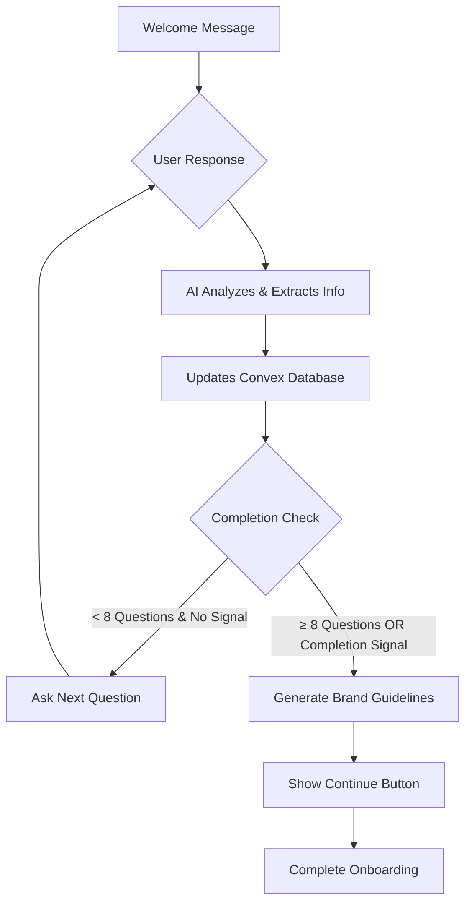

# AURA Onboarding System: Questions Flow & Data Extraction

## Current Configuration
- **Maximum Questions**: 8 (configured as `MAX_ONBOARDING_QUESTIONS`)
- **Minimum Questions for Early Completion**: 5
- **Early Completion**: Enabled with completion signal detection
- **Model**: Claude 3.7 Sonnet
- **Skip Option**: Available via interactive button component

## Onboarding Flow Architecture



## Question Categories & Data Extraction

| Question Category | Convex Field | Data Type | Extraction Method | Example User Response | Extracted Data |
|------------------|--------------|-----------|-------------------|----------------------|----------------|
| **Brand Name** | `brandName` | String | Pattern matching + NLP | "My startup is called Aura" | `"Aura"` |
| **Brand Description** | `brandDescription` | String | Contextual extraction | "We're a social media broadcasting platform" | `"social media broadcasting platform"` |
| **Industry** | `brandIndustry` | String | Industry classification | "We're in the tech space, focusing on media" | `"media/technology"` |
| **Target Audience** | `targetAudience.primaryAudience` | Object | Demographic analysis | "Small businesses who need affordable solutions" | `{ primaryAudience: "small businesses" }` |
| **Brand Personality** | `brandPersonality` | String[] | Trait extraction | "We want to be professional but approachable" | `["professional", "approachable"]` |
| **Brand Values** | `brandValues` | String[] | Values identification | "Accessibility and transparency are important to us" | `["accessibility", "transparency"]` |
| **Brand Goals** | `brandGoals` | String[] | Goal extraction | "We want to democratize social media" | `["democratize social media"]` |
| **Visual Preferences** | `colorPreferences`, `stylePreferences` | String[] | Style extraction | "I like blue tones, modern and clean design" | `colorPreferences: ["blue"], stylePreferences: ["modern", "clean"]` |

## Typical Question Flow

### Phase 1: Core Identity (Questions 1-3)
```
AI: "Time to grow your Aura. Let's get started by creating your brand identity. You can skip the setup and add the details later, or begin by simply letting me know the name of your brand or product."

User: "My product is called StreamFlow"
→ Extracts: brandName: "StreamFlow"

AI: "Great name! Tell me about StreamFlow - what does it do?"

User: "It's a live streaming platform for content creators"
→ Extracts: brandDescription: "live streaming platform for content creators"
         brandIndustry: "media/technology"

AI: "Who are you building StreamFlow for? What's your target audience?"

User: "Content creators, especially small streamers who need better tools"
→ Extracts: targetAudience: { primaryAudience: "content creators, small streamers" }
```

### Phase 2: Brand Character (Questions 4-6)
```
AI: "How would you describe StreamFlow's personality? What should it feel like to use?"

User: "Fun but professional, innovative and user-friendly"
→ Extracts: brandPersonality: ["fun", "professional", "innovative", "user-friendly"]

AI: "What values are most important to StreamFlow? What principles guide your decisions?"

User: "Creator empowerment, accessibility, and fair monetization"
→ Extracts: brandValues: ["creator empowerment", "accessibility", "fair monetization"]

AI: "What are StreamFlow's main goals? What impact do you want to have?"

User: "Level the playing field for small creators and make streaming more accessible"
→ Extracts: brandGoals: ["level playing field", "make streaming accessible"]
```

### Phase 3: Visual Direction (Questions 7-8)
```
AI: "Do you have any color preferences for StreamFlow's brand?"

User: "I like purple and teal, something vibrant but not overwhelming"
→ Extracts: colorPreferences: ["purple", "teal", "vibrant"]

AI: "What about style and aesthetic? Modern, playful, corporate, minimalist?"

User: "Modern and sleek, with some playful elements"
→ Extracts: stylePreferences: ["modern", "sleek", "playful elements"]
```

## Completion Triggers

### Automatic Completion (8 Questions Reached)
- System automatically triggers completion after 8 assistant messages
- Generates brand guidelines
- Shows continue button

### Early Completion (5+ Questions + Signal)
**Completion Signals Detected:**
- `"good to go"`, `"nothing further"`, `"that's it"`, `"done"`, `"finished"`
- `"complete"`, `"nope"`, `"all set"`, `"ready"`, `"no more"`
- `"enough"`, `"stop"`, `"skip"`, `"continue"`, `"next"`, `"proceed"`
- `"that's enough"`, `"i'm ready"`, `"let's go"`, `"sounds good"`
- `"great"`, `"perfect"`, `"awesome"`, `"yes"`, `"yep"`, `"ok"`, `"sure"`

### Skip Option
- Available via interactive button component in welcome message
- Bypasses entire onboarding flow
- Sets user status to `isSkipped: true`

## Database Schema Updates

### OnboardingResponses Table
```typescript
{
  _id: Id<"onboardingResponses">,
  userId: string,
  sessionId: string,
  currentStep: "welcome" | "brand_name" | "brand_description" | "brand_industry" | 
              "target_audience" | "brand_personality" | "brand_values" | 
              "brand_goals" | "color_preferences" | "style_preferences" | 
              "completion_pending" | "completed",
  responses: {
    brandName?: string,
    brandDescription?: string,
    brandIndustry?: string,
    targetAudience?: { primaryAudience?: string },
    brandPersonality?: string[],
    brandValues?: string[],
    brandGoals?: string[],
    colorPreferences?: string[],
    stylePreferences?: string[]
  },
  completionPercentage: number,
  isCompleted: boolean,
  isSkipped?: boolean,
  createdAt: number,
  lastUpdatedAt: number
}
```

## Interactive Components

### Skip Button (Welcome Message)
```typescript
interactiveComponent: {
  type: "onboarding_skip_button",
  status: "pending",
  data: { sessionId, userId }
}
```

### Continue Button (Completion)
```typescript
interactiveComponent: {
  type: "onboarding_continue_button", 
  data: { label: "Continue" },
  status: "pending"
}
```

## Fixed Issues (v2.0)

### ✅ Brand Name Extraction Fix
- **Problem**: System incorrectly extracted "MarTech" as brand name when user said "its MarTech" 
- **Root Cause**: Brand name extraction was too aggressive and didn't consider context
- **Solution**: Added context-aware filtering to prevent extraction when response indicates industry/category classification
- **Prevention**: Added industry indicators (`'its'`, `'it\'s'`, `'martech'`, `'fintech'`, etc.) that block brand name extraction

### Brand Name Extraction Logic (Enhanced)

Upon completion, the system:

1. **Analyzes Collected Data**: Uses all extracted information
2. **Generates Comprehensive Guidelines**: Creates brand identity document
3. **Updates User Status**: Sets to `completion_pending`
4. **Creates Project Structure**: Sets up initial project with brand guidelines
5. **Shows Continue Button**: Allows user to proceed to main application

## Configuration Options

To modify the onboarding flow:

### Reduce to 3 Questions
```typescript
// In /convex/onboarding.ts, line 368
const MAX_ONBOARDING_QUESTIONS = 3; // Changed from 8 to 3

// And adjust minimum questions for early completion
const hasMinimumQuestions = assistantMessages >= 2; // Changed from 5 to 2
```

### Suggested 3-Question Flow
1. **Brand Name & Description**: "Tell me about your brand - what's it called and what does it do?"
2. **Target Audience**: "Who are you building this for?"
3. **Brand Character**: "How would you describe your brand's personality and values?"

## Current Status: 8 Questions
The system is currently configured for comprehensive brand identity collection with 8 questions. To implement the 3-question flow, update the `MAX_ONBOARDING_QUESTIONS` constant and adjust the completion logic accordingly.

### Brand Name Extraction Logic (Enhanced)

**Context-Aware Filtering:**
```typescript
// Before Fix: Would extract "MarTech" from "its MarTech"
// After Fix: Recognizes "its" as industry context indicator and skips extraction

const industryIndicators = [
  'its', 'it\'s', 'that\'s', 'we are', 'we\'re', 'i would say', 'i think',
  'martech', 'fintech', 'edtech', 'adtech', 'healthtech', 'proptech',
  'marketing technology', 'financial technology', 'educational technology'
];
```

**Improved Validation:**
- Excludes tech industry terms (`'tech'`, `'marketing'`)
- Prevents extraction from industry classification responses
- More conservative capitalized word detection
- Enhanced pattern matching for explicit brand names
