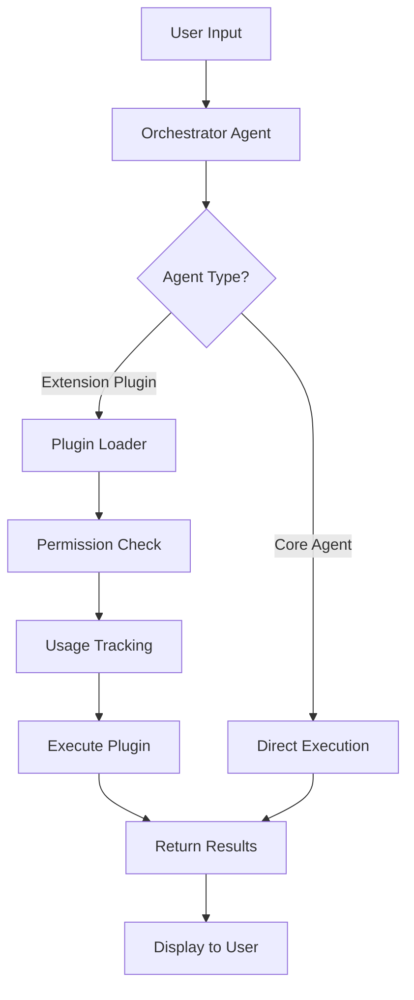

# AURA Plugin System Architecture Guide

*Comprehensive documentation for AURA's extensible plugin system*

---

## System Overview


AURA implements a dual-tier plugin architecture that separates core platform functionality from extensible features:

### **Tier 1: Core Platform Agents** (Free Tier)
- **Location**: `/app/_components/agents/_components/`
- **Purpose**: Essential workflow agents built into the base platform
- **Examples**: Orchestrator, Onboarding, Creating, Scheduling
- **Cost Model**: Always available, no additional charges
- **Implementation**: React components with direct Convex integration for realtime/ Live persistence

### **Tier 2: Extension Plugins** (Premium/Pay-per-use)
- **Location**: `/lib/agents/` & `/lib/extensions/`
- **Purpose**: Specialized agents and tools for advanced use cases
- **Access Point**: Extensions Console (puzzle piece button in Activity Console)

#### **Plugin Types**:
1. **Agentic Workflows**: Complex agents with tools for specific purposes
   - *Example*: Competitor Analysis Agent - comprehensive market research with data collection, analysis, and reporting
   - *Use Case*: Multi-step processes requiring AI reasoning and tool orchestration

2. **Quick-Tool Extensions**: Single-purpose utilities for immediate results  
   - *Example*: Logo Generator - instant brand logo creation from text prompts
   - *Use Case*: One-click solutions for common creative and productivity tasks

#### **Democratizing AI Mission**:
Our core value is making AI accessible to everyone through:
- **Generous Free Tier**: All essential workflow agents included at no cost
- **Affordable Pay-per-use**: Premium extensions priced around ~$1 per generation
- **No Subscription Lock-in**: Pay only when you use advanced features
- **Transparent Pricing**: Clear costs displayed before each use

- **Examples**: Data Analyst, Logo Generator, Social Media Manager, API Builder
- **Cost Model**: Pay-per-use ($1/generation target) with optional premium tiers for power users
- **Implementation**: Dynamic loading via Extensions Console with instant purchase flow

---

## 🔄 Plugin System Workflow



### **Step-by-Step Flow**:
1. **User Input**: User interacts with terminal chat interface
2. **Orchestrator**: Routes request based on agent type and user permissions
3. **Core Agents**: Execute immediately if built-in functionality
4. **Extension Plugins**: Load dynamically, check permissions, track usage
5. **Response**: Return results through unified interface

---

## 📁 Directory Structure & Organization

```
AURA/
├── app/_components/agents/           # Core Platform Agents (Tier 1)
│   ├── _components/
│   │   ├── orchestrator/            # Main orchestrator UI
│   │   ├── onboarding/              # User onboarding workflows
│   │   └── [future-core-agents]/    # Code Assistant, File Manager, etc.
│   ├── AgentSystemProvider.tsx      # Agent context provider
│   └── AgentsPanel.tsx              # Agent management UI
│
├── lib/agents/                      # Extension Plugins (Tier 2)
│   ├── base.ts                      # Abstract base classes
│   ├── registry.ts                  # Plugin registration system
│   ├── store.ts                     # Agent state management
│   ├── data-analyst/               # Example: Premium data analysis
│   ├── api-builder/                # Example: API generation tools
│   └── [plugin-agents]/            # Third-party plugin agents
│
├── lib/extensions/                  # Extension Infrastructure
│   ├── loader.ts                    # Dynamic plugin loading
│   ├── permissions.ts               # Access control system
│   ├── registry.ts                  # Extension manifest management
│   └── console/                     # Extensions Console logic
│
├── convex/                          # Backend Logic
│   ├── orchestrator.ts              # Main orchestrator backend
│   ├── agents/
│   │   ├── registry.ts              # Backend agent registration
│   │   └── [agent-backends]/        # Individual agent backends
│   ├── usage.ts                     # Usage tracking & billing
│   └── plugins.ts                   # Plugin management
│
└── app/_components/activity/_components/extensions/  # Extensions Console UI
    ├── ExtensionsPanel.tsx          # Main extensions browser
    ├── ExtensionCard.tsx            # Individual extension display
    ├── PurchaseFlow.tsx             # One-click purchase system
    └── UsageTracker.tsx             # Usage analytics display
```

---

## 🔧 Core Implementation Components

### **1. Extension Manifest System**

Every plugin requires a manifest file defining its capabilities and requirements:

```typescript
// /lib/extensions/types.ts
export interface ExtensionManifest {
  id: string;                        // Unique identifier (e.g., "agent.data-analyst")
  name: string;                      // Display name
  version: string;                   // Semantic version
  type: 'agent' | 'tool' | 'workflow';
  tier: 'free' | 'premium' | 'pay-per-use';
  entryPoint: string;                // Main execution file
  permissions: ExtensionPermission[]; // Required permissions
  dependencies: string[];             // Other plugins/libraries needed
  cost?: {
    perUse?: number;                 // Cost per execution
    perToken?: number;               // Cost per AI token
    monthly?: number;                // Monthly subscription
  };
  author: {
    name: string;
    email: string;
    website?: string;
  };
  repository?: string;               // Source code location
  documentation?: string;            // Documentation URL
}
```

### **2. Dynamic Plugin Loader**

Handles secure loading and execution of plugins:

```typescript
// /lib/extensions/loader.ts
import { ExtensionManifest, ExtensionPermission } from './types';
import { PermissionManager } from './permissions';

export class ExtensionLoader {
  private extensions: Map<string, ExtensionManifest> = new Map();
  private permissionManager = new PermissionManager();
  
  async loadExtension(manifestPath: string): Promise<void> {
    // 1. Load and validate manifest
    const manifest = await this.loadManifest(manifestPath);
    
    // 2. Verify permissions
    await this.permissionManager.validatePermissions(manifest.permissions);
    
    // 3. Load extension code with sandboxing
    const extension = await import(manifest.entryPoint);
    
    // 4. Register in system
    this.extensions.set(manifest.id, manifest);
  }
  
  async executeExtension(id: string, params: any, context: ExecutionContext): Promise<any> {
    // 1. Check user permissions & billing
    await this.validateExecution(id, context.userId);
    
    // 2. Track usage for billing
    const startTime = Date.now();
    
    try {
      // 3. Execute in sandboxed environment
      const result = await this.executeSandboxed(id, params, context);
      
      // 4. Track successful execution
      await this.trackUsage(id, context.userId, Date.now() - startTime);
      
      return result;
    } catch (error) {
      // 5. Handle errors and still track usage
      await this.trackError(id, context.userId, error);
      throw error;
    }
  }
  
  private async executeSandboxed(id: string, params: any, context: ExecutionContext) {
    // Implement secure execution environment
    // - Limit file system access
    // - Restrict network calls
    // - Monitor resource usage
    // - Timeout protection
  }
}
```

### **3. Permission System**

Controls what plugins can access:

```typescript
// /lib/extensions/permissions.ts
export enum ExtensionPermission {
  // File System
  FILE_READ = 'file:read',
  FILE_WRITE = 'file:write',
  FILE_DELETE = 'file:delete',
  
  // Network
  NETWORK_HTTP = 'network:http',
  NETWORK_WEBSOCKET = 'network:websocket',
  
  // Database
  DATABASE_READ = 'database:read',
  DATABASE_WRITE = 'database:write',
  
  // AI Models
  AI_MODEL_GPT = 'ai:gpt',
  AI_MODEL_CLAUDE = 'ai:claude',
  AI_MODEL_LOCAL = 'ai:local',
  
  // System
  SYSTEM_ENV = 'system:env',
  SYSTEM_PROCESS = 'system:process',
  
  // User Data
  USER_PROFILE = 'user:profile',
  USER_BILLING = 'user:billing',
}

export class PermissionManager {
  async validatePermissions(required: ExtensionPermission[]): Promise<boolean> {
    // Check if user/system allows these permissions
  }
  
  async checkPermission(permission: ExtensionPermission, context: ExecutionContext): Promise<boolean> {
    // Runtime permission checking
  }
}
```

### **4. Base Agent Class**

Abstract class that all plugin agents must extend:

```typescript
// /lib/agents/base.ts
export abstract class BaseAgent {
  abstract readonly id: string;
  abstract readonly name: string;
  abstract readonly description: string;
  abstract readonly tier: 'free' | 'premium' | 'pay-per-use';
  abstract readonly permissions: ExtensionPermission[];
  
  // Core execution method
  abstract async execute(input: AgentInput, context: ExecutionContext): Promise<AgentOutput>;
  
  // Input validation
  abstract async validate(input: any): Promise<ValidationResult>;
  
  // Agent-specific tools/capabilities
  abstract readonly tools: AgentTool[];
  
  // Cost calculation for pay-per-use agents
  calculateCost?(input: AgentInput, output: AgentOutput): Promise<number>;
  
  // Lifecycle hooks
  async onLoad?(): Promise<void>;
  async onUnload?(): Promise<void>;
}

export interface AgentInput {
  query: string;
  data?: any;
  files?: File[];
  context?: Record<string, any>;
}

export interface AgentOutput {
  success: boolean;
  data?: any;
  message?: string;
  files?: File[];
  tokensUsed?: number;
  executionTime?: number;
}
```

---

## 💡 Example Plugin Implementation

### **Data Analyst Agent** (Pay-per-use Plugin)

#### **Manifest File**:
```json
// /lib/agents/data-analyst/manifest.json
{
  "id": "agent.data-analyst",
  "name": "Data Analyst Agent",
  "version": "1.2.0",
  "type": "agent",
  "tier": "pay-per-use",
  "entryPoint": "./index.ts",
  "permissions": [
    "file:read",
    "database:read", 
    "ai:claude",
    "network:http"
  ],
  "dependencies": [],
  "cost": {
    "perUse": 0.05,
    "perToken": 0.00001
  },
  "author": {
    "name": "AURA Team",
    "email": "plugins@aura.dev"
  },
  "documentation": "https://docs.aura.dev/plugins/data-analyst"
}
```

#### **Implementation**:
```typescript
// /lib/agents/data-analyst/index.ts
import { BaseAgent, AgentInput, AgentOutput, ExtensionPermission } from '../base';

export class DataAnalystAgent extends BaseAgent {
  readonly id = 'agent.data-analyst';
  readonly name = 'Data Analyst';
  readonly description = 'Advanced data analysis and visualization';
  readonly tier = 'pay-per-use' as const;
  readonly permissions: ExtensionPermission[] = [
    ExtensionPermission.FILE_READ,
    ExtensionPermission.DATABASE_READ,
    ExtensionPermission.AI_MODEL_CLAUDE,
    ExtensionPermission.NETWORK_HTTP,
  ];
  
  readonly tools = [
    {
      command: 'analyze-data',
      name: 'Data Analysis',
      description: 'Perform comprehensive data analysis',
      usage: 'analyze-data [file|query]',
    },
    {
      command: 'create-chart',
      name: 'Chart Generation', 
      description: 'Generate visualizations from data',
      usage: 'create-chart [data] [chart-type]',
    },
  ];
  
  async execute(input: AgentInput, context: ExecutionContext): Promise<AgentOutput> {
    const startTime = Date.now();
    
    try {
      // 1. Parse and validate input data
      const data = await this.parseInputData(input);
      
      // 2. Perform analysis using AI
      const analysis = await this.analyzeData(data, context);
      
      // 3. Generate visualizations
      const charts = await this.generateCharts(analysis, input.context?.chartType);
      
      // 4. Create summary report
      const report = await this.generateReport(analysis, charts);
      
      return {
        success: true,
        data: {
          analysis,
          charts,
          report,
        },
        tokensUsed: analysis.tokensUsed || 0,
        executionTime: Date.now() - startTime,
      };
    } catch (error) {
      return {
        success: false,
        message: `Analysis failed: ${error.message}`,
        executionTime: Date.now() - startTime,
      };
    }
  }
  
  async validate(input: AgentInput): Promise<ValidationResult> {
    if (!input.query && !input.data && !input.files) {
      return {
        valid: false,
        error: 'No data provided for analysis',
      };
    }
    
    return { valid: true };
  }
  
  async calculateCost(input: AgentInput, output: AgentOutput): Promise<number> {
    const baseCost = 0.05; // Per-use cost
    const tokenCost = (output.tokensUsed || 0) * 0.00001;
    return baseCost + tokenCost;
  }
  
  private async analyzeData(data: any, context: ExecutionContext) {
    // Implementation for data analysis using AI models
    // This would interact with Claude API for insights
  }
  
  private async generateCharts(analysis: any, chartType?: string) {
    // Implementation for chart generation
    // Could use libraries like D3.js, Chart.js, etc.
  }
  
  private async generateReport(analysis: any, charts: any) {
    // Implementation for report generation
    // Create markdown/PDF reports with findings
  }
}
```

### **Social Media Manager Agent** (Premium Subscription)

```typescript
// /lib/agents/social-media-manager/index.ts
export class SocialMediaManagerAgent extends BaseAgent {
  readonly id = 'agent.social-media';
  readonly name = 'Social Media Manager';
  readonly tier = 'premium' as const;
  
  readonly tools = [
    {
      command: 'schedule-post',
      name: 'Post Scheduler',
      description: 'Schedule posts across platforms',
    },
    {
      command: 'analyze-engagement',
      name: 'Engagement Analytics',
      description: 'Analyze social media performance',
    },
    {
      command: 'generate-content',
      name: 'Content Generator',
      description: 'AI-powered content creation',
    },
  ];
  
  async execute(input: AgentInput): Promise<AgentOutput> {
    // Implementation for social media management
    // - Content creation and scheduling
    // - Analytics and reporting
    // - Cross-platform posting
  }
}
```

### **Logo Generator Extension** (Quick-Tool Pay-per-use)

```typescript
// /lib/extensions/logo-generator/index.ts
export class LogoGeneratorExtension extends BaseAgent {
  readonly id = 'extension.logo-generator';
  readonly name = 'Logo Generator';
  readonly description = 'Instant AI-powered logo creation from text prompts';
  readonly tier = 'pay-per-use' as const;
  readonly permissions: ExtensionPermission[] = [
    ExtensionPermission.AI_MODEL_CLAUDE,
    ExtensionPermission.FILE_WRITE,
  ];
  
  readonly tools = [
    {
      command: 'generate-logo',
      name: 'Generate Logo',
      description: 'Create professional logos from text descriptions',
      usage: 'generate-logo "company name" --style=modern --colors=blue,white',
    },
  ];
  
  async execute(input: AgentInput): Promise<AgentOutput> {
    const startTime = Date.now();
    
    try {
      // 1. Parse logo requirements from input
      const requirements = this.parseLogoRequirements(input.query);
      
      // 2. Generate logo using AI image generation
      const logoVariations = await this.generateLogoDesigns(requirements);
      
      // 3. Create downloadable files
      const logoFiles = await this.createLogoFiles(logoVariations);
      
      return {
        success: true,
        data: {
          logos: logoVariations,
          files: logoFiles,
          variations: logoVariations.length,
        },
        message: `Generated ${logoVariations.length} logo variations`,
        files: logoFiles,
        executionTime: Date.now() - startTime,
      };
    } catch (error) {
      return {
        success: false,
        message: `Logo generation failed: ${error.message}`,
        executionTime: Date.now() - startTime,
      };
    }
  }
  
  async calculateCost(input: AgentInput, output: AgentOutput): Promise<number> {
    // Fixed cost per logo generation
    return 1.00; // $1 per generation as per target
  }
  
  private parseLogoRequirements(query: string) {
    // Extract company name, style, colors, industry from query
  }
  
  private async generateLogoDesigns(requirements: any) {
    // Use AI image generation to create logo variations
  }
  
  private async createLogoFiles(logos: any[]) {
    // Generate downloadable PNG, SVG, PDF formats
  }
}
```

---

## 🔐 Security & Sandboxing

### **Plugin Isolation**:
- Each plugin runs in isolated execution context
- Limited file system access based on permissions
- Network requests filtered and monitored
- Resource usage limits (CPU, memory, execution time)
- No access to other plugins or core system internals

### **Permission Validation**:
- Permissions checked at load time and runtime
- User consent required for sensitive permissions
- Granular control over what plugins can access
- Audit trail for all plugin actions

---

## 💰 Monetization & Billing Integration

### **Usage Tracking**:
```typescript
// /convex/usage.ts
export const trackAgentUsage = mutation({
  args: {
    userId: v.string(),
    agentId: v.string(),
    executionTime: v.number(),
    tokensUsed: v.number(),
    cost: v.number(),
    success: v.boolean(),
  },
  handler: async (ctx, args) => {
    await ctx.db.insert("agentUsage", {
      ...args,
      timestamp: Date.now(),
    });
    
    // Update user's billing information
    await ctx.runMutation(api.billing.addCharge, {
      userId: args.userId,
      amount: args.cost,
      description: `${args.agentId} execution`,
    });
  },
});
```

### **Cost Models**:
1. **Pay-per-use**: Fixed cost per execution + token usage
2. **Premium Subscription**: Monthly fee for unlimited access
3. **Freemium**: Basic features free, advanced features paid
4. **Token-based**: Pay for AI model usage only

---

## 🧩 Extensions Console

### **Console Features**:
- **Integrated Access**: Accessible via puzzle piece button in Activity Console
- **Instant Purchase Flow**: One-click activation with pre-loaded payment details
- **Live Pricing**: Clear cost display ($1/generation target) before purchase
- **Category Organization**: Browse extensions by type and use case
- **Usage Analytics**: Track your extension usage and costs in real-time
- **Quick Activation**: Purchase confirmation → immediate extension availability

### **Purchase Workflow**:
1. **Discovery**: Browse available extensions in console
2. **Preview**: View extension details, pricing, and example outputs  
3. **One-Click Purchase**: Instant activation using stored payment methods
4. **Immediate Use**: Extension becomes available in orchestrator immediately
5. **Usage Tracking**: Monitor costs and usage patterns

### **Extension Categories**:
- **Agentic Workflows**: Multi-step AI processes (Competitor Analysis, Market Research)
- **Quick Tools**: Instant generation utilities (Logo Creator, Content Writer)
- **Data & Analytics**: Data processing, visualization, reporting  
- **Content Creation**: Writing, design, media generation
- **Automation**: Workflow automation, scheduling, integration
- **Business**: CRM, accounting, project management
- **Development**: Code analysis, testing, deployment tools

---

## 🚀 Implementation Roadmap

### **Phase 1: Foundation** (Current Sprint)
- [x] Core orchestrator implementation
- [x] Base agent architecture
- [ ] Extension loader system
- [ ] Permission framework
- [ ] Usage tracking backend

### **Phase 2: Core Plugins** (Next Sprint) 
- [ ] Data Analyst agent
- [ ] Code Assistant agent
- [ ] File Manager agent
- [ ] Social Media Manager agent

### **Phase 3: Extensions Console & Commerce** (Next Priority)
- [ ] Extensions Console UI integration
- [ ] One-click purchase flow with pre-loaded payment
- [ ] Real-time usage tracking and cost display
- [ ] Extension activation/deactivation system
- [ ] Category-based extension browsing

### **Phase 4: Advanced Features** (Long-term)
- [ ] Plugin versioning system
- [ ] Hot-swapping capabilities
- [ ] A/B testing framework
- [ ] Advanced analytics dashboard
- [ ] Enterprise features

---

## 🧪 Testing Strategy

### **Plugin Testing Framework**:
- **Unit Tests**: Individual plugin functionality
- **Integration Tests**: Plugin interaction with core system  
- **Performance Tests**: Resource usage and execution time
- **Security Tests**: Permission validation and sandboxing
- **End-to-End Tests**: Complete user workflows

### **Quality Assurance**:
- Automated testing for all core plugins
- Manual testing for marketplace submissions
- Security audit for third-party plugins
- Performance benchmarking
- User acceptance testing

---

## 📚 Developer Resources

### **Plugin Development Kit (PDK)**:
- TypeScript templates for common plugin types
- CLI tools for plugin scaffolding and testing
- Local development environment setup
- Plugin validation and testing utilities

### **Documentation**:
- Plugin development guide
- API reference documentation
- Best practices and patterns  
- Example plugin implementations
- Troubleshooting guides

### **Community**:
- Plugin developer forum
- Discord community channels
- Plugin showcase and examples
- Contribution guidelines
- Code review process

---

## 🔍 Monitoring & Analytics

### **System Metrics**:
- Plugin execution times and success rates
- Resource usage per plugin
- User adoption and engagement metrics
- Cost analysis and profitability
- Error rates and common issues

### **User Analytics**:
- Most popular plugins
- Usage patterns and workflows
- Feature requests and feedback
- Conversion rates from free to paid
- User satisfaction scores

---

This comprehensive plugin system architecture enables AURA to scale from a core development platform to a full ecosystem of specialized tools and agents, while maintaining security, performance, and a sustainable business model.
