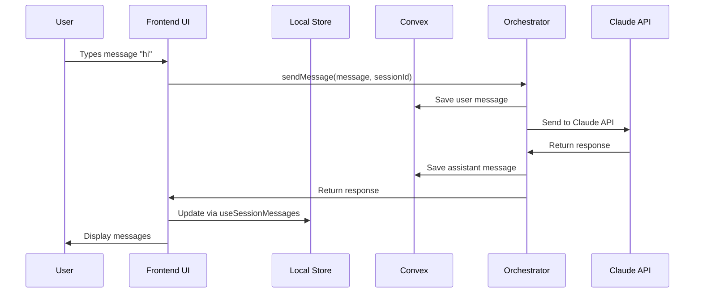

# AURA Terminal Chat System Documentation

## Overview

AURA's terminal chat system provides a multi-session conversational interface powered by Claude 3.7 Sonnet through our Orchestrator Agent. The system enables users to maintain multiple isolated chat sessions with persistent history and real-time synchronization.

## Chat Flow Analysis

### Behind the Scenes: User Says "Hi"

Let's trace what happens when a user begins a chat with "hi":

```
1. Frontend: User types "hi" → AdvancedTerminalDisplay captures input

2. Action: Calls sendMessage() in convex/orchestrator.ts
   The orchestrator performs these steps:
   
   a. Query Conversation History:
      - Calls getConversationHistory query with sessionId
      - Retrieves LAST 20 MESSAGES from chatMessages table (not all history)
      - Orders by creation time (ascending = oldest first)
      - Filters by sessionId to get only this session's messages
   
   b. Save User Message:
      - Saves user's "hi" message to chatMessages table immediately
      - Role: "user", Content: "hi", SessionId: current session
      - No tool calls at this stage - pure message storage
   
   c. Format History for Claude:
      - Takes the 20 messages from Convex
      - Filters to only "user" and "assistant" roles (excludes system/terminal)
      - Maps to Claude API format: {role: "user/assistant", content: "message"}
      - Adds current "hi" message to the conversation array
   
   d. Prepare Claude API Request:
      - Model: claude-3-7-sonnet-20250219
      - Max tokens: 4000
      - Temperature: 0.7
      - System prompt: ORCHESTRATOR_SYSTEM_PROMPT
      - Messages: formatted conversation history (max 21 messages including current)

3. API Call: Sends to Claude API
   - History source: Directly from Convex chatMessages table
   - History limit: Last 20 messages (plus current = 21 total)
   - History format: Only user/assistant messages, no system/terminal noise
   - Context: Full AURA platform system prompt provides context

4. Claude: Processes with AURA context and returns helpful response
   - Receives system prompt defining AURA platform role
   - Gets conversation history for continuity
   - Generates contextually appropriate response

5. Database Operations:
   - Extracts response text from Claude API response
   - Calculates token usage: inputTokens + outputTokens
   - Estimates cost: (input * $3/1M) + (output * $15/1M)
   - Saves assistant message to chatMessages table with:
     * Role: "assistant" 
     * Content: Claude's response
     * SessionId: current session
     * TokenCount, InputTokens, OutputTokens, EstimatedCost

6. Frontend: useSessionMessages hook detects changes
   - Convex reactivity triggers when new messages added to chatMessages
   - Hook re-queries messages for current sessionId
   - Gets updated message list including new assistant response

7. Display Formatting:
   The orchestrator affects display through message role formatting:
   - User message: "chat> hi"
   - Assistant message: "🤖 Orchestrator: [Claude's response]"
   - System message: "📋 [system content]"
   - Terminal message: [raw content]

8. UI Re-render:
   - AdvancedTerminalDisplay receives new formattedMessages
   - Displays both user and assistant messages
   - Auto-scrolls to bottom of conversation
```

### Tool Calls & Message Processing

**Where are tool calls happening?**
- Currently: **NO TOOL CALLS** - The orchestrator is a pure conversational agent
- The system prompt explicitly states: "You currently operate as a conversational agent without access to external tools"
- Future: Tool calls would be added to the orchestrator action, between Claude API call and message saving

**User message storage:**
- User message is stored exactly as typed: "hi"
- No modification or enhancement by orchestrator
- Stored with role="user", raw content, no tool data

**Message sorting:**
- Messages retrieved by sessionId filter
- Ordered chronologically (oldest first) 
- Limited to last 20 for API efficiency
- Display shows all messages in conversation order

## Orchestrator Agent Deep Dive

### System Prompt Analysis

The Orchestrator uses this system prompt (from `convex/orchestrator.ts`):

```typescript
const ORCHESTRATOR_SYSTEM_PROMPT = `You are the Orchestrator Agent for the AURA platform, a powerful IDE-style development environment. Your role is to:

1. **Understand User Intent**: Analyze user requests and determine what they want to accomplish
2. **Provide Helpful Guidance**: Offer clear, actionable responses to user questions  
3. **Coordinate Tasks**: When complex tasks require specialized tools or agents, explain what would be needed
4. **Maintain Context**: Keep track of the conversation and provide contextually relevant responses

## About AURA Platform:
- Modern IDE-style development environment with VS Code inspired interface
- Built with Next.js, TypeScript, Tailwind CSS, and Convex backend
- Includes terminal, project management, file operations, and agent system
- Supports both individual development and team collaboration

## Your Capabilities:
- Conversational AI assistance for development tasks
- Guidance on AURA platform features and usage
- Help with project planning and task breakdown
- Code review and development best practices
- Troubleshooting and debugging assistance

## Communication Style:
- Be conversational but professional
- Provide clear, actionable guidance
- Ask clarifying questions when needed
- Break down complex tasks into manageable steps
- Reference specific AURA features when relevant

## Important Notes:
- You currently operate as a conversational agent without access to external tools
- When users request actions that would require tools (file operations, API calls, etc.), explain what would be needed
- Focus on providing maximum value through guidance, planning, and conversation
- Always be helpful and aim to move the user forward in their goals

Engage naturally and help users accomplish their development goals within the AURA platform.`;
```

### Orchestrator Components

#### Backend (`convex/orchestrator.ts`)
- **API Integration**: Direct connection to Anthropic Claude API
- **Message Management**: Saves both user and assistant messages
- **Token Tracking**: Monitors usage and estimates costs
- **Error Handling**: Graceful failure with user-friendly messages
- **Context Management**: Loads conversation history for continuity

#### Frontend (`app/_components/agents/_components/orchestrator/OrchestratorAgent.tsx`)
- **Standalone Component**: Can be used independently of terminal
- **Session Management**: Supports custom session IDs
- **Real-time Updates**: Live message rendering via Convex queries
- **User Interface**: Input field and scrollable message history

### API Configuration

```typescript
// Claude 3.7 Sonnet Configuration
model: "claude-3-7-sonnet-20250219"
max_tokens: 4000
temperature: 0.7
system: ORCHESTRATOR_SYSTEM_PROMPT

// Cost Estimation (as of late 2024)
// Input: ~$3 per 1M tokens
// Output: ~$15 per 1M tokens
const estimatedCost = (inputTokens * 3 / 1000000) + (outputTokens * 15 / 1000000);
```

## Response Analysis: Why "Hi, how can I help?"

When user says "hi", the Orchestrator responds with a welcoming message because:

1. **System Prompt Context**: Defines role as helpful assistant for AURA platform
2. **Professional Tone**: "Be conversational but professional" 
3. **Actionable Guidance**: "Provide clear, actionable responses"
4. **Platform Awareness**: References AURA features and capabilities
5. **Goal Orientation**: "Move the user forward in their goals"

The response typically includes:
- Greeting acknowledging the AURA platform context
- Overview of capabilities (development tasks, planning, guidance)
- Specific areas of help (projects, features, debugging, etc.)
- Call to action asking how to assist

## Architecture

### Frontend Components

#### Session Management
- **SessionManager**: Horizontal tab bar for session switching with + button for creation
- **SessionTab**: Individual session tabs with rename/delete functionality  
- **SessionsPanel**: Vertical session list view for comprehensive session management

#### Chat Interface
- **AdvancedTerminalDisplay**: Main terminal interface with chat/sessions/agents/extensions tabs
- **Terminal**: Root component managing collapsed/expanded states and tab navigation

### State Management

#### Local State (Zustand)
- **terminal-sessions.ts**: Session metadata, active session tracking, UI state
- **terminal.ts**: Terminal buffer, command history, processing state

#### Backend State (Convex)
- **chatSessions**: Session metadata, token tracking, user association
- **chatMessages**: Individual messages with role, content, session linkage

### Data Flow



## Session Lifecycle

### 1. Session Creation
```typescript
// Auto-generated time-based titles
const timeString = now.toLocaleTimeString([], { hour: '2-digit', minute: '2-digit' });
const defaultTitle = `Chat ${timeString}`;
```

### 2. Message Flow
1. User types message in chat input
2. Frontend calls `sendMessage()` orchestrator action
3. Orchestrator saves user message to `chatMessages` table
4. Orchestrator calls Claude API with conversation history
5. Orchestrator saves assistant response to `chatMessages` table
6. Frontend re-renders via `useSessionMessages` hook reactivity

### 3. Session Switching
- Instant switching between sessions via `switchSession(sessionId)`
- Each session maintains isolated message history
- Real-time session count display: "Sessions 3"

## Key Features

### Multi-Session Support
- Create unlimited chat sessions with unique IDs
- Auto-generated time-based session titles
- Session persistence across browser sessions
- Individual session token tracking and cost estimation

### Real-Time Synchronization
- **useSessionSync**: Bidirectional sync between local store and Convex
- **useSessionMessages**: Real-time message loading for active session
- Automatic UI updates when sessions change

### Message Persistence
- All messages stored in Convex `chatMessages` table
- Linked to sessions via `sessionId` field
- Token usage and cost tracking per message
- Support for user, assistant, system, terminal, and thinking roles

## Technical Implementation

### Hooks Architecture
- **useSessionMessages**: Loads and formats messages for active session
- **useSessionSync**: Handles session CRUD operations with Convex
- **useTerminal**: Legacy terminal functionality
- **useTerminalStore**: Terminal state management

### Message Deduplication
Previous issue: Messages were saved twice (frontend + orchestrator)
Solution: Orchestrator handles all message persistence, frontend only displays

### Session Storage Schema
```typescript
interface ChatSession {
  sessionId: string;          // Unique session identifier
  title: string;              // Display name (e.g., "Chat 2:30")
  isActive: boolean;          // Current session status
  totalTokens: number;        // Cumulative token usage
  totalCost: number;          // Estimated cost in USD
  messageCount: number;       // Number of messages in session
  createdAt: number;          // Creation timestamp
  lastActivity: number;       // Last interaction timestamp
  preview: string;            // First message preview
  userId?: string;            // Associated user ID
  convexId?: string;          // Convex document ID
}
```

## Performance Considerations

### Optimization Strategies
- Message limit per session (100 messages via `useSessionMessages`)
- Lazy loading of session history
- Local state caching with Zustand persistence
- Efficient re-rendering via React hooks

### Resource Management
- Token tracking per session with limits (180,000 token default)
- Cost estimation for budget awareness
- Session cleanup and soft deletion support

## Development Notes

### File Structure
```
AURA/app/_components/terminal/
├── Terminal.tsx                    # Root terminal component
├── _components/
│   ├── AdvancedTerminalDisplay.tsx # Main chat interface
│   └── TerminalHeaderRow.tsx       # Navigation tabs
├── sessions/
│   ├── SessionManager.tsx          # Session tab bar
│   ├── SessionTab.tsx              # Individual session tabs
│   └── SessionsPanel.tsx           # Session list view
└── chat/
    └── ChatDisplay.tsx             # Chat message rendering

AURA/app/_components/agents/_components/orchestrator/
├── OrchestratorAgent.tsx           # Standalone orchestrator component
└── index.ts                        # Agent exports

AURA/lib/
├── hooks/
│   ├── useSessionMessages.ts       # Message loading hook
│   └── useSessionSync.ts           # Session sync hook
└── store/
    └── terminal-sessions.ts        # Session state store

AURA/convex/
├── chat.ts                         # Session CRUD operations
├── orchestrator.ts                 # Main chat agent logic
└── schema.ts                       # Database schema
```

### Next Steps
- Agent system integration (AgentsPanel placeholder ready)
- Extension system implementation (ExtensionsPanel placeholder ready)
- Advanced session management (export, import, search)
- Multi-user session collaboration
- Session templates and presets

### Frontend Components

#### Session Management
- **SessionManager**: Horizontal tab bar for session switching with + button for creation
- **SessionTab**: Individual session tabs with rename/delete functionality  
- **SessionsPanel**: Vertical session list view for comprehensive session management

#### Chat Interface
- **AdvancedTerminalDisplay**: Main terminal interface with chat/sessions/agents/extensions tabs
- **Terminal**: Root component managing collapsed/expanded states and tab navigation

### State Management

#### Local State (Zustand)
- **terminal-sessions.ts**: Session metadata, active session tracking, UI state
- **terminal.ts**: Terminal buffer, command history, processing state

#### Backend State (Convex)
- **chatSessions**: Session metadata, token tracking, user association
- **chatMessages**: Individual messages with role, content, session linkage

### Data Flow


## Session Lifecycle

### 1. Session Creation
```typescript
// Auto-generated time-based titles
const timeString = now.toLocaleTimeString([], { hour: '2-digit', minute: '2-digit' });
const defaultTitle = `Chat ${timeString}`;
```

### 2. Message Flow
1. User types message in chat input
2. Frontend calls `sendMessage()` orchestrator action
3. Orchestrator saves user message to `chatMessages` table
4. Orchestrator calls Claude API with conversation history
5. Orchestrator saves assistant response to `chatMessages` table
6. Frontend re-renders via `useSessionMessages` hook reactivity

### 3. Session Switching
- Instant switching between sessions via `switchSession(sessionId)`
- Each session maintains isolated message history
- Real-time session count display: "Sessions 3"

## Key Features

### Multi-Session Support
- Create unlimited chat sessions with unique IDs
- Auto-generated time-based session titles
- Session persistence across browser sessions
- Individual session token tracking and cost estimation

### Real-Time Synchronization
- **useSessionSync**: Bidirectional sync between local store and Convex
- **useSessionMessages**: Real-time message loading for active session
- Automatic UI updates when sessions change

### Message Persistence
- All messages stored in Convex `chatMessages` table
- Linked to sessions via `sessionId` field
- Token usage and cost tracking per message
- Support for user, assistant, system, terminal, and thinking roles

## Technical Implementation

### Hooks Architecture
- **useSessionMessages**: Loads and formats messages for active session
- **useSessionSync**: Handles session CRUD operations with Convex
- **useTerminal**: Legacy terminal functionality
- **useTerminalStore**: Terminal state management

### Message Deduplication
Previous issue: Messages were saved twice (frontend + orchestrator)
Solution: Orchestrator handles all message persistence, frontend only displays

### Session Storage Schema
```typescript
interface ChatSession {
  sessionId: string;          // Unique session identifier
  title: string;              // Display name (e.g., "Chat 2:30")
  isActive: boolean;          // Current session status
  totalTokens: number;        // Cumulative token usage
  totalCost: number;          // Estimated cost in USD
  messageCount: number;       // Number of messages in session
  createdAt: number;          // Creation timestamp
  lastActivity: number;       // Last interaction timestamp
  preview: string;            // First message preview
  userId?: string;            // Associated user ID
  convexId?: string;          // Convex document ID
}
```

## Performance Considerations

### Optimization Strategies
- Message limit per session (100 messages via `useSessionMessages`)
- Lazy loading of session history
- Local state caching with Zustand persistence
- Efficient re-rendering via React hooks

### Resource Management
- Token tracking per session with limits (180,000 token default)
- Cost estimation for budget awareness
- Session cleanup and soft deletion support

## Development Notes

### File Structure
```
AURA/app/_components/terminal/
├── Terminal.tsx                    # Root terminal component
├── _components/
│   ├── AdvancedTerminalDisplay.tsx # Main chat interface
│   └── TerminalHeaderRow.tsx       # Navigation tabs
├── sessions/
│   ├── SessionManager.tsx          # Session tab bar
│   ├── SessionTab.tsx              # Individual session tabs
│   └── SessionsPanel.tsx           # Session list view
└── chat/
    └── ChatDisplay.tsx             # Chat message rendering

AURA/lib/
├── hooks/
│   ├── useSessionMessages.ts       # Message loading hook
│   └── useSessionSync.ts           # Session sync hook
└── store/
    └── terminal-sessions.ts        # Session state store

AURA/convex/
├── chat.ts                         # Session CRUD operations
├── orchestrator.ts                 # Main chat agent logic
└── schema.ts                       # Database schema
```

### Next Steps
- Agent system integration (AgentsPanel placeholder ready)
- Extension system implementation (ExtensionsPanel placeholder ready)
- Advanced session management (export, import, search)
- Multi-user session collaboration
- Session templates and presets
