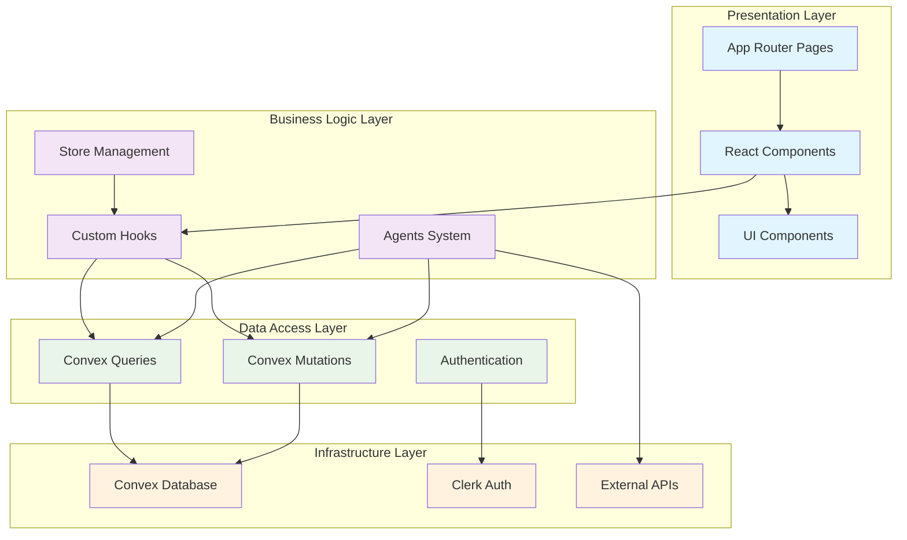
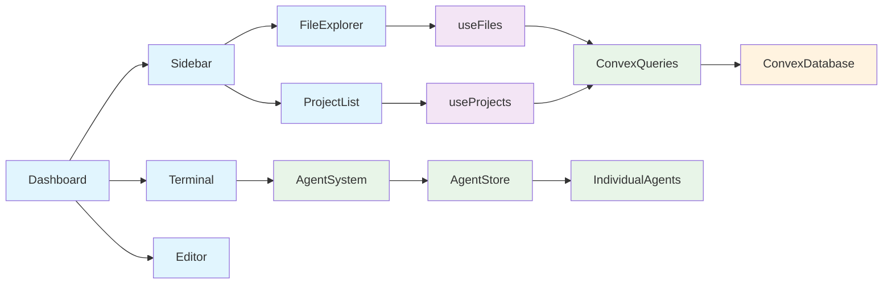

# LifeOS Structure Test Examples

This directory contains sample Mermaid diagrams generated by the structure analysis system.

## Architecture Overview

## Organization Structure

```mermaid
graph TD
    ROOT[LifeOS Project]
    
    ROOT --> APP[app/]
    ROOT --> COMPONENTS[components/]
    ROOT --> LIB[lib/]
    ROOT --> CONVEX[convex/]
    
    APP --> PAGES[_components/]
    APP --> TESTS[tests/]
    
    PAGES --> ACTIVITY[activity/]
    PAGES --> AGENTS[agents/]
    PAGES --> AUTH[auth/]
    PAGES --> DASHBOARD[dashboard/]
    PAGES --> EDITOR[editor/]
    PAGES --> SIDEBAR[sidebar/]
    PAGES --> TERMINAL[terminal/]
    
    COMPONENTS --> UI[ui/]
    COMPONENTS --> PROVIDER[ConvexClientProvider]
    
    LIB --> HOOKS[hooks/]
    LIB --> STORE[store/]
    LIB --> AGENTS_LIB[agents/]
    LIB --> EXTENSIONS[extensions/]
    LIB --> UTILS[utils.ts]
    
    CONVEX --> SCHEMA[schema.ts]
    CONVEX --> QUERIES[*.ts queries]
    CONVEX --> AUTH_CONFIG[auth.config.ts]
    
    TESTS --> STATE[state/]
    TESTS --> STRUCTURE[structure/]
    
    classDef directory fill:#f9f,stroke:#333,stroke-width:2px
    classDef file fill:#bbf,stroke:#333,stroke-width:1px
    
    class ROOT,APP,COMPONENTS,LIB,CONVEX,PAGES,TESTS,HOOKS,STORE,AGENTS_LIB,EXTENSIONS,UI,ACTIVITY,AGENTS,AUTH,DASHBOARD,EDITOR,SIDEBAR,TERMINAL,STATE,STRUCTURE directory
    class PROVIDER,UTILS,SCHEMA,QUERIES,AUTH_CONFIG file
```

## Dependency Graph Example

