# Research Agent Workflow

This document visualizes the complete research agent workflow in the LifeOS Research Studio, showing how user queries are processed through intelligent follow-up detection and copywriter agent integration.

```mermaid
---
title: Research Agent Workflow System
---
flowchart TD
    %% User Input Section
    A["`👤 **User Input**
    Research Query`"] --> B{"`🔍 **Query Analysis**
    New vs Follow-up?`"}
    
    %% New Research Path
    B -->|New Research| C["`🆕 **New Research Session**
    Create Session ID`"]
    
    %% Follow-up Detection Path
    B -->|Follow-up Detected| D["`🔄 **Follow-up Research**
    Use Existing Session`"]
    
    %% API Route Processing
    C --> E["`🔧 **API Route Processing**
    /api/research`"]
    D --> E
    
    %% Research Execution
    E --> F["`🤖 **Research Agent Execution**
    Lead Agent + Tools`"]
    
    %% Parallel Research Operations
    F --> G["`📊 **Data Collection**
    Multiple Sources`"]
    F --> H["`📝 **Content Analysis**
    Key Points Extract`"]
    F --> I["`📚 **Citation Gathering**
    Source References`"]
    
    %% Research Results
    G --> J["`📋 **Research Results**
    Summary + Key Points + Citations`"]
    H --> J
    I --> J
    
    %% Canvas Decision Point
    J --> K{"`🎨 **Canvas Processing**
    Existing Canvas?`"}
    
    %% Canvas Creation Path
    K -->|No Canvas| L["`✨ **Create Canvas**
    Copywriter Agent Tool`"]
    
    %% Canvas Enhancement Path
    K -->|Has Canvas| M["`🔄 **Enhance Canvas**
    Copywriter Agent Tool`"]
    
    %% Copywriter Agent Processing
    L --> N["`🤖 **Copywriter Agent**
    Content Synthesis`"]
    M --> N
    
    %% Content Integration
    N --> O["`🔗 **Content Integration**
    Smart Deduplication`"]
    O --> P["`📊 **Context Analysis**
    Relevance Scoring`"]
    P --> Q["`📝 **Enhanced Canvas**
    Comprehensive Output`"]
    
    %% Database Operations
    Q --> R["`💾 **Database Update**
    Convex Mutation`"]
    
    %% UI Update
    R --> S["`🖥️ **UI Update**
    ResearchStudio Refresh`"]
    
    %% User Experience
    S --> T["`👁️ **User Views Result**
    Enhanced Canvas Display`"]
    
    %% Feedback Loop
    T --> U{"`🔄 **User Action**
    New Query?`"}
    U -->|Yes| A
    U -->|No| V["`✅ **Session Complete**
    Research Saved`"]
    
    %% Styling for different node types
    classDef userNode fill:#4CAF50,stroke:#333,stroke-width:2px,color:#fff
    classDef processNode fill:#2196F3,stroke:#333,stroke-width:2px,color:#fff
    classDef agentNode fill:#FF9800,stroke:#333,stroke-width:2px,color:#fff
    classDef dataNode fill:#9C27B0,stroke:#333,stroke-width:2px,color:#fff
    classDef decisionNode fill:#F44336,stroke:#333,stroke-width:2px,color:#fff
    
    %% Apply classes
    class A,T,U userNode
    class C,D,E,F,G,H,I,J,L,M,O,P,Q,R,S processNode
    class N agentNode
    class V dataNode
    class B,K decisionNode
```

## Follow-up Detection Algorithm

```mermaid
---
title: Follow-up Detection Logic
---
flowchart LR
    A["`📝 **New Query**
    User Input`"] --> B["`⏰ **Time Check**
    Last Query < 10 min?`"]
    
    B -->|No| C["`🆕 **New Session**
    Create Fresh Research`"]
    B -->|Yes| D["`🔍 **Pattern Analysis**
    Check Query Patterns`"]
    
    D --> E{"`🎯 **Relevance Check**
    Related to Previous?`"}
    
    E -->|No Match| C
    E -->|Match Found| F["`🔗 **Follow-up Detected**
    Use Existing Session`"]
    
    F --> G["`📊 **Context Building**
    Previous + New Query`"]
    
    G --> H["`🤖 **Enhanced Research**
    Copywriter Integration`"]
    
    classDef inputNode fill:#4CAF50,stroke:#333,stroke-width:2px,color:#fff
    classDef processNode fill:#2196F3,stroke:#333,stroke-width:2px,color:#fff
    classDef decisionNode fill:#F44336,stroke:#333,stroke-width:2px,color:#fff
    classDef outputNode fill:#9C27B0,stroke:#333,stroke-width:2px,color:#fff
    
    class A inputNode
    class B,D,F,G,H processNode
    class E decisionNode
    class C outputNode
```

## Copywriter Agent Architecture

```mermaid
---
title: Copywriter Agent Tools & Processing
---
flowchart TD
    A["`📥 **Agent Input**
    Research Data`"] --> B{"`🎨 **Canvas State**
    Existing Content?`"}
    
    B -->|No Canvas| C["`✨ **create-canvas**
    Tool Selection`"]
    B -->|Has Canvas| D["`🔄 **enhance-canvas**
    Tool Selection`"]
    
    C --> E["`🏗️ **Canvas Creation**
    Structure: Executive Summary
    Key Insights, Recommendations
    Supporting Evidence`"]
    
    D --> F["`🔧 **Canvas Enhancement**
    Intelligent Integration
    Deduplication Logic
    Context Weaving`"]
    
    E --> G["`🧠 **Content Processing**
    AI Synthesis Engine`"]
    F --> G
    
    G --> H["`📊 **Quality Analysis**
    Coherence Check
    Relevance Scoring
    Flow Optimization`"]
    
    H --> I["`📝 **Final Canvas**
    Enhanced Content`"]
    
    I --> J["`📋 **Integration Notes**
    Change Summary`"]
    
    classDef toolNode fill:#FF9800,stroke:#333,stroke-width:2px,color:#fff
    classDef processNode fill:#2196F3,stroke:#333,stroke-width:2px,color:#fff
    classDef outputNode fill:#4CAF50,stroke:#333,stroke-width:2px,color:#fff
    
    class C,D toolNode
    class E,F,G,H processNode
    class A,I,J outputNode
```

## Database Schema Flow

## System Integration Overview

## Performance & Optimization

```mermaid
---
title: System Performance Optimizations
---
flowchart LR
    A["`⚡ **Performance Features**`"] --> B["`🔄 **Real-time Updates**
    Convex Live Queries
    Instant UI Sync`"]
    
    A --> C["`🧠 **Smart Caching**
    Session-based Cache
    Content Deduplication`"]
    
    A --> D["`📊 **Efficient Processing**
    Parallel Tool Execution
    Optimized Algorithms`"]
    
    A --> E["`🎯 **Context Awareness**
    Intelligent Follow-up
    Relevance Scoring`"]
    
    B --> F["`✨ **User Experience**
    Seamless Interaction
    Responsive Interface`"]
    
    C --> F
    D --> F
    E --> F
    
    classDef perfNode fill:#4CAF50,stroke:#333,stroke-width:2px,color:#fff
    classDef featureNode fill:#2196F3,stroke:#333,stroke-width:2px,color:#fff
    classDef resultNode fill:#FF9800,stroke:#333,stroke-width:2px,color:#fff
    
    class A perfNode
    class B,C,D,E featureNode
    class F resultNode
```

---

**Generated**: August 27, 2025  
**System**: LifeOS Research Agent Workflow Documentation  
**Version**: 1.0.0
