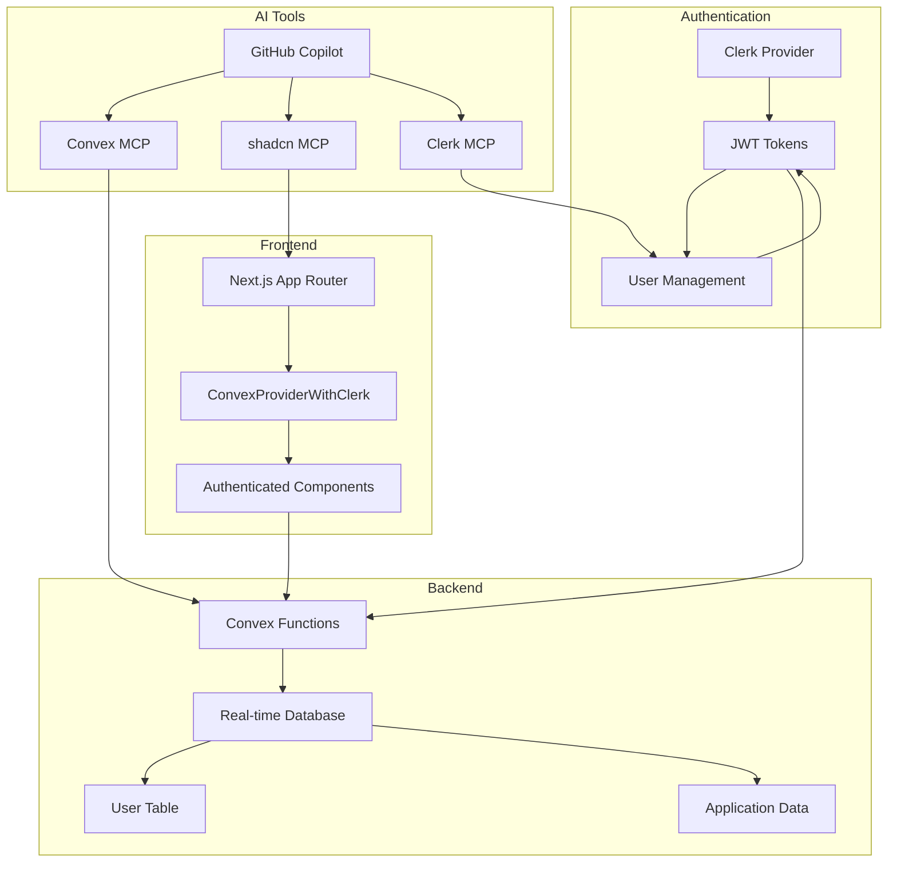

# ACDC Digital Monorepo - Project Setup Documentation

A comprehensive guide documenting the complete setup of our Next.js + Convex + Clerk application with AI-powered development tools.

## 📋 Table of Contents

- [Overview](#overview)
- [Architecture](#architecture)
- [Monorepo Setup](#monorepo-setup)
- [Convex Backend](#convex-backend)
- [Clerk Authentication](#clerk-authentication)
- [AI Development Tools](#ai-development-tools)
- [Development Workflow](#development-workflow)
- [Project Structure](#project-structure)
- [Environment Configuration](#environment-configuration)
- [Commands Reference](#commands-reference)
- [Troubleshooting](#troubleshooting)

## Overview

This project is a modern full-stack application built with:
- **Next.js 15** - React framework with App Router
- **Convex** - Reactive backend with real-time synchronization
- **Clerk** - Authentication and user management
- **pnpm** - Fast, disk space efficient package manager
- **AI Integration** - GitHub Copilot with MCP servers for enhanced development

### Key Features
- 🔐 **Secure Authentication** - Clerk integration with JWT tokens
- 🔄 **Real-time Data Sync** - Convex reactive database
- 🤖 **AI-Powered Development** - Multiple MCP servers for intelligent assistance
- 📦 **Monorepo Structure** - Scalable project organization
- 🎨 **Material UI Icons** - Visual file system organization
- 🚀 **Custom Port Configuration** - Development server on port 5454

## Architecture



## Monorepo Setup

### Package Manager Configuration

We use pnpm with workspaces for efficient dependency management:

```yaml
# pnpm-workspace.yaml
packages:
  - "ruff"
```

### Root Package Scripts

```json
{
  "scripts": {
    "dev": "pnpm --filter ruff dev",
    "convex": "pnpm --filter ruff convex:dev",
    "build": "pnpm --filter ruff build",
    "lint": "pnpm --filter ruff lint"
  }
}
```

### Custom Port Configuration

The development server runs on **port 5454** instead of the default 3000:

```javascript
// next.config.ts
const nextConfig = {
  serverExternalPackages: ["@clerk/mcp-tools"],
  async rewrites() {
    return [];
  },
};
```

Package scripts handle port configuration:

```json
{
  "scripts": {
    "dev": "next dev --port 5454",
    "start": "next start --port 5454"
  }
}
```

## Convex Backend

### Installation & Setup

```bash
# Install Convex
pnpm add convex

# Initialize Convex
npx convex dev
```

### Authentication Configuration

```typescript
// convex/auth.config.ts
const authConfig = {
  providers: [
    {
      domain: process.env.CLERK_JWT_ISSUER_DOMAIN,
      applicationID: "convex",
    },
  ],
};

export default authConfig;
```

### Schema Definition

```typescript
// convex/schema.ts
import { defineSchema, defineTable } from "convex/server";
import { v } from "convex/values";

export default defineSchema({
  users: defineTable({
    // Clerk user ID (from ctx.auth.getUserIdentity().subject)
    clerkId: v.string(),
    // User profile information
    email: v.string(),
    name: v.optional(v.string()),
    firstName: v.optional(v.string()),
    lastName: v.optional(v.string()),
    imageUrl: v.optional(v.string()),
    // Timestamps
    lastSeen: v.number(),
  })
    // Index to find users by their Clerk ID
    .index("by_clerk_id", ["clerkId"])
    // Index to find users by email
    .index("by_email", ["email"]),
});
```

### User Management Functions

```typescript
// convex/users.ts
export const ensureCurrentUser = mutation({
  args: {},
  returns: v.id("users"),
  handler: async (ctx) => {
    const identity = await ctx.auth.getUserIdentity();
    if (!identity) {
      throw new Error("Not authenticated");
    }

    const existingUser = await ctx.db
      .query("users")
      .withIndex("by_clerk_id", (q) => q.eq("clerkId", identity.subject))
      .unique();

    if (existingUser) {
      // Update last seen
      await ctx.db.patch(existingUser._id, { lastSeen: Date.now() });
      return existingUser._id;
    }

    // Create new user from identity
    const userData = {
      clerkId: identity.subject,
      email: identity.email ?? "",
      name: identity.name ? String(identity.name) : undefined,
      firstName: identity.given_name ? String(identity.given_name) : undefined,
      lastName: identity.family_name ? String(identity.family_name) : undefined,
      imageUrl: identity.picture ? String(identity.picture) : undefined,
      lastSeen: Date.now(),
    };

    return await ctx.db.insert("users", userData);
  },
});
```

## Clerk Authentication

### JWT Template Configuration

1. **Create JWT Template** in Clerk Dashboard
   - Name: `convex` (must be exactly this)
   - Issuer URL: Copy from your Clerk dashboard

2. **Environment Variables**

```bash
# .env.local
NEXT_PUBLIC_CLERK_PUBLISHABLE_KEY=pk_test_...
CLERK_SECRET_KEY=sk_test_...
CLERK_JWT_ISSUER_DOMAIN=https://notable-man-45.clerk.accounts.dev
NEXT_PUBLIC_CONVEX_URL=https://animated-skunk-278.convex.cloud
CONVEX_DEPLOYMENT=dev:animated-skunk-278
```

### Middleware Setup

```typescript
// middleware.ts
import { clerkMiddleware, createRouteMatcher } from "@clerk/nextjs/server";

const isProtectedRoute = createRouteMatcher(["/server"]);

export default clerkMiddleware(async (auth, req) => {
  if (isProtectedRoute(req)) await auth.protect();
});

export const config = {
  matcher: [
    // Skip Next.js internals and all static files, unless found in search params
    "/((?!_next|[^?]*\\.(?:html?|css|js(?!on)|jpe?g|webp|png|gif|svg|ttf|woff2?|ico|csv|docx?|xlsx?|zip|webmanifest)).*)",
    // Always run for API routes
    "/(api|trpc)(.*)",
  ],
};
```

### Provider Configuration

```typescript
// components/ConvexClientProvider.tsx
"use client";

import { ReactNode } from "react";
import { ConvexReactClient } from "convex/react";
import { ConvexProviderWithClerk } from "convex/react-clerk";
import { useAuth } from "@clerk/nextjs";

if (!process.env.NEXT_PUBLIC_CONVEX_URL) {
  throw new Error('Missing NEXT_PUBLIC_CONVEX_URL in your .env file')
}

const convex = new ConvexReactClient(process.env.NEXT_PUBLIC_CONVEX_URL!);

export default function ConvexClientProvider({ children }: { children: ReactNode }) {
  return (
    <ConvexProviderWithClerk client={convex} useAuth={useAuth}>
      {children}
    </ConvexProviderWithClerk>
  );
}
```

### Layout Integration

```typescript
// app/layout.tsx
import type { Metadata } from "next";
import { Geist, Geist_Mono } from "next/font/google";
import "./globals.css";
import ConvexClientProvider from "@/components/ConvexClientProvider";
import { ClerkProvider } from "@clerk/nextjs";

export default function RootLayout({
  children,
}: Readonly<{
  children: React.ReactNode;
}>) {
  return (
    <html lang="en">
      <body className={`${geistSans.variable} ${geistMono.variable} antialiased`}>
        <ClerkProvider>
          <ConvexClientProvider>{children}</ConvexClientProvider>
        </ClerkProvider>
      </body>
    </html>
  );
}
```

## AI Development Tools

### GitHub Copilot Configuration

#### Custom Instructions

Comprehensive Convex guidelines are stored in `.github/copilot-instructions.md` covering:
- Function definition syntax with explicit args, returns, and handler
- Validator usage and type safety
- Database query patterns and indexing
- Authentication patterns
- Real-time considerations

#### Chat Modes

1. **Convex Expert** (`.github/chatmodes/Convex Expert.md`)
   - Specialized guidance for Convex development
   - Real-time application architecture
   - Database schema optimization

2. **Code Reviewer** (`.github/chatmodes/Code Reviewer.md`)
   - Code quality analysis
   - Convex-specific review criteria
   - Security and performance checks

### MCP Server Configuration

```json
// .vscode/mcp.json
{
  "servers": {
    "convex-mcp": {
      "type": "stdio",
      "command": "npx",
      "args": ["-y", "convex@latest", "mcp", "start"]
    },
    "shadcn": {
      "type": "stdio",
      "command": "npx",
      "args": ["shadcn@latest", "mcp"]
    }
  }
}
```

**Note:** Clerk MCP server is implemented but temporarily disabled due to OAuth specification compliance issues.

### VS Code Settings

```json
// .vscode/settings.json
{
  "material-icon-theme.folders.associations": {
    "convex": "api",
    "components": "components",
    "_generated": "tools",
    ".github": "github"
  },
  "material-icon-theme.files.associations": {
    "*.tsx": "react_ts",
    "schema.ts": "database",
    "myFunctions.ts": "api"
  }
}
```

## Development Workflow

### Initial Setup

```bash
# 1. Clone the repository
git clone <repository-url>
cd ruff

# 2. Install dependencies
pnpm install

# 3. Set up environment variables
cp .env.local.example .env.local
# Add your Clerk and Convex credentials

# 4. Start development servers
pnpm convex  # Terminal 1: Convex backend
pnpm dev     # Terminal 2: Next.js frontend (port 5454)
```

### Authentication Flow

1. **User Signs In** → Clerk authenticates via OAuth
2. **JWT Token Created** → Clerk generates JWT with user info
3. **Token Validated** → Convex validates JWT with public key
4. **User Synced** → `ensureCurrentUser` creates/updates user in database
5. **Real-time Updates** → All connected clients receive updates

### Data Flow

```typescript
// Component mounts → Ensure user exists
useEffect(() => {
  ensureUser({}).catch(console.error);
}, [ensureUser]);

// Query user data → Real-time updates
const user = useQuery(api.myFunctions.getCurrentUser);

// Mutation → Update database
const updateUser = useMutation(api.users.updateUser);
```

## Project Structure

```
ruff/
├── package.json              # Root monorepo configuration
├── pnpm-workspace.yaml       # pnpm workspace config
├── .vscode/                  # VS Code configuration
│   ├── settings.json         # Editor settings
│   └── mcp.json              # MCP servers config
├── .github/                  # GitHub configuration
│   ├── copilot-instructions.md
│   └── chatmodes/            # Custom AI chat modes
└── ruff/                     # Main application package
    ├── app/                  # Next.js App Router
    │   ├── api/              # API routes
    │   │   ├── [transport]/  # MCP transport endpoint
    │   │   └── .well-known/  # OAuth metadata endpoints
    │   ├── server/           # Server components
    │   ├── globals.css       # Global styles
    │   ├── layout.tsx        # Root layout with providers
    │   └── page.tsx          # Home page
    ├── components/           # React components
    │   └── ConvexClientProvider.tsx
    ├── convex/               # Backend functions
    │   ├── _generated/       # Auto-generated code
    │   ├── auth.config.ts    # Authentication config
    │   ├── myFunctions.ts    # Custom functions
    │   ├── schema.ts         # Database schema
    │   └── users.ts          # User management
    ├── public/               # Static assets
    ├── middleware.ts         # Clerk middleware
    ├── next.config.ts        # Next.js config
    ├── package.json          # Dependencies
    ├── .env.local            # Environment variables
    └── CLERK_MCP_NOTES.md    # Implementation notes
```

## Environment Configuration

### Required Environment Variables

```bash
# Clerk Authentication
NEXT_PUBLIC_CLERK_PUBLISHABLE_KEY=pk_test_...
CLERK_SECRET_KEY=sk_test_...
CLERK_JWT_ISSUER_DOMAIN=https://notable-man-45.clerk.accounts.dev

# Convex Backend
NEXT_PUBLIC_CONVEX_URL=https://animated-skunk-278.convex.cloud
CONVEX_DEPLOYMENT=dev:animated-skunk-278
```

### Development vs Production

```bash
# Development (.env.local)
CLERK_JWT_ISSUER_DOMAIN=https://notable-man-45.clerk.accounts.dev
NEXT_PUBLIC_CLERK_PUBLISHABLE_KEY=pk_test_...

# Production (.env.production)
CLERK_JWT_ISSUER_DOMAIN=https://clerk.your-domain.com
NEXT_PUBLIC_CLERK_PUBLISHABLE_KEY=pk_live_...
```

## Commands Reference

### Development

```bash
# Start all services (from root)
pnpm dev        # Next.js on port 5454
pnpm convex     # Convex backend

# Build for production
pnpm build

# Lint code
pnpm lint

# Type checking
pnpm type-check
```

### Convex CLI

```bash
# Deploy to production
npx convex deploy

# View logs
npx convex logs

# Run dashboard
npx convex dashboard

# Generate types
npx convex codegen
```

### Package Management

```bash
# Install dependencies (root)
pnpm install

# Install package to specific workspace
pnpm --filter ruff add <package>

# Run script in specific workspace
pnpm --filter ruff <script>
```

## Troubleshooting

### Common Issues

#### User Not Syncing to Database
- **Problem**: User signs in but doesn't appear in Convex
- **Solution**: Ensure `ensureCurrentUser` is called on component mount
```typescript
useEffect(() => {
  ensureUser({}).catch(console.error);
}, [ensureUser]);
```

#### MCP Server Connection Issues
- **Problem**: "Server exited before responding to initialize"
- **Solutions**:
  1. Check environment variables are set
  2. Restart VS Code
  3. Clear npx cache: `npx clear-npx-cache`

#### Port 5454 Already in Use
```bash
# Find process using port
lsof -i :5454

# Kill process
kill -9 <PID>
```

#### Convex Function Type Errors
- **Problem**: TypeScript errors in Convex functions
- **Solution**: Always use proper validators
```typescript
export const myFunction = query({
  args: { id: v.id("users") },
  returns: v.object({ name: v.string() }),
  handler: async (ctx, args) => {
    // Implementation
  },
});
```

### Debug Authentication

```typescript
// Check auth state in component
const { isAuthenticated, isLoading } = useConvexAuth();
console.log({ isAuthenticated, isLoading });

// Check user identity in function
const identity = await ctx.auth.getUserIdentity();
console.log("User identity:", identity);
```

### Performance Optimization

1. **Use Indexes** - Always query with indexes
```typescript
.withIndex("by_email", (q) => q.eq("email", email))
```

2. **Paginate Large Results**
```typescript
.paginate(args.paginationOpts)
```

3. **Limit Query Results**
```typescript
.take(10)
```

## Contributing

### Code Style Guidelines
- Use TypeScript strict mode
- Follow Convex function syntax requirements
- Include proper error handling
- Add comprehensive comments

### Git Workflow
```bash
# Create feature branch
git checkout -b feature/your-feature

# Make changes and commit
git add .
git commit -m "feat: add new feature"

# Push and create PR
git push origin feature/your-feature
```

## Resources

### Documentation
- [Convex Documentation](https://docs.convex.dev)
- [Clerk Documentation](https://clerk.com/docs)
- [Next.js Documentation](https://nextjs.org/docs)
- [MCP Specification](https://modelcontextprotocol.io)

### Community
- [Convex Discord](https://www.convex.dev/community)
- [Clerk Discord](https://discord.com/invite/b5rXHjAg7A)
- [Next.js Discord](https://nextjs.org/discord)

### Templates & Examples
- [Convex Templates](https://www.convex.dev/templates)
- [Clerk + Next.js Examples](https://github.com/clerk/javascript/tree/main/examples)
- [shadcn/ui Components](https://ui.shadcn.com)

---

## License

This project is proprietary and confidential.

## Support

For questions or issues, please contact the development team or open an issue in the project repository.

---

*Last Updated: September 2025*
*Version: 1.0.0*