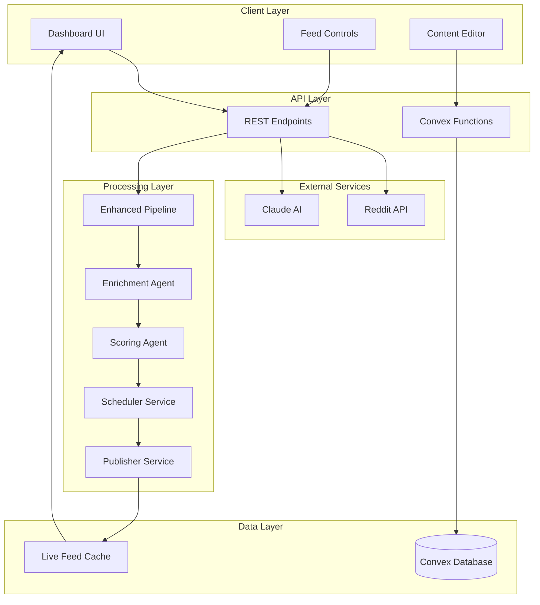

# SMNB API Documentation

> **Social Media News Broadcasting (SMNB)** - Intelligent Content Curation & Broadcasting Platform

Welcome to the comprehensive API documentation for SMNB, a sophisticated Next.js application with advanced live feed processing, AI-powered content analysis, and real-time broadcasting capabilities.

## 🏗️ Architecture Overview

SMNB employs a multi-layered architecture combining REST APIs, reactive database operations, and intelligent processing pipelines:



## 📚 Documentation Structure

| Section                                     | Description                                          | Use Case                            |
| ------------------------------------------- | ---------------------------------------------------- | ----------------------------------- |
| [**REST API Endpoints**](rest-endpoints.md) | Next.js API routes for Reddit and Claude integration | External API calls, data fetching   |
| [**Convex Functions**](convex-functions.md) | Reactive database operations and real-time sync      | Live data updates, state management |
| [**Authentication**](authentication.md)     | API keys, security, and access control               | Secure API access                   |
| [**Error Handling**](error-handling.md)     | Error codes, troubleshooting, and recovery           | Debugging and monitoring            |
| [**Rate Limits**](rate-limits.md)           | Reddit API limitations and best practices            | Sustainable API usage               |
| [**Architecture**](architecture.md)         | System design and processing pipeline                | Understanding data flow             |
| [**Examples & Tutorials**](examples.md)     | Code samples and getting started guides              | Implementation help                 |

## 🚀 Quick Start

### Prerequisites

* Node.js 18+ and npm/pnpm
* Reddit API credentials
* Anthropic Claude API key
* Convex account and project

### Basic Setup

```bash
# Clone and install
git clone <repository-url>
cd smnb
npm install

# Configure environment
cp .env.example .env.local
# Add your API keys to .env.local

# Start development
npm run dev          # Next.js app on port 8888
npm run dev:convex   # Convex backend
```

### First API Call

```typescript
// Fetch Reddit posts
const response = await fetch('/api/reddit?subreddit=worldnews&limit=5');
const data = await response.json();

// Analyze content with Claude
const analysis = await fetch('/api/claude', {
  method: 'POST',
  headers: { 'Content-Type': 'application/json' },
  body: JSON.stringify({
    action: 'analyze',
    prompt: 'Sample content for analysis'
  })
});
```

## 🎯 Core Features

### 🔥 Live Feed Processing

* **Real-time Reddit content ingestion**
* **Multi-agent processing pipeline**
* **Intelligent content scoring and prioritization**
* **Smart scheduling and publishing**

### 🧠 AI-Powered Analysis

* **Claude AI integration for content analysis**
* **Sentiment analysis and categorization**
* **Quality scoring and relevance detection**
* **Automated content enrichment**

### 📊 Data Management

* **Convex reactive database**
* **Real-time synchronization**
* **Comprehensive metadata tracking**
* **Advanced search and filtering**

### 🎬 Broadcasting Features

* **Host session management**
* **Story generation and narration**
* **Editor document management**
* **Token usage tracking**

## 📋 API Principles

Following GitBook's seven principles of great API documentation:

1. **🔍 Clear**: Simple language, easy to understand
2. **⚡ Concise**: Quick access to information, skimmable format
3. **🎯 Contextual**: Relevant examples and use cases
4. **✅ Complete**: Every endpoint, parameter, and response documented
5. **🔄 Consistent**: Uniform formatting and terminology
6. **🛠️ Concrete**: Interactive examples and real-world scenarios
7. **📱 Convenient**: Accessible where developers need it

## 🔗 Related Resources

* [**GitHub Repository**](https://github.com/acdc-digital/SMNB) - Source code and issues
* [**Convex Documentation**](https://docs.convex.dev) - Database and backend functions
* [**Reddit API**](https://www.reddit.com/dev/api/) - External data source
* [**Anthropic Claude**](https://docs.anthropic.com) - AI analysis capabilities

## 📞 Support

* **Issues**: Report bugs on GitHub Issues
* **Questions**: Use GitHub Discussions
* **API Status**: Check Convex dashboard for backend status

***

_Last Updated: December 2024_\
&#xNAN;_&#x56;ersion: 2.0.0_\
&#xNAN;_&#x4D;aintained by: SMNB Development Team_
