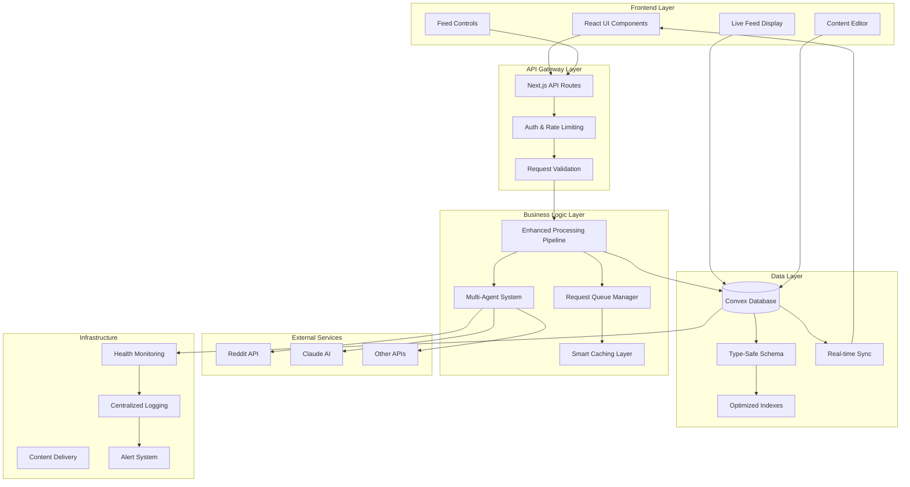
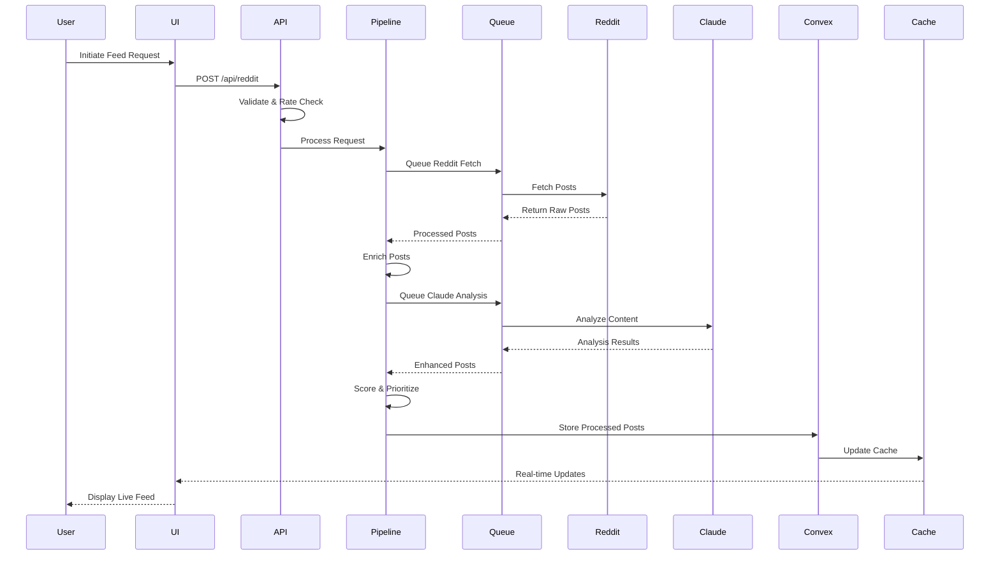
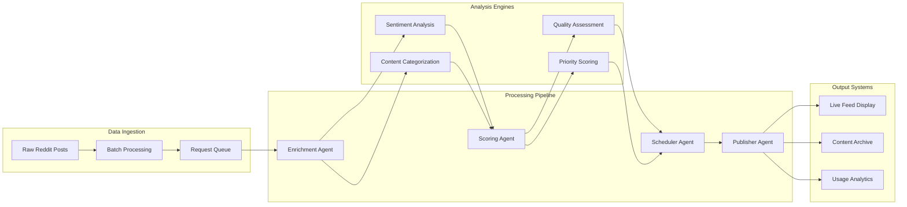
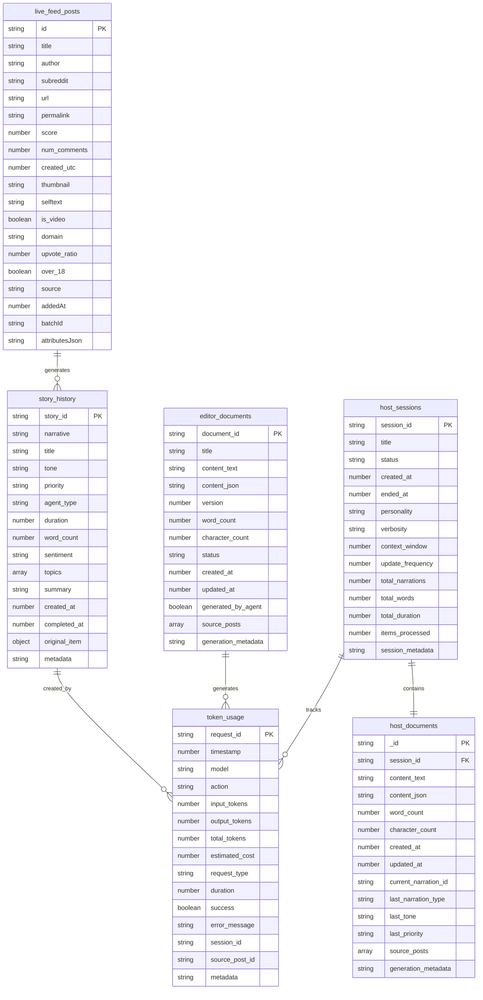
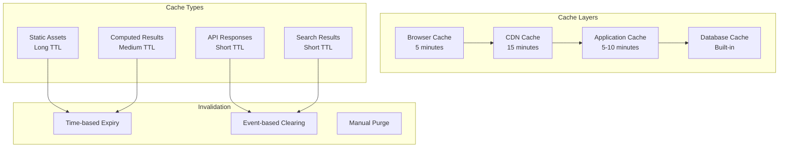
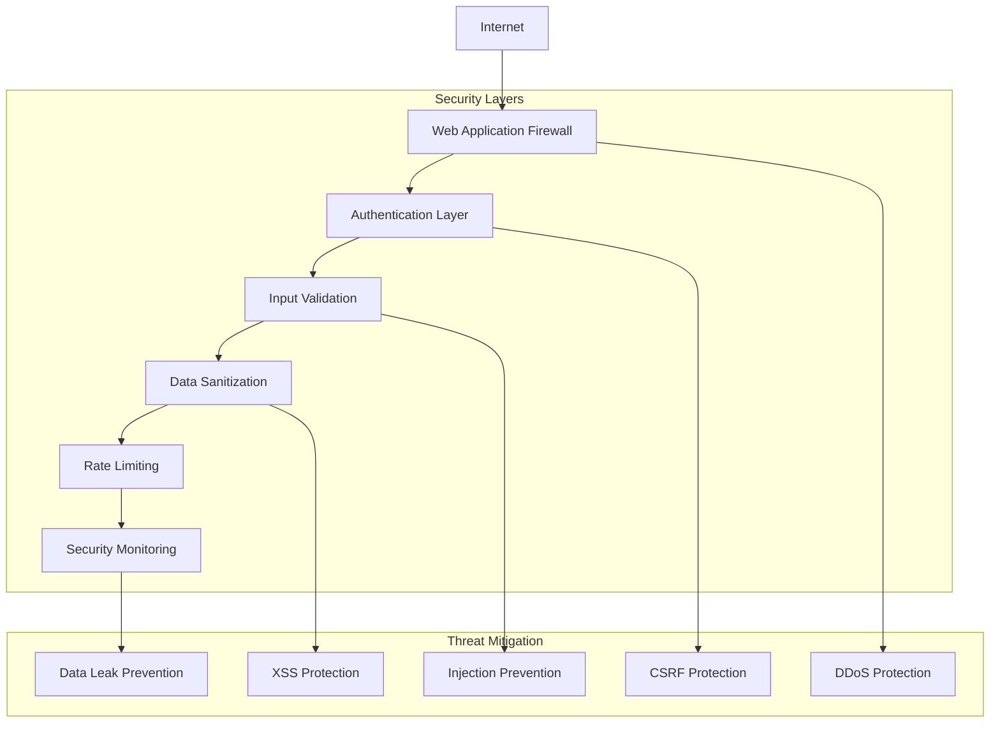

# System Architecture

> **Deep Dive** - SMNB's multi-layered architecture, data flow, and design patterns

SMNB employs a sophisticated architecture combining modern web technologies with intelligent content processing. This document provides a comprehensive overview of the system design, data flow patterns, and architectural decisions.

## 🏗️ High-Level Architecture



## 🔄 Data Flow Architecture

### **Request Lifecycle**



### **Multi-Agent Processing Flow**



## 🧩 Component Architecture

### **Frontend Architecture**

```typescript
// Component hierarchy and data flow
interface ComponentArchitecture {
  // Top-level app structure
  App: {
    ConvexProvider: ConvexClientProvider;
    ThemeProvider: NextThemesProvider;
    children: [
      LiveFeedDashboard,
      ContentEditor,
      AnalyticsDashboard
    ];
  };
  
  // Live feed components
  LiveFeedDashboard: {
    FeedControls: FeedControlsComponent;
    FeedDisplay: FeedDisplayComponent;
    RealTimeUpdates: RealtimeComponent;
  };
  
  // Content editing
  ContentEditor: {
    DocumentList: DocumentListComponent;
    ProseMirrorEditor: ProseMirrorComponent;
    VersionControl: VersionControlComponent;
  };
  
  // Analytics and monitoring
  AnalyticsDashboard: {
    TokenUsageChart: UsageChartComponent;
    RateLimitMonitor: RateLimitComponent;
    ErrorTracking: ErrorTrackingComponent;
  };
}
```

### **Backend Architecture**

```typescript
// API route organization
interface APIArchitecture {
  // External API integration
  'app/api/reddit/': {
    'route.ts': RedditDataFetching;
    'duplicates/route.ts': DuplicateDetection;
  };
  
  'app/api/claude/': {
    'route.ts': ClaudeAIIntegration;
    'debug/route.ts': DebuggingUtils;
  };
  
  // Convex backend functions
  'convex/': {
    'redditFeed.ts': LiveFeedOperations;
    'storyHistory.ts': ContentArchiving;
    'tokenUsage.ts': UsageTracking;
    'schema.ts': DatabaseSchema;
  };
  
  // Business logic
  'lib/services/': {
    'processingPipeline.ts': CorePipeline;
    'enrichmentAgent.ts': ContentEnrichment;
    'scoringAgent.ts': PriorityScoring;
    'schedulerService.ts': PublishingSchedule;
  };
}
```

## 🔗 Service Integration Patterns

### **Repository Pattern**

```typescript
// Data access abstraction
interface DataRepository<T, ID> {
  findById(id: ID): Promise<T | null>;
  findMany(criteria: SearchCriteria): Promise<T[]>;
  create(entity: Omit<T, 'id'>): Promise<T>;
  update(id: ID, updates: Partial<T>): Promise<T>;
  delete(id: ID): Promise<boolean>;
}

// Reddit posts repository
class RedditPostsRepository implements DataRepository<LiveFeedPost, string> {
  constructor(private convex: ConvexReactClient) {}
  
  async findById(id: string): Promise<LiveFeedPost | null> {
    return this.convex.query(api.redditFeed.getPostById, { id });
  }
  
  async findMany(criteria: PostSearchCriteria): Promise<LiveFeedPost[]> {
    return this.convex.query(api.redditFeed.searchPosts, criteria);
  }
  
  async create(post: Omit<LiveFeedPost, 'id'>): Promise<LiveFeedPost> {
    const id = await this.convex.mutation(api.redditFeed.createPost, post);
    return { ...post, id } as LiveFeedPost;
  }
  
  // ... other methods
}
```

### **Service Layer Pattern**

```typescript
// Business logic encapsulation
abstract class BaseService {
  protected logger: Logger;
  protected metrics: MetricsCollector;
  
  constructor(logger: Logger, metrics: MetricsCollector) {
    this.logger = logger;
    this.metrics = metrics;
  }
  
  protected async executeWithMetrics<T>(
    operation: string,
    fn: () => Promise<T>
  ): Promise<T> {
    const startTime = Date.now();
    
    try {
      this.logger.info(`Starting ${operation}`);
      const result = await fn();
      
      const duration = Date.now() - startTime;
      this.metrics.recordSuccess(operation, duration);
      this.logger.info(`Completed ${operation} in ${duration}ms`);
      
      return result;
    } catch (error) {
      const duration = Date.now() - startTime;
      this.metrics.recordError(operation, duration, error);
      this.logger.error(`Failed ${operation} after ${duration}ms:`, error);
      
      throw error;
    }
  }
}

// Live feed service implementation
class LiveFeedService extends BaseService {
  constructor(
    private redditClient: RedditClient,
    private repository: RedditPostsRepository,
    logger: Logger,
    metrics: MetricsCollector
  ) {
    super(logger, metrics);
  }
  
  async fetchAndProcessPosts(subreddit: string): Promise<ProcessedPost[]> {
    return this.executeWithMetrics('fetchAndProcessPosts', async () => {
      // Fetch raw posts
      const rawPosts = await this.redditClient.fetchPosts(subreddit);
      
      // Process through pipeline
      const processedPosts = await this.processingPipeline.process(rawPosts);
      
      // Store in database
      await this.repository.createMany(processedPosts);
      
      return processedPosts;
    });
  }
}
```

### **Observer Pattern for Real-time Updates**

```typescript
// Event-driven architecture for real-time features
interface EventObserver<T> {
  update(event: T): void;
}

class EventEmitter<T> {
  private observers: EventObserver<T>[] = [];
  
  subscribe(observer: EventObserver<T>): () => void {
    this.observers.push(observer);
    
    // Return unsubscribe function
    return () => {
      const index = this.observers.indexOf(observer);
      if (index > -1) {
        this.observers.splice(index, 1);
      }
    };
  }
  
  emit(event: T): void {
    this.observers.forEach(observer => observer.update(event));
  }
}

// Live feed events
interface LiveFeedEvent {
  type: 'post_added' | 'post_updated' | 'batch_complete';
  data: any;
  timestamp: number;
}

class LiveFeedEventManager {
  private eventEmitter = new EventEmitter<LiveFeedEvent>();
  
  // Subscribe to live feed events
  onPostAdded(callback: (post: LiveFeedPost) => void): () => void {
    return this.eventEmitter.subscribe({
      update: (event) => {
        if (event.type === 'post_added') {
          callback(event.data);
        }
      }
    });
  }
  
  // Emit events from processing pipeline
  emitPostAdded(post: LiveFeedPost): void {
    this.eventEmitter.emit({
      type: 'post_added',
      data: post,
      timestamp: Date.now()
    });
  }
}
```

## 🗄️ Database Design

### **Schema Architecture**



### **Index Strategy**

```typescript
// Optimized indexing for query performance
const IndexStrategy = {
  // Live feed posts - optimized for real-time queries
  live_feed_posts: [
    'by_batchId',        // Fast batch retrieval
    'by_source',         // Filter by subreddit/sort
    'by_addedAt',        // Chronological ordering
    'by_created_utc',    // Reddit timeline
    'by_score',          // Popular content
    'live_search_title'  // Full-text search
  ],
  
  // Story history - optimized for content management
  story_history: [
    'by_agent_type',     // Filter by host/editor
    'by_priority',       // High-priority content
    'by_tone',           // Content categorization
    'by_created_at',     // Chronological order
    'by_completed_at',   // Completion tracking
    'by_sentiment',      // Sentiment filtering
    'search_stories'     // Full-text narrative search
  ],
  
  // Token usage - optimized for analytics
  token_usage: [
    'by_timestamp',      // Time-series queries
    'by_model',          // Model-specific usage
    'by_action',         // Action-type analysis
    'by_request_type',   // Request categorization
    'by_success',        // Error rate tracking
    'by_session_id',     // Session tracking
    'by_source_post_id'  // Content attribution
  ]
};
```

## ⚡ Performance Architecture

### **Caching Strategy**



### **Performance Monitoring**

```typescript
// Performance tracking and optimization
class PerformanceMonitor {
  private metrics: Map<string, PerformanceMetric[]> = new Map();
  
  startTiming(operation: string): () => number {
    const startTime = performance.now();
    
    return () => {
      const duration = performance.now() - startTime;
      this.recordMetric(operation, duration);
      return duration;
    };
  }
  
  recordMetric(operation: string, duration: number): void {
    if (!this.metrics.has(operation)) {
      this.metrics.set(operation, []);
    }
    
    const metrics = this.metrics.get(operation)!;
    metrics.push({
      duration,
      timestamp: Date.now()
    });
    
    // Keep only last 1000 measurements
    if (metrics.length > 1000) {
      metrics.splice(0, metrics.length - 1000);
    }
    
    // Alert on performance degradation
    this.checkPerformanceThresholds(operation, metrics);
  }
  
  private checkPerformanceThresholds(operation: string, metrics: PerformanceMetric[]): void {
    if (metrics.length < 10) return;
    
    const recent = metrics.slice(-10);
    const average = recent.reduce((sum, m) => sum + m.duration, 0) / recent.length;
    
    const thresholds = {
      'reddit_fetch': 2000,    // 2 seconds
      'claude_analysis': 5000, // 5 seconds
      'database_query': 500,   // 500ms
      'cache_operation': 50    // 50ms
    };
    
    const threshold = thresholds[operation];
    if (threshold && average > threshold) {
      console.warn(`⚠️ Performance degradation detected: ${operation} averaging ${average.toFixed(2)}ms`);
    }
  }
  
  getMetrics(operation?: string) {
    if (operation) {
      return this.calculateStats(this.metrics.get(operation) || []);
    }
    
    const allStats: Record<string, any> = {};
    for (const [op, metrics] of this.metrics.entries()) {
      allStats[op] = this.calculateStats(metrics);
    }
    return allStats;
  }
  
  private calculateStats(metrics: PerformanceMetric[]) {
    if (metrics.length === 0) return null;
    
    const durations = metrics.map(m => m.duration);
    durations.sort((a, b) => a - b);
    
    return {
      count: metrics.length,
      min: durations[0],
      max: durations[durations.length - 1],
      median: durations[Math.floor(durations.length / 2)],
      p95: durations[Math.floor(durations.length * 0.95)],
      average: durations.reduce((sum, d) => sum + d, 0) / durations.length
    };
  }
}

interface PerformanceMetric {
  duration: number;
  timestamp: number;
}

// Global performance monitor
export const performanceMonitor = new PerformanceMonitor();

// Usage in API routes
export async function GET(request: NextRequest) {
  const endTiming = performanceMonitor.startTiming('reddit_fetch');
  
  try {
    const result = await redditAPI.fetchPosts('worldnews');
    return NextResponse.json(result);
  } finally {
    const duration = endTiming();
    console.log(`Reddit fetch completed in ${duration.toFixed(2)}ms`);
  }
}
```

## 🔐 Security Architecture

### **Defense in Depth**



### **Security Implementation**

```typescript
// Security middleware stack
export class SecurityMiddleware {
  static async validateRequest(request: NextRequest): Promise<SecurityValidation> {
    const validation: SecurityValidation = {
      isValid: true,
      errors: [],
      sanitizedData: {}
    };
    
    // 1. Rate limiting check
    const rateLimitResult = await this.checkRateLimit(request);
    if (!rateLimitResult.allowed) {
      validation.isValid = false;
      validation.errors.push('Rate limit exceeded');
      return validation;
    }
    
    // 2. Input validation
    const inputValidation = await this.validateInputs(request);
    if (!inputValidation.isValid) {
      validation.isValid = false;
      validation.errors.push(...inputValidation.errors);
      return validation;
    }
    
    // 3. Authentication check
    const authResult = await this.checkAuthentication(request);
    if (!authResult.isValid) {
      validation.isValid = false;
      validation.errors.push('Authentication failed');
      return validation;
    }
    
    // 4. Authorization check
    const authzResult = await this.checkAuthorization(request, authResult.user);
    if (!authzResult.allowed) {
      validation.isValid = false;
      validation.errors.push('Insufficient permissions');
      return validation;
    }
    
    validation.sanitizedData = inputValidation.sanitizedData;
    return validation;
  }
  
  private static async checkRateLimit(request: NextRequest): Promise<RateLimitResult> {
    // Implementation details in rate-limits.md
    return rateLimiter.checkRequest(request);
  }
  
  private static async validateInputs(request: NextRequest): Promise<InputValidation> {
    // Implementation details in authentication.md
    return inputValidator.validate(request);
  }
}

interface SecurityValidation {
  isValid: boolean;
  errors: string[];
  sanitizedData: Record<string, any>;
  user?: AuthenticatedUser;
}
```

## 📊 Scalability Considerations

### **Horizontal Scaling Strategy**

```typescript
// Microservice decomposition strategy
interface ScalabilityArchitecture {
  // API Gateway Layer
  gateway: {
    loadBalancer: 'nginx' | 'cloudflare';
    instances: number;
    autoScaling: {
      minInstances: 2;
      maxInstances: 10;
      cpuThreshold: 70;
      memoryThreshold: 80;
    };
  };
  
  // Application Layer
  application: {
    frontend: {
      framework: 'Next.js';
      deployment: 'Vercel' | 'AWS' | 'Railway';
      caching: 'CDN + Browser';
    };
    
    backend: {
      api: 'Next.js API Routes';
      database: 'Convex';
      queueing: 'Built-in + External';
      caching: 'Redis' | 'Memory';
    };
  };
  
  // External Services
  external: {
    reddit: {
      rateLimit: '60/minute';
      fallback: 'cached data';
      circuitBreaker: true;
    };
    
    claude: {
      rateLimit: 'tier-based';
      costOptimization: true;
      tokenTracking: true;
    };
  };
}
```

### **Database Scaling Patterns**

```typescript
// Convex scaling considerations
const DatabaseScaling = {
  // Read optimization
  reads: {
    indexes: 'Comprehensive indexing strategy',
    caching: 'Query result caching',
    pagination: 'Cursor-based pagination',
    filtering: 'Server-side filtering'
  },
  
  // Write optimization
  writes: {
    batching: 'Batch insert operations',
    queueing: 'Async write queue',
    validation: 'Schema validation',
    retries: 'Exponential backoff'
  },
  
  // Data archiving
  archiving: {
    oldPosts: 'Archive posts > 30 days',
    analytics: 'Aggregate historical data',
    cleanup: 'Remove processed tokens',
    compression: 'Compress large documents'
  }
};
```

## 🔧 Development Patterns

### **Code Organization**

```
smnb/
├── app/                     # Next.js App Router
│   ├── api/                 # API routes
│   │   ├── reddit/          # Reddit integration
│   │   └── claude/          # Claude AI integration
│   ├── components/          # React components
│   └── globals.css          # Global styles
├── convex/                  # Convex backend
│   ├── _generated/          # Generated types
│   ├── schema.ts            # Database schema
│   ├── redditFeed.ts        # Live feed functions
│   └── storyHistory.ts      # Content management
├── lib/                     # Shared utilities
│   ├── services/            # Business logic
│   ├── types/               # TypeScript types
│   └── utils/               # Helper functions
├── docs/                    # Documentation
│   └── api/                 # API documentation
└── package.json             # Dependencies
```

### **Testing Strategy**

```typescript
// Testing architecture
interface TestingStrategy {
  unit: {
    framework: 'Jest + React Testing Library';
    coverage: 'Services and utilities';
    mocking: 'External API calls';
  };
  
  integration: {
    framework: 'Playwright';
    scope: 'API routes and database';
    fixtures: 'Test data management';
  };
  
  e2e: {
    framework: 'Playwright';
    scenarios: 'Critical user journeys';
    environments: 'Staging and production';
  };
  
  performance: {
    tools: 'Lighthouse + Custom metrics';
    targets: 'Load time and responsiveness';
    monitoring: 'Continuous performance tracking';
  };
}
```

## 🔗 Technology Stack Rationale

### **Frontend Technology Choices**

| Technology       | Rationale                                                                | Alternatives Considered         |
| ---------------- | ------------------------------------------------------------------------ | ------------------------------- |
| **Next.js 15**   | Full-stack React framework with App Router, excellent TypeScript support | Remix, Nuxt.js, Vite            |
| **React 19**     | Component architecture, hooks, excellent ecosystem                       | Vue.js, Svelte, Angular         |
| **TypeScript**   | Type safety, excellent IDE support, reduces runtime errors               | JavaScript, Flow                |
| **Tailwind CSS** | Utility-first CSS, consistent design system, small bundle                | Styled Components, CSS Modules  |
| **Convex**       | Real-time database, TypeScript-first, automatic caching                  | Supabase, Firebase, PlanetScale |

### **Backend Technology Choices**

| Technology             | Rationale                                                     | Alternatives Considered     |
| ---------------------- | ------------------------------------------------------------- | --------------------------- |
| **Convex**             | Real-time sync, TypeScript integration, automatic scaling     | Express.js, Fastify, tRPC   |
| **Next.js API Routes** | Co-located with frontend, excellent TypeScript support        | Express.js, Fastify, Koa    |
| **Reddit API**         | Rich content source, comprehensive API, active community      | Twitter API, HackerNews API |
| **Claude AI**          | Advanced reasoning, large context window, competitive pricing | OpenAI GPT, Google Gemini   |

### **Infrastructure Choices**

| Component           | Technology                | Rationale                                                 |
| ------------------- | ------------------------- | --------------------------------------------------------- |
| **Hosting**         | Vercel/Railway            | Excellent Next.js integration, automatic deployments      |
| **Database**        | Convex Cloud              | Managed service, real-time capabilities, TypeScript-first |
| **CDN**             | Vercel Edge Network       | Automatic optimization, global distribution               |
| **Monitoring**      | Convex Dashboard + Custom | Built-in monitoring plus custom metrics                   |
| **Version Control** | GitHub                    | Industry standard, excellent CI/CD integration            |

***

## 🎯 Design Principles

### **Core Principles**

1. **Type Safety First**: Comprehensive TypeScript usage across all layers
2. **Real-time by Default**: Leverage Convex for immediate data synchronization
3. **Fail Fast**: Early validation and clear error messages
4. **Performance Conscious**: Caching, batching, and optimization at every level
5. **Security Minded**: Defense in depth with multiple security layers
6. **Developer Experience**: Clear APIs, comprehensive documentation, good tooling
7. **Scalability Ready**: Architecture supports horizontal scaling
8. **Cost Efficient**: Optimize external API usage and resource consumption

### **Architectural Patterns Used**

* **Repository Pattern**: Data access abstraction
* **Service Layer Pattern**: Business logic encapsulation
* **Observer Pattern**: Real-time event handling
* **Circuit Breaker Pattern**: External service failure protection
* **Rate Limiting Pattern**: API usage management
* **Cache-Aside Pattern**: Performance optimization
* **Event Sourcing**: Audit trail and state reconstruction
* **CQRS**: Separate read and write models where beneficial

***

_For implementation details, see_ [_Examples & Tutorials_](examples.md)\
&#xNAN;_&#x46;or API specifics, see_ [_REST Endpoints_](rest-endpoints.md) _and_ [_Convex Functions_](convex-functions.md)
