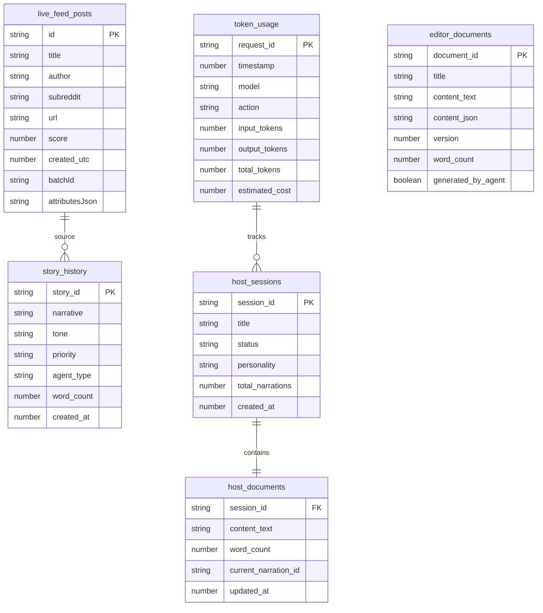

# Convex Functions

> **Reactive Database Operations** - Real-time data synchronization and backend functions

SMNB uses Convex as its reactive database backend, providing real-time synchronization, type-safe queries, and powerful indexing. All functions are automatically accessible via the generated API client.

## 🔄 Function Types

| Type         | Purpose                          | Example Use Case                      |
| ------------ | -------------------------------- | ------------------------------------- |
| **Query**    | Read data with automatic caching | Fetch live posts, get documents       |
| **Mutation** | Insert, update, delete data      | Store Reddit posts, update documents  |
| **Action**   | Call external APIs               | Reddit API integration, AI processing |

## 📊 Database Schema Overview



***

## 🔥 Live Feed Functions

### `storeLiveFeedPosts` (Mutation)

Store Reddit posts in the live feed with duplicate detection.

**Parameters**:

```typescript
{
  posts: LiveFeedPost[],
  batchId: string
}

interface LiveFeedPost {
  id: string;
  title: string;
  author: string;
  subreddit: string;
  url: string;
  permalink: string;
  score: number;
  num_comments: number;
  created_utc: number;
  thumbnail: string;
  selftext: string;
  is_video: boolean;
  domain: string;
  upvote_ratio: number;
  over_18: boolean;
  source: string; // e.g. "technology/hot"
  addedAt: number;
  batchId: string;
  attributesJson?: string; // JSON metadata
}
```

**Example Usage**:

```typescript
import { useMutation } from "convex/react";
import { api } from "@/convex/_generated/api";

function LiveFeedComponent() {
  const storePosts = useMutation(api.redditFeed.storeLiveFeedPosts);
  
  const handleNewPosts = async (posts: RedditPost[]) => {
    const batchId = `batch_${Date.now()}`;
    const liveFeedPosts = posts.map(post => ({
      ...post,
      source: `${post.subreddit}/hot`,
      addedAt: Date.now(),
      batchId
    }));
    
    const result = await storePosts({ posts: liveFeedPosts, batchId });
    console.log(`Stored ${result.inserted} posts, skipped ${result.skipped} duplicates`);
  };
}
```

**Response**:

```typescript
{
  requested: number;      // Total posts requested to store
  inserted: number;       // Successfully inserted posts
  skipped: number;        // Skipped due to duplicates
  insertedIds: string[];  // Convex IDs of inserted documents
  existingIds: string[];  // Reddit IDs that already existed
  existingMatchesCount: number; // Total existing matches found
}
```

### `getLiveFeedPosts` (Query)

Retrieve live feed posts with optional filtering.

**Parameters**:

```typescript
{
  limit?: number;      // Default: 50
  batchId?: string;    // Filter by specific batch
}
```

**Example Usage**:

```typescript
import { useQuery } from "convex/react";
import { api } from "@/convex/_generated/api";

function FeedDisplay() {
  // Get latest 20 posts
  const posts = useQuery(api.redditFeed.getLiveFeedPosts, { limit: 20 });
  
  // Get posts from specific batch
  const batchPosts = useQuery(api.redditFeed.getLiveFeedPosts, { 
    batchId: "batch_1703875200" 
  });
  
  return (
    <div>
      {posts?.map(post => (
        <div key={post._id}>
          <h3>{post.title}</h3>
          <p>r/{post.subreddit} • {post.score} points</p>
        </div>
      ))}
    </div>
  );
}
```

***

## 📄 Editor Document Functions

### `createEditorDocument` (Mutation)

Create a new editor document with version control.

**Parameters**:

```typescript
{
  document_id: string;
  title?: string;
  content_text?: string;
  content_json?: string;
  generated_by_agent?: boolean;
  source_posts?: string[];
  generation_metadata?: string;
}
```

**Example Usage**:

```typescript
const createDocument = useMutation(api.redditFeed.createEditorDocument);

const handleCreateDocument = async () => {
  const docId = await createDocument({
    document_id: `doc_${Date.now()}`,
    title: "Breaking News Story",
    content_text: "Story content here...",
    generated_by_agent: true,
    source_posts: ["reddit_post_123", "reddit_post_456"]
  });
  
  console.log(`Created document: ${docId}`);
};
```

### `updateEditorDocument` (Mutation)

Update existing document or create if doesn't exist.

**Example Usage**:

```typescript
const updateDocument = useMutation(api.redditFeed.updateEditorDocument);

const handleSave = async (documentId: string, content: string) => {
  await updateDocument({
    document_id: documentId,
    content_text: content,
    content_json: JSON.stringify({ editorState: "rich_text_data" })
  });
};
```

### `getEditorDocument` (Query)

Retrieve a specific document by ID.

**Example Usage**:

```typescript
const document = useQuery(api.redditFeed.getEditorDocument, { 
  document_id: "doc_1703875200" 
});

if (document) {
  console.log(`Document: ${document.title} (v${document.version})`);
  console.log(`Words: ${document.word_count}, Characters: ${document.character_count}`);
}
```

### `listEditorDocuments` (Query)

Get list of recent documents.

**Example Usage**:

```typescript
const documents = useQuery(api.redditFeed.listEditorDocuments, { limit: 10 });

return (
  <div>
    <h2>Recent Documents</h2>
    {documents?.map(doc => (
      <div key={doc._id}>
        <h3>{doc.title}</h3>
        <p>Version {doc.version} • {doc.word_count} words</p>
        <span className={doc.generated_by_agent ? 'ai-generated' : 'human-authored'}>
          {doc.generated_by_agent ? '🤖 AI Generated' : '✍️ Human Authored'}
        </span>
      </div>
    ))}
  </div>
);
```

***

## 🎬 Host Session Functions

### `createHostSession` (Mutation)

Create a new broadcasting host session.

**Parameters**:

```typescript
{
  session_id: string;
  title: string;
  personality: string;
  verbosity: string;
  context_window: number;
  update_frequency: number;
}
```

**Example Usage**:

```typescript
const createSession = useMutation(api.redditFeed.createHostSession);

const startBroadcast = async () => {
  const sessionId = await createSession({
    session_id: `session_${Date.now()}`,
    title: "Evening News Broadcast",
    personality: "professional",
    verbosity: "detailed",
    context_window: 10,
    update_frequency: 30000 // 30 seconds
  });
  
  console.log(`Started session: ${sessionId}`);
};
```

### `updateHostDocument` (Mutation)

Update host session content during live broadcasting.

**Example Usage**:

```typescript
const updateHost = useMutation(api.redditFeed.updateHostDocument);

const addNarration = async (sessionId: string, newContent: string) => {
  await updateHost({
    session_id: sessionId,
    content_text: newContent,
    current_narration_id: `narration_${Date.now()}`,
    last_narration_type: "breaking",
    last_tone: "urgent",
    last_priority: "high"
  });
};
```

***

## 📚 Story History Functions

### `addStory` (Mutation)

Add completed story to permanent history.

**Parameters**:

```typescript
{
  story_id: string;
  narrative: string;
  title?: string;
  tone: "breaking" | "developing" | "analysis" | "opinion" | "human-interest";
  priority: "high" | "medium" | "low";
  agent_type: "host" | "editor";
  duration: number;
  word_count: number;
  sentiment?: "positive" | "negative" | "neutral";
  topics?: string[];
  summary?: string;
  created_at: number;
  completed_at: number;
  original_item?: {
    title: string;
    author: string;
    subreddit?: string;
    url?: string;
  };
  metadata?: string;
}
```

**Example Usage**:

```typescript
const addStory = useMutation(api.storyHistory.addStory);

const saveCompletedStory = async (story: StoryData) => {
  const storyId = await addStory({
    story_id: `story_${Date.now()}`,
    narrative: story.content,
    title: story.title,
    tone: "breaking",
    priority: "high",
    agent_type: "host",
    duration: 180, // 3 minutes
    word_count: story.content.split(' ').length,
    sentiment: "neutral",
    topics: ["Technology", "Politics"],
    created_at: Date.now() - 60000,
    completed_at: Date.now(),
    original_item: {
      title: "Source Reddit Post",
      author: "reddit_user",
      subreddit: "worldnews",
      url: "https://reddit.com/..."
    }
  });
};
```

### `getStories` (Query)

Retrieve stories with optional filtering.

**Example Usage**:

```typescript
// Get latest 50 stories
const stories = useQuery(api.storyHistory.getStories, { limit: 50 });

// Get only host-generated stories
const hostStories = useQuery(api.storyHistory.getStories, { 
  agent_type: "host",
  limit: 25 
});

// Display stories
return (
  <div>
    {stories?.map(story => (
      <div key={story._id}>
        <h3>{story.title}</h3>
        <div className="story-meta">
          <span className={`tone-${story.tone}`}>{story.tone}</span>
          <span className={`priority-${story.priority}`}>{story.priority}</span>
          <span className={`agent-${story.agent_type}`}>
            {story.agent_type === 'host' ? '📺' : '✍️'} {story.agent_type}
          </span>
        </div>
        <p>{story.summary}</p>
      </div>
    ))}
  </div>
);
```

### `getRecentStories` (Query)

Get stories from last N hours.

**Example Usage**:

```typescript
// Last 24 hours
const recentStories = useQuery(api.storyHistory.getRecentStories, { hours: 24 });

// Last 6 hours, host only
const recentHostStories = useQuery(api.storyHistory.getRecentStories, { 
  hours: 6,
  agent_type: "host" 
});
```

### `getStoriesByPriority` (Query)

Filter stories by priority level.

**Example Usage**:

```typescript
const highPriorityStories = useQuery(api.storyHistory.getStoriesByPriority, { 
  priority: "high",
  limit: 20 
});

const breakingNews = highPriorityStories?.filter(story => 
  story.tone === "breaking" && story.priority === "high"
);
```

***

## 📊 Token Usage Functions

### `recordTokenUsage` (Mutation)

Track Claude AI token consumption for analytics.

**Parameters**:

```typescript
{
  request_id: string;
  timestamp: number;
  model: string;
  action: "generate" | "stream" | "analyze" | "test";
  input_tokens: number;
  output_tokens: number;
  total_tokens: number;
  estimated_cost: number;
  request_type: "host" | "producer" | "editor";
  duration?: number;
  success: boolean;
  error_message?: string;
  session_id?: string;
  source_post_id?: string;
  metadata?: string;
}
```

**Example Usage**:

```typescript
const recordUsage = useMutation(api.tokenUsage.recordTokenUsage);

const trackTokenUsage = async (claudeResponse: any) => {
  await recordUsage({
    request_id: `req_${Date.now()}`,
    timestamp: Date.now(),
    model: "claude-3-5-haiku-20241022",
    action: "analyze",
    input_tokens: claudeResponse.usage.input_tokens,
    output_tokens: claudeResponse.usage.output_tokens,
    total_tokens: claudeResponse.usage.input_tokens + claudeResponse.usage.output_tokens,
    estimated_cost: calculateCost(claudeResponse.usage),
    request_type: "host",
    duration: 1200, // ms
    success: true,
    session_id: "session_123"
  });
};
```

### `getTokenUsageStats` (Query)

Retrieve token usage analytics.

**Example Usage**:

```typescript
const usageStats = useQuery(api.tokenUsage.getTokenUsageStats, {
  startTime: Date.now() - (24 * 60 * 60 * 1000), // Last 24 hours
  endTime: Date.now(),
  limit: 1000
});

const totalCost = usageStats?.reduce((sum, record) => sum + record.estimated_cost, 0);
const totalTokens = usageStats?.reduce((sum, record) => sum + record.total_tokens, 0);

console.log(`24h Usage: ${totalTokens} tokens, $${totalCost?.toFixed(4)}`);
```

***

## 🔍 Search Functions

### Search Live Feed Posts

**Example Usage**:

```typescript
// Search posts by title
const searchResults = useQuery(api.redditFeed.searchLiveFeedPosts, {
  query: "artificial intelligence",
  subreddit: "technology",
  limit: 20
});
```

### Search Stories

**Example Usage**:

```typescript
// Search story narratives
const storySearch = useQuery(api.storyHistory.searchStories, {
  query: "climate change",
  agent_type: "host",
  tone: "analysis"
});
```

***

## 🎯 Real-time Updates

### Reactive Data Flow

Convex automatically updates UI components when data changes:

```typescript
function LiveDashboard() {
  // Automatically updates when new posts are stored
  const livePosts = useQuery(api.redditFeed.getLiveFeedPosts, { limit: 10 });
  
  // Updates when new stories are completed
  const recentStories = useQuery(api.storyHistory.getRecentStories, { hours: 1 });
  
  // Updates when token usage is recorded
  const todayUsage = useQuery(api.tokenUsage.getTokenUsageStats, {
    startTime: new Date().setHours(0, 0, 0, 0),
    endTime: Date.now()
  });
  
  return (
    <div>
      <div>Live Posts: {livePosts?.length || 0}</div>
      <div>Recent Stories: {recentStories?.length || 0}</div>
      <div>Today's Token Usage: {todayUsage?.length || 0} requests</div>
    </div>
  );
}
```

## 🔧 Advanced Patterns

### Optimistic Updates

```typescript
const storePosts = useMutation(api.redditFeed.storeLiveFeedPosts);

const addPostOptimistically = async (post: RedditPost) => {
  // Optimistically add to local state
  setLocalPosts(prev => [post, ...prev]);
  
  try {
    await storePosts({ posts: [post], batchId: `batch_${Date.now()}` });
  } catch (error) {
    // Revert on error
    setLocalPosts(prev => prev.filter(p => p.id !== post.id));
    console.error("Failed to store post:", error);
  }
};
```

### Batch Operations

```typescript
const batchStorePosts = async (posts: RedditPost[]) => {
  // Process in chunks to avoid large mutations
  const chunkSize = 50;
  const batchId = `batch_${Date.now()}`;
  
  for (let i = 0; i < posts.length; i += chunkSize) {
    const chunk = posts.slice(i, i + chunkSize);
    await storePosts({ posts: chunk, batchId });
  }
};
```

### Error Handling

```typescript
const safeQuery = (queryFn: () => any, fallback: any = null) => {
  try {
    const result = useQuery(queryFn);
    return result ?? fallback;
  } catch (error) {
    console.error("Query failed:", error);
    return fallback;
  }
};

// Usage
const posts = safeQuery(
  () => api.redditFeed.getLiveFeedPosts({ limit: 10 }),
  []
);
```

***

## 📋 Best Practices

### 1. **Use Indexes Effectively**

```typescript
// Good - uses index
const posts = await ctx.db
  .query("live_feed_posts")
  .withIndex("by_subreddit", q => q.eq("subreddit", "technology"))
  .order("desc")
  .take(10);

// Bad - no index, scans all documents
const posts = await ctx.db
  .query("live_feed_posts")
  .filter(q => q.eq(q.field("subreddit"), "technology"))
  .take(10);
```

### 2. **Implement Proper Error Handling**

```typescript
export const safeStorePosts = mutation({
  args: { posts: v.array(postSchema) },
  handler: async (ctx, args) => {
    try {
      const results = await Promise.allSettled(
        args.posts.map(post => ctx.db.insert("live_feed_posts", post))
      );
      
      const successful = results.filter(r => r.status === 'fulfilled').length;
      const failed = results.filter(r => r.status === 'rejected').length;
      
      return { successful, failed };
    } catch (error) {
      console.error("Batch store failed:", error);
      throw new Error("Failed to store posts batch");
    }
  }
});
```

### 3. **Optimize Query Performance**

```typescript
// Use pagination for large datasets
export const getPaginatedStories = query({
  args: {
    paginationOpts: paginationOptsValidator,
    filters: v.optional(v.object({
      agent_type: v.optional(v.string()),
      priority: v.optional(v.string())
    }))
  },
  handler: async (ctx, args) => {
    let query = ctx.db.query("story_history");
    
    if (args.filters?.agent_type) {
      query = query.withIndex("by_agent_type", q => 
        q.eq("agent_type", args.filters!.agent_type!)
      );
    }
    
    return await query.paginate(args.paginationOpts);
  }
});
```

***

_For implementation examples, see_ [_Examples & Tutorials_](examples.md)\
&#xNAN;_&#x46;or error handling patterns, see_ [_Error Handling Guide_](error-handling.md)
