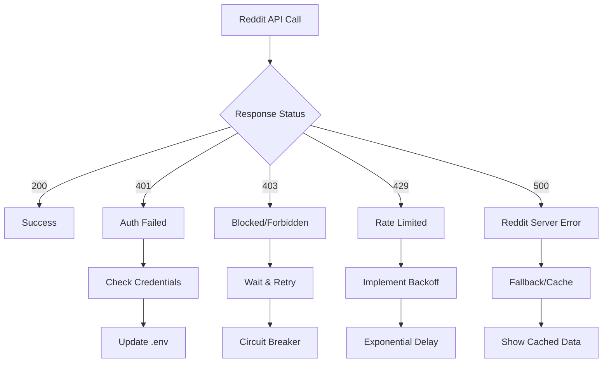

# Error Handling & Troubleshooting

> **Comprehensive Error Management** - Error codes, recovery strategies, and debugging guides

SMNB implements robust error handling across all API layers with detailed error codes, recovery mechanisms, and comprehensive logging for debugging.

## 🚨 Error Response Structure

All SMNB APIs follow a consistent error response format:

```typescript
interface ErrorResponse {
  success: false;
  error: string;           // Human-readable error message
  code?: string;           // Machine-readable error code
  details?: any;           // Additional error context
  timestamp?: string;      // ISO 8601 timestamp
  requestId?: string;      // Unique request identifier
  retryAfter?: number;     // Seconds to wait before retry
}
```

**Example Error Response**:

```json
{
  "success": false,
  "error": "Reddit API rate limit exceeded. Please wait before making more requests.",
  "code": "REDDIT_RATE_LIMIT",
  "details": {
    "rateLimited": true,
    "service": "reddit",
    "endpoint": "/api/reddit"
  },
  "timestamp": "2024-12-19T10:30:00Z",
  "requestId": "req_1703875200",
  "retryAfter": 60
}
```

***

## 🔴 HTTP Status Codes

### 4xx Client Errors

#### **400 Bad Request**

Invalid request parameters or malformed data.

**Common Causes**:

* Missing required parameters
* Invalid parameter values
* Malformed JSON body

**Example**:

```json
{
  "success": false,
  "error": "Missing required parameter: subreddit",
  "code": "MISSING_PARAMETER",
  "details": {
    "parameter": "subreddit",
    "expectedType": "string"
  }
}
```

**Resolution**:

```typescript
// ✅ Correct request
const response = await fetch('/api/reddit?subreddit=worldnews&limit=5');

// ❌ Missing subreddit parameter
const response = await fetch('/api/reddit?limit=5');
```

#### **401 Unauthorized**

Authentication failed or missing credentials.

**Common Causes**:

* Invalid API key
* Expired authentication token
* Missing authentication headers

**Example**:

```json
{
  "success": false,
  "error": "Invalid API key",
  "code": "INVALID_API_KEY",
  "details": {
    "service": "claude",
    "keyFormat": "sk-ant-*"
  }
}
```

**Resolution**:

```bash
# Check environment variables
echo $ANTHROPIC_API_KEY
echo $REDDIT_CLIENT_ID

# Verify API key format
# Claude: sk-ant-api03-xxxxx
# Reddit: 14-character string
```

#### **403 Forbidden**

Access denied due to service restrictions.

**Common Causes**:

* Reddit API blocked your IP
* Service temporarily unavailable
* Insufficient permissions

**Example**:

```json
{
  "success": false,
  "error": "Reddit API access blocked. Try again later.",
  "code": "REDDIT_BLOCKED",
  "details": {
    "blocked": true,
    "service": "reddit",
    "posts": []
  }
}
```

**Resolution**:

* Wait 10-15 minutes before retry
* Check Reddit API status
* Consider using different User-Agent
* Verify Reddit app permissions

#### **404 Not Found**

Resource or endpoint not found.

**Common Causes**:

* Invalid API endpoint
* Non-existent subreddit
* Deleted content

**Example**:

```json
{
  "success": false,
  "error": "Subreddit not found: nonexistentsubreddit",
  "code": "SUBREDDIT_NOT_FOUND",
  "details": {
    "subreddit": "nonexistentsubreddit",
    "suggestions": ["news", "worldnews", "technology"]
  }
}
```

#### **429 Rate Limited**

API rate limit exceeded.

**Common Causes**:

* Too many requests in short time
* Reddit API rate limiting (60/min)
* Claude API rate limiting
* Circuit breaker activated

**Example**:

```json
{
  "success": false,
  "error": "Reddit API rate limit reached. Please wait before making more requests.",
  "code": "REDDIT_RATE_LIMIT",
  "details": {
    "rateLimited": true,
    "service": "reddit",
    "requestsRemaining": 0,
    "resetTime": "2024-12-19T10:31:00Z"
  },
  "retryAfter": 60
}
```

**Resolution**:

```typescript
// Implement exponential backoff
const retryWithBackoff = async (fn: () => Promise<any>, maxRetries = 3) => {
  for (let attempt = 1; attempt <= maxRetries; attempt++) {
    try {
      return await fn();
    } catch (error) {
      if (error.status === 429) {
        const delay = Math.pow(2, attempt) * 1000; // 2s, 4s, 8s
        await new Promise(resolve => setTimeout(resolve, delay));
        continue;
      }
      throw error;
    }
  }
  throw new Error('Max retries exceeded');
};
```

### 5xx Server Errors

#### **500 Internal Server Error**

Unexpected server-side error.

**Common Causes**:

* Unhandled exceptions
* Database connection failures
* Third-party service errors

**Example**:

```json
{
  "success": false,
  "error": "Internal server error",
  "code": "INTERNAL_ERROR",
  "details": {
    "timestamp": "2024-12-19T10:30:00Z",
    "requestId": "req_1703875200"
  }
}
```

#### **503 Service Unavailable**

Service temporarily unavailable due to circuit breaker or maintenance.

**Common Causes**:

* Circuit breaker open
* Service overload
* Scheduled maintenance

**Example**:

```json
{
  "success": false,
  "error": "Reddit API is temporarily unavailable due to rate limits. Please try again later.",
  "code": "CIRCUIT_BREAKER_OPEN",
  "details": {
    "circuitBreakerOpen": true,
    "service": "reddit",
    "estimatedRecoveryTime": "2024-12-19T10:35:00Z"
  }
}
```

***

## 🔧 Service-Specific Errors

### Reddit API Errors



#### **Authentication Errors**

```json
{
  "success": false,
  "error": "Reddit authentication failed",
  "code": "REDDIT_AUTH_FAILED",
  "details": {
    "reason": "invalid_client",
    "description": "Invalid client credentials"
  }
}
```

**Debugging Steps**:

```bash
# 1. Verify credentials
echo "Client ID: $REDDIT_CLIENT_ID"
echo "Client Secret: $REDDIT_CLIENT_SECRET"
echo "User Agent: $REDDIT_USER_AGENT"

# 2. Test authentication
curl -X POST "https://www.reddit.com/api/v1/access_token" \
  -H "Authorization: Basic $(echo -n 'CLIENT_ID:CLIENT_SECRET' | base64)" \
  -H "User-Agent: YourApp/1.0.0" \
  -d "grant_type=client_credentials"
```

#### **Rate Limiting Errors**

```typescript
// Reddit API rate limiting implementation
class RedditRateLimiter {
  private lastRequest = 0;
  private requestCount = 0;
  private resetTime = 0;
  
  async canMakeRequest(): Promise<boolean> {
    const now = Date.now();
    
    // Reset counter every minute
    if (now > this.resetTime) {
      this.requestCount = 0;
      this.resetTime = now + 60000; // 1 minute
    }
    
    // Check if we're within rate limit (60 requests/minute)
    if (this.requestCount >= 60) {
      const waitTime = this.resetTime - now;
      throw new Error(`Rate limit exceeded. Wait ${Math.ceil(waitTime / 1000)} seconds.`);
    }
    
    // Enforce minimum 1-second delay between requests
    const timeSinceLastRequest = now - this.lastRequest;
    if (timeSinceLastRequest < 1000) {
      await new Promise(resolve => 
        setTimeout(resolve, 1000 - timeSinceLastRequest)
      );
    }
    
    this.requestCount++;
    this.lastRequest = Date.now();
    return true;
  }
}
```

### Claude AI Errors

#### **Token Limit Errors**

```json
{
  "success": false,
  "error": "Request exceeds maximum token limit",
  "code": "CLAUDE_TOKEN_LIMIT",
  "details": {
    "requestTokens": 4500,
    "maxTokens": 4096,
    "model": "claude-3-5-haiku-20241022"
  }
}
```

**Resolution**:

```typescript
// Token counting and chunking
const countTokens = async (text: string): Promise<number> => {
  const response = await fetch('/api/claude', {
    method: 'POST',
    headers: { 'Content-Type': 'application/json' },
    body: JSON.stringify({
      action: 'count-tokens',
      messages: [{ role: 'user', content: text }]
    })
  });
  
  const { input_tokens } = await response.json();
  return input_tokens;
};

const chunkText = (text: string, maxTokens: number): string[] => {
  const words = text.split(' ');
  const chunks: string[] = [];
  let currentChunk = '';
  
  for (const word of words) {
    const testChunk = currentChunk + ' ' + word;
    const estimated = testChunk.length / 4; // Rough token estimate
    
    if (estimated > maxTokens && currentChunk) {
      chunks.push(currentChunk.trim());
      currentChunk = word;
    } else {
      currentChunk = testChunk;
    }
  }
  
  if (currentChunk) chunks.push(currentChunk.trim());
  return chunks;
};
```

#### **Model Errors**

```json
{
  "success": false,
  "error": "Model not available",
  "code": "CLAUDE_MODEL_UNAVAILABLE",
  "details": {
    "requestedModel": "claude-3-opus",
    "availableModels": ["claude-3-5-haiku-20241022", "claude-3-5-sonnet-20241022"]
  }
}
```

### Convex Errors

#### **Database Errors**

```typescript
// Convex error handling in mutations
export const safeStorePosts = mutation({
  args: { posts: v.array(postSchema) },
  handler: async (ctx, args) => {
    try {
      const results = await Promise.allSettled(
        args.posts.map(async (post) => {
          // Validate post data
          if (!post.id || !post.title) {
            throw new ConvexError("Invalid post data: missing required fields");
          }
          
          // Check for duplicates
          const existing = await ctx.db
            .query("live_feed_posts")
            .withIndex("by_id", q => q.eq("id", post.id))
            .first();
            
          if (existing) {
            throw new ConvexError(`Post already exists: ${post.id}`);
          }
          
          return await ctx.db.insert("live_feed_posts", post);
        })
      );
      
      const successful = results.filter(r => r.status === 'fulfilled');
      const failed = results.filter(r => r.status === 'rejected');
      
      if (failed.length > 0) {
        console.error('Some posts failed to store:', failed.map(f => f.reason));
      }
      
      return {
        success: true,
        inserted: successful.length,
        failed: failed.length,
        errors: failed.map(f => f.reason)
      };
    } catch (error) {
      console.error("Batch store operation failed:", error);
      throw new ConvexError("Failed to store posts batch");
    }
  }
});
```

***

## 🔄 Error Recovery Strategies

### 1. **Circuit Breaker Pattern**

```typescript
class CircuitBreaker {
  private failures = 0;
  private lastFailTime = 0;
  private state: 'CLOSED' | 'OPEN' | 'HALF_OPEN' = 'CLOSED';
  
  constructor(
    private threshold: number = 5,
    private timeout: number = 60000 // 1 minute
  ) {}
  
  async execute<T>(fn: () => Promise<T>): Promise<T> {
    if (this.state === 'OPEN') {
      if (Date.now() - this.lastFailTime > this.timeout) {
        this.state = 'HALF_OPEN';
      } else {
        throw new Error('Circuit breaker is OPEN');
      }
    }
    
    try {
      const result = await fn();
      this.onSuccess();
      return result;
    } catch (error) {
      this.onFailure();
      throw error;
    }
  }
  
  private onSuccess() {
    this.failures = 0;
    this.state = 'CLOSED';
  }
  
  private onFailure() {
    this.failures++;
    this.lastFailTime = Date.now();
    
    if (this.failures >= this.threshold) {
      this.state = 'OPEN';
    }
  }
}

// Usage
const redditCircuitBreaker = new CircuitBreaker(5, 60000);

const fetchRedditPosts = async (subreddit: string) => {
  return redditCircuitBreaker.execute(async () => {
    const response = await redditAPI.fetchPosts(subreddit);
    return response;
  });
};
```

### 2. **Retry with Exponential Backoff**

```typescript
interface RetryOptions {
  maxRetries: number;
  baseDelay: number;
  maxDelay: number;
  retryCondition?: (error: any) => boolean;
}

async function retryWithBackoff<T>(
  fn: () => Promise<T>,
  options: RetryOptions
): Promise<T> {
  const { maxRetries, baseDelay, maxDelay, retryCondition } = options;
  
  for (let attempt = 1; attempt <= maxRetries; attempt++) {
    try {
      return await fn();
    } catch (error) {
      // Don't retry if condition fails
      if (retryCondition && !retryCondition(error)) {
        throw error;
      }
      
      // Don't retry on last attempt
      if (attempt === maxRetries) {
        throw error;
      }
      
      // Calculate delay with jitter
      const delay = Math.min(
        baseDelay * Math.pow(2, attempt - 1),
        maxDelay
      );
      const jitter = Math.random() * 0.1 * delay;
      
      console.log(`Retry attempt ${attempt} after ${delay + jitter}ms`);
      await new Promise(resolve => setTimeout(resolve, delay + jitter));
    }
  }
  
  throw new Error('Max retries exceeded');
}

// Usage
const result = await retryWithBackoff(
  () => fetch('/api/reddit?subreddit=worldnews'),
  {
    maxRetries: 3,
    baseDelay: 1000,
    maxDelay: 10000,
    retryCondition: (error) => error.status >= 500 || error.status === 429
  }
);
```

### 3. **Graceful Degradation**

```typescript
// Fallback to cached data when APIs fail
class FallbackDataProvider {
  private cache = new Map<string, { data: any; timestamp: number }>();
  
  async getRedditPosts(subreddit: string): Promise<RedditPost[]> {
    try {
      // Try primary API
      const posts = await this.fetchFromAPI(subreddit);
      this.cache.set(subreddit, { data: posts, timestamp: Date.now() });
      return posts;
    } catch (error) {
      console.warn(`API failed for ${subreddit}, falling back to cache:`, error);
      
      // Try cache
      const cached = this.cache.get(subreddit);
      if (cached && this.isCacheValid(cached.timestamp)) {
        return cached.data;
      }
      
      // Try alternative sources
      try {
        return await this.fetchFromAlternativeSource(subreddit);
      } catch (altError) {
        // Return empty state with error info
        return this.getEmptyState(error, altError);
      }
    }
  }
  
  private isCacheValid(timestamp: number): boolean {
    const maxAge = 15 * 60 * 1000; // 15 minutes
    return Date.now() - timestamp < maxAge;
  }
  
  private getEmptyState(primaryError: any, altError: any): RedditPost[] {
    console.error('All data sources failed:', { primaryError, altError });
    return [];
  }
}
```

***

## 🐛 Debugging Guide

### 1. **Enable Debug Logging**

```typescript
// Enable debug mode
const DEBUG = process.env.NODE_ENV === 'development';

const debugLog = (category: string, message: string, data?: any) => {
  if (!DEBUG) return;
  
  console.log(`🐛 [${category}] ${message}`, data ? JSON.stringify(data, null, 2) : '');
};

// Usage in API routes
export async function GET(request: NextRequest) {
  debugLog('API', 'Reddit request received', {
    url: request.url,
    headers: Object.fromEntries(request.headers.entries())
  });
  
  try {
    const result = await redditAPI.fetchPosts('worldnews');
    debugLog('API', 'Reddit response received', { postCount: result.length });
    return NextResponse.json({ success: true, posts: result });
  } catch (error) {
    debugLog('API', 'Reddit request failed', { error: error.message });
    throw error;
  }
}
```

### 2. **Request Tracing**

```typescript
// Add request ID for tracing
import { v4 as uuidv4 } from 'uuid';

export async function GET(request: NextRequest) {
  const requestId = uuidv4();
  const startTime = Date.now();
  
  console.log(`🚀 [${requestId}] Request started:`, request.url);
  
  try {
    const result = await processRequest(request, requestId);
    const duration = Date.now() - startTime;
    
    console.log(`✅ [${requestId}] Request completed in ${duration}ms`);
    return NextResponse.json({ ...result, requestId });
  } catch (error) {
    const duration = Date.now() - startTime;
    
    console.error(`❌ [${requestId}] Request failed after ${duration}ms:`, error);
    return NextResponse.json(
      { 
        success: false, 
        error: error.message,
        requestId 
      },
      { status: 500 }
    );
  }
}
```

### 3. **Health Check Endpoint**

```typescript
// app/api/health/route.ts
export async function GET() {
  const health = {
    status: 'ok',
    timestamp: new Date().toISOString(),
    services: {} as Record<string, any>
  };
  
  // Test Reddit API
  try {
    await fetch('/api/reddit?subreddit=test&limit=1');
    health.services.reddit = { status: 'healthy' };
  } catch (error) {
    health.services.reddit = { 
      status: 'unhealthy', 
      error: error.message 
    };
  }
  
  // Test Claude API
  try {
    await fetch('/api/claude/debug');
    health.services.claude = { status: 'healthy' };
  } catch (error) {
    health.services.claude = { 
      status: 'unhealthy', 
      error: error.message 
    };
  }
  
  // Test Convex
  try {
    // Test basic Convex query
    health.services.convex = { status: 'healthy' };
  } catch (error) {
    health.services.convex = { 
      status: 'unhealthy', 
      error: error.message 
    };
  }
  
  const allHealthy = Object.values(health.services)
    .every(service => service.status === 'healthy');
  
  return NextResponse.json(health, { 
    status: allHealthy ? 200 : 503 
  });
}
```

***

## 📊 Error Monitoring & Alerting

### 1. **Error Tracking**

```typescript
// Error tracking service
class ErrorTracker {
  private errors: Array<{
    timestamp: number;
    error: string;
    service: string;
    endpoint: string;
    requestId: string;
  }> = [];
  
  track(error: Error, context: {
    service: string;
    endpoint: string;
    requestId: string;
  }) {
    this.errors.push({
      timestamp: Date.now(),
      error: error.message,
      ...context
    });
    
    // Keep only last 1000 errors
    if (this.errors.length > 1000) {
      this.errors = this.errors.slice(-1000);
    }
    
    // Check for error patterns
    this.analyzeErrorPatterns();
  }
  
  private analyzeErrorPatterns() {
    const recentErrors = this.errors.filter(
      e => Date.now() - e.timestamp < 5 * 60 * 1000 // Last 5 minutes
    );
    
    const errorCounts = recentErrors.reduce((counts, error) => {
      const key = `${error.service}:${error.error}`;
      counts[key] = (counts[key] || 0) + 1;
      return counts;
    }, {} as Record<string, number>);
    
    // Alert if any error occurs more than 10 times in 5 minutes
    Object.entries(errorCounts).forEach(([error, count]) => {
      if (count > 10) {
        this.alertHighErrorRate(error, count);
      }
    });
  }
  
  private alertHighErrorRate(error: string, count: number) {
    console.error(`🚨 HIGH ERROR RATE: ${error} occurred ${count} times in last 5 minutes`);
    // Implement alerting (email, Slack, etc.)
  }
  
  getErrorStats() {
    const last24h = this.errors.filter(
      e => Date.now() - e.timestamp < 24 * 60 * 60 * 1000
    );
    
    const byService = last24h.reduce((stats, error) => {
      stats[error.service] = (stats[error.service] || 0) + 1;
      return stats;
    }, {} as Record<string, number>);
    
    return {
      total: last24h.length,
      byService,
      lastError: this.errors[this.errors.length - 1]
    };
  }
}

const errorTracker = new ErrorTracker();

// Usage in API routes
export async function GET(request: NextRequest) {
  const requestId = uuidv4();
  
  try {
    // API logic here
  } catch (error) {
    errorTracker.track(error, {
      service: 'reddit',
      endpoint: '/api/reddit',
      requestId
    });
    throw error;
  }
}
```

### 2. **Performance Monitoring**

```typescript
// Performance monitoring
class PerformanceMonitor {
  private metrics: Array<{
    endpoint: string;
    duration: number;
    timestamp: number;
    success: boolean;
  }> = [];
  
  recordRequest(endpoint: string, duration: number, success: boolean) {
    this.metrics.push({
      endpoint,
      duration,
      timestamp: Date.now(),
      success
    });
    
    // Alert on slow requests
    if (duration > 10000) { // 10 seconds
      console.warn(`⚠️ SLOW REQUEST: ${endpoint} took ${duration}ms`);
    }
  }
  
  getStats() {
    const last24h = this.metrics.filter(
      m => Date.now() - m.timestamp < 24 * 60 * 60 * 1000
    );
    
    const byEndpoint = last24h.reduce((stats, metric) => {
      if (!stats[metric.endpoint]) {
        stats[metric.endpoint] = {
          requests: 0,
          totalDuration: 0,
          successCount: 0
        };
      }
      
      stats[metric.endpoint].requests++;
      stats[metric.endpoint].totalDuration += metric.duration;
      if (metric.success) stats[metric.endpoint].successCount++;
      
      return stats;
    }, {} as Record<string, any>);
    
    // Calculate averages and success rates
    Object.entries(byEndpoint).forEach(([endpoint, stats]) => {
      stats.avgDuration = stats.totalDuration / stats.requests;
      stats.successRate = stats.successCount / stats.requests;
    });
    
    return byEndpoint;
  }
}
```

***

## ❓ Common Issues & Solutions

### Issue: "Reddit API access blocked"

**Symptoms**: 403 errors from Reddit API **Causes**: IP temporarily blocked, invalid User-Agent, rate limiting **Solutions**:

1. Wait 10-15 minutes before retry
2. Verify User-Agent format: `AppName/Version (by /u/username)`
3. Check Reddit API status
4. Implement proper rate limiting

### Issue: "Claude API key not working"

**Symptoms**: 401 errors from Claude API **Causes**: Invalid key, expired key, wrong environment **Solutions**:

1. Verify key format: `sk-ant-api03-...`
2. Check environment variable: `ANTHROPIC_API_KEY`
3. Test with debug endpoint: `/api/claude/debug`
4. Regenerate API key if needed

### Issue: "Convex functions not updating"

**Symptoms**: UI not reflecting database changes **Causes**: Client not connected, function errors, caching issues **Solutions**:

1. Check Convex connection status
2. Verify function permissions
3. Check browser console for errors
4. Clear browser cache and reload

### Issue: "High error rates"

**Symptoms**: Multiple API failures **Causes**: Service outages, rate limiting, configuration issues **Solutions**:

1. Check service status pages
2. Implement circuit breakers
3. Enable fallback mechanisms
4. Review error patterns in logs

***

## 🔗 Support Resources

* [**GitHub Issues**](https://github.com/acdc-digital/SMNB/issues) - Report bugs and request features
* [**Reddit API Status**](https://www.redditstatus.com/) - Check Reddit service status
* [**Anthropic Status**](https://status.anthropic.com/) - Check Claude API status
* [**Convex Status**](https://status.convex.dev/) - Check Convex service status

***

_For authentication troubleshooting, see_ [_Authentication Guide_](authentication.md)\
&#xNAN;_&#x46;or rate limiting info, see_ [_Rate Limits Documentation_](rate-limits.md)
