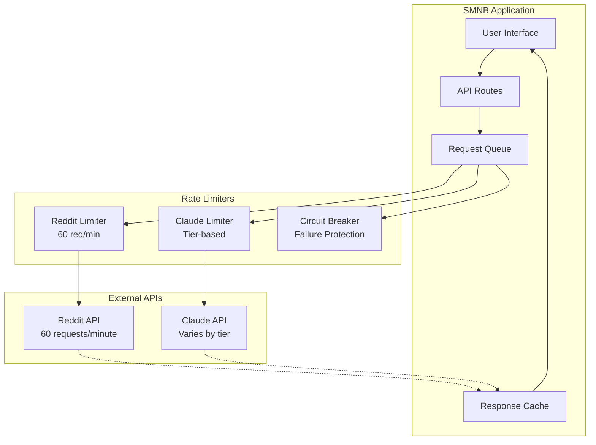

# Rate Limits & Best Practices

> **Sustainable API Usage** - Rate limiting, quotas, and optimization strategies

Understanding and respecting rate limits is crucial for building robust applications that integrate with external APIs. SMNB implements comprehensive rate limiting and optimization strategies.

## 📊 Rate Limit Overview



---

## 🟠 Reddit API Rate Limits

### **Official Limits**

| Authentication | Requests per Minute | Notes |
|---------------|--------------------| ------|
| **Authenticated** | 60 | OAuth2 with valid credentials |
| **Unauthenticated** | 10 | IP-based, very limited |
| **App-only** | 60 | Client credentials flow |

### **Rate Limit Headers**

Reddit includes rate limit information in response headers:

```http
X-RateLimit-Used: 45
X-RateLimit-Remaining: 15  
X-RateLimit-Reset: 1703875260
X-RateLimit-Reset-Timestamp: 1703875260
```

### **Implementation**

```typescript
// Reddit Rate Limiter
class RedditRateLimiter {
  private requests: number[] = [];
  private readonly maxRequests = 60;
  private readonly windowMs = 60 * 1000; // 1 minute
  private isBlocked = false;
  private blockUntil = 0;
  
  async checkRateLimit(): Promise<{ allowed: boolean; waitTime?: number }> {
    const now = Date.now();
    
    // Check if we're in a blocked state
    if (this.isBlocked && now < this.blockUntil) {
      return {
        allowed: false,
        waitTime: Math.ceil((this.blockUntil - now) / 1000)
      };
    } else if (this.isBlocked && now >= this.blockUntil) {
      // Reset block state
      this.isBlocked = false;
      this.requests = [];
    }
    
    // Remove old requests outside the window
    this.requests = this.requests.filter(time => now - time < this.windowMs);
    
    // Check if we can make a request
    if (this.requests.length >= this.maxRequests) {
      const oldestRequest = Math.min(...this.requests);
      const waitTime = Math.ceil((this.windowMs - (now - oldestRequest)) / 1000);
      
      return {
        allowed: false,
        waitTime
      };
    }
    
    // Add current request
    this.requests.push(now);
    return { allowed: true };
  }
  
  // Handle 429 responses
  handleRateLimitError(retryAfter?: number) {
    this.isBlocked = true;
    this.blockUntil = Date.now() + (retryAfter ? retryAfter * 1000 : 60000);
    console.warn(`🚫 Reddit rate limit hit. Blocked until ${new Date(this.blockUntil).toISOString()}`);
  }
  
  getStatus() {
    const now = Date.now();
    const recentRequests = this.requests.filter(time => now - time < this.windowMs);
    
    return {
      requestsInWindow: recentRequests.length,
      remainingRequests: this.maxRequests - recentRequests.length,
      windowResetIn: this.windowMs - (now - Math.min(...recentRequests)),
      isBlocked: this.isBlocked,
      blockUntil: this.isBlocked ? new Date(this.blockUntil).toISOString() : null
    };
  }
}

const redditLimiter = new RedditRateLimiter();

// Usage in API route
export async function GET(request: NextRequest) {
  // Check rate limit before making request
  const rateCheck = await redditLimiter.checkRateLimit();
  
  if (!rateCheck.allowed) {
    return NextResponse.json(
      {
        success: false,
        error: `Rate limit exceeded. Try again in ${rateCheck.waitTime} seconds.`,
        code: 'REDDIT_RATE_LIMIT',
        retryAfter: rateCheck.waitTime
      },
      { status: 429 }
    );
  }
  
  try {
    const response = await redditAPI.fetchPosts(subreddit);
    return NextResponse.json({ success: true, posts: response });
  } catch (error) {
    if (error.status === 429) {
      const retryAfter = error.headers?.['retry-after'];
      redditLimiter.handleRateLimitError(retryAfter);
      
      return NextResponse.json(
        {
          success: false,
          error: 'Reddit API rate limit exceeded',
          code: 'REDDIT_RATE_LIMIT_EXTERNAL',
          retryAfter: retryAfter || 60
        },
        { status: 429 }
      );
    }
    throw error;
  }
}
```

### **Batch Request Optimization**

```typescript
// Optimize batch requests to stay within rate limits
export async function POST(request: NextRequest) {
  const { subreddits, sort = 'hot', limit = 5 } = await request.json();
  
  if (!Array.isArray(subreddits) || subreddits.length === 0) {
    return NextResponse.json(
      { success: false, error: 'subreddits must be a non-empty array' },
      { status: 400 }
    );
  }
  
  // Limit batch size to respect rate limits
  const maxBatchSize = 10; // Conservative limit
  if (subreddits.length > maxBatchSize) {
    return NextResponse.json(
      { 
        success: false, 
        error: `Batch size limited to ${maxBatchSize} subreddits`,
        code: 'BATCH_SIZE_EXCEEDED'
      },
      { status: 400 }
    );
  }
  
  const results: any[] = [];
  const errors: any[] = [];
  
  // Process requests sequentially with rate limiting
  for (const subreddit of subreddits) {
    const rateCheck = await redditLimiter.checkRateLimit();
    
    if (!rateCheck.allowed) {
      errors.push({
        subreddit,
        error: `Rate limit exceeded. Wait ${rateCheck.waitTime}s`,
        code: 'RATE_LIMITED'
      });
      continue;
    }
    
    try {
      const response = await redditAPI.fetchPosts(subreddit, sort, limit);
      results.push({
        subreddit,
        posts: response.data.children.map((child: any) => child.data),
        count: response.data.children.length
      });
      
      // Add small delay between requests
      await new Promise(resolve => setTimeout(resolve, 1100)); // 1.1 seconds
      
    } catch (error) {
      if (error.status === 429) {
        redditLimiter.handleRateLimitError();
        errors.push({
          subreddit,
          error: 'Reddit API rate limit exceeded',
          code: 'REDDIT_RATE_LIMIT'
        });
      } else {
        errors.push({
          subreddit,
          error: error.message,
          code: 'FETCH_ERROR'
        });
      }
    }
  }
  
  return NextResponse.json({
    success: results.length > 0,
    results,
    errors,
    totalRequested: subreddits.length,
    successful: results.length,
    failed: errors.length
  });
}
```

---

## 🧠 Claude AI Rate Limits

### **Tier-Based Limits**

Claude AI rate limits vary by subscription tier:

| Tier | Requests per Minute | Tokens per Minute | Daily Limit |
|------|--------------------|--------------------|-------------|
| **Free** | 5 | 25,000 | 1,000 requests |
| **Pro** | 1,000 | 400,000 | No daily limit |
| **Team** | 1,000 | 400,000 | No daily limit |

### **Model-Specific Limits**

Different models have different token limits:

```typescript
const MODEL_LIMITS = {
  'claude-3-5-haiku-20241022': {
    maxTokens: 4096,
    inputLimit: 200000,
    costPer1K: {
      input: 0.00025,
      output: 0.00125
    }
  },
  'claude-3-5-sonnet-20241022': {
    maxTokens: 8192,
    inputLimit: 200000,
    costPer1K: {
      input: 0.003,
      output: 0.015
    }
  },
  'claude-3-opus-20240229': {
    maxTokens: 4096,
    inputLimit: 200000,
    costPer1K: {
      input: 0.015,
      output: 0.075
    }
  }
};
```

### **Implementation**

```typescript
// Claude Rate Limiter
class ClaudeRateLimiter {
  private requests: Array<{ timestamp: number; tokens: number }> = [];
  private readonly windowMs = 60 * 1000; // 1 minute
  private maxRequests: number;
  private maxTokens: number;
  
  constructor(tier: 'free' | 'pro' | 'team' = 'free') {
    switch (tier) {
      case 'free':
        this.maxRequests = 5;
        this.maxTokens = 25000;
        break;
      case 'pro':
      case 'team':
        this.maxRequests = 1000;
        this.maxTokens = 400000;
        break;
    }
  }
  
  async checkRateLimit(estimatedTokens: number): Promise<{
    allowed: boolean;
    reason?: string;
    waitTime?: number;
  }> {
    const now = Date.now();
    
    // Remove old requests
    this.requests = this.requests.filter(req => now - req.timestamp < this.windowMs);
    
    // Check request count limit
    if (this.requests.length >= this.maxRequests) {
      const oldestRequest = Math.min(...this.requests.map(r => r.timestamp));
      const waitTime = Math.ceil((this.windowMs - (now - oldestRequest)) / 1000);
      
      return {
        allowed: false,
        reason: 'Request count limit exceeded',
        waitTime
      };
    }
    
    // Check token limit
    const tokenSum = this.requests.reduce((sum, req) => sum + req.tokens, 0);
    if (tokenSum + estimatedTokens > this.maxTokens) {
      return {
        allowed: false,
        reason: 'Token limit exceeded',
        waitTime: 60 // Wait full minute for token window reset
      };
    }
    
    // Add request to tracking
    this.requests.push({ timestamp: now, tokens: estimatedTokens });
    
    return { allowed: true };
  }
  
  getUsage() {
    const now = Date.now();
    const recentRequests = this.requests.filter(req => now - req.timestamp < this.windowMs);
    const totalTokens = recentRequests.reduce((sum, req) => sum + req.tokens, 0);
    
    return {
      requestsUsed: recentRequests.length,
      requestsRemaining: this.maxRequests - recentRequests.length,
      tokensUsed: totalTokens,
      tokensRemaining: this.maxTokens - totalTokens,
      utilizationPercent: {
        requests: (recentRequests.length / this.maxRequests) * 100,
        tokens: (totalTokens / this.maxTokens) * 100
      }
    };
  }
}

const claudeLimiter = new ClaudeRateLimiter('pro'); // Set based on your tier

// Usage in Claude API route
export async function POST(request: NextRequest) {
  const { action, prompt, model = 'claude-3-5-haiku-20241022' } = await request.json();
  
  // Estimate token count
  const estimatedTokens = Math.ceil(prompt.length / 4); // Rough estimate
  
  // Check rate limit
  const rateCheck = await claudeLimiter.checkRateLimit(estimatedTokens);
  
  if (!rateCheck.allowed) {
    return NextResponse.json(
      {
        success: false,
        error: `Claude API rate limit: ${rateCheck.reason}`,
        code: 'CLAUDE_RATE_LIMIT',
        retryAfter: rateCheck.waitTime,
        usage: claudeLimiter.getUsage()
      },
      { status: 429 }
    );
  }
  
  try {
    const response = await anthropic.messages.create({
      model,
      max_tokens: 150,
      messages: [{ role: 'user', content: prompt }]
    });
    
    // Track actual token usage
    const actualTokens = response.usage.input_tokens + response.usage.output_tokens;
    await trackTokenUsage({
      model,
      action,
      input_tokens: response.usage.input_tokens,
      output_tokens: response.usage.output_tokens,
      total_tokens: actualTokens,
      estimated_cost: calculateCost(response.usage, model)
    });
    
    return NextResponse.json({ success: true, response, usage: response.usage });
  } catch (error) {
    if (error.status === 429) {
      return NextResponse.json(
        {
          success: false,
          error: 'Claude API rate limit exceeded',
          code: 'CLAUDE_RATE_LIMIT_EXTERNAL',
          retryAfter: 60
        },
        { status: 429 }
      );
    }
    throw error;
  }
}
```

### **Cost Tracking**

```typescript
// Track costs to avoid bill shock
class CostTracker {
  private costs: Array<{ timestamp: number; cost: number; model: string }> = [];
  
  addUsage(usage: {
    model: string;
    input_tokens: number;
    output_tokens: number;
  }) {
    const modelLimits = MODEL_LIMITS[usage.model];
    if (!modelLimits) return;
    
    const inputCost = (usage.input_tokens / 1000) * modelLimits.costPer1K.input;
    const outputCost = (usage.output_tokens / 1000) * modelLimits.costPer1K.output;
    const totalCost = inputCost + outputCost;
    
    this.costs.push({
      timestamp: Date.now(),
      cost: totalCost,
      model: usage.model
    });
    
    // Alert on high usage
    const dailyCost = this.getDailyCost();
    if (dailyCost > 50) { // $50 daily limit
      console.warn(`💰 HIGH USAGE ALERT: Daily cost is $${dailyCost.toFixed(2)}`);
    }
  }
  
  getDailyCost(): number {
    const oneDayAgo = Date.now() - (24 * 60 * 60 * 1000);
    return this.costs
      .filter(cost => cost.timestamp > oneDayAgo)
      .reduce((sum, cost) => sum + cost.cost, 0);
  }
  
  getMonthlyCost(): number {
    const oneMonthAgo = Date.now() - (30 * 24 * 60 * 60 * 1000);
    return this.costs
      .filter(cost => cost.timestamp > oneMonthAgo)
      .reduce((sum, cost) => sum + cost.cost, 0);
  }
  
  getCostByModel() {
    const oneDayAgo = Date.now() - (24 * 60 * 60 * 1000);
    const recentCosts = this.costs.filter(cost => cost.timestamp > oneDayAgo);
    
    return recentCosts.reduce((breakdown, cost) => {
      breakdown[cost.model] = (breakdown[cost.model] || 0) + cost.cost;
      return breakdown;
    }, {} as Record<string, number>);
  }
}

const costTracker = new CostTracker();
```

---

## ⚡ Optimization Strategies

### 1. **Request Queuing**

```typescript
// Queue system for managing API requests
class RequestQueue {
  private queue: Array<{
    fn: () => Promise<any>;
    resolve: (value: any) => void;
    reject: (error: any) => void;
    priority: number;
  }> = [];
  
  private processing = false;
  private concurrent = 0;
  private maxConcurrent = 3;
  
  async add<T>(
    fn: () => Promise<T>, 
    priority: number = 0
  ): Promise<T> {
    return new Promise((resolve, reject) => {
      this.queue.push({ fn, resolve, reject, priority });
      this.queue.sort((a, b) => b.priority - a.priority); // Higher priority first
      this.processQueue();
    });
  }
  
  private async processQueue() {
    if (this.processing || this.concurrent >= this.maxConcurrent || this.queue.length === 0) {
      return;
    }
    
    this.processing = true;
    
    while (this.queue.length > 0 && this.concurrent < this.maxConcurrent) {
      const item = this.queue.shift()!;
      this.concurrent++;
      
      this.executeRequest(item).finally(() => {
        this.concurrent--;
        this.processQueue(); // Continue processing
      });
    }
    
    this.processing = false;
  }
  
  private async executeRequest(item: any) {
    try {
      const result = await item.fn();
      item.resolve(result);
    } catch (error) {
      item.reject(error);
    }
  }
  
  getStatus() {
    return {
      queueSize: this.queue.length,
      concurrent: this.concurrent,
      maxConcurrent: this.maxConcurrent
    };
  }
}

const apiQueue = new RequestQueue();

// Usage
const fetchRedditPosts = async (subreddit: string) => {
  return apiQueue.add(
    () => redditAPI.fetchPosts(subreddit),
    subreddit === 'worldnews' ? 10 : 5 // Higher priority for important subreddits
  );
};
```

### 2. **Smart Caching**

```typescript
// Intelligent caching with TTL and invalidation
class SmartCache {
  private cache = new Map<string, {
    data: any;
    timestamp: number;
    ttl: number;
    accessCount: number;
    lastAccess: number;
  }>();
  
  set(key: string, data: any, ttl: number = 300000) { // 5 minutes default
    this.cache.set(key, {
      data,
      timestamp: Date.now(),
      ttl,
      accessCount: 0,
      lastAccess: Date.now()
    });
    
    // Clean old entries periodically
    if (this.cache.size > 1000) {
      this.cleanup();
    }
  }
  
  get(key: string): any | null {
    const item = this.cache.get(key);
    
    if (!item) return null;
    
    // Check if expired
    if (Date.now() - item.timestamp > item.ttl) {
      this.cache.delete(key);
      return null;
    }
    
    // Update access stats
    item.accessCount++;
    item.lastAccess = Date.now();
    
    return item.data;
  }
  
  has(key: string): boolean {
    return this.get(key) !== null;
  }
  
  private cleanup() {
    const now = Date.now();
    const entriesToRemove: string[] = [];
    
    for (const [key, item] of this.cache.entries()) {
      // Remove expired items
      if (now - item.timestamp > item.ttl) {
        entriesToRemove.push(key);
      }
      // Remove least recently used items if cache is large
      else if (now - item.lastAccess > 60 * 60 * 1000) { // 1 hour
        entriesToRemove.push(key);
      }
    }
    
    entriesToRemove.forEach(key => this.cache.delete(key));
  }
  
  getStats() {
    const items = Array.from(this.cache.values());
    return {
      size: this.cache.size,
      totalAccesses: items.reduce((sum, item) => sum + item.accessCount, 0),
      avgAccessesPerItem: items.length > 0 
        ? items.reduce((sum, item) => sum + item.accessCount, 0) / items.length 
        : 0,
      oldestItem: Math.min(...items.map(item => item.timestamp)),
      newestItem: Math.max(...items.map(item => item.timestamp))
    };
  }
}

const cache = new SmartCache();

// Usage with dynamic TTL based on content type
const getCachedRedditPosts = async (subreddit: string, sort: string) => {
  const cacheKey = `reddit:${subreddit}:${sort}`;
  
  // Check cache first
  const cached = cache.get(cacheKey);
  if (cached) {
    console.log(`📦 Cache hit for ${cacheKey}`);
    return cached;
  }
  
  // Fetch from API
  console.log(`🌐 Cache miss for ${cacheKey}, fetching...`);
  const posts = await fetchRedditPosts(subreddit);
  
  // Cache with appropriate TTL
  const ttl = sort === 'hot' ? 300000 : 600000; // Hot: 5 min, Others: 10 min
  cache.set(cacheKey, posts, ttl);
  
  return posts;
};
```

### 3. **Batch Processing**

```typescript
// Batch multiple requests efficiently
class BatchProcessor {
  private batches = new Map<string, {
    requests: Array<{
      resolve: (value: any) => void;
      reject: (error: any) => void;
      params: any;
    }>;
    timeout: NodeJS.Timeout;
  }>();
  
  private readonly batchDelay = 100; // 100ms batching window
  private readonly maxBatchSize = 10;
  
  async process<T>(
    batchKey: string,
    params: any,
    processor: (batchParams: any[]) => Promise<T[]>
  ): Promise<T> {
    return new Promise((resolve, reject) => {
      let batch = this.batches.get(batchKey);
      
      if (!batch) {
        batch = {
          requests: [],
          timeout: setTimeout(() => this.executeBatch(batchKey, processor), this.batchDelay)
        };
        this.batches.set(batchKey, batch);
      }
      
      batch.requests.push({ resolve, reject, params });
      
      // Execute immediately if batch is full
      if (batch.requests.length >= this.maxBatchSize) {
        clearTimeout(batch.timeout);
        this.executeBatch(batchKey, processor);
      }
    });
  }
  
  private async executeBatch<T>(
    batchKey: string,
    processor: (batchParams: any[]) => Promise<T[]>
  ) {
    const batch = this.batches.get(batchKey);
    if (!batch) return;
    
    this.batches.delete(batchKey);
    
    try {
      const params = batch.requests.map(req => req.params);
      const results = await processor(params);
      
      // Resolve each request with its corresponding result
      batch.requests.forEach((request, index) => {
        request.resolve(results[index]);
      });
    } catch (error) {
      // Reject all requests with the error
      batch.requests.forEach(request => {
        request.reject(error);
      });
    }
  }
}

const batchProcessor = new BatchProcessor();

// Usage for batching Claude requests
const analyzeContentBatch = async (contents: string[]) => {
  const responses = await Promise.all(
    contents.map(content => 
      anthropic.messages.create({
        model: 'claude-3-5-haiku-20241022',
        max_tokens: 50,
        messages: [{ role: 'user', content: `Analyze: ${content}` }]
      })
    )
  );
  
  return responses.map(response => response.content[0].text);
};

// Individual requests get batched automatically
const analyzeContent = async (content: string) => {
  return batchProcessor.process(
    'claude-analysis',
    content,
    analyzeContentBatch
  );
};
```

---

## 📊 Monitoring & Alerts

### **Rate Limit Dashboard**

```typescript
// Real-time rate limit monitoring
export const getRateLimitStatus = query({
  handler: async () => {
    const redditStatus = redditLimiter.getStatus();
    const claudeUsage = claudeLimiter.getUsage();
    const queueStatus = apiQueue.getStatus();
    const cacheStats = cache.getStats();
    
    return {
      reddit: {
        ...redditStatus,
        healthStatus: redditStatus.remainingRequests > 10 ? 'healthy' : 'warning'
      },
      claude: {
        ...claudeUsage,
        healthStatus: claudeUsage.utilizationPercent.requests < 80 ? 'healthy' : 'warning'
      },
      queue: {
        ...queueStatus,
        healthStatus: queueStatus.queueSize < 50 ? 'healthy' : 'warning'
      },
      cache: {
        ...cacheStats,
        hitRate: cacheStats.totalAccesses > 0 
          ? (cacheStats.totalAccesses / (cacheStats.totalAccesses + cacheStats.size)) * 100 
          : 0
      },
      overall: {
        status: 'operational',
        timestamp: new Date().toISOString()
      }
    };
  }
});

// Usage in React component
function RateLimitDashboard() {
  const status = useQuery(api.monitoring.getRateLimitStatus);
  
  return (
    <div className="grid grid-cols-2 gap-4">
      <div className="p-4 border rounded">
        <h3>Reddit API</h3>
        <div className={`text-${status?.reddit.healthStatus === 'healthy' ? 'green' : 'yellow'}-600`}>
          {status?.reddit.remainingRequests} / 60 requests remaining
        </div>
        <div className="text-sm text-gray-600">
          Reset in: {Math.ceil(status?.reddit.windowResetIn / 1000)}s
        </div>
      </div>
      
      <div className="p-4 border rounded">
        <h3>Claude API</h3>
        <div className={`text-${status?.claude.healthStatus === 'healthy' ? 'green' : 'yellow'}-600`}>
          {status?.claude.requestsRemaining} requests remaining
        </div>
        <div className="text-sm text-gray-600">
          Tokens: {status?.claude.tokensRemaining} remaining
        </div>
      </div>
    </div>
  );
}
```

### **Automated Alerts**

```typescript
// Alert system for rate limit issues
class AlertSystem {
  private alerts: Array<{
    id: string;
    type: 'warning' | 'error';
    message: string;
    timestamp: number;
    resolved: boolean;
  }> = [];
  
  checkThresholds() {
    const redditStatus = redditLimiter.getStatus();
    const claudeUsage = claudeLimiter.getUsage();
    
    // Reddit rate limit warnings
    if (redditStatus.remainingRequests < 5) {
      this.createAlert('warning', 'Reddit API rate limit nearly exhausted');
    }
    
    if (redditStatus.isBlocked) {
      this.createAlert('error', 'Reddit API rate limit exceeded - requests blocked');
    }
    
    // Claude usage warnings
    if (claudeUsage.utilizationPercent.requests > 90) {
      this.createAlert('warning', 'Claude API request limit at 90% utilization');
    }
    
    if (claudeUsage.utilizationPercent.tokens > 95) {
      this.createAlert('error', 'Claude API token limit at 95% utilization');
    }
    
    // Cost alerts
    const dailyCost = costTracker.getDailyCost();
    if (dailyCost > 25) {
      this.createAlert('warning', `Daily API costs at $${dailyCost.toFixed(2)}`);
    }
    
    if (dailyCost > 50) {
      this.createAlert('error', `Daily API costs exceeded $50: $${dailyCost.toFixed(2)}`);
    }
  }
  
  private createAlert(type: 'warning' | 'error', message: string) {
    const alertId = `${type}_${Date.now()}`;
    
    // Don't duplicate recent alerts
    const recentAlert = this.alerts.find(alert => 
      alert.message === message && 
      !alert.resolved && 
      Date.now() - alert.timestamp < 300000 // 5 minutes
    );
    
    if (recentAlert) return;
    
    this.alerts.push({
      id: alertId,
      type,
      message,
      timestamp: Date.now(),
      resolved: false
    });
    
    console.log(`🚨 ${type.toUpperCase()}: ${message}`);
    
    // Send to external alerting system (Slack, email, etc.)
    this.sendExternalAlert(type, message);
  }
  
  private async sendExternalAlert(type: string, message: string) {
    // Example: Send to Slack webhook
    try {
      await fetch(process.env.SLACK_WEBHOOK_URL!, {
        method: 'POST',
        headers: { 'Content-Type': 'application/json' },
        body: JSON.stringify({
          text: `${type === 'error' ? '🚨' : '⚠️'} SMNB API Alert: ${message}`,
          channel: '#api-alerts'
        })
      });
    } catch (error) {
      console.error('Failed to send external alert:', error);
    }
  }
  
  getActiveAlerts() {
    return this.alerts.filter(alert => !alert.resolved);
  }
  
  resolveAlert(alertId: string) {
    const alert = this.alerts.find(a => a.id === alertId);
    if (alert) {
      alert.resolved = true;
    }
  }
}

const alertSystem = new AlertSystem();

// Run threshold checks every minute
setInterval(() => {
  alertSystem.checkThresholds();
}, 60000);
```

---

## 📋 Best Practices Summary

### ✅ **Do**

- **Implement rate limiting** before hitting external APIs
- **Use exponential backoff** for retry logic
- **Cache responses** appropriately based on data freshness needs
- **Monitor usage patterns** and set up alerts
- **Batch requests** when possible to maximize efficiency
- **Track costs** to avoid unexpected bills
- **Respect 429 responses** and honor retry-after headers
- **Use circuit breakers** to prevent cascade failures

### ❌ **Don't**

- **Ignore rate limit headers** from APIs
- **Retry immediately** after rate limit errors
- **Make unnecessary requests** - always check cache first
- **Exceed batch limits** - respect API quotas
- **Ignore cost implications** of API usage
- **Block user interface** while waiting for rate limits
- **Use fixed delays** - implement intelligent backoff
- **Skip monitoring** - always track usage patterns

### 📊 **Performance Targets**

- **Reddit API**: < 55 requests per minute (leave buffer)
- **Claude API**: < 80% of tier limits
- **Cache hit rate**: > 60% for Reddit data
- **Response time**: < 2 seconds for cached data
- **Queue size**: < 20 pending requests
- **Error rate**: < 5% due to rate limiting

---

## 🔗 Related Resources

- **[Reddit API Documentation](https://www.reddit.com/dev/api/)** - Official rate limit documentation
- **[Anthropic API Limits](https://docs.anthropic.com/en/api/rate-limits)** - Claude API rate limiting
- **[Error Handling Guide](./error-handling.md)** - Comprehensive error management
- **[Authentication Guide](./authentication.md)** - API key setup and security

---

*For troubleshooting rate limit issues, see [Error Handling Guide](./error-handling.md)*