# SMNB Data Flow Architecture - Mermaid Diagram

## Complete System Flow (Top to Bottom)

```mermaid
flowchart TD
    %% User Entry Point
    START(("User Visits<br/>localhost:8888"))
    AUTH["🔐 Clerk OAuth<br/>Google/GitHub"]
    DASHBOARD["📊 Dashboard Landing<br/>/dashboard"]
    
    START --> AUTH
    AUTH --> DASHBOARD
    
    %% User Actions
    DASHBOARD --> ACTION1["👤 Action 1:<br/>Start Live Feed"]
    DASHBOARD --> ACTION2["📈 Action 2:<br/>View Sentiment"]
    DASHBOARD --> ACTION3["📰 Action 3:<br/>Click News Item"]
    
    %% ===== ACTION 1: START LIVE FEED =====
    subgraph LIVE_FEED ["🔴 LIVE FEED PIPELINE (2-6 seconds first posts)"]
        direction TB
        
        WS["WebSocket<br/>Connection<br/>Established"]
        REDDIT_INIT["Reddit API<br/>Session Init"]
        QUEUE["Subreddit Queue<br/>r/news, r/worldnews<br/>r/technology"]
        
        WS --> REDDIT_INIT
        REDDIT_INIT --> QUEUE
        
        %% Stage 1: Data Ingestion
        subgraph STAGE1 ["Stage 1: INGESTION (100-300ms)"]
            FETCH["Reddit API Fetch<br/>Raw JSON"]
            PARSE["Parse to<br/>Structured Data"]
            RAW["Post ID + Content<br/>+ Metadata + Engagement"]
            
            FETCH --> PARSE --> RAW
        end
        
        QUEUE --> STAGE1
        
        %% Stage 2: Sentiment Analysis
        subgraph STAGE2 ["Stage 2: SENTIMENT (800-1200ms)"]
            CLAUDE["Anthropic Claude<br/>Haiku 4.5 API"]
            NLP["NLP Analysis<br/>Text → Vector"]
            SENT_OUT["Sentiment Score: -1 to +1<br/>Confidence: 0 to 1"]
            
            CLAUDE --> NLP --> SENT_OUT
        end
        
        RAW --> STAGE2
        
        %% Stage 3: Quality Scoring
        subgraph STAGE3 ["Stage 3: QUALITY (50-100ms)"]
            MULTI["Multi-factor<br/>Algorithm"]
            CRED["Source Credibility<br/>Content Depth"]
            QUAL_OUT["Quality Score: 0-100<br/>Tier Classification"]
            
            MULTI --> CRED --> QUAL_OUT
        end
        
        SENT_OUT --> STAGE3
        
        %% Stage 4: Priority Classification
        subgraph STAGE4 ["Stage 4: PRIORITY (100-200ms)"]
            VEL["Velocity &<br/>Trend Detection"]
            ENG["Engagement Rate<br/>Analysis"]
            PRIOR_OUT["Priority: 1-5<br/>Trending Flag"]
            
            VEL --> ENG --> PRIOR_OUT
        end
        
        QUAL_OUT --> STAGE4
        
        %% Stage 5: Categorization
        subgraph STAGE5 ["Stage 5: CATEGORIZATION (200-400ms)"]
            TOPIC["Topic Modeling<br/>+ NLP"]
            ENTITY["Entity Extraction<br/>People/Companies"]
            CAT_OUT["Tags + Entities<br/>+ Sector Labels"]
            
            TOPIC --> ENTITY --> CAT_OUT
        end
        
        PRIOR_OUT --> STAGE5
        
        %% Stage 6: Market Correlation
        subgraph STAGE6 ["Stage 6: MARKET (150-300ms)"]
            MNQ["MNQ1 Index<br/>Live Data"]
            CORR["Correlation<br/>Calculation"]
            IMPACT["Correlation Coefficient<br/>Predicted Delta"]
            
            MNQ --> CORR --> IMPACT
        end
        
        CAT_OUT --> STAGE6
        
        %% Stage 7: Threading
        subgraph STAGE7 ["Stage 7: THREADING (100-250ms)"]
            SIM["Similarity<br/>Detection"]
            FINGER["Content<br/>Fingerprint"]
            THREAD_OUT["Thread ID<br/>Related Links"]
            
            SIM --> FINGER --> THREAD_OUT
        end
        
        IMPACT --> STAGE7
        
        %% Database Write
        DB_WRITE[("💾 Convex DB Write<br/>50ms")]
        THREAD_OUT --> DB_WRITE
        
        %% Real-time Push
        WS_PUSH["📡 WebSocket Push<br/>20ms"]
        DB_WRITE --> WS_PUSH
        
        %% Client Render
        UI_RENDER["🖥️ Client UI Render<br/>Instant"]
        WS_PUSH --> UI_RENDER
    end
    
    ACTION1 --> LIVE_FEED
    
    %% Background Analytics
    LIVE_FEED -.-> BG_ANALYTICS["📊 Background Analytics<br/>MNQ1 Correlation<br/>Aggregate Metrics<br/>Alert Checks"]
    
    %% ===== ACTION 2: VIEW SENTIMENT ANALYSIS =====
    subgraph SENTIMENT_VIEW ["📈 SENTIMENT ANALYSIS VIEW (600-900ms total)"]
        direction TB
        
        CONV_QUERY["Convex Query<br/>getPosts(1hr window)<br/>100-300ms"]
        MNQ_QUERY["MNQ1 API Query<br/>getHistoricalData<br/>100-300ms"]
        
        AGG["Data Aggregation<br/>Weighted Sentiment<br/>50ms"]
        
        CONV_QUERY --> AGG
        MNQ_QUERY --> AGG
        
        PEARSON["Pearson Correlation<br/>r coefficient<br/>24hr rolling window<br/>100-300ms"]
        
        AGG --> PEARSON
        
        VIZ["Visualization<br/>Chart.js Render<br/>Dual-axis Graph<br/>200ms"]
        
        PEARSON --> VIZ
        
        DISPLAY["📊 Display Components<br/>Score: +0.42<br/>Impact: +0.15%<br/>Trend: ↑<br/>Confidence: ±0.08<br/>300ms"]
        
        VIZ --> DISPLAY
        
        REALTIME["Real-time Updates<br/>Every 30 seconds<br/>WebSocket subscription"]
        
        DISPLAY -.-> REALTIME
    end
    
    ACTION2 --> SENTIMENT_VIEW
    
    %% ===== ACTION 3: CLICK NEWS ITEM =====
    subgraph NEWS_ITEM ["📰 NEWS ITEM DETAIL VIEW (250-500ms)"]
        direction TB
        
        ROUTE["Route Change<br/>/post/[id]<br/>10ms"]
        
        GET_POST["Convex Query<br/>getPostById()<br/>50-100ms"]
        
        ROUTE --> GET_POST
        
        GET_THREAD["Convex Query<br/>getRelatedPosts()<br/>100-200ms"]
        
        GET_POST --> GET_THREAD
        
        RENDER_DETAIL["Render Detail View<br/>100-200ms"]
        
        GET_THREAD --> RENDER_DETAIL
        
        subgraph DETAIL_DISPLAY ["Detail Display Sections"]
            direction TB
            
            SEC1["1. Original Content<br/>Subreddit + Metadata<br/>Title + Body<br/>Engagement Stats"]
            SEC2["2. Sentiment Analysis<br/>Overall Score<br/>Paragraph Breakdown<br/>Key Phrases<br/>Emotion Metrics"]
            SEC3["3. Quality Metrics<br/>Credibility: 85/100<br/>Content Depth: 72/100<br/>Engagement: 91/100"]
            SEC4["4. Market Impact<br/>MNQ1 Correlation<br/>Historical Comparisons<br/>Sector Relevance<br/>Time Decay"]
            SEC5["5. Related Stories<br/>Thread ID<br/>Similar Posts<br/>Timeline View"]
            
            SEC1 --> SEC2 --> SEC3 --> SEC4 --> SEC5
        end
        
        RENDER_DETAIL --> DETAIL_DISPLAY
        
        LOG_INT["Log Interaction<br/>user_interactions table<br/>20ms (async)"]
        UPDATE_METRICS["Update Metrics<br/>viewCount++<br/>engagement↑<br/>20ms"]
        
        RENDER_DETAIL -.-> LOG_INT
        LOG_INT --> UPDATE_METRICS
        
        PREFETCH["Predictive Cache<br/>Top 2 Related Posts<br/>Browser Cache"]
        
        DETAIL_DISPLAY -.-> PREFETCH
    end
    
    ACTION3 --> NEWS_ITEM
    
    %% ===== WELCOME PAGE TICKER ARCHITECTURE =====
    subgraph TICKER ["🎯 WELCOME PAGE TICKER (Real-time)"]
        direction TB
        
        TICKER_QUERY["Rolling 1hr Window<br/>150 posts collected"]
        QUAL_FILTER["Quality Filter<br/>>50 score<br/>120 posts pass"]
        
        TICKER_QUERY --> QUAL_FILTER
        
        WEIGHT_CALC["Weight Calculation<br/>Quality: 40%<br/>Engagement: 30%<br/>Credibility: 30%"]
        
        QUAL_FILTER --> WEIGHT_CALC
        
        FINAL_SENT["Final Sentiment<br/>+0.42"]
        
        WEIGHT_CALC --> FINAL_SENT
        
        PERCENT_CALC["Percentage Display<br/>(0.42 × 0.68) / 150<br/>= 0.19% impact<br/>(~28.5 index points)"]
        
        FINAL_SENT --> PERCENT_CALC
        
        TICKER_DISPLAY["📊 Ticker Update<br/>+0.42 (+0.19%)"]
        
        PERCENT_CALC --> TICKER_DISPLAY
    end
    
    DASHBOARD -.-> TICKER
    
    %% ===== NEWS RANKING ALGORITHM =====
    subgraph RANKING ["🏆 NEWS RANKING ALGORITHM (Continuous)"]
        direction TB
        
        ALL_POSTS["All Posts<br/>Collected"]
        
        subgraph FACTORS ["Multi-Factor Scoring"]
            F1["Quality: 35%<br/>Source + Depth + Accuracy"]
            F2["Sentiment: 25%<br/>|score| absolute value"]
            F3["Market: 20%<br/>Keyword × Sector"]
            F4["Temporal: 10%<br/>e^(-0.1t)"]
            F5["Engagement: 10%<br/>Δengagement/Δtime"]
        end
        
        ALL_POSTS --> FACTORS
        
        COMPOSITE["Composite Score<br/>Weighted Sum"]
        
        FACTORS --> COMPOSITE
        
        SORT["Sort by Score<br/>Highest First"]
        
        COMPOSITE --> SORT
        
        TOP_N["Top 20 Posts<br/>Display"]
        
        SORT --> TOP_N
    end
    
    LIVE_FEED -.-> RANKING
    
    %% ===== VS NEWS SCORE =====
    subgraph VS_NEWS ["📊 VERSUS NEWS SCORE (Every 15min)"]
        direction TB
        
        SMNB_SCORE["SMNB Sentiment<br/>+0.65<br/>Reddit Aggregated"]
        TRAD_SCORE["Traditional Media<br/>+0.32<br/>Reuters/Bloomberg/CNBC"]
        
        DIVERGENCE["Divergence Analysis<br/>Δ = +0.33"]
        
        SMNB_SCORE --> DIVERGENCE
        TRAD_SCORE --> DIVERGENCE
        
        SIGNAL{"Signal Detection"}
        
        DIVERGENCE --> SIGNAL
        
        BULL["Δ > +0.25<br/>Early Bullish Signal"]
        BEAR["Δ < -0.25<br/>Risk Indicator"]
        CONSENSUS["│Δ│< 0.10<br/>Consensus"]
        
        SIGNAL -->|"Δ +0.33"| BULL
        SIGNAL -.-> BEAR
        SIGNAL -.-> CONSENSUS
    end
    
    SENTIMENT_VIEW -.-> VS_NEWS
    
    %% ===== SYSTEM MONITORING =====
    subgraph MONITORING ["🔍 SYSTEM MONITORING & KPIs"]
        direction TB
        
        KPI1["Enrichment Latency<br/>Target: <3s p95<br/>Alert: >5s for 5min"]
        KPI2["Correlation Accuracy<br/>Target: r >0.65<br/>Alert: <0.50 for 1hr"]
        KPI3["WebSocket Latency<br/>Target: <100ms<br/>Alert: >500ms"]
        KPI4["Query Performance<br/>Target: <200ms p95<br/>Alert: >1s"]
        KPI5["AI API Success<br/>Target: >99%<br/>Alert: <95%"]
        KPI6["Update Freshness<br/>Target: <45s p90<br/>Alert: >2min"]
        
        KPI1 ~~~ KPI2 ~~~ KPI3 ~~~ KPI4 ~~~ KPI5 ~~~ KPI6
    end
    
    LIVE_FEED -.-> MONITORING
    SENTIMENT_VIEW -.-> MONITORING
    
    %% ===== TECHNOLOGY STACK =====
    subgraph TECH ["🛠️ TECHNOLOGY STACK"]
        direction LR
        
        FRONTEND["Frontend<br/>Next.js 14<br/>React 18<br/>TailwindCSS"]
        BACKEND["Backend<br/>Convex<br/>Real-time DB<br/>Serverless"]
        AI["AI Processing<br/>Anthropic<br/>Claude Haiku 4.5<br/>(Oct 2025)"]
        MARKET["Market Data<br/>Finlight.me<br/>MNQ1 Futures"]
        
        FRONTEND ~~~ BACKEND ~~~ AI ~~~ MARKET
    end
    
    %% ===== DATA RETENTION =====
    subgraph RETENTION ["💾 DATA RETENTION & ARCHIVAL"]
        direction TB
        
        HOT["Hot Storage (30 days)<br/>Active Posts"]
        WARM["Warm Storage (1 year)<br/>Historical Posts"]
        COLD["Cold Archive (5 years)<br/>S3 Glacier"]
        
        HOT --> WARM --> COLD
        
        ARCHIVAL["Archival Process<br/>Daily: 1hr aggregation<br/>Weekly: Warm migration<br/>Monthly: Statistics<br/>Quarterly: S3 archive"]
        
        COLD -.-> ARCHIVAL
    end
    
    %% Styling
    classDef userAction fill:#4CAF50,stroke:#2E7D32,stroke-width:3px,color:#fff
    classDef enrichment fill:#2196F3,stroke:#1565C0,stroke-width:2px,color:#fff
    classDef database fill:#9C27B0,stroke:#6A1B9A,stroke-width:2px,color:#fff
    classDef analytics fill:#FF9800,stroke:#E65100,stroke-width:2px,color:#fff
    classDef realtime fill:#F44336,stroke:#C62828,stroke-width:2px,color:#fff
    classDef system fill:#607D8B,stroke:#37474F,stroke-width:2px,color:#fff
    
    class ACTION1,ACTION2,ACTION3 userAction
    class STAGE1,STAGE2,STAGE3,STAGE4,STAGE5,STAGE6,STAGE7 enrichment
    class DB_WRITE,CONV_QUERY,MNQ_QUERY,GET_POST database
    class SENTIMENT_VIEW,PEARSON,VIZ,RANKING analytics
    class WS_PUSH,UI_RENDER,REALTIME,TICKER realtime
    class MONITORING,TECH,RETENTION system
```



## Timing Summary

| Stage | Component | Latency |
|-------|-----------|---------|
| **Action 1: Start Live Feed** | | |
| 1 | WebSocket Connection | 2-6 seconds (first posts) |
| 2 | Enrichment Pipeline | 1.5-2.8 seconds per post |
| 3 | Database Write | 50ms |
| 4 | WebSocket Push | 20ms |
| 5 | Client Render | Instant |
| **Total** | **User Click → Display** | **3.7-8.9 seconds** |
| | | |
| **Action 2: View Sentiment** | | |
| 1 | Convex Query | 100-300ms |
| 2 | MNQ1 Query | 100-300ms |
| 3 | Data Aggregation | 50ms |
| 4 | Correlation Calc | 100-300ms |
| 5 | Visualization | 200ms |
| 6 | Display Components | 300ms |
| **Total** | **Click → Display** | **600-900ms** |
| | | |
| **Action 3: Click News Item** | | |
| 1 | Route Change | 10ms |
| 2 | Get Post Query | 50-100ms |
| 3 | Get Thread Query | 100-200ms |
| 4 | Render Detail | 100-200ms |
| **Total** | **Click → Display** | **260-510ms** |

## Key Performance Indicators

| KPI | Target | Measurement | Alert Threshold |
|-----|--------|-------------|-----------------|
| Enrichment Latency | <3s p95 | Ingest → DB write | >5s for 5min |
| Correlation Accuracy | r >0.65 | 24hr rolling window | <0.50 for 1hr |
| WebSocket Latency | <100ms | Server → Client | >500ms |
| Query Performance | <200ms p95 | DB query execution | >1s |
| AI API Success Rate | >99% | Success / Total | <95% |
| Update Freshness | <45s p90 | Reddit → SMNB | >2min |

## Data Flow Patterns

### 7-Stage Enrichment Pipeline
1. **Ingestion** (100-300ms): Reddit API → Structured Data
2. **Sentiment** (800-1200ms): Claude Haiku 4.5 → Score + Confidence
3. **Quality** (50-100ms): Multi-factor → 0-100 Score
4. **Priority** (100-200ms): Velocity Detection → 1-5 + Trending Flag
5. **Categorization** (200-400ms): NLP → Tags + Entities + Sectors
6. **Market Correlation** (150-300ms): MNQ1 Analysis → Coefficient + Impact
7. **Threading** (100-250ms): Similarity → Thread ID + Related Links

**Total Enrichment Time**: 1.5-2.8 seconds per post

### Sentiment Score Calculation
```
final_sentiment = (
  quality_score × 0.40 +
  engagement_metrics × 0.30 +
  source_credibility × 0.30
)
```

### Market Impact Formula
```
Sentiment Impact % = (Sentiment Score × Historical Correlation) / MNQ1 Daily Range

Example:
(0.42 × 0.68) / 150 = 0.19% (~28.5 index points)
```

### News Ranking Weights
- Quality Score: **35%**
- Sentiment Strength: **25%**
- Market Relevance: **20%**
- Temporal Decay: **10%** (e^(-0.1t))
- Engagement Velocity: **10%**

---

*This architecture ensures SMNB delivers real-time, high-quality market intelligence with sub-second response times and cost efficiency.*
