# SMNB Dashboard Architecture Overview

This Mermaid diagram shows the complete architecture of your SMNB dashboard, including layout, components, data flow, and the processing pipeline.

## Dashboard Structure Diagram

```mermaid
flowchart TB
    %% Top Level Layout
    Browser[🌐 Browser] --> DashLayout[📱 Dashboard Layout]
    
    subgraph DashLayout["🏗️ Dashboard Layout (VS Code Style)"]
        TopBar[📋 Top Bar - SMNB Dashboard]
        ActivityBar[🎛️ Activity Bar]
        MainContent[📊 Main Content Area]
        Footer[📄 Footer - Status & Links]
    end
    
    %% Top Bar Components
    subgraph TopBar["📋 Top Bar Components"]
        Title[SMNB Dashboard]
        ThemeToggle[🌙 Theme Toggle]
        HomeLink[🏠 Home Link]
    end
    
    %% Activity Bar Icons
    subgraph ActivityBar["🎛️ Activity Bar"]
        HomeIcon[🏠 Home]
        FeedIcon[📰 Feed]
        SearchIcon[🔍 Search]
        SettingsIcon[⚙️ Settings]
    end
    
    %% Main Content Split
    subgraph MainContent["📊 Main Content Area"]
        FeedSidebar[📰 Feed Sidebar]
        Studio[🎬 Studio]
    end
    
    %% Feed Sidebar Components
    subgraph FeedSidebar["📰 Feed Sidebar"]
        LiveFeedComponent[🔴 LiveFeed]
        FeedControls[🎛️ Feed Controls]
        PostDisplay[📝 Post Display]
    end
    
    %% Studio Components  
    subgraph Studio["🎬 Studio"]
        HostControls[🎙️ Host Controls]
        EditorPanel[✏️ Editor Panel]
        AnalyticsPanel[📈 Analytics Panel]
    end
    
    %% Footer Components
    subgraph Footer["📄 Footer"]
        Status[✅ Status: Ready]
        Version[📋 v0.1.0]
        TokenCounter[🧮 Token Counter]
        Links[🔗 Navigation Links]
    end
    
    %% Data Processing Pipeline
    subgraph Pipeline["🔄 Enhanced Processing Pipeline"]
        RedditAPI[🔴 Reddit API]
        EnrichAgent[🧠 Enrichment Agent]
        ScoringAgent[⭐ Scoring Agent]
        SchedulerService[⏰ Scheduler Service]
        PublisherService[📤 Publisher Service]
    end
    
    %% Convex Database
    subgraph ConvexDB["💾 Convex Database"]
        TokenUsage[(🧮 token_usage)]
        LiveFeedPosts[(📰 live_feed_posts)]
        EditorDocs[(✏️ editor_documents)]
        HostSessions[(🎙️ host_sessions)]
        HostDocs[(📄 host_documents)]
        StoryHistory[(📚 story_history)]
    end
    
    %% State Management
    subgraph StateManagement["🏪 State Management (Zustand)"]
        LiveFeedStore[📰 Live Feed Store]
        HostAgentStore[🎙️ Host Agent Store]
        TokenCountingStore[🧮 Token Counting Store]
    end
    
    %% External Services
    subgraph ExternalServices["🌐 External Services"]
        Reddit[🔴 Reddit API]
        Claude[🤖 Claude API]
        ConvexService[💾 Convex Service]
    end
    
    %% Data Flow Connections
    Reddit --> RedditAPI
    RedditAPI --> EnrichAgent
    EnrichAgent --> ScoringAgent
    ScoringAgent --> SchedulerService
    SchedulerService --> PublisherService
    PublisherService --> LiveFeedComponent
    
    %% Database Connections
    Pipeline --> ConvexDB
    StateManagement <--> ConvexDB
    
    %% Component Connections
    LiveFeedComponent <--> LiveFeedStore
    HostControls <--> HostAgentStore
    TokenCounter <--> TokenCountingStore
    
    %% External Service Connections
    Pipeline --> Reddit
    HostControls --> Claude
    StateManagement --> ConvexService
    
    %% Live Feed Data Flow
    LiveFeedStore --> PostDisplay
    FeedControls --> LiveFeedStore
    
    %% Host Agent Flow
    HostAgentStore --> EditorPanel
    AnalyticsPanel --> TokenCountingStore
    
    %% Styling
    classDef layoutBox fill:#e1f5fe,stroke:#01579b,stroke-width:2px
    classDef componentBox fill:#f3e5f5,stroke:#4a148c,stroke-width:2px
    classDef dataBox fill:#e8f5e8,stroke:#1b5e20,stroke-width:2px
    classDef serviceBox fill:#fff3e0,stroke:#e65100,stroke-width:2px
    classDef pipelineBox fill:#fce4ec,stroke:#880e4f,stroke-width:2px
    
    class DashLayout,MainContent layoutBox
    class LiveFeedComponent,HostControls,EditorPanel,AnalyticsPanel componentBox
    class ConvexDB,StateManagement dataBox
    class ExternalServices serviceBox
    class Pipeline pipelineBox
```

## Data Flow Diagram

```mermaid
flowchart LR
    %% Data Sources
    User[👤 User Input] 
    RedditData[🔴 Reddit Data]
    
    %% Processing Stages
    subgraph Processing["🔄 Processing Pipeline"]
        direction TB
        Fetch[📥 Fetch Posts]
        Enrich[🧠 Enrichment]
        Score[⭐ Scoring] 
        Schedule[⏰ Scheduling]
        Publish[📤 Publishing]
        
        Fetch --> Enrich
        Enrich --> Score
        Score --> Schedule
        Schedule --> Publish
    end
    
    %% Storage Layer
    subgraph Storage["💾 Storage Layer"]
        direction TB
        ConvexTables[📊 Convex Tables]
        ZustandStores[🏪 Zustand Stores]
        
        ConvexTables <--> ZustandStores
    end
    
    %% UI Layer
    subgraph UI["🖥️ User Interface"]
        direction TB
        Controls[🎛️ Controls]
        LiveFeed[📰 Live Feed]
        Studio[🎬 Studio]
        Analytics[📈 Analytics]
    end
    
    %% Connections
    User --> Controls
    RedditData --> Processing
    Processing --> Storage
    Storage --> UI
    UI --> User
    
    %% External Services
    Claude[🤖 Claude API] --> Processing
    Processing --> Claude
    
    classDef userBox fill:#e3f2fd,stroke:#0277bd,stroke-width:3px
    classDef processBox fill:#fce4ec,stroke:#880e4f,stroke-width:2px
    classDef storageBox fill:#e8f5e8,stroke:#1b5e20,stroke-width:2px
    classDef uiBox fill:#f3e5f5,stroke:#4a148c,stroke-width:2px
    classDef serviceBox fill:#fff3e0,stroke:#e65100,stroke-width:2px
    
    class User userBox
    class Processing processBox
    class Storage storageBox
    class UI uiBox
    class Claude serviceBox
```

## Component Hierarchy

```mermaid
flowchart TD
    App[🚀 Next.js App] --> DashboardLayout[📱 Dashboard Layout]
    
    DashboardLayout --> TopBar[📋 Top Bar]
    DashboardLayout --> ActivityBar[🎛️ Activity Bar]
    DashboardLayout --> MainArea[📊 Main Area]
    DashboardLayout --> Footer[📄 Footer]
    
    MainArea --> FeedSidebar[📰 Feed Sidebar]
    MainArea --> Studio[🎬 Studio]
    
    %% Feed Sidebar Components
    FeedSidebar --> LiveFeedComponent[📡 LiveFeed]
    LiveFeedComponent --> PostCard[📝 Post Card]
    LiveFeedComponent --> FeedControls[🎛️ Feed Controls]
    LiveFeedComponent --> ViewToggle[👁️ View Toggle]
    
    %% Studio Components
    Studio --> HostControls[🎙️ Host Controls]
    Studio --> EditorPanel[✏️ Editor Panel]
    Studio --> AnalyticsSection[📈 Analytics]
    
    %% Host Controls
    HostControls --> LLMStatus[🤖 LLM Status]
    HostControls --> WaterfallNarration[💧 Waterfall Narration]
    
    %% Analytics Components
    AnalyticsSection --> TokenUsageOverview[🧮 Token Usage Overview]
    AnalyticsSection --> CostAnalysis[💰 Cost Analysis]
    AnalyticsSection --> RealTimeMetrics[📊 Real-time Metrics]
    AnalyticsSection --> EndpointBreakdown[🔗 Endpoint Breakdown]
    
    %% Top Bar Components
    TopBar --> ThemeToggle[🌙 Theme Toggle]
    TopBar --> TokenCounter[🧮 Token Counter]
    
    %% Activity Bar Icons
    ActivityBar --> HomeIcon[🏠 Home]
    ActivityBar --> FeedIcon[📰 Feed] 
    ActivityBar --> SearchIcon[🔍 Search]
    ActivityBar --> SettingsIcon[⚙️ Settings]
    
    classDef appBox fill:#e3f2fd,stroke:#0277bd,stroke-width:3px
    classDef layoutBox fill:#e1f5fe,stroke:#01579b,stroke-width:2px
    classDef componentBox fill:#f3e5f5,stroke:#4a148c,stroke-width:2px
    classDef featureBox fill:#e8f5e8,stroke:#1b5e20,stroke-width:2px
    
    class App appBox
    class DashboardLayout,MainArea layoutBox
    class FeedSidebar,Studio,TopBar,ActivityBar,Footer componentBox
    class SimpleLiveFeed,HostControls,AnalyticsSection,TokenUsageOverview featureBox
```

