# SMNB System Architecture: API vs Local Processing

## Overview
SMNB implements a **hybrid architecture** that strategically balances cost efficiency, performance, and intelligence. The system makes intelligent decisions about when to use expensive external API calls versus fast local processing algorithms.

## Architecture Philosophy

### Core Principle: **Smart Resource Allocation**
- **High-volume, real-time processing** → Local algorithms (cost-effective, fast)
- **User-initiated, premium features** → External APIs (intelligent, high-quality)
- **Critical system functions** → Internal services (reliable, controlled)

### Cost vs Intelligence Trade-off
```
Local Processing:     ✅ Fast, ✅ Free, ✅ Reliable, ❌ Basic Intelligence
External APIs:        ✅ Smart, ✅ Advanced, ❌ Expensive, ❌ Rate Limited
```

## System Decision Flow

```mermaid
flowchart TD
    Start(["`**User Action**
    🎯 Entry Point`"]) --> Decision{"`**Request Type**
    🤔 What does user want?`"}
    
    Decision -->|"`📰 **Live Feed**
    Browse news`"| RedditAPI["`🔗 **Reddit API**
    📥 Fetch raw posts`"]
    
    Decision -->|"`✍️ **Editor Features**
    Create/format content`"| EditorFlow["`📝 **Editor Workflow**
    🎨 Content creation`"]
    
    Decision -->|"`📊 **Analytics**
    View system stats`"| InternalAPI["`🏠 **Internal APIs**
    📈 System metrics`"]
    
    %% Live Feed Path (Local Processing)
    RedditAPI --> EnrichmentAgent["`🧠 **EnrichmentAgent**
    💭 Sentiment analysis
    🏷️ Categorization
    ⭐ Quality scoring`"]
    
    EnrichmentAgent --> ScoringAgent["`📊 **ScoringAgent**
    🎯 Priority calculation
    📈 Engagement metrics
    ⏰ Recency weighting`"]
    
    ScoringAgent --> SchedulerService["`⏰ **SchedulerService**
    🎯 Smart timing
    🌈 Content diversity
    📅 Peak hours optimization`"]
    
    SchedulerService --> LiveFeed["`📺 **Live Feed UI**
    ✅ Real-time updates
    🔄 Auto-refresh`"]
    
    %% Editor Path (API Calls)
    EditorFlow --> ClaudeDecision{"`**Content Type**
    📝 What to generate?`"}
    
    ClaudeDecision -->|"`📄 **Newsletter**
    Generate formatted content`"| ClaudeAPI["`🤖 **Claude API**
    💸 $$ API Call $$
    🧠 AI generation`"]
    
    ClaudeDecision -->|"`🎨 **Formatting**
    Style existing content`"| ClaudeAPI
    
    ClaudeDecision -->|"`📊 **Basic Editing**
    Simple text changes`"| LocalEditor["`✏️ **Local Editor**
    🆓 No API calls
    ⚡ Instant response`"]
    
    ClaudeAPI --> EditorUI["`📝 **Editor Interface**
    ✨ Enhanced content`"]
    LocalEditor --> EditorUI
    
    %% Internal APIs Path
    InternalAPI --> SystemHealth["`🏥 **System Health**
    💚 API status monitoring`"]
    
    InternalAPI --> DatabaseAPI["`🗄️ **Database Health**
    📊 Convex connectivity`"]
    
    SystemHealth --> AnalyticsDashboard["`📊 **Analytics Dashboard**
    📈 Real-time monitoring`"]
    DatabaseAPI --> AnalyticsDashboard
    
    %% Styling
    classDef apiCall fill:#ff6b6b,stroke:#d63447,stroke-width:2px,color:#fff
    classDef localProcess fill:#51cf66,stroke:#2f9e44,stroke-width:2px,color:#fff
    classDef userInterface fill:#339af0,stroke:#1971c2,stroke-width:2px,color:#fff
    classDef decision fill:#ffd43b,stroke:#fab005,stroke-width:2px,color:#000
    
    class RedditAPI,ClaudeAPI,InternalAPI,SystemHealth,DatabaseAPI apiCall
    class EnrichmentAgent,ScoringAgent,SchedulerService,LocalEditor localProcess
    class LiveFeed,EditorUI,AnalyticsDashboard userInterface
    class Decision,ClaudeDecision decision
```



## Processing Strategies by Use Case

### 1. 📰 Live Feed Processing (Local Intelligence)

**Why Local?** High-volume, real-time processing where API costs would be prohibitive.

#### Data Flow:
```
Reddit Posts → Local Enrichment → Local Scoring → Smart Scheduling → Live UI
```

#### Local Processing Components:

**🧠 EnrichmentAgent**
- **Sentiment Analysis**: Keyword-based emotion detection
- **Categorization**: Rule-based topic classification
- **Quality Scoring**: Engagement metrics + content analysis
- **Cost**: $0 per post ✅

**📊 ScoringAgent** 
- **Priority Algorithm**: `engagement(40%) + recency(35%) + quality(25%)`
- **Performance**: ~1ms per post
- **Scalability**: Processes hundreds of posts without cost

**⏰ SchedulerService**
- **Smart Timing**: Peak hours optimization
- **Content Diversity**: Prevents topic flooding  
- **Rate Management**: Optimal posting frequency

### 2. ✍️ Editor Features (API Intelligence)

**Why API?** User-initiated, premium features where quality matters more than cost.

#### When APIs Are Called:
- 📄 **Newsletter Generation**: Full AI-powered content creation
- 🎨 **Content Formatting**: Advanced styling and restructuring
- 🔧 **Complex Transformations**: AI-enhanced editing

#### When Local Processing Is Used:
- ✏️ **Basic Text Editing**: Simple changes, formatting
- 📝 **Draft Management**: Auto-save, version control
- 🔍 **Search/Filter**: Local content operations

### 3. 📊 System Monitoring (Internal APIs)

**Why Internal?** System health and metrics need reliable, controlled access.

#### Internal Endpoints:
- `/api/health/system` - Overall system status
- `/api/health/database` - Convex connectivity
- `/api/reddit` - Reddit integration status
- Convex queries - Real-time data access

## Cost & Performance Comparison

### Processing 1000 Reddit Posts:

| Method | Cost | Time | Intelligence Level |
|--------|------|------|-------------------|
| **Local Pipeline** | $0 | ~1 second | Basic-Good |
| **Claude API Calls** | ~$50-200 | ~5-10 minutes | Excellent |

### API Usage Patterns:

**📰 Live Feed**: 0 API calls per post (100% local)
**✍️ Editor**: 1-5 API calls per user session (on-demand)
**📊 Analytics**: 0 external API calls (internal only)

## Error Handling & Fallbacks

### API Failure Scenarios:

```mermaid
flowchart LR
    APICall["`🤖 **API Request**
    Claude/Reddit`"] --> Success{"`✅ **Success?**`"}
    
    Success -->|Yes| ProcessResponse["`📝 **Process Response**
    Continue workflow`"]
    Success -->|No| CheckError{"`❌ **Error Type?**`"}
    
    CheckError -->|"`💸 **Billing**
    Insufficient credits`"| ShowBilling["`💳 **Show Billing Notice**
    'Add credits to continue'`"]
    
    CheckError -->|"`⚡ **Rate Limit**
    Too many requests`"| ShowRetry["`⏳ **Show Retry Notice**
    'Try again in X minutes'`"]
    
    CheckError -->|"`🌐 **Network**
    Connection issues`"| FallbackLocal["`🏠 **Local Fallback**
    Basic processing only`"]
    
    CheckError -->|"`🔧 **System**
    Service unavailable`"| ShowMaintenance["`🚧 **Maintenance Mode**
    'Service temporarily down'`"]
    
    classDef error fill:#ff6b6b,stroke:#d63447,stroke-width:2px,color:#fff
    classDef success fill:#51cf66,stroke:#2f9e44,stroke-width:2px,color:#fff
    classDef fallback fill:#ffd43b,stroke:#fab005,stroke-width:2px,color:#000
    
    class CheckError,ShowBilling,ShowRetry,ShowMaintenance error
    class Success,ProcessResponse success
    class FallbackLocal,ShowRetry fallback
```



## API Health Monitoring

### Real-time Status Tracking:

**🔍 Monitored Endpoints:**
- Reddit Posts API (`/api/reddit`) 
- Claude AI API (`https://api.anthropic.com`)
- System Health (`/api/health/system`)
- Database Health (`/api/health/database`)

**📊 Metrics Tracked:**
- Response times
- Error rates
- Uptime percentages
- Consecutive failures
- Last successful check

### Health Status Indicators:
- ✅ **Healthy**: All systems operational
- ⚠️ **Degraded**: Slow responses, some errors
- ❌ **Unhealthy**: Service unavailable
- ❓ **Unknown**: No recent health checks

## Benefits of Hybrid Architecture

### 💰 Cost Efficiency
- **Live Feed**: $0 ongoing costs (local processing)
- **Editor**: Pay-per-use for premium features
- **Analytics**: Internal monitoring only

### ⚡ Performance
- **Live Feed**: Sub-second processing
- **Editor**: Quality over speed for user-initiated tasks
- **System**: Real-time health monitoring

### 🔒 Reliability  
- **Live Feed**: No external dependencies for core functionality
- **Editor**: Graceful degradation when APIs unavailable
- **System**: Self-monitoring and alerting

### 📈 Scalability
- **Live Feed**: Handles thousands of posts without additional cost
- **Editor**: Scales with user demand
- **System**: Distributed monitoring across all components

## Development Guidelines

### When to Use APIs:
- User explicitly requests AI features
- Content quality is more important than speed
- Processing is infrequent or user-initiated

### When to Use Local Processing:
- High-volume, automatic processing
- Real-time requirements
- Cost is a primary concern
- Basic intelligence is sufficient

### When to Use Internal Services:
- System health monitoring
- Database operations
- User authentication
- Configuration management

---

**Architecture Decision Record**: This hybrid approach allows SMNB to provide intelligent news curation at scale while keeping operational costs manageable and maintaining high performance for core user experiences.
