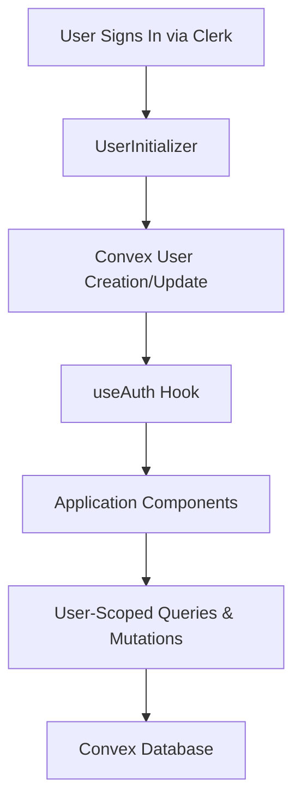

# Authentication System Documentation

Welcome to the SMNB authentication system documentation. This system provides enterprise-grade authentication using **Clerk** for user management and **Convex** for user data persistence.

## 📚 Documentation Structure
ok,
### Core Documentation
- **[Overview](./overview.md)** - High-level system architecture and concepts
- **[Quick Start](./quick-start.md)** - Get up and running in 5 minutes
- **[API Reference](./api-reference.md)** - Complete hook and function documentation

### Implementation Guides
- **[Authentication Patterns](./patterns.md)** - Common implementation patterns
- **[Component Integration](./component-integration.md)** - How to integrate auth with your components
- **[Session Management](./session-management.md)** - Working with user sessions

### Advanced Topics
- **[Security Best Practices](./security.md)** - Security considerations and best practices
- **[Troubleshooting](./troubleshooting.md)** - Common issues and solutions
- **[Migration Guide](./migration.md)** - Upgrading from other auth systems

## 🚀 Quick Links

| What you want to do | Where to go |
|---------------------|-------------|
| Get started immediately | [Quick Start Guide](./quick-start.md) |
| Understand the architecture | [System Overview](./overview.md) |
| Add auth to a component | [Component Integration](./component-integration.md) |
| Work with user sessions | [Session Management](./session-management.md) |
| See all available hooks | [API Reference](./api-reference.md) |
| Implement common patterns | [Authentication Patterns](./patterns.md) |

## 🔧 System Features

✅ **Unified Authentication State** - Single source of truth across your app  
✅ **Type-Safe Hooks** - Full TypeScript support with proper types  
✅ **Automatic User Management** - Users created/updated automatically  
✅ **Session-Scoped Operations** - Built-in patterns for user data  
✅ **Easy Component Integration** - Simple hooks that work everywhere  
✅ **Production Ready** - Enterprise-grade security and performance  

## 🏗️ Architecture Overview

## 📋 Prerequisites

- **Clerk Account** - For authentication services
- **Convex Project** - For user data storage  
- **Next.js 14+** - Application framework
- **TypeScript** - For type safety (recommended)

## 🆘 Need Help?

- Check the [Troubleshooting Guide](./troubleshooting.md) for common issues
- Review [Security Best Practices](./security.md) for production deployments
- See [Authentication Patterns](./patterns.md) for implementation examples

---

*Last updated: September 28, 2025*