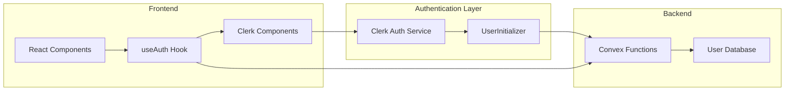

# System Overview

## Architecture

The SMNB authentication system is built on a hybrid architecture that combines **Clerk** for authentication and **Convex** for user data persistence. This approach provides the best of both worlds: Clerk's robust authentication features and Convex's real-time database capabilities.

### Key Components



## Data Flow

### 1. User Authentication
```
User → Clerk Sign In → JWT Token → Convex Authentication
```

### 2. User Data Synchronization
```
Clerk User Data → UserInitializer → Convex User Record → Application State
```

### 3. Component Integration
```
Component → useAuth Hook → User State + Actions → UI Updates
```

## Core Concepts

### Authentication States

| State | Description | Component Behavior |
|-------|-------------|-------------------|
| `isLoading: true` | Authentication status unknown | Show loading spinner |
| `isAuthenticated: false` | User not signed in | Show sign-in prompt |
| `isAuthenticated: true` | User signed in and verified | Show protected content |

### User Data Sources

#### Clerk User (UI Layer)
```typescript
interface ClerkUser {
  id: string;
  fullName: string;
  primaryEmailAddress: { emailAddress: string };
  imageUrl: string;
  // ... other Clerk-specific fields
}
```

Used for: Profile pictures, display names, authentication UI

#### Convex User (Application Layer)
```typescript
interface AuthUser {
  id: Id<"users">;        // Convex document ID
  name: string;           // Display name
  email: string;          // Email address
  avatarUrl?: string;     // Profile picture URL
  createdAt: number;      // Account creation timestamp
  lastActiveAt: number;   // Last activity timestamp
}
```

Used for: Database queries, user-scoped operations, application logic

### Authentication Context

The system maintains authentication context through React Context and Convex's real-time subscriptions:

```typescript
const AuthContext = {
  // Loading state
  isLoading: boolean;
  
  // Authentication status
  isAuthenticated: boolean;
  
  // User data (from Convex)
  user: AuthUser | null;
  
  // Clerk user data (for UI)
  clerkUser: ClerkUser | null;
  
  // Actions
  signOut: () => Promise<void>;
}
```

## Database Schema

### Users Table
```typescript
users: defineTable({
  name: v.string(),              // Display name
  email: v.string(),             // Email address
  tokenIdentifier: v.string(),   // Clerk's unique identifier
  avatarUrl: v.optional(v.string()),  // Profile picture
  createdAt: v.number(),         // Account creation timestamp
  lastActiveAt: v.number(),      // Last activity timestamp
})
.index("by_token", ["tokenIdentifier"])  // Primary lookup
.index("by_email", ["email"])            // Email lookup
```

### Sessions Table
```typescript
sessions: defineTable({
  userId: v.id("users"),         // Reference to users table
  name: v.string(),              // Session name
  status: v.union(               // Session status
    v.literal("active"), 
    v.literal("paused"), 
    v.literal("archived")
  ),
  settings: v.object({           // Session configuration
    model: v.string(),
    temperature: v.number(),
    // ... other settings
  }),
})
.index("by_userId", ["userId"])           // User's sessions
.index("by_userId_and_status", ["userId", "status"])  // Filtered sessions
```

## Security Model

### Authentication Flow
1. **Clerk Authentication** - Handles sign-in, MFA, password reset
2. **JWT Validation** - Convex validates Clerk JWTs automatically
3. **User Context** - Each request includes authenticated user context
4. **Authorization** - Functions check user ownership before operations

### Data Isolation
- All user data is scoped by `userId`
- Database queries use user-specific indexes
- No cross-user data access possible
- Automatic user validation in all operations

### Token Management
- JWTs handled automatically by Clerk + Convex integration
- No manual token storage required
- Automatic refresh and validation
- Secure token transmission

## Performance Considerations

### Real-time Updates
- Convex provides real-time subscriptions to user data
- Changes sync automatically across all user sessions
- No manual polling or refresh required

### Query Optimization
- User-scoped indexes for fast queries
- Efficient pagination for large datasets  
- Automatic query batching and deduplication

### Caching Strategy
- Convex handles query result caching automatically
- User data cached locally with automatic invalidation
- Optimistic updates for better UX

---

*Next: [Quick Start Guide](./quick-start.md)*