# Enhanced Reddit Live Feed Processing Pipeline

This diagram shows the complete architecture of the enhanced Reddit live feed system with multi-agent processing pipeline.

```mermaid
---
title: Enhanced Reddit Live Feed Processing Pipeline
---
flowchart TD
    %% Data Sources
    RN["`🌐 **r/news**
    Raw Posts`"]:::source
    RW["`🌐 **r/worldnews** 
    Raw Posts`"]:::source
    
    %% Main Pipeline Components
    DI["`📡 **Data Ingestion**
    Fetch from Reddit API
    Rate-limited requests`"]:::ingestion
    
    EA["`🧠 **Enrichment Agent**
    • Sentiment Analysis
    • Content Categorization  
    • Quality Scoring`"]:::enrichment
    
    SA["`📊 **Scoring Agent**
    • Engagement Score (40%)
    • Recency Score (35%)
    • Quality Score (25%)
    Priority: 0.000-1.000`"]:::scoring
    
    SS["`📅 **Scheduler Service**
    • Smart Timing
    • Category Distribution
    • Subreddit Diversity
    • Peak Hours Logic`"]:::scheduler
    
    PS["`📢 **Publisher Service**
    Queue Management
    Live Feed Updates`"]:::publisher
    
    %% Processing States
    RAW["`📝 **Raw Posts**
    processing_status: 'raw'`"]:::state
    
    ENR["`✨ **Enriched Posts**  
    processing_status: 'enriched'
    + sentiment, categories, quality`"]:::state
    
    SCR["`🎯 **Scored Posts**
    processing_status: 'scored'  
    + priority_score`"]:::state
    
    SCH["`⏰ **Scheduled Posts**
    processing_status: 'scheduled'
    + scheduled_at timestamp`"]:::state
    
    PUB["`📺 **Published Posts**
    processing_status: 'published'
    Live in UI`"]:::state
    
    %% UI Components  
    UI["`🖥️ **SimpleLiveFeed UI**
    • Priority Indicators 🔥
    • Sentiment Badges 😊😐😞
    • Quality Scores ⭐
    • Category Labels 🏷️`"]:::ui
    
    STORE["`🗄️ **Live Feed Store**
    Zustand State Management`"]:::store
    
    %% Configuration
    CONFIG["`⚙️ **Queue Config**
    MIN_POST_INTERVAL: 5min
    MAX_POSTS_PER_HOUR: 8
    PEAK_HOURS: [14,15,16,17,18]
    Scoring Weights & Rules`"]:::config
    
    %% Data Flow
    RN --> DI
    RW --> DI
    DI --> RAW
    
    RAW --> EA
    EA --> ENR
    
    ENR --> SA  
    SA --> SCR
    
    SCR --> SS
    SS --> SCH
    
    SCH --> PS
    PS --> PUB
    
    PUB --> UI
    UI --> STORE
    
    %% Configuration connections
    CONFIG -.-> SS
    CONFIG -.-> PS
    CONFIG -.-> SA
    
    %% Processing Pipeline Container
    subgraph EPP ["`🔄 **Enhanced Processing Pipeline**`"]
        direction TB
        PIPELINE["`🎛️ **Pipeline Orchestrator**
        • Coordinates all agents
        • 3-second publishing cycles  
        • Smart batching
        • Stats tracking`"]:::pipeline
        
        STATS["`📈 **Pipeline Stats**
        • Total Processed
        • Total Published
        • Queue Status
        • Performance Metrics`"]:::stats
        
        PIPELINE --> STATS
    end
    
    %% Pipeline coordinates everything
    PIPELINE -.-> EA
    PIPELINE -.-> SA
    PIPELINE -.-> SS
    PIPELINE -.-> PS
    
    %% Special Features
    subgraph FEATURES ["`✨ **Enhanced Features**`"]
        direction LR
        F1["`🔥 **Priority Scoring**
        High-impact posts first`"]:::feature
        F2["`🎭 **Sentiment Analysis** 
        Emotional context`"]:::feature
        F3["`⏱️ **Smart Scheduling**
        Optimal timing logic`"]:::feature
        F4["`🌈 **Content Diversity**
        Category distribution`"]:::feature
    end
    
    %% Immediate Publishing Logic
    subgraph IMMEDIATE ["`⚡ **Immediate Publishing**`"]
        direction TB
        IMM1["`📦 **First 3 Posts**
        Scheduled: now, +2s, +4s`"]:::immediate
        IMM2["`🚀 **Fast Publishing**
        3-second check cycles`"]:::immediate
        IMM3["`📺 **Instant UI Update**
        Real-time feed updates`"]:::immediate
        
        IMM1 --> IMM2 --> IMM3
    end
    
    SCH -.-> IMMEDIATE
    
    %% Styling
    classDef source fill:#e1f5fe,stroke:#01579b,stroke-width:2px,color:#000
    classDef ingestion fill:#f3e5f5,stroke:#4a148c,stroke-width:2px,color:#000
    classDef enrichment fill:#e8f5e8,stroke:#1b5e20,stroke-width:2px,color:#000  
    classDef scoring fill:#fff3e0,stroke:#e65100,stroke-width:2px,color:#000
    classDef scheduler fill:#fce4ec,stroke:#880e4f,stroke-width:2px,color:#000
    classDef publisher fill:#e0f2f1,stroke:#004d40,stroke-width:2px,color:#000
    classDef state fill:#f5f5f5,stroke:#424242,stroke-width:1px,color:#000
    classDef ui fill:#e3f2fd,stroke:#0d47a1,stroke-width:2px,color:#000
    classDef store fill:#fff8e1,stroke:#ff8f00,stroke-width:2px,color:#000
    classDef config fill:#fafafa,stroke:#616161,stroke-width:1px,color:#000
    classDef pipeline fill:#ffebee,stroke:#c62828,stroke-width:2px,color:#000
    classDef stats fill:#f1f8e9,stroke:#33691e,stroke-width:1px,color:#000
    classDef feature fill:#f3e5f5,stroke:#7b1fa2,stroke-width:1px,color:#000
    classDef immediate fill:#ffecb3,stroke:#f57f17,stroke-width:2px,color:#000
```

## Architecture Overview

This enhanced processing pipeline transforms raw Reddit data into an intelligent live feed through a sophisticated multi-agent system:

### **Core Components:**

1. **🧠 Enrichment Agent**
   - Performs sentiment analysis using keyword matching
   - Categorizes content (Breaking News, Politics, Technology, etc.)
   - Calculates quality scores based on content characteristics

2. **📊 Scoring Agent**
   - Weighted priority scoring system:
     - Engagement Score: 40% (upvotes, comments)
     - Recency Score: 35% (time-based decay)
     - Quality Score: 25% (content assessment)
   - Output range: 0.000-1.000

3. **📅 Scheduler Service**
   - Smart timing algorithms
   - Category distribution for diversity
   - Subreddit diversity rules
   - Peak hours optimization (UTC 14-18)

4. **📢 Publisher Service**
   - Queue management
   - Real-time UI updates
   - Live feed coordination

### **Enhanced Features:**

- **🔥 Priority Indicators**: Visual cues for high-scoring posts
- **😊😐😞 Sentiment Badges**: Emotional context display
- **⭐ Quality Scores**: Content quality indicators
- **🏷️ Category Labels**: Topic classification
- **⚡ Immediate Publishing**: First 3 posts published instantly

### **Processing States:**

Each post flows through these states with metadata enrichment at each stage:
- `raw` → `enriched` → `scored` → `scheduled` → `published`

### **Configuration:**

- Minimum post interval: 5 minutes
- Maximum posts per hour: 8
- Peak publishing hours: 2-6 PM UTC
- Smart scheduling with diversity rules

This architecture ensures a high-quality, diverse, and engaging live feed experience with intelligent content curation and optimal timing.
