# SMNB Live Feed Workflow

This chart shows the complete workflow from Reddit API data retrieval through to display in the live feed UI.

```mermaid
flowchart TD
    %% External Sources
    Reddit[Reddit API<br/>r/subreddit/sort.json]
    
    %% API Layer
    APIRoute["/api/reddit<br/>Next.js Route Handler<br/>?subreddit=tech&sort=hot&limit=10"]
    
    %% Processing Pipeline Start
    Pipeline[Enhanced Processing Pipeline<br/>Master Orchestrator]
    
    %% Raw Data
    RawPosts[(Raw Reddit Posts<br/>status: 'raw'<br/>Basic Reddit data only)]
    
    %% Agent Processing
    EnrichAgent[EnrichmentAgent<br/>🧠 Intelligence Layer]
    EnrichDetails[Sentiment Analysis<br/>Category Assignment<br/>Quality Scoring<br/>Content Enhancement]
    
    ScoringAgent[ScoringAgent<br/>⚡ Priority Calculator]
    ScoringDetails[Engagement Score 40%<br/>Recency Score 35%<br/>Quality Score 25%<br/>Final Priority 0-1]
    
    SchedulerAgent[SchedulerService<br/>⏰ Optimal Timing]
    SchedulerDetails[Peak Hours 14-18 UTC<br/>Diversity Management<br/>Queue Optimization<br/>First 3 posts: Immediate<br/>Others: Smart timing]
    
    %% Data States
    EnrichedPosts[(Enriched Posts<br/>status: 'enriched'<br/>+ sentiment, categories, quality)]
    
    ScoredPosts[(Scored Posts<br/>status: 'scored'<br/>+ priority_score)]
    
    ScheduledPosts[(Scheduled Posts<br/>status: 'scheduled'<br/>+ scheduleTime)]
    
    %% Publishing
    PublishQueue[Publishing Queue<br/>📤 Smart Publisher]
    PublishLogic[Publishing Logic<br/>- Check scheduleTime<br/>- Publish when ready<br/>- 3 second intervals<br/>- Immediate for top 3]
    
    %% State Management
    ZustandStore[Zustand Store<br/>🗃️ State Management<br/>Posts, UI State, Config]
    
    %% UI Layer
    UIUpdate[UI Update Trigger<br/>📱 Real-time Updates]
    
    LiveFeed[SimpleLiveFeed Component<br/>🎨 User Interface]
    
    %% UI Elements
    PostCard[Post Cards<br/>🔥 High Priority Badge<br/>😊😐😞 Sentiment Badges<br/>⭐ Quality Scores<br/>🏷️ Categories<br/>📊 Engagement Stats]
    
    %% User Interaction
    User[👤 User]
    Controls[Feed Controls<br/>▶️ Start/Stop<br/>🌙 Dark Mode Toggle<br/>🔧 SFW/NSFW Mode<br/>⚙️ Subreddit Config]
    
    %% Flow Connections
    Reddit --> APIRoute
    APIRoute --> Pipeline
    Pipeline --> RawPosts
    
    %% Processing Flow
    RawPosts --> EnrichAgent
    EnrichAgent --> EnrichDetails
    EnrichDetails --> EnrichedPosts
    
    EnrichedPosts --> ScoringAgent
    ScoringAgent --> ScoringDetails
    ScoringDetails --> ScoredPosts
    
    ScoredPosts --> SchedulerAgent
    SchedulerAgent --> SchedulerDetails
    SchedulerDetails --> ScheduledPosts
    
    %% Publishing Flow
    ScheduledPosts --> PublishQueue
    PublishQueue --> PublishLogic
    PublishLogic --> UIUpdate
    
    %% State Management Flow
    UIUpdate --> ZustandStore
    ZustandStore --> LiveFeed
    LiveFeed --> PostCard
    PostCard --> User
    
    %% User Controls
    User --> Controls
    Controls --> Pipeline
    
    %% Styling
    classDef apiLayer fill:#e1f5fe
    classDef processing fill:#f3e5f5
    classDef dataStore fill:#fff3e0
    classDef ui fill:#e8f5e8
    classDef user fill:#fff8e1
    
    class Reddit,APIRoute apiLayer
    class Pipeline,EnrichAgent,ScoringAgent,SchedulerAgent,PublishQueue processing
    class RawPosts,EnrichedPosts,ScoredPosts,ScheduledPosts,ZustandStore dataStore
    class UIUpdate,LiveFeed,PostCard ui
    class User,Controls user
```

## Workflow Steps

### 1. **Data Acquisition**
- Reddit API called via `/api/reddit` route
- Random subreddit + sort method selection
- Raw posts fetched (limit 10 per call)

### 2. **Enhanced Processing Pipeline**
- **EnrichmentAgent**: Adds sentiment, categories, quality scores
- **ScoringAgent**: Calculates priority (0-1 scale) using weighted algorithm
- **SchedulerService**: Determines optimal publishing times

### 3. **Smart Publishing**
- First 3 posts: Published immediately (0s, 2s, 4s)
- Remaining posts: Scheduled based on priority + timing algorithm
- 3-second publishing cycle checks for ready posts

### 4. **Real-time UI Updates**
- Zustand store manages all state
- UI updates instantly when posts published
- Visual indicators show processing status
- Smooth animations for new posts

### 5. **User Experience**
- Live feed with enhanced post cards
- Priority badges (🔥), sentiment indicators (😊😐😞)
- Quality scores (⭐), categories (🏷️)
- Interactive controls for customization

## Key Features

- **Multi-Agent Architecture**: Separate agents for different processing stages
- **Intelligent Curation**: AI-powered content analysis and scoring
- **Optimal Timing**: Smart scheduling based on priority and engagement patterns  
- **Real-time Updates**: Instant UI updates with smooth animations
- **User Control**: Comprehensive settings and live feed controls
- **Dark Mode**: Complete theming system with semantic colors
