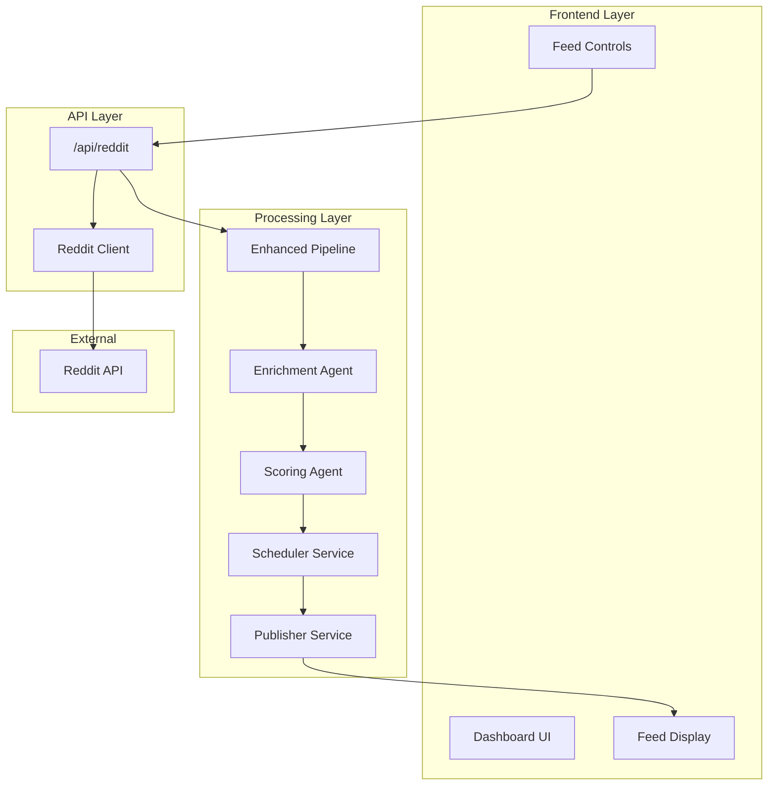
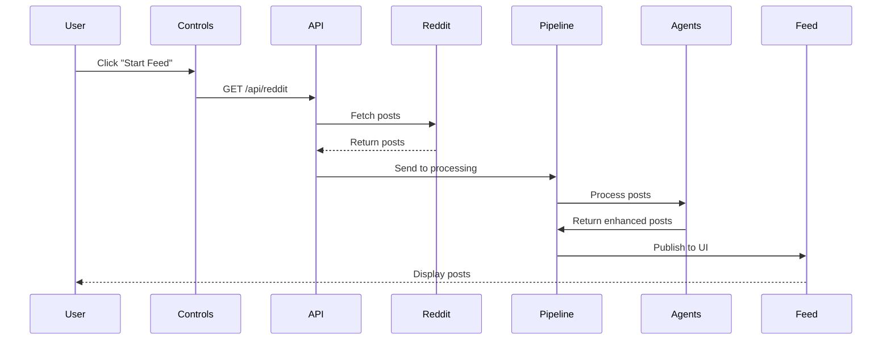

# API Structure Documentation: Reddit Live Feed Pipeline

## 📋 Table of Contents

1. [Overview](feedapistructure.md#overview)
2. [API Architecture](feedapistructure.md#api-architecture)
3. [Data Flow Diagram](feedapistructure.md#data-flow-diagram)
4. [Reddit API Route](feedapistructure.md#reddit-api-route)
5. [Processing Pipeline](feedapistructure.md#processing-pipeline)
6. [Order of Operations](feedapistructure.md#order-of-operations)
7. [Component Integration](feedapistructure.md#component-integration)
8. [Error Handling](feedapistructure.md#error-handling)
9. [Performance Metrics](feedapistructure.md#performance-metrics)
10. [Real-time Updates](feedapistructure.md#real-time-updates)

***

## 🎯 Overview

The SMNB dashboard features a sophisticated live feed system that fetches, processes, and displays Reddit content in real-time. The system uses a multi-layered architecture with intelligent content curation through multiple processing agents.

### Key Components

| Component               | Purpose                          | Location                                               |
| ----------------------- | -------------------------------- | ------------------------------------------------------ |
| **Reddit API Route**    | Fetches posts from Reddit        | `/app/api/reddit/route.ts`                             |
| **Reddit Client**       | Handles Reddit API communication | `/lib/reddit.ts`                                       |
| **Processing Pipeline** | Orchestrates content processing  | `/lib/services/livefeed/enhancedProcessingPipeline.ts` |
| **Feed UI**             | Displays processed content       | `/app/dashboard/feed/FeedSidebar.tsx`                  |
| **Controls**            | Manages feed settings            | `/app/dashboard/studio/controls/Controls.tsx`          |

***

## 🏗️ API Architecture



***

## 📊 Data Flow Diagram

### Complete Data Journey

```
┌─────────────────┐     ┌─────────────────┐     ┌─────────────────┐
│   User Action   │────▶│  API Request    │────▶│  Reddit Fetch   │
│  (Start Feed)   │     │  GET /api/reddit│     │  reddit.com API │
└─────────────────┘     └─────────────────┘     └─────────────────┘
                                                          │
                                                          ▼
┌─────────────────┐     ┌─────────────────┐     ┌─────────────────┐
│  Feed Display   │◀────│   Publishing    │◀────│   Processing    │
│  (UI Updates)   │     │   (Scheduled)   │     │   (Enrichment)  │
└─────────────────┘     └─────────────────┘     └─────────────────┘
```

***

## 🔌 Reddit API Route

### **Route Endpoints**

| Method   | Endpoint      | Purpose                              | Parameters                      |
| -------- | ------------- | ------------------------------------ | ------------------------------- |
| **GET**  | `/api/reddit` | Fetch posts from single subreddit    | `subreddit`, `sort`, `limit`    |
| **POST** | `/api/reddit` | Batch fetch from multiple subreddits | `subreddits[]`, `sort`, `limit` |

### **GET Request Flow**

```typescript
// Request Structure
GET /api/reddit?subreddit=worldnews&sort=hot&limit=10

// Processing Steps
1. Parse query parameters
2. Validate inputs (limit max: 25)
3. Call redditAPI.fetchPosts()
4. Transform Reddit response
5. Return formatted JSON
```

### **POST Request Flow**

```typescript
// Request Body
{
  "subreddits": ["worldnews", "technology", "science"],
  "sort": "hot",
  "limit": 5
}

// Processing Steps
1. Parse JSON body
2. Validate subreddits array
3. Create parallel fetch promises
4. Execute with Promise.allSettled()
5. Separate successful/failed results
6. Return aggregated response
```

***

## ⚙️ Processing Pipeline

### **Enhanced Processing Pipeline Architecture**

| Stage             | Agent/Service    | Responsibility                     | Output            |
| ----------------- | ---------------- | ---------------------------------- | ----------------- |
| **1. Ingestion**  | Pipeline         | Fetch raw posts                    | Raw Reddit posts  |
| **2. Enrichment** | EnrichmentAgent  | Add sentiment, categories, quality | Enhanced posts    |
| **3. Scoring**    | ScoringAgent     | Calculate priority scores          | Scored posts      |
| **4. Scheduling** | SchedulerService | Smart timing & diversity           | Scheduled posts   |
| **5. Publishing** | PublisherService | Queue management                   | Live feed updates |

### **Processing Status Flow**

```
[raw] ──▶ [enriched] ──▶ [scored] ──▶ [scheduled] ──▶ [published]
  │           │             │              │               │
  └─ Fresh ───┴─ +Metadata ─┴─ +Priority ─┴─ +Timing ────┴─ Live
```

***

## 📋 Order of Operations

### **Complete Request Lifecycle**



### **Detailed Step-by-Step Operations**

| Step   | Component        | Operation                         | Data Transformation                |
| ------ | ---------------- | --------------------------------- | ---------------------------------- |
| **1**  | User             | Selects subreddits & clicks start | `["worldnews", "technology"]`      |
| **2**  | Controls         | Builds API request                | `{subreddits: [...], sort: "hot"}` |
| **3**  | API Route        | Validates parameters              | Ensures limit ≤ 25                 |
| **4**  | Reddit Client    | Adds headers & auth               | `User-Agent`, rate limiting        |
| **5**  | Reddit API       | Returns JSON data                 | Raw Reddit response                |
| **6**  | API Route        | Maps to posts array               | `children.map(c => c.data)`        |
| **7**  | Pipeline         | Receives posts batch              | Array of RedditPost objects        |
| **8**  | EnrichmentAgent  | Adds metadata                     | +sentiment, +categories, +quality  |
| **9**  | ScoringAgent     | Calculates priority               | +priority\_score (0-1)             |
| **10** | SchedulerService | Determines timing                 | +scheduled\_time                   |
| **11** | PublisherService | Queues for display                | Manages feed rate                  |
| **12** | Feed UI          | Renders posts                     | Visual cards with metadata         |

***

## 🔧 Component Integration

### **Key Integration Points**

```typescript
// 1. Controls Component initiates the feed
const handleStartFeed = async () => {
  const response = await fetch(`/api/reddit?subreddit=${subreddit}&limit=10`);
  const data = await response.json();
  // Send to pipeline...
};

// 2. API Route processes the request
export async function GET(request: NextRequest) {
  const posts = await redditAPI.fetchPosts(subreddit, sort, limit);
  return NextResponse.json({ posts });
}

// 3. Pipeline enriches and publishes
async startDataIngestion() {
  const enriched = await this.enrichmentAgent.enrichPosts(posts);
  const scored = await this.scoringAgent.scorePosts(enriched);
  const scheduled = await this.schedulerService.schedulePost(scored);
  await this.publisherService.publishPost(scheduled);
}

// 4. Feed displays the results
const FeedSidebar = () => {
  const posts = useLiveFeedStore(state => state.posts);
  return posts.map(post => <PostCard {...post} />);
};
```

### **Data Type Transformations**

| Stage          | Input Type             | Output Type            | Key Changes                              |
| -------------- | ---------------------- | ---------------------- | ---------------------------------------- |
| **Reddit API** | Raw JSON               | `RedditPost[]`         | Basic post structure                     |
| **Pipeline**   | `RedditPost[]`         | `EnhancedRedditPost[]` | +processing\_status, +fetch\_timestamp   |
| **Enrichment** | `EnhancedRedditPost[]` | Enhanced               | +sentiment, +categories, +quality\_score |
| **Scoring**    | Enhanced               | Scored                 | +priority\_score, +engagement\_score     |
| **Store**      | Scored                 | `LiveFeedPost[]`       | +addedAt, +batchId, +isNew               |

***

## 🛡️ Error Handling

### **Error Handling Chain**

| Level        | Component     | Error Type              | Handling Strategy                |
| ------------ | ------------- | ----------------------- | -------------------------------- |
| **API**      | Route Handler | Network/Timeout         | Return 500 with error message    |
| **Reddit**   | Client        | Rate Limiting (403/429) | Retry with backoff               |
| **Pipeline** | Processing    | Enrichment Failure      | Log & continue with partial data |
| **UI**       | Feed Display  | Missing Data            | Show fallback UI                 |

### **Error Response Structure**

```typescript
// Success Response
{
  "success": true,
  "posts": [...],
  "pagination": { "after": "...", "before": "..." }
}

// Error Response
{
  "success": false,
  "error": "Error message",
  "posts": []  // Empty fallback
}

// Batch Request Response
{
  "success": true,
  "successful": [...],  // Successful subreddit fetches
  "failed": [...]       // Failed subreddit attempts
}
```

### **Graceful Degradation Strategy**

```
Reddit API Error → Pipeline continues → Partial data → UI shows available posts
       │                    │                │                    │
   Log warning       Cache last good     Display cached      Show "limited data"
                          data               content              notification
```

***

## 📈 Performance Metrics

### **System Constraints**

| Metric                 | Value      | Purpose               |
| ---------------------- | ---------- | --------------------- |
| **Max posts/request**  | 25         | Reddit API limit      |
| **Fetch interval**     | 2 seconds  | Rate limiting         |
| **Min post interval**  | 5 minutes  | Prevent feed flooding |
| **Max posts/hour**     | 8          | User experience       |
| **Processing timeout** | 30 seconds | Prevent hanging       |

### **Processing Performance**

| Stage          | Avg Time    | Concurrent           | Bottleneck           |
| -------------- | ----------- | -------------------- | -------------------- |
| **API Fetch**  | 1-3 seconds | 1 request            | Reddit rate limits   |
| **Enrichment** | 100-500ms   | Batch processing     | AI analysis          |
| **Scoring**    | 10-50ms     | Parallel computation | Algorithm complexity |
| **Scheduling** | 5-10ms      | Queue operations     | Memory allocation    |
| **Publishing** | 1-5ms       | UI updates           | React rendering      |

***

## 🔄 Real-time Updates

### **Live Feed Update Mechanism**

```
┌──────────────┐      ┌──────────────┐      ┌──────────────┐
│   Fetch      │─────▶│   Process    │─────▶│   Publish    │
│   (2s)       │      │   (100ms)    │      │   (varies)   │
└──────────────┘      └──────────────┘      └──────────────┘
       ▲                                            │
       └────────────────────────────────────────────┘
                    Continuous Loop
```

### **State Management Flow**

| Store                   | State                | Update Trigger     | UI Effect           |
| ----------------------- | -------------------- | ------------------ | ------------------- |
| **simpleLiveFeedStore** | `posts[]`            | New post published | Feed rerenders      |
| **simpleLiveFeedStore** | `isLive`             | Start/Stop clicked | Controls update     |
| **simpleLiveFeedStore** | `selectedSubreddits` | Subreddit toggled  | Fetch scope changes |

### **Update Mechanisms**

```typescript
// Zustand Store Updates
interface SimpleLiveFeedStore {
  // Real-time state
  posts: LiveFeedPost[];
  isLive: boolean;
  contentMode: 'sfw' | 'nsfw';
  
  // Update actions
  addPost: (post: LiveFeedPost) => void;
  setIsLive: (live: boolean) => void;
  setContentMode: (mode: 'sfw' | 'nsfw') => void;
}

// Pipeline to Store Integration
const publisherService = {
  publishPost: (post: EnhancedRedditPost) => {
    const liveFeedPost = transformToLiveFeedPost(post);
    simpleLiveFeedStore.getState().addPost(liveFeedPost);
  }
};
```

***

## 🔄 Pipeline Configuration

### **Configuration Options**

```typescript
interface PipelineConfig {
  subreddits: string[];           // Target subreddits
  contentMode: 'sfw' | 'nsfw';   // Content filtering
  maxPostsInPipeline: number;     // Memory management
  publishingInterval: number;      // MS between publishes
}

// Default Configuration
const defaultConfig: PipelineConfig = {
  subreddits: ['all', 'news', 'worldnews', 'technology'],
  contentMode: 'sfw',
  maxPostsInPipeline: 100,
  publishingInterval: 300000  // 5 minutes
};
```

### **Pipeline Statistics**

```typescript
interface PipelineStats {
  totalPosts: number;
  rawPosts: number;
  enrichedPosts: number;
  scoredPosts: number;
  scheduledPosts: number;
  publishedPosts: number;
  averageProcessingTime: number;
  lastUpdate: number;
}
```

***

## 📊 Data Models

### **Core Data Structures**

```typescript
// Raw Reddit Post
interface RedditPost {
  id: string;
  title: string;
  author: string;
  subreddit: string;
  url: string;
  score: number;
  created_utc: number;
  // ... standard Reddit fields
}

// Enhanced Post (Pipeline)
interface EnhancedRedditPost extends RedditPost {
  source: 'reddit';
  fetch_timestamp: number;
  processing_status: 'raw' | 'enriched' | 'scored' | 'scheduled' | 'published';
  engagement_score?: number;
  priority_score?: number;
  quality_score?: number;
  sentiment?: 'positive' | 'neutral' | 'negative';
  categories?: string[];
}

// Live Feed Post (UI)
interface LiveFeedPost extends EnhancedRedditPost {
  addedAt: number;
  batchId: number;
  isNew?: boolean;
  sort_type?: 'live' | 'hot' | 'top' | 'rising';
}
```

***

## 🎯 Summary

The Reddit Live Feed API structure follows a clear pipeline pattern:

1. **User Interaction** → Controls component
2. **API Request** → `/api/reddit` route
3. **External Fetch** → Reddit API via client
4. **Processing** → Multi-agent pipeline
5. **Display** → Real-time feed updates

### **Architecture Benefits**

This architecture ensures:

* ✅ **Scalability**: Modular components can be enhanced independently
* ✅ **Reliability**: Error handling at each layer
* ✅ **Performance**: Batching and rate limiting
* ✅ **User Experience**: Smooth, real-time updates
* ✅ **Maintainability**: Clear separation of concerns
* ✅ **Extensibility**: Easy to add new processing agents
* ✅ **Monitoring**: Comprehensive stats and logging

### **Key Design Patterns**

| Pattern                  | Implementation                  | Benefit             |
| ------------------------ | ------------------------------- | ------------------- |
| **Pipeline**             | Sequential processing stages    | Clear data flow     |
| **Agent-based**          | Independent processing services | Modular enhancement |
| **Publisher-Subscriber** | Store updates trigger UI        | Reactive updates    |
| **Circuit Breaker**      | Error isolation per component   | Fault tolerance     |
| **Rate Limiting**        | Controlled API requests         | API compliance      |

***

## 📚 Related Documentation

* [Enhanced Processing Pipeline Details](processingPipeline.md)
* [Reddit Client Implementation](redditClient.md)
* [Feed Component Architecture](feedComponents.md)
* [Convex Integration Guide](convexIntegration.md)
* [Error Handling Strategies](errorHandling.md)

***

## 🔧 Development Notes

### **Testing Endpoints**

```bash
# Test single subreddit
curl "http://localhost:3000/api/reddit?subreddit=worldnews&limit=5"

# Test batch request
curl -X POST "http://localhost:3000/api/reddit" \
  -H "Content-Type: application/json" \
  -d '{"subreddits":["worldnews","technology"],"limit":3}'
```

### **Debug Pipeline**

```typescript
// Enable pipeline debugging
const pipeline = new EnhancedProcessingPipeline();
pipeline.enableDebugMode(true);

// Monitor stats
const stats = pipeline.getStats();
console.log('Pipeline performance:', stats);
```

***

_Last Updated: September 1, 2025_\
&#xNAN;_&#x56;ersion: 2.0.0_\
&#xNAN;_&#x43;ontributors: SMNB Development Team_
