# SMNB Live Feed - User Experience Workflow

This diagram shows the complete user journey and experience when using the SMNB live feed feature, from the user's perspective.

```mermaid
---
title: SMNB Live Feed - User Experience Flow
---
flowchart TD
    %% User Actions
    START(("👤 **User**
    Opens SMNB")):::user
    
    DASH["📊 **Dashboard Page**
    Navigate to Live Feed"]:::page
    
    TOGGLE["🔴 **Click 'Start Live Feed'**
    Button toggles to 'ON'"]:::action
    
    %% What User Sees
    LOADING["⏳ **Loading State**
    'Fetching latest news...'"]:::loading
    
    FIRST["⚡ **First Posts Appear**
    Within 2-6 seconds"]:::immediate
    
    QUALITY["✨ **Enhanced Posts Display**
    🔥 Priority indicators
    😊😐😞 Sentiment badges
    ⭐ Quality scores (0.85-0.99)
    🏷️ Category labels"]:::enhanced
    
    FLOW["🌊 **Continuous Flow**
    New posts every 5-8 minutes
    Smart timing & diversity"]:::flow
    
    INTERACT["👆 **User Interactions**
    • Click titles → Read full article
    • See live engagement stats
    • Watch sentiment analysis
    • Notice quality curation"]:::interact
    
    %% Behind the Scenes (What User Doesn't See)
    subgraph MAGIC ["🎩 **Behind the Scenes Magic**"]
        direction TB
        FETCH["📡 Fetching from Reddit
        r/news + r/worldnews"]:::backend
        
        SMART["🧠 Smart Processing
        • Content analysis
        • Priority scoring
        • Optimal scheduling"]:::backend
        
        CURATE["🎯 Intelligent Curation
        • High-quality posts first
        • Diverse topics
        • Perfect timing"]:::backend
    end
    
    %% Experience Quality
    subgraph BENEFITS ["🎁 **User Benefits**"]
        direction LR
        B1["📰 **Fresh News**
        Always current"]:::benefit
        
        B2["🎯 **High Quality**
        No spam or low-value"]:::benefit
        
        B3["🌈 **Diverse Topics**
        Balanced coverage"]:::benefit
        
        B4["😊 **Emotional Context**
        Know the mood"]:::benefit
    end
    
    %% User Flow
    START --> DASH
    DASH --> TOGGLE
    TOGGLE --> LOADING
    LOADING --> FIRST
    FIRST --> QUALITY
    QUALITY --> FLOW
    FLOW --> INTERACT
    
    %% Continuous Loop
    INTERACT -.->|"Stays engaged"| FLOW
    
    %% Magic happens invisibly
    TOGGLE -.->|"Triggers"| MAGIC
    MAGIC -.->|"Delivers"| FIRST
    MAGIC -.->|"Powers"| FLOW
    
    %% Benefits flow from experience
    QUALITY --> BENEFITS
    FLOW --> BENEFITS
    
    %% Real User Scenarios
    subgraph SCENARIOS ["📱 **Real User Scenarios**"]
        direction TB
        S1["☕ **Morning Coffee**
        'Let me check what happened overnight'"]:::scenario
        
        S2["🏢 **Work Break**
        'Quick news update between meetings'"]:::scenario
        
        S3["📺 **Evening Unwind**
        'What's the mood of today's news?'"]:::scenario
    end
    
    INTERACT --> SCENARIOS
    
    %% What Makes It Special
    SPECIAL["✨ **What Makes SMNB Special**
    Unlike other news feeds:
    • No algorithm manipulation  
    • Transparent quality scoring
    • Real-time sentiment insight
    • Perfectly timed delivery"]:::special
    
    BENEFITS --> SPECIAL
    
    %% Styling
    classDef user fill:#e3f2fd,stroke:#1565c0,stroke-width:3px,color:#000
    classDef page fill:#f3e5f5,stroke:#7b1fa2,stroke-width:2px,color:#000
    classDef action fill:#ffecb3,stroke:#f57f17,stroke-width:2px,color:#000
    classDef loading fill:#fff3e0,stroke:#ef6c00,stroke-width:2px,color:#000
    classDef immediate fill:#c8e6c9,stroke:#2e7d32,stroke-width:2px,color:#000
    classDef enhanced fill:#e8f5e8,stroke:#1b5e20,stroke-width:2px,color:#000
    classDef flow fill:#e1f5fe,stroke:#0277bd,stroke-width:2px,color:#000
    classDef interact fill:#fce4ec,stroke:#c2185b,stroke-width:2px,color:#000
    classDef backend fill:#f5f5f5,stroke:#616161,stroke-width:1px,color:#666
    classDef benefit fill:#fff8e1,stroke:#f9a825,stroke-width:2px,color:#000
    classDef scenario fill:#f1f8e9,stroke:#558b2f,stroke-width:1px,color:#000
    classDef special fill:#ffebee,stroke:#d32f2f,stroke-width:2px,color:#000
```

## User Experience Journey

This chart focuses on what users actually see and experience when using the SMNB live feed, rather than the technical implementation details.