# SMNB Editor Agent - Top-Down Workflow Characteristics

## Editor Agent Architecture Flow

This chart shows the complete workflow when "Newsletter" content type is selected in the Editor Agent (Producer Column 2).

```mermaid
flowchart TD
    %% Top Level - User Interface
    UI["🖥️ **Producer Panel - Column 2**<br/>Editor Interface Active"]:::interface
    
    %% Content Type Selection
    UI --> CTF["📂 **Content Creation Filters**<br/>Home | Blog Post | Newsletter | Analysis | Social | Context"]:::filter
    
    %% Newsletter Selection Focus
    CTF --> NL["📧 **Newsletter Selected**<br/>User clicks Newsletter button"]:::selected
    
    %% Core Editor Agent Components
    NL --> EA["🤖 **Editor Agent Service**<br/>Main orchestrator for content generation"]:::agent
    
    %% Multi-Agent Workflow
    EA --> MAW["🔄 **Multi-Agent Workflow**<br/>Coordinated AI processing pipeline"]:::workflow
    
    %% Sub-Agents & Tools
    MAW --> TTE["📝 **TipTap Editor**<br/>• Real-time content display<br/>• Markdown to HTML conversion<br/>• Typography & styling<br/>• Content state management"]:::editor
    
    MAW --> ATH["⚡ **Anthropic Text Handler**<br/>• Claude 3.5 Sonnet integration<br/>• Streaming content generation<br/>• Text editor tool calls<br/>• Content processing"]:::anthropic
    
    MAW --> ECS["💾 **Editor Convex Service**<br/>• Database persistence<br/>• Content versioning<br/>• Story-based storage<br/>• Real-time sync"]:::convex
    
    MAW --> ESS["🧠 **Editor Store Service**<br/>• Zustand state management<br/>• Auto-save functionality<br/>• Change tracking<br/>• Visual feedback"]:::store
    
    %% Processing Pipeline
    TTE --> PP["🏭 **Processing Pipeline**<br/>Newsletter Generation Workflow"]:::pipeline
    
    %% Pipeline Steps
    PP --> S1["1️⃣ **Content Analysis**<br/>• Source story parsing<br/>• Metadata extraction<br/>• Context enrichment"]:::step
    
    PP --> S2["2️⃣ **AI Content Generation**<br/>• Claude prompt engineering<br/>• Newsletter formatting rules<br/>• Visual hierarchy creation"]:::step
    
    PP --> S3["3️⃣ **Streaming & Display**<br/>• Real-time content streaming<br/>• Live editor updates<br/>• Progress indicators"]:::step
    
    PP --> S4["4️⃣ **Content Processing**<br/>• Markdown to HTML conversion<br/>• Typography enhancement<br/>• Newsletter styling"]:::step
    
    PP --> S5["5️⃣ **Persistence & Sync**<br/>• Convex database save<br/>• Content versioning<br/>• State synchronization"]:::step
    
    %% Tools & Technologies Used
    subgraph TOOLS ["🛠️ **Tools & Technologies**"]
        direction TB
        T1["📖 **TipTap Extensions**<br/>• StarterKit (basic editing)<br/>• Typography (smart quotes)<br/>• Placeholder (help text)<br/>• TextAlign (alignment)<br/>• Highlight (text marking)"]:::tool
        
        T2["🎨 **Styling System**<br/>• Tailwind CSS classes<br/>• Newsletter typography<br/>• Header hierarchy (H1-H6)<br/>• Color coding by type<br/>• Prose styling"]:::tool
        
        T3["🔄 **State Management**<br/>• Editor content state<br/>• AI processing flags<br/>• Auto-save timers<br/>• Visual feedback state<br/>• Change tracking"]:::tool
        
        T4["⚙️ **AI Integration**<br/>• Anthropic API client<br/>• Streaming response handling<br/>• Error handling & recovery<br/>• Content validation<br/>• Rate limiting"]:::tool
        
        T5["💽 **Data Persistence**<br/>• Convex mutations<br/>• Real-time subscriptions<br/>• Optimistic updates<br/>• Conflict resolution<br/>• Version history"]:::tool
    end
    
    %% Activities & Features
    subgraph ACTIVITIES ["🎯 **Key Activities & Features**"]
        direction TB
        A1["🔍 **Content Intelligence**<br/>• Story metadata analysis<br/>• Sentiment extraction<br/>• Priority scoring<br/>• Topic categorization<br/>• Quality assessment"]:::activity
        
        A2["✍️ **Dynamic Writing**<br/>• AI-powered content creation<br/>• Newsletter structure<br/>• Engaging headlines<br/>• Call-to-action placement<br/>• Visual hierarchy"]:::activity
        
        A3["🎛️ **Real-time Controls**<br/>• Live editing capabilities<br/>• Format preservation<br/>• Undo/redo functionality<br/>• Content validation<br/>• Error recovery"]:::activity
        
        A4["📊 **Performance Monitoring**<br/>• Generation metrics<br/>• Content quality scores<br/>• Processing time tracking<br/>• Error rate monitoring<br/>• User engagement"]:::activity
        
        A5["🔄 **Workflow Automation**<br/>• Auto-save functionality<br/>• Content backup<br/>• Version management<br/>• Publishing preparation<br/>• Quality assurance"]:::activity
    end
    
    %% Output Results
    S5 --> OUT["📋 **Final Newsletter Output**<br/>• Professional formatting<br/>• Engaging content<br/>• Visual hierarchy<br/>• Ready for publishing"]:::output
    
    %% Connections to tools and activities
    EA --> TOOLS
    PP --> ACTIVITIES
    
    %% Styling
    classDef interface fill:#e1f5fe,stroke:#0277bd,stroke-width:3px,color:#000
    classDef filter fill:#f3e5f5,stroke:#7b1fa2,stroke-width:2px,color:#000
    classDef selected fill:#e8f5e8,stroke:#2e7d32,stroke-width:3px,color:#000
    classDef agent fill:#fff3e0,stroke:#f57c00,stroke-width:3px,color:#000
    classDef workflow fill:#fce4ec,stroke:#c2185b,stroke-width:2px,color:#000
    classDef editor fill:#e3f2fd,stroke:#1976d2,stroke-width:2px,color:#000
    classDef anthropic fill:#f1f8e9,stroke:#558b2f,stroke-width:2px,color:#000
    classDef convex fill:#faf2ff,stroke:#6a1b9a,stroke-width:2px,color:#000
    classDef store fill:#fff8e1,stroke:#f9a825,stroke-width:2px,color:#000
    classDef pipeline fill:#ffebee,stroke:#d32f2f,stroke-width:3px,color:#000
    classDef step fill:#e8eaf6,stroke:#3f51b5,stroke-width:2px,color:#000
    classDef tool fill:#e0f2f1,stroke:#00695c,stroke-width:1px,color:#000
    classDef activity fill:#fff3e0,stroke:#ef6c00,stroke-width:1px,color:#000
    classDef output fill:#e8f5e8,stroke:#388e3c,stroke-width:3px,color:#000
```

## Newsletter Generation Deep Dive

### Content Type Characteristics

| Content Type | Icon | Purpose | AI Context | Special Features |
|-------------|------|---------|------------|-----------------|
| **Home** | 🏠 | Default story content | Load from live feed | Story metadata display |
| **Blog Post** | 📄 | Comprehensive articles | Long-form narrative | SEO optimization |
| **Newsletter** | 📧 | Email-ready content | Engaging format | Visual hierarchy |
| **Analysis** | 📊 | Data-driven insights | Technical depth | Charts & metrics |
| **Social** | 💬 | Social media content | Community focus | Engagement hooks |
| **Context** | ⚡ | Background information | Educational tone | Reference links |

### Newsletter-Specific Agent Tools

```mermaid
flowchart LR
    %% Newsletter Tools Flow
    NLT["📧 Newsletter Tools"]
    
    NLT --> H1["🔵 H1: Main Headlines<br/>text-4xl, blue-600"]
    NLT --> H2["🔴 H2: Section Headers<br/>text-2xl, red-600"] 
    NLT --> H3["🟢 H3: Subsections<br/>text-xl, green-600"]
    NLT --> H4["🟣 H4: Details<br/>text-lg, purple-600"]
    NLT --> H5["🟠 H5: Notes<br/>text-base, orange-600"]
    NLT --> H6["🟡 H6: Fine print<br/>text-sm, yellow-600"]
    
    NLT --> BQ["💙 Blockquotes<br/>Callout sections"]
    NLT --> EM["💛 Emphasis<br/>Key points"]
    NLT --> ST["💚 Strong text<br/>Important info"]
    
    classDef header fill:#e3f2fd,stroke:#1976d2,stroke-width:2px
    classDef format fill:#f3e5f5,stroke:#7b1fa2,stroke-width:2px
```

### Processing States & Safeguards

The editor implements multiple safeguards to prevent the "triple save" issue:

1. **AI Processing Guards**: Prevents content overwrites during streaming
2. **Auto-Save Debouncing**: 2-second delay to prevent rapid saves  
3. **Content Validation**: Only saves meaningful content (not `

`)
4. **State Synchronization**: Ensures editor and database stay in sync
5. **Error Recovery**: Graceful handling of failures with retry logic

### Agent Capabilities Summary

- **Real-time Generation**: Streaming AI content with live updates
- **Multi-format Support**: 6 different content types with specialized prompts
- **Visual Intelligence**: Automatic typography and hierarchy creation
- **Content Persistence**: Reliable database storage with version control
- **User Experience**: Seamless editing with professional output quality
- **Error Resilience**: Comprehensive safeguards and recovery mechanisms

This architecture enables the Editor Agent to transform raw story data into publication-ready newsletters with minimal user intervention while maintaining full editorial control.