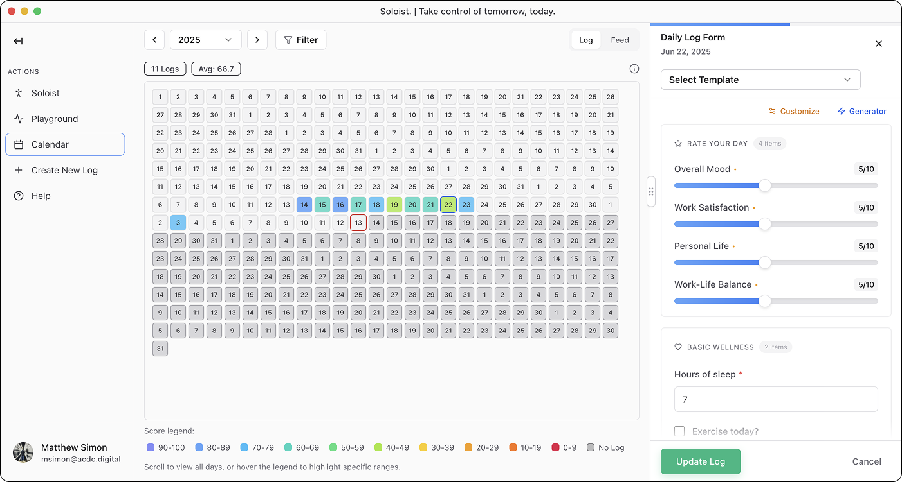

##   **Soloist. | Take control of tomorrow, today.**


```text
 ____        _       _     _     
/ ___|  ___ | | ___ (_)___| |_   
\___ \ / _ \| |/ _ \| / __| __|  
 ___) | (_) | | (_) | \__ \ |_ _ 
|____/ \___/|_|\___/|_|___/\__(_)
```

**Version:** `1.6.6` | **License:** For-Profit Open Source | **Status:** Active Development

---



[](https://reactjs.org/) [](https://www.typescriptlang.org/) [](https://nextjs.org/) [](https://tailwindcss.com/) [](https://www.electronjs.org/) [](https://convex.dev/) [](https://resend.com/) [](https://openai.com/) [](https://vercel.com/)

## About

**Soloist** is a revolutionary personal analytics platform that transforms your daily emotional journey into powerful, data-driven insights. Using advanced AI forecasting technology, Soloist predicts your mood patterns up to 3 days in advance—like having a weather forecast for your emotional well-being.

Built for individuals seeking deeper self-understanding, Soloist combines intelligent mood tracking with predictive analysis to help you identify patterns, anticipate challenges, and make informed decisions about your mental health. Whether you're working to break negative cycles, optimize your productivity, or simply understand yourself better, Soloist provides the analytical tools to turn self-reflection into actionable change.

**The future of personal analytics is here.** Stop wondering why you feel the way you do—start predicting and preparing for it.

### Key Features

| Category | Highlights |
|----------|------------|
| Daily Logging | Custom templates, auto-summaries, progressive prompts |
| Predictive Analytics | 3-day forecasts, yearly heat-map, pattern detection |
| AI Cost Tracking | Real-time OpenAI usage monitoring, cost analytics, feature breakdown |
| Admin Dashboard | Live usage statistics, cost alerts, model performance metrics |
| Integrations | Social feed import (Facebook, Instagram, X / Twitter, LinkedIn) |
| Starter Kits | Guided 7-day journaling programme (coming Q4 2025) |
| Desktop Experience | Native macOS / Windows / Linux apps built with Electron |

### Why Soloist Stands Apart

**Advanced AI Integration**: Unlike simple mood trackers, Soloist leverages cutting-edge machine learning to analyze your emotional patterns and generate scientifically-informed predictions about your future mental state.

**Cross-Platform Excellence**: Seamlessly switch between web and desktop experiences with full data synchronization and platform-optimized interfaces.

**Privacy-First Architecture**: Your emotional data remains secure with end-to-end encryption, user-controlled exports, and transparent AI processing policies.

**Open Source Innovation**: Built with modern technologies and open development practices, enabling community contributions and complete transparency.

---

## Downloads

**Ready to transform your self-understanding?** Download Soloist Pro and start your journey toward predictive personal analytics.

| Platform | File | Direct Link |
|----------|------|-------------|
| macOS (Intel) | `Soloist.Pro-1.6.6-x64.dmg` | [Download](https://github.com/acdc-digital/solopro/releases/download/v1.6.6/Soloist.Pro-1.6.6-x64.dmg) |
| macOS (Apple Silicon) | `Soloist.Pro-1.6.6-arm64.dmg` | [Download](https://github.com/acdc-digital/solopro/releases/download/v1.6.6/Soloist.Pro-1.6.6-arm64.dmg) |
| Windows | `Soloist.Pro-Setup-1.6.6.exe` | [Download](https://github.com/acdc-digital/solopro/releases/download/v1.6.6/Soloist.Pro-Setup-1.6.6.exe) |
| Linux (AppImage) | `Soloist.Pro-1.6.6.AppImage` | [Download](https://github.com/acdc-digital/solopro/releases/download/v1.6.6/Soloist.Pro-1.6.6.AppImage) |
| Linux (Deb) | `solopro-electron-1.6.6.deb` | [Download](https://github.com/acdc-digital/solopro/releases/download/v1.6.6/solopro-electron-1.6.6.deb) |

**System Requirements**: All platforms require 4GB RAM minimum, 500MB storage space. Internet connection required for AI features.

---

## Quick Start

**For End Users:**
```bash
# Download and install from releases above
# Or try the web version at app.acdc.digital
```

**For Developers:**
```bash
# Clone
git clone https://github.com/acdc-digital/solopro.git
cd solopro

# Install dependencies (pnpm recommended)
pnpm install

# Start Dev Environment
pnpm dev          # boots website, renderer and Electron shell
```

**Building Desktop Apps:**
```bash
pnpm --filter solopro-electron run build:mac     # macOS dmg
pnpm --filter solopro-electron run build:win     # Windows exe (needs Wine)
pnpm --filter solopro-electron run build:linux   # Linux AppImage + Deb (needs Docker)
```

Outputs are written to `electron/dist/`.

### Architecture Overview

Soloist Pro is built as a sophisticated monorepo leveraging modern technologies:

- **Frontend**: Next.js 15 with TypeScript, Tailwind CSS, and Shadcn/UI components
- **Backend**: Convex serverless platform with real-time data synchronization
- **AI Engine**: OpenAI GPT models with comprehensive cost tracking and analytics
- **Authentication**: Secure email verification with GitHub OAuth integration
- **Payments**: Stripe subscriptions with automated webhook processing
- **Desktop**: Electron wrapper with code-signed, notarized applications

---

## Development Commands

| Command | Description |
|---------|-------------|
| `pnpm dev` | Boot website, renderer, Electron shell |
| `pnpm dev:renderer` | Next.js renderer only (port 3002) |
| `pnpm dev:website` | Marketing site only (port 3004) |
| `pnpm dev:electron` | Electron window with live-reload |
| `pnpm build` | Build all projects (website, renderer, electron) |
| `pnpm build:renderer` | Build Next.js renderer for production |
| `pnpm build:website` | Build marketing website for production |
| `pnpm --filter solopro-electron run build:mac` | Build macOS desktop app (.dmg) |
| `pnpm --filter solopro-electron run build:win` | Build Windows desktop app (.exe) |
| `pnpm --filter solopro-electron run build:linux` | Build Linux desktop app (AppImage + Deb) |

## Deployment Commands

| Command | Description |
|---------|-------------|
| `npx convex deploy` | Deploy Convex database changes to Live Production Cloud |
| `pnpm run deploy:all` | Deploy website **and** renderer to Vercel Prod |
| `pnpm run deploy:website` | Deploy website only |
| `pnpm run deploy:renderer` | Deploy renderer only |

## Version Management (Git)

```bash
# Bump version, tag & push
npm version <patch|minor|major>
git push origin main --tags

# Reset to a specific version
git checkout v1.6.5
```

## Git Command Reference

| Purpose | Command | Notes |
|---------|---------|-------|
| Clone repository | `git clone https://github.com/acdc-digital/solopro.git` | Creates local copy of remote repo |
| List branches | `git branch -a` | `-a` shows local & remote |
| Create feature branch | `git checkout -b feature/<name>` | Based off current branch (usually `main`) |
| Push branch to origin | `git push -u origin feature/<name>` | `-u` sets upstream for future `git push` |
| Fetch & merge remote main | `git pull origin main` | Keeps branch up-to-date before PR |
| Switch branches | `git checkout <branch>` | Or `git switch <branch>` |
| Delete local branch | `git branch -d feature/<name>` | Use `-D` to force delete |
| Create version tag | `git tag v1.6.5` | Lightweight tag |
| Annotated version tag | `git tag -a v1.6.5 -m "Soloist v1.6.5"` | Preferred for releases |
| Push single tag | `git push origin v1.6.5` | Uploads tag to remote |
| View commit history | `git log --oneline --graph --decorate --all` | Compact visual graph |
| Undo local commit (keep changes) | `git reset --soft HEAD~1` | Moves `HEAD` back one commit |

> Tip: configure aliases in `~/.gitconfig` to speed up frequent commands.

## Technical Highlights

### AI-Powered Insights Engine
Soloist's machine learning capabilities set it apart from traditional mood tracking applications:

- **Predictive Modeling**: Advanced pattern recognition algorithms analyze historical emotional data to generate 3-day forecasts with confidence intervals
- **Contextual Analysis**: AI processes not just mood scores but also activities, notes, and temporal patterns to provide nuanced insights
- **Adaptive Learning**: The system continuously refines predictions based on user feedback and accuracy tracking
- **Cost Optimization**: Comprehensive OpenAI usage monitoring ensures efficient AI resource utilization

### Enterprise-Grade Architecture
Built with scalability and reliability in mind:

- **Serverless Backend**: Convex platform provides automatic scaling and real-time data synchronization
- **Type-Safe Development**: Full TypeScript implementation with strict validation across frontend and backend
- **Modern UI Framework**: Shadcn/UI components built on Radix primitives ensure accessibility and consistency
- **Cross-Platform Native**: Electron apps with code signing and auto-update capabilities

### Data Security & Privacy
User trust is paramount in personal analytics:

- **End-to-End Encryption**: Sensitive emotional data is protected at rest and in transit
- **User-Controlled Exports**: Complete data portability with JSON and CSV export options
- **Transparent AI Processing**: Clear disclosure of how personal data is used for insights generation
- **Secure Authentication**: Multi-factor authentication with email verification and OAuth integration

---

## Version History

| Version | Date | Notes |
|---------|------|-------|
| **v1.6.6** | 2025-07-13 | Latest release with enhanced features and improvements |
| **v1.6.5** | 2025-01-22 | Real-time usage monitoring, admin dashboard |
| **v1.6.4** | 2025-01-29 | Enhanced security & authentication, email verification, password management |
| **v1.6.2** | 2025-02-01 | Guided journaling starter kit, social platform integration preview, refined macOS dock icon |
| **v1.6.1** | 2025-01-17 | Build & notarisation improvements |
| **v1.6.0** | 2024-12-31 | UI/UX enhancements |

---

## Contributing

**Join the Future of Personal Analytics**

Soloist Pro thrives on community collaboration. Whether you're passionate about AI, mental health technology, or cutting-edge web development, there's a place for your expertise.

**Ways to Contribute:**
- **Frontend Development**: Enhance UI/UX with React, TypeScript, and Tailwind CSS
- **AI Integration**: Improve forecasting algorithms and natural language processing
- **Backend Engineering**: Optimize Convex functions and database performance
- **Desktop Applications**: Refine Electron builds and cross-platform compatibility
- **Documentation**: Help others understand and contribute to the codebase
- **Testing & QA**: Ensure reliability across all platforms and features

**Getting Started**: Read our [CONTRIBUTING.md](docs/CONTRIBUTING.md) for detailed guidelines, development setup, and coding standards.

**Tech Stack Highlights**: Next.js 15, TypeScript, Convex, OpenAI, Stripe, Electron - perfect for developers interested in modern full-stack development.

---

© 2025 ACDC.digital • Maintainer: msimon@acdc.digital