# LLM Prompts Architecture Overview

## 🎯 Executive Summary

The Soloist Pro application leverages six specialized Large Language Model (LLM) prompts to create a comprehensive personal analytics platform. Each prompt is specifically configured for different AI-powered features, from mood scoring to predictive forecasting, creating an interconnected ecosystem that transforms raw user data into actionable insights.

## 📊 System Architecture Diagram

```mermaid
flowchart TD
    %% Main LLM Prompts
    SCORING_PROMPT["🎯 SCORING_PROMPT<br/>Temperature: 0.3<br/>Max Tokens: 500<br/>Model: gpt-4o-mini"]
    FORECASTING_PROMPT["🔮 FORECASTING_PROMPT<br/>Temperature: 0.7<br/>Max Tokens: 1000<br/>Model: gpt-4o-mini"]
    CONSULTATION_PROMPT["💬 DAILY_CONSULTATION_PROMPT<br/>Temperature: 0.7<br/>Max Tokens: 1000<br/>Model: gpt-4o-mini"]
    INSIGHTS_PROMPT["📊 WEEKLY_INSIGHTS_PROMPT<br/>Temperature: 0.7<br/>Max Tokens: 1000<br/>Model: gpt-4o-mini"]
    RANDOM_LOG_PROMPT["🎲 RANDOM_LOG_PROMPT<br/>Temperature: 0.8<br/>Max Tokens: 800<br/>Model: gpt-4o-mini"]
    FEED_SUMMARY_PROMPT["📱 FEED_SUMMARY_PROMPT<br/>Temperature: 0.6<br/>Max Tokens: 600<br/>Model: gpt-4o-mini"]

    %% Data Sources
    DAILY_LOGS[("📅 Daily Logs<br/>- Mood scores<br/>- Work satisfaction<br/>- Personal life ratings<br/>- Activities & notes")]
    USER_ANSWERS[("📝 User Answers<br/>- JSON structured data<br/>- Ratings & reflections<br/>- Daily entries")]
    HISTORICAL_DATA[("📈 Historical Data<br/>- Past 4+ days of logs<br/>- Pattern analysis<br/>- Trend identification")]
    SOCIAL_MEDIA[("📲 Social Media<br/>- Posts & content<br/>- Digital consumption<br/>- Emotional influences")]
    USER_INSTRUCTIONS[("⚙️ User Instructions<br/>- Custom preferences<br/>- Personalization settings<br/>- Demo parameters")]

    %% Core Application Functions
    SCORE_DAILY_LOG["scoreDailyLog()<br/>📊 Generate 1-10 mood scores"]
    GENERATE_FORECAST["generateForecast()<br/>🔮 3-day emotional predictions"]
    DAILY_CONSULTATION["generateDailyConsultation()<br/>💬 Personalized daily insights"]
    WEEKLY_INSIGHTS["generateWeeklyInsights()<br/>📊 7-day pattern analysis"]
    RANDOM_LOG_GEN["generateRandomLog()<br/>🎲 Demo log creation"]
    FEED_GENERATION["generateFeedSummary()<br/>📱 Social content analysis"]

    %% Database Effects
    DAILY_LOGS_DB[("🗄️ dailyLogs Table<br/>- Updated scores<br/>- Enhanced data")]
    FORECAST_DB[("🗄️ forecast Table<br/>- Future predictions<br/>- Confidence levels")]
    FEED_DB[("🗄️ feed Table<br/>- Content summaries<br/>- Emotional insights")]
    OPENAI_USAGE_DB[("💰 openaiUsage Table<br/>- Cost tracking<br/>- Token consumption<br/>- Feature analytics")]

    %% UI Components
    MOOD_HEATMAP["🌡️ Mood Heatmap<br/>- Color-coded days<br/>- Visual patterns<br/>- 365-day view"]
    FORECAST_CARDS["🃏 Forecast Cards<br/>- 3-day predictions<br/>- Confidence scores<br/>- Trend indicators"]
    CONSULTATION_PANEL["💭 Daily Consultation<br/>- AI insights<br/>- Contextual analysis<br/>- Wellness coaching"]
    INSIGHTS_DASHBOARD["📈 Weekly Dashboard<br/>- Pattern recognition<br/>- Trend analysis<br/>- Recommendations"]
    DEMO_INTERFACE["🎭 Demo Mode<br/>- Sample data<br/>- Testing environment<br/>- User onboarding"]
    FEED_TIMELINE["📰 Social Feed<br/>- Content curation<br/>- Emotional impact<br/>- Digital wellness"]

    %% Admin & Analytics
    ADMIN_DASHBOARD["👑 Admin Dashboard<br/>- Cost monitoring<br/>- Usage analytics<br/>- Model performance"]
    COST_TRACKING["💹 Cost Analytics<br/>- Feature breakdown<br/>- User consumption<br/>- Budget alerts"]

    %% Data Flow Connections
    DAILY_LOGS --> SCORING_PROMPT
    USER_ANSWERS --> SCORING_PROMPT
    SCORING_PROMPT --> SCORE_DAILY_LOG
    SCORE_DAILY_LOG --> DAILY_LOGS_DB
    DAILY_LOGS_DB --> MOOD_HEATMAP

    HISTORICAL_DATA --> FORECASTING_PROMPT
    FORECASTING_PROMPT --> GENERATE_FORECAST
    GENERATE_FORECAST --> FORECAST_DB
    FORECAST_DB --> FORECAST_CARDS

    DAILY_LOGS --> CONSULTATION_PROMPT
    HISTORICAL_DATA --> CONSULTATION_PROMPT
    CONSULTATION_PROMPT --> DAILY_CONSULTATION
    DAILY_CONSULTATION --> CONSULTATION_PANEL

    HISTORICAL_DATA --> INSIGHTS_PROMPT
    INSIGHTS_PROMPT --> WEEKLY_INSIGHTS
    WEEKLY_INSIGHTS --> INSIGHTS_DASHBOARD

    USER_INSTRUCTIONS --> RANDOM_LOG_PROMPT
    RANDOM_LOG_PROMPT --> RANDOM_LOG_GEN
    RANDOM_LOG_GEN --> DEMO_INTERFACE

    SOCIAL_MEDIA --> FEED_SUMMARY_PROMPT
    FEED_SUMMARY_PROMPT --> FEED_GENERATION
    FEED_GENERATION --> FEED_DB
    FEED_DB --> FEED_TIMELINE

    %% Cost Tracking Effects
    SCORE_DAILY_LOG --> OPENAI_USAGE_DB
    GENERATE_FORECAST --> OPENAI_USAGE_DB
    DAILY_CONSULTATION --> OPENAI_USAGE_DB
    WEEKLY_INSIGHTS --> OPENAI_USAGE_DB
    RANDOM_LOG_GEN --> OPENAI_USAGE_DB
    FEED_GENERATION --> OPENAI_USAGE_DB
    
    OPENAI_USAGE_DB --> ADMIN_DASHBOARD
    OPENAI_USAGE_DB --> COST_TRACKING

    %% Feedback Loops
    FORECAST_CARDS -.->|"User feedback<br/>(👍/👎)"| FORECAST_DB
    CONSULTATION_PANEL -.->|"Pattern validation"| HISTORICAL_DATA
    INSIGHTS_DASHBOARD -.->|"Behavioral changes"| DAILY_LOGS

    %% Styling
    classDef promptNode fill:#e1f5fe,stroke:#01579b,stroke-width:3px,color:#000
    classDef dataSource fill:#f3e5f5,stroke:#4a148c,stroke-width:2px,color:#000
    classDef function fill:#e8f5e8,stroke:#1b5e20,stroke-width:2px,color:#000
    classDef database fill:#fff3e0,stroke:#e65100,stroke-width:2px,color:#000
    classDef ui fill:#fce4ec,stroke:#880e4f,stroke-width:2px,color:#000
    classDef admin fill:#f1f8e9,stroke:#33691e,stroke-width:2px,color:#000

    class SCORING_PROMPT,FORECASTING_PROMPT,CONSULTATION_PROMPT,INSIGHTS_PROMPT,RANDOM_LOG_PROMPT,FEED_SUMMARY_PROMPT promptNode
    class DAILY_LOGS,USER_ANSWERS,HISTORICAL_DATA,SOCIAL_MEDIA,USER_INSTRUCTIONS dataSource
    class SCORE_DAILY_LOG,GENERATE_FORECAST,DAILY_CONSULTATION,WEEKLY_INSIGHTS,RANDOM_LOG_GEN,FEED_GENERATION function
    class DAILY_LOGS_DB,FORECAST_DB,FEED_DB,OPENAI_USAGE_DB database
    class MOOD_HEATMAP,FORECAST_CARDS,CONSULTATION_PANEL,INSIGHTS_DASHBOARD,DEMO_INTERFACE,FEED_TIMELINE ui
    class ADMIN_DASHBOARD,COST_TRACKING admin
```



## 🤖 LLM Prompt Specifications

### 1. 🎯 SCORING_PROMPT
**Purpose**: Analyzes daily log entries to generate numerical mood scores (1-10 scale)

**Configuration**:
- **Model**: `gpt-4o-mini`
- **Temperature**: `0.3` (Low for consistent, objective scoring)
- **Max Tokens**: `500`
- **Function**: `scoreDailyLog()`

**Input Data**:
- Daily logs with mood ratings
- User answers in JSON format
- Work satisfaction levels
- Personal life satisfaction scores
- Activity logs and reflections

**Output Effects**:
- Updates `dailyLogs` table with AI-generated scores
- Powers the **Mood Heatmap** with color-coded daily visualizations
- Provides foundation data for pattern analysis

**Key Features**:
- Deterministic scoring with low temperature
- Considers multiple emotional indicators
- Integrates qualitative notes with quantitative ratings

---

### 2. 🔮 FORECASTING_PROMPT
**Purpose**: Generates 3-day emotional predictions based on historical patterns

**Configuration**:
- **Model**: `gpt-4o-mini`
- **Temperature**: `0.7` (Balanced creativity and consistency)
- **Max Tokens**: `1000`
- **Function**: `generateForecast()`

**Input Data**:
- Historical data from past 4+ days
- Mood trends and patterns
- External factor analysis
- Seasonal and weekly patterns

**Output Effects**:
- Populates `forecast` table with predictions
- Displays **Forecast Cards** with confidence scores
- Enables predictive analytics dashboard

**Key Features**:
- Pattern recognition across multiple days
- Confidence scoring (decreases with time distance)
- Trend analysis (up/down/stable)
- User feedback integration (👍/👎)

---

### 3. 💬 DAILY_CONSULTATION_PROMPT
**Purpose**: Provides personalized daily insights and wellness coaching

**Configuration**:
- **Model**: `gpt-4o-mini`
- **Temperature**: `0.7` (Empathetic and supportive)
- **Max Tokens**: `1000`
- **Function**: `generateDailyConsultation()`

**Input Data**:
- Selected day's mood data
- 7-day context window
- Historical patterns
- User's emotional journey

**Output Effects**:
- Powers **Daily Consultation Panel**
- Provides contextual wellness insights
- Offers personalized recommendations

**Key Features**:
- Context-aware analysis (7-day window)
- Supportive, non-judgmental tone
- Actionable wellness recommendations
- Pattern validation feedback loop

---

### 4. 📊 WEEKLY_INSIGHTS_PROMPT
**Purpose**: Analyzes weekly patterns and provides comprehensive insights

**Configuration**:
- **Model**: `gpt-4o-mini`
- **Temperature**: `0.7` (Analytical with creative insights)
- **Max Tokens**: `1000`
- **Function**: `generateWeeklyInsights()`

**Input Data**:
- 7 days of emotional data
- Both historical logs and forecasts
- Trend identification
- Pattern correlations

**Output Effects**:
- Displays **Weekly Dashboard**
- Shows pattern recognition
- Provides trend analysis and recommendations

**Key Features**:
- Multi-day pattern analysis
- Identifies winning streaks and concerning dips
- Behavioral change recommendations
- Weekly comparison analytics

---

### 5. 🎲 RANDOM_LOG_PROMPT
**Purpose**: Generates realistic demo data for testing and user onboarding

**Configuration**:
- **Model**: `gpt-4o-mini`
- **Temperature**: `0.8` (High creativity for varied content)
- **Max Tokens**: `800`
- **Function**: `generateRandomLog()`

**Input Data**:
- User's custom instructions
- Personalization preferences
- Demo parameters
- Date-specific context

**Output Effects**:
- Powers **Demo Interface**
- Enables user onboarding
- Provides realistic sample data

**Key Features**:
- Customizable based on user instructions
- Realistic data correlation
- Varied but believable content
- Supports testing and demonstrations

---

### 6. 📱 FEED_SUMMARY_PROMPT
**Purpose**: Analyzes social media content for emotional impact assessment

**Configuration**:
- **Model**: `gpt-4o-mini`
- **Temperature**: `0.6` (Balanced analysis and creativity)
- **Max Tokens**: `600`
- **Function**: `generateFeedSummary()`

**Input Data**:
- Social media posts and content
- Digital consumption patterns
- Emotional influences from online activity

**Output Effects**:
- Populates `feed` table with content summaries
- Powers **Social Feed Timeline**
- Enables digital wellness tracking

**Key Features**:
- Content emotional analysis
- Digital consumption impact assessment
- Privacy-sensitive processing
- Wellness-focused insights

## 🔄 Data Flow Architecture

### Input Sources
1. **📅 Daily Logs**: Core user mood and satisfaction data
2. **📝 User Answers**: Structured JSON responses to daily prompts
3. **📈 Historical Data**: Pattern analysis from 4+ days of logs
4. **📲 Social Media**: External content affecting emotional state
5. **⚙️ User Instructions**: Personalization and customization settings

### Processing Pipeline
Each LLM prompt processes specific input types through dedicated functions:

```
Input Data → LLM Prompt → Core Function → Database Update → UI Display
```

### Database Impact
All AI operations are tracked in four main database tables:

1. **`dailyLogs`**: Enhanced with AI-generated mood scores
2. **`forecast`**: Stores 3-day predictions with confidence levels
3. **`feed`**: Contains AI-analyzed social media summaries
4. **`openaiUsage`**: Comprehensive cost and usage tracking

### User Interface Effects
The LLM outputs directly power six major UI components:

1. **🌡️ Mood Heatmap**: 365-day visual mood calendar
2. **🃏 Forecast Cards**: Interactive 3-day prediction display
3. **💭 Daily Consultation**: AI wellness coaching panel
4. **📈 Weekly Dashboard**: Pattern analysis and insights
5. **🎭 Demo Interface**: Onboarding and testing environment
6. **📰 Social Feed**: Digital wellness timeline

## 💰 Cost Management & Analytics

### Real-Time Monitoring
Every AI operation is tracked with:
- **Token consumption** (prompt + completion)
- **Cost calculation** (based on model pricing)
- **Feature attribution** (which prompt type)
- **Performance metrics** (response time, success rate)

### Admin Dashboard Integration
The **Admin Dashboard** provides:
- Real-time cost monitoring
- Feature-specific usage breakdown
- Model performance analytics
- Budget alerts and projections

### Cost Optimization
- **Optimized temperatures** for each use case
- **Appropriate token limits** to prevent waste
- **Efficient prompt engineering** for better results
- **Fallback mechanisms** for AI service failures

## 🔁 Feedback Loops & Continuous Improvement

### User Feedback Integration
1. **Forecast Accuracy**: Users can rate predictions (👍/👎)
2. **Pattern Validation**: Consultations help validate AI insights
3. **Behavioral Impact**: Dashboard changes influence future logging

### System Learning
- **Accuracy tracking** compares predictions to actual outcomes
- **Pattern refinement** improves future forecasting
- **User preference learning** enhances personalization

## 🛡️ Technical Implementation

### Error Handling
- **Graceful degradation** when AI services are unavailable
- **Fallback content** for failed generations
- **Comprehensive logging** for debugging and optimization

### Performance Optimization
- **Async processing** for non-blocking operations
- **Caching strategies** for repeated analyses
- **Batch processing** for efficiency gains

### Security & Privacy
- **Secure API key management** through environment variables
- **Data privacy** with user consent and transparency
- **Audit trails** for compliance and debugging

## 📈 Business Impact

### User Experience Enhancement
- **Personalized insights** increase user engagement
- **Predictive analytics** provide proactive wellness support
- **Pattern recognition** helps users understand their emotional journeys

### Operational Intelligence
- **Cost transparency** enables informed feature development
- **Usage analytics** guide product roadmap decisions
- **Performance monitoring** ensures reliable service delivery

---

*This architecture represents a sophisticated AI-powered personal analytics platform that transforms raw emotional data into actionable insights while maintaining cost efficiency and user privacy.*